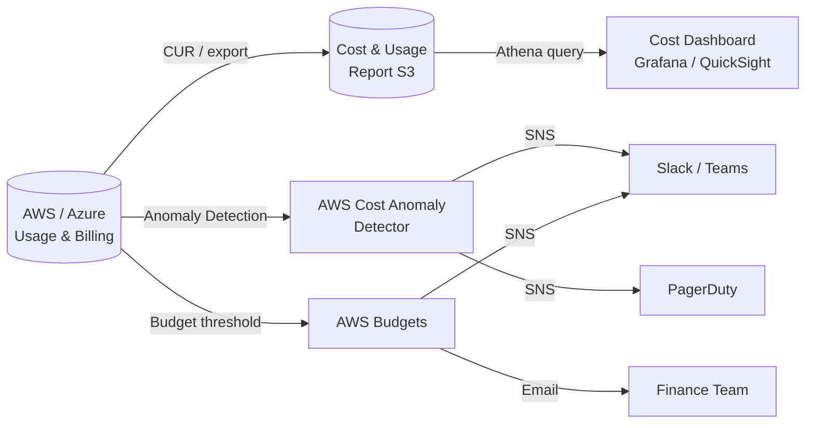

# Cloud Cost Monitoring & Alerting

## Category

**Domain:** FinOps · **Stack:** AWS Cost Explorer, CloudWatch, Terraform · **Scope:** Cost Observability

---

## Context

You cannot optimise what you cannot see. Cost monitoring gives engineering and finance teams real-time visibility into cloud spend, anomaly detection when costs spike unexpectedly, and budget guardrails that trigger before bills arrive. Effective monitoring answers: *Where is money going? Is today abnormal? Who owns this cost?*

### Monitoring Layers

| Layer | Tool | Signal |
|-------|------|--------|
| **Billing dashboard** | AWS Cost Explorer / Azure Cost Management | Monthly/daily spend by service |
| **Anomaly detection** | AWS Cost Anomaly Detection / Azure Cost Alerts | Statistical deviation from baseline |
| **Budget alerts** | AWS Budgets / Azure Budgets | Threshold breach (actual + forecast) |
| **Real-time metrics** | CloudWatch Metrics / Azure Monitor | Per-resource utilisation |
| **FinOps platform** | Datadog Cloud Cost, Spot.io, Apptio Cloudability | Cross-cloud aggregation |

### Alert Types

| Alert Type | Trigger | Response |
|-----------|---------|---------|
| **Threshold** | Actual spend > N% of monthly budget | Slack + PagerDuty |
| **Anomaly** | Day-over-day spike > 2σ | Engineering triage |
| **Forecast** | Projected to exceed budget by EOM | Engineering + Finance review |
| **Per-resource** | Single resource cost spike | Tag-owner notification |
| **Idle resource** | EC2/RDS with <5% utilisation for 7 days | Rightsizing ticket |

---

## Pros

- Budget alerts catch runaway resources before they become large bills
- Anomaly detection surfaces unknown cost drivers without manual threshold setting
- Per-tag cost allocation makes team ownership visible
- Forecast alerts enable proactive action — not just post-bill cleanup
- CloudWatch metrics integration links cost to technical utilisation

## Cons

- AWS Cost Explorer data has up to 24-hour lag — not suitable for real-time workloads
- Anomaly detection has a learning period (14+ days) before baselines are reliable
- Alert fatigue if thresholds are set too low — teams start ignoring notifications
- Multi-cloud cost aggregation requires a third-party tool (Datadog, Apptio)

---

## Design Diagram



---

## Code Sample

### Terraform — AWS Budget with SNS Alert

```hcl
# finops/budgets.tf

resource "aws_sns_topic" "cost_alerts" {
  name = "cost-alerts-${var.environment}"

  tags = {
    Environment = var.environment
    Team        = "finops"
    ManagedBy   = "terraform"
  }
}

resource "aws_sns_topic_subscription" "cost_alerts_slack" {
  topic_arn = aws_sns_topic.cost_alerts.arn
  protocol  = "https"
  endpoint  = var.slack_webhook_url  # Slack incoming webhook
}

# Monthly budget — alert at 80% actual and 100% forecast
resource "aws_budgets_budget" "monthly" {
  name         = "monthly-budget-${var.environment}"
  budget_type  = "COST"
  limit_amount = var.monthly_budget_usd
  limit_unit   = "USD"
  time_unit    = "MONTHLY"

  notification {
    comparison_operator        = "GREATER_THAN"
    threshold                  = 80
    threshold_type             = "PERCENTAGE"
    notification_type          = "ACTUAL"
    subscriber_sns_topic_arns  = [aws_sns_topic.cost_alerts.arn]
  }

  notification {
    comparison_operator        = "GREATER_THAN"
    threshold                  = 100
    threshold_type             = "PERCENTAGE"
    notification_type          = "FORECASTED"
    subscriber_sns_topic_arns  = [aws_sns_topic.cost_alerts.arn]
  }

  # Per-service budget filter (optional — monitor specific service)
  cost_filter {
    name   = "Service"
    values = ["Amazon Elastic Compute Cloud - Compute"]
  }
}
```

### Terraform — AWS Cost Anomaly Detection

```hcl
# finops/anomaly-detection.tf

resource "aws_ce_anomaly_monitor" "service_monitor" {
  name              = "service-anomaly-monitor"
  monitor_type      = "DIMENSIONAL"
  monitor_dimension = "SERVICE"
}

resource "aws_ce_anomaly_subscription" "engineering" {
  name      = "engineering-anomaly-alerts"
  frequency = "DAILY"  # IMMEDIATE | DAILY | WEEKLY

  monitor_arn_list = [aws_ce_anomaly_monitor.service_monitor.arn]

  subscriber {
    type    = "SNS"
    address = aws_sns_topic.cost_alerts.arn
  }

  threshold_expression {
    and {
      dimension {
        key           = "ANOMALY_TOTAL_IMPACT_PERCENTAGE"
        values        = ["20"]     # Alert if cost is 20%+ above baseline
        match_options = ["GREATER_THAN_OR_EQUAL"]
      }
    }
    and {
      dimension {
        key           = "ANOMALY_TOTAL_IMPACT_ABSOLUTE"
        values        = ["100"]    # And absolute impact > $100
        match_options = ["GREATER_THAN_OR_EQUAL"]
      }
    }
  }
}
```

### Terraform — Cost & Usage Report (CUR) to S3

```hcl
# finops/cur.tf

resource "aws_s3_bucket" "cur_reports" {
  bucket = "cost-usage-reports-${data.aws_caller_identity.current.account_id}"

  tags = {
    Purpose   = "cost-usage-reports"
    ManagedBy = "terraform"
  }
}

resource "aws_s3_bucket_server_side_encryption_configuration" "cur" {
  bucket = aws_s3_bucket.cur_reports.id
  rule {
    apply_server_side_encryption_by_default {
      sse_algorithm = "AES256"
    }
  }
}

resource "aws_cur_report_definition" "daily" {
  report_name                = "daily-cost-usage-report"
  time_unit                  = "DAILY"
  format                     = "Parquet"
  compression                = "Parquet"
  additional_schema_elements = ["RESOURCES", "SPLIT_COST_ALLOCATION_DATA"]
  s3_bucket                  = aws_s3_bucket.cur_reports.bucket
  s3_prefix                  = "cur"
  s3_region                  = var.aws_region
  report_versioning          = "OVERWRITE_REPORT"
  refresh_closed_reports     = true
}
```

### Python — Lambda: Slack Cost Alert Formatter

```python
# lambda/cost_alert_formatter/handler.py
"""
Receives SNS messages from AWS Budgets / Cost Anomaly Detection
and formats them into rich Slack messages.
"""
import json
import os
import urllib.request
from typing import Any

SLACK_WEBHOOK_URL = os.environ["SLACK_WEBHOOK_URL"]


def lambda_handler(event: dict[str, Any], _context: Any) -> dict[str, int]:
    for record in event.get("Records", []):
        message_str = record["Sns"]["Message"]
        message = json.loads(message_str)

        subject = record["Sns"].get("Subject", "AWS Cost Alert")
        text = format_alert(subject, message)
        send_slack(text)

    return {"statusCode": 200}


def format_alert(subject: str, message: dict[str, Any]) -> str:
    budget_name = message.get("budgetName", "Unknown budget")
    actual = message.get("budgetedAndActualAmounts", {}).get("actualAmount", {})
    amount_str = f"${actual.get('amount', 'N/A')} {actual.get('unit', 'USD')}"

    return (
        f":money_with_wings: *{subject}*\n"
        f"*Budget:* {budget_name}\n"
        f"*Actual spend:* {amount_str}\n"
        f"*Action required:* Review AWS Cost Explorer for anomalous services."
    )


def send_slack(text: str) -> None:
    payload = json.dumps({"text": text}).encode()
    req = urllib.request.Request(
        SLACK_WEBHOOK_URL,
        data=payload,
        headers={"Content-Type": "application/json"},
        method="POST",
    )
    with urllib.request.urlopen(req, timeout=5) as resp:  # noqa: S310
        if resp.status != 200:
            raise RuntimeError(f"Slack returned {resp.status}")
```

### YAML — GitHub Actions: Weekly Cost Report

```yaml
# .github/workflows/weekly-cost-report.yml
name: Weekly Cost Report

on:
  schedule:
    - cron: "0 8 * * 1"   # Every Monday 08:00 UTC
  workflow_dispatch:

permissions:
  contents: none

jobs:
  cost-report:
    runs-on: ubuntu-latest
    steps:
      - name: Configure AWS credentials
        uses: aws-actions/configure-aws-credentials@v4
        with:
          role-to-assume: ${{ secrets.AWS_FINOPS_ROLE_ARN }}
          aws-region: us-east-1

      - name: Fetch last 7 days cost by service
        run: |
          START=$(date -d '7 days ago' +%Y-%m-%d)
          END=$(date +%Y-%m-%d)
          aws ce get-cost-and-usage \
            --time-period Start=$START,End=$END \
            --granularity DAILY \
            --metrics "UnblendedCost" \
            --group-by Type=DIMENSION,Key=SERVICE \
            --output json > cost-report.json

      - name: Post report to Slack
        env:
          SLACK_WEBHOOK_URL: ${{ secrets.SLACK_FINOPS_WEBHOOK }}
        run: |
          TOTAL=$(jq '[.ResultsByTime[].Groups[].Metrics.UnblendedCost.Amount | tonumber] | add' cost-report.json)
          curl -s -X POST "$SLACK_WEBHOOK_URL" \
            -H "Content-Type: application/json" \
            -d "{\"text\": \":bar_chart: *Weekly AWS Cost Report*\nTotal (last 7 days): \$${TOTAL}\"}"
```

### Terraform — Azure Budget Alert

```hcl
# finops/azure-budget.tf

data "azurerm_subscription" "current" {}

resource "azurerm_monitor_action_group" "finops" {
  name                = "finops-alerts"
  resource_group_name = var.resource_group_name
  short_name          = "finops"

  email_receiver {
    name          = "finops-team"
    email_address = var.finops_email
  }
}

resource "azurerm_consumption_budget_subscription" "monthly" {
  name            = "monthly-budget"
  subscription_id = data.azurerm_subscription.current.id
  amount          = var.monthly_budget_usd
  time_grain      = "Monthly"

  time_period {
    start_date = formatdate("YYYY-MM-01'T'00:00:00'Z'", timestamp())
  }

  notification {
    enabled        = true
    threshold      = 80
    operator       = "GreaterThan"
    threshold_type = "Actual"

    contact_groups = [azurerm_monitor_action_group.finops.id]
  }

  notification {
    enabled        = true
    threshold      = 100
    operator       = "GreaterThan"
    threshold_type = "Forecasted"

    contact_groups = [azurerm_monitor_action_group.finops.id]
  }
}
```
