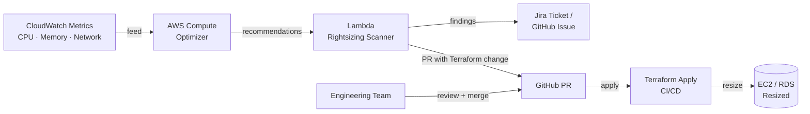

# Resource Rightsizing

## Category

**Domain:** FinOps · **Stack:** AWS Compute Optimizer, Terraform, Python · **Scope:** Cost Reduction

---

## Context

Rightsizing identifies over-provisioned resources — instances where CPU, memory, or I/O utilisation is consistently well below capacity — and recommends a smaller, cheaper size. Industry benchmarks suggest 30–35% of cloud compute spend is wasted on idle or over-provisioned resources (Gartner, 2024).

### Rightsizing Targets

| Resource         | Metric                                | Tool                                    |
| ---------------- | ------------------------------------- | --------------------------------------- |
| EC2 instances    | CPU %, memory %, network I/O          | AWS Compute Optimizer                   |
| RDS instances    | CPU %, connections, storage I/O       | AWS Compute Optimizer / Trusted Advisor |
| ECS tasks        | Task CPU/memory reservation vs actual | CloudWatch Container Insights           |
| Lambda functions | Memory setting vs max used            | AWS Compute Optimizer                   |
| Azure VMs        | CPU avg < 5% for 7+ days              | Azure Advisor                           |
| GCP instances    | CPU avg < 10% for 7+ days             | GCP Recommender                         |

### Rightsizing Decision Matrix

| CPU Avg (7d) | CPU Peak (7d) | Recommendation                                   |
| ------------ | ------------- | ------------------------------------------------ |
| < 10%        | < 40%         | Downsize 2 tiers (e.g. m5.xlarge → m5.medium)    |
| 10–30%       | < 60%         | Downsize 1 tier                                  |
| 30–60%       | < 80%         | Correctly sized                                  |
| > 60%        | Any           | Upsize or scale out                              |
| < 10%        | > 80%         | Spiky workload — consider bursting instance type |

---

## Pros

- Immediate cost savings with no architecture changes
- AWS Compute Optimizer provides ML-based recommendations with risk level
- Rightsizing data is available free in the AWS console
- Terraform remote state integration enables automated PRs for resizing
- Saves engineering time vs manual instance monitoring

## Cons

- Rightsizing without load testing is risky — must validate in staging first
- Memory utilisation requires CloudWatch agent — not captured by default
- Burstable instance types (t3/t4g) save money but throttle under sustained load
- Some applications have high startup memory needs but low steady-state — misleading metrics
- Organisational inertia: teams fear downsize = performance degradation

---

## Design Diagram



---

## Code Sample

### Python — Fetch Compute Optimizer Recommendations

```python
# scripts/rightsizing/fetch_recommendations.py
"""
Fetches EC2 rightsizing recommendations from AWS Compute Optimizer
and outputs findings sorted by estimated monthly savings.
"""
import boto3
import json
from dataclasses import dataclass, asdict


@dataclass
class RightsizingRecommendation:
    instance_id: str
    current_type: str
    recommended_type: str
    current_monthly_cost: float
    projected_monthly_cost: float
    estimated_monthly_saving: float
    performance_risk: str  # Low | Medium | High | VeryHigh


def fetch_ec2_recommendations(
    region: str = "eu-west-1",
) -> list[RightsizingRecommendation]:
    client = boto3.client("compute-optimizer", region_name=region)
    results: list[RightsizingRecommendation] = []

    paginator = client.get_paginator("get_ec2_instance_recommendations")
    for page in paginator.paginate():
        for rec in page.get("instanceRecommendations", []):
            if rec.get("finding") not in ("OVER_PROVISIONED",):
                continue

            current_cost = _extract_cost(rec, "CURRENT")
            for option in rec.get("recommendationOptions", [])[:1]:  # Best option only
                projected_cost = _extract_cost_from_option(option)
                saving = current_cost - projected_cost
                if saving <= 0:
                    continue

                results.append(
                    RightsizingRecommendation(
                        instance_id=rec["instanceArn"].split("/")[-1],
                        current_type=rec["currentInstanceType"],
                        recommended_type=option["instanceType"],
                        current_monthly_cost=round(current_cost, 2),
                        projected_monthly_cost=round(projected_cost, 2),
                        estimated_monthly_saving=round(saving, 2),
                        performance_risk=option.get("performanceRisk", "Unknown"),
                    )
                )

    return sorted(results, key=lambda r: r.estimated_monthly_saving, reverse=True)


def _extract_cost(rec: dict, source: str) -> float:
    for breakdown in rec.get("utilizationMetrics", []):
        if breakdown.get("name") == "COST" and breakdown.get("statistic") == source:
            return float(breakdown.get("value", 0))
    return 0.0


def _extract_cost_from_option(option: dict) -> float:
    for item in option.get("projectedUtilizationMetrics", []):
        if item.get("name") == "COST":
            return float(item.get("value", 0))
    return 0.0


if __name__ == "__main__":
    recommendations = fetch_ec2_recommendations()
    print(json.dumps([asdict(r) for r in recommendations], indent=2))
    total_saving = sum(r.estimated_monthly_saving for r in recommendations)
    print(f"\nTotal estimated monthly saving: ${total_saving:,.2f}")
```

### Python — Generate Terraform Rightsizing PR

```python
# scripts/rightsizing/generate_tf_pr.py
"""
Reads Compute Optimizer output and patches Terraform .tfvars
with recommended instance types, then pushes a PR via GitHub API.
"""
import json
import os
import re
import subprocess


def patch_tfvars(tfvars_path: str, instance_id: str, new_type: str) -> bool:
    with open(tfvars_path) as f:
        content = f.read()

    # Replace instance_type in the relevant resource block
    pattern = rf'(resource\s+"aws_instance"\s+"{re.escape(instance_id)}"[^{{]*{{[^}}]*instance_type\s*=\s*)"[^"]*"'
    replacement = rf'\g<1>"{new_type}"'
    new_content, count = re.subn(pattern, replacement, content, flags=re.DOTALL)

    if count == 0:
        return False

    with open(tfvars_path, "w") as f:
        f.write(new_content)
    return True


def create_github_pr(branch: str, title: str, body: str) -> None:
    token = os.environ["GITHUB_TOKEN"]
    repo = os.environ["GITHUB_REPOSITORY"]

    subprocess.run(["git", "checkout", "-b", branch], check=True)
    subprocess.run(["git", "add", "."], check=True)
    subprocess.run(["git", "commit", "-m", title], check=True)
    subprocess.run(["git", "push", "origin", branch], check=True)

    import urllib.request
    payload = json.dumps(
        {"title": title, "body": body, "head": branch, "base": "main"}
    ).encode()
    req = urllib.request.Request(
        f"https://api.github.com/repos/{repo}/pulls",
        data=payload,
        headers={
            "Authorization": f"Bearer {token}",
            "Content-Type": "application/json",
            "X-GitHub-Api-Version": "2022-11-28",
        },
        method="POST",
    )
    with urllib.request.urlopen(req) as resp:  # noqa: S310
        print(f"PR created: {json.loads(resp.read())['html_url']}")
```

### Terraform — EC2 Instance with Compute Optimizer Integration

```hcl
# compute/main.tf

variable "instance_type" {
  description = "EC2 instance type — updated by rightsizing automation"
  type        = string
  default     = "m5.xlarge"
}

resource "aws_instance" "api_server" {
  ami           = data.aws_ami.amazon_linux_2023.id
  instance_type = var.instance_type

  # Enable detailed monitoring for Compute Optimizer accuracy
  monitoring = true

  tags = {
    Name        = "api-server"
    Environment = var.environment
    Team        = "payments"
    CostCenter  = "engineering"
  }
}

# Opt in this account to Compute Optimizer recommendations
resource "aws_computeoptimizer_enrollment_status" "this" {
  status = "Active"
}
```

### YAML — GitHub Actions: Weekly Rightsizing Report

```yaml
# .github/workflows/rightsizing-report.yml
name: Weekly Rightsizing Report

on:
  schedule:
    - cron: "0 7 * * 1" # Monday 07:00 UTC
  workflow_dispatch:

permissions:
  contents: write
  pull-requests: write

jobs:
  rightsizing:
    runs-on: ubuntu-latest
    steps:
      - uses: actions/checkout@v4

      - name: Configure AWS credentials
        uses: aws-actions/configure-aws-credentials@v4
        with:
          role-to-assume: ${{ secrets.AWS_FINOPS_ROLE_ARN }}
          aws-region: eu-west-1

      - name: Set up Python
        uses: actions/setup-python@v5
        with:
          python-version: "3.12"

      - name: Install dependencies
        run: pip install boto3

      - name: Run rightsizing scanner
        run: python scripts/rightsizing/fetch_recommendations.py > rightsizing-report.json

      - name: Post summary to Slack
        env:
          SLACK_WEBHOOK_URL: ${{ secrets.SLACK_FINOPS_WEBHOOK }}
        run: |
          COUNT=$(jq length rightsizing-report.json)
          SAVING=$(jq '[.[].estimated_monthly_saving] | add // 0' rightsizing-report.json)
          curl -s -X POST "$SLACK_WEBHOOK_URL" \
            -H "Content-Type: application/json" \
            -d "{\"text\": \":scissors: *Rightsizing Report*\nOver-provisioned instances: $COUNT\nEstimated monthly saving: \$$SAVING\"}"
```

### Terraform — CloudWatch Alarms for CPU Rightsizing Signals

```hcl
# finops/rightsizing-alarms.tf

resource "aws_cloudwatch_metric_alarm" "ec2_low_cpu" {
  for_each = var.monitored_instance_ids

  alarm_name          = "low-cpu-${each.key}"
  comparison_operator = "LessThanThreshold"
  evaluation_periods  = 14    # 14 × 1-day periods
  metric_name         = "CPUUtilization"
  namespace           = "AWS/EC2"
  period              = 86400 # 1 day
  statistic           = "Average"
  threshold           = 10    # < 10% avg CPU over 14 days
  treat_missing_data  = "notBreaching"
  alarm_description   = "Instance may be over-provisioned"

  dimensions = {
    InstanceId = each.key
  }

  alarm_actions = [aws_sns_topic.cost_alerts.arn]

  tags = {
    Purpose = "rightsizing"
  }
}
```
