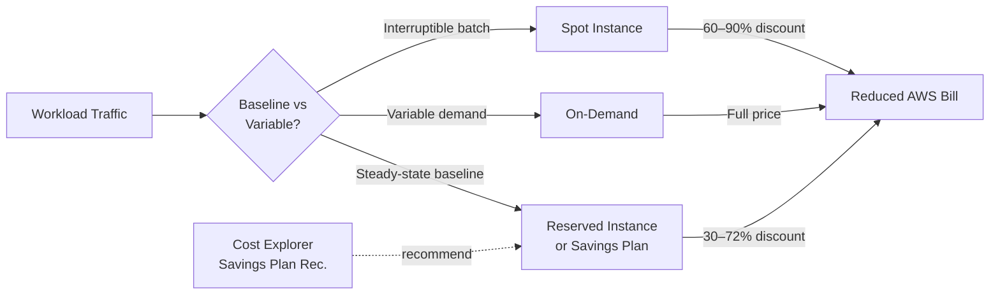

# Reserved Instances & Savings Plans

## Category

**Domain:** FinOps · **Stack:** AWS, Azure, Terraform · **Scope:** Commitment-Based Discounts

---

## Context

Reserved Instances (RIs) and Savings Plans (SPs) are commitment-based pricing models that exchange flexibility for discount — typically 30–72% off On-Demand rates. The key discipline is matching commitment to **steady-state baseline** load: the portion of compute that runs 24/7. Variable and spiky traffic should remain On-Demand or Spot.

### Commitment Types

| Model | Flexibility | Discount | Term | Applies To |
|-------|------------|---------|------|-----------|
| **Reserved Instance (Standard)** | Low (locked instance family, region) | Up to 72% | 1 or 3 yr | EC2, RDS, ElastiCache |
| **Reserved Instance (Convertible)** | Medium (swap family/region) | Up to 66% | 1 or 3 yr | EC2 |
| **Compute Savings Plan** | High (any EC2, Lambda, Fargate) | Up to 66% | 1 or 3 yr | EC2, Lambda, Fargate |
| **EC2 Instance Savings Plan** | Medium (instance family, region) | Up to 72% | 1 or 3 yr | EC2 |
| **Azure Reserved VM** | Low (VM size, region) | Up to 72% | 1 or 3 yr | VMs, SQL, App Service |

### Decision Framework

| Workload Characteristic | Recommendation |
|------------------------|---------------|
| Runs 24/7, predictable | 1-yr Compute Savings Plan for flexibility |
| Runs 24/7, instance family stable | 3-yr Standard RI for maximum discount |
| Growing rapidly (>20%/month) | 1-yr commitment max — avoid lock-in |
| Unpredictable / bursty | On-Demand + Spot — no commitment |
| Long-lived DB (RDS) | RDS Standard 1-yr RI |

---

## Pros

- 30–72% discount on the baseline compute spend — highest ROI of any FinOps action
- Compute Savings Plans provide flexibility across instance families and Lambda
- Convertible RIs allow swapping to new instance types as fleet evolves
- AWS provides Coverage and Utilisation reports to track ROI in real time
- Savings Plans recommendations are built into Cost Explorer

## Cons

- Upfront payment locks capital — requires finance approval
- Over-commitment when workloads shrink wastes money (unutilised commitment)
- 3-year terms are risky for fast-changing architectures (e.g. moving EC2 → ECS → Lambda)
- RI management (buying, modifying, selling in Marketplace) requires dedicated process
- AWS/Azure RI Marketplace secondary market pricing fluctuates

---

## Design Diagram



---

## Code Sample

### Terraform — Purchase Compute Savings Plan

```hcl
# finops/savings-plans.tf

resource "aws_savingsplans_savings_plan" "compute" {
  savings_plan_offer_id = data.aws_savingsplans_savings_plan_offering.compute_1yr.offering_id
  commitment            = var.savings_plan_hourly_commitment  # e.g. "100.00" (USD/hr)
  payment_option        = "Partial_Upfront"   # No_Upfront | Partial_Upfront | All_Upfront
  purchase_time         = null                # null = buy immediately

  tags = {
    Purpose    = "baseline-compute-commitment"
    ManagedBy  = "terraform"
    ReviewDate = "2027-03-01"
  }
}

data "aws_savingsplans_savings_plan_offering" "compute_1yr" {
  funding_account_id  = data.aws_caller_identity.current.account_id
  savings_plan_type   = "Compute"
  terms               = [12]  # 1 year
  product_type        = ""
  operation           = ""
  service_code        = ""
}
```

### Python — Savings Plan Coverage Analysis

```python
# scripts/savings_plans/coverage_report.py
"""
Reports Savings Plan coverage and utilisation.
Coverage < 80% → buy more SPs.
Utilisation < 80% → over-committed, consider selling/exchanging.
"""
import boto3
from datetime import datetime, timedelta, UTC


def get_savings_plan_metrics(lookback_days: int = 30) -> dict:
    client = boto3.client("ce", region_name="us-east-1")

    end = datetime.now(UTC).date()
    start = end - timedelta(days=lookback_days)

    coverage = client.get_savings_plans_coverage(
        TimePeriod={"Start": str(start), "End": str(end)},
        Granularity="MONTHLY",
    )

    utilisation = client.get_savings_plans_utilization(
        TimePeriod={"Start": str(start), "End": str(end)},
        Granularity="MONTHLY",
    )

    return {
        "coverage": coverage.get("SavingsPlansCoverages", []),
        "utilisation": utilisation.get("SavingsPlansUtilizationsByTime", []),
    }


def print_report() -> None:
    metrics = get_savings_plan_metrics()

    print("=== Savings Plan Coverage ===")
    for period in metrics["coverage"]:
        attrs = period.get("Attributes", {})
        cov = period.get("Coverage", {})
        coverage_pct = float(cov.get("CoveragePercentage", 0))
        on_demand = float(cov.get("OnDemandCost", 0))
        print(
            f"  {attrs.get('SAVINGS_PLAN_ARN', 'All')} "
            f"Coverage: {coverage_pct:.1f}%  "
            f"On-Demand spend (uncovered): ${on_demand:,.2f}"
        )

    print("\n=== Savings Plan Utilisation ===")
    for period in metrics["utilisation"]:
        util = period.get("Utilization", {})
        util_pct = float(util.get("UtilizationPercentage", 0))
        unused = float(util.get("UnusedSavings", 0))
        print(
            f"  Utilisation: {util_pct:.1f}%  "
            f"Unused commitment: ${unused:,.2f}"
        )


if __name__ == "__main__":
    print_report()
```

### Python — RI Recommendations via Cost Explorer

```python
# scripts/reserved_instances/get_recommendations.py
"""
Fetches RI purchase recommendations from Cost Explorer.
Output: ranked list of RI purchases with estimated savings.
"""
import boto3
import json
from datetime import datetime, UTC


def get_ri_recommendations(service: str = "Amazon Elastic Compute Cloud - Compute") -> None:
    client = boto3.client("ce", region_name="us-east-1")

    response = client.get_reservation_purchase_recommendation(
        Service=service,
        LookbackPeriodInDays="SIXTY_DAYS",
        TermInYears="ONE_YEAR",
        PaymentOption="PARTIAL_UPFRONT",
    )

    recommendations = response.get("Recommendations", [])
    print(f"RI Recommendations for: {service}")
    print(f"Generated: {datetime.now(UTC).isoformat()}\n")

    for rec in recommendations:
        details = rec.get("RecommendationDetails", [])
        for detail in details:
            spec = detail.get("InstanceDetails", {}).get("EC2InstanceDetails", {})
            savings = detail.get("EstimatedMonthlySavingsAmount", "N/A")
            print(
                f"  {spec.get('InstanceType', '?'):>14}  "
                f"Region: {spec.get('Region', '?'):>12}  "
                f"Count: {detail.get('RecommendedNumberOfInstancesToPurchase', '?'):>4}  "
                f"Est. monthly saving: ${savings}"
            )


if __name__ == "__main__":
    get_ri_recommendations()
```

### YAML — RI Review Workflow (CI Scheduled)

```yaml
# .github/workflows/ri-review.yml
name: Monthly RI / Savings Plan Review

on:
  schedule:
    - cron: "0 9 1 * *"   # 1st of every month, 09:00 UTC
  workflow_dispatch:

permissions:
  contents: none

jobs:
  review:
    runs-on: ubuntu-latest
    steps:
      - uses: actions/checkout@v4

      - name: Configure AWS credentials
        uses: aws-actions/configure-aws-credentials@v4
        with:
          role-to-assume: ${{ secrets.AWS_FINOPS_ROLE_ARN }}
          aws-region: us-east-1

      - name: Set up Python
        uses: actions/setup-python@v5
        with:
          python-version: "3.12"

      - name: Install dependencies
        run: pip install boto3

      - name: Run coverage report
        run: python scripts/savings_plans/coverage_report.py > sp-report.txt

      - name: Run RI recommendations
        run: python scripts/reserved_instances/get_recommendations.py >> sp-report.txt

      - name: Post to Slack
        env:
          SLACK_WEBHOOK_URL: ${{ secrets.SLACK_FINOPS_WEBHOOK }}
        run: |
          REPORT=$(cat sp-report.txt | head -30)
          curl -s -X POST "$SLACK_WEBHOOK_URL" \
            -H "Content-Type: application/json" \
            -d "{\"text\": \":bank: *Monthly RI/SP Review*\n\`\`\`${REPORT}\`\`\`\"}"
```

### Terraform — Azure Reserved VM Instance

```hcl
# finops/azure-reservations.tf

resource "azurerm_reservation_order" "api_servers" {
  name          = "api-server-reservations"
  display_name  = "API Server 1-Year Reserved"
  billing_scope = data.azurerm_billing_enrollment_account.current.id
  term          = "P1Y"    # P1Y or P3Y
  billing_plan  = "Monthly" # Upfront or Monthly

  reservation {
    display_name          = "api-server-westeurope"
    quantity              = var.reserved_vm_count
    sku_name              = "Standard_D4s_v5"
    reserved_resource_type = "VirtualMachines"

    applied_scope_type   = "Shared"  # applies across subscription

    purchase_date = formatdate("YYYY-MM-DD", timestamp())
  }
}
```
