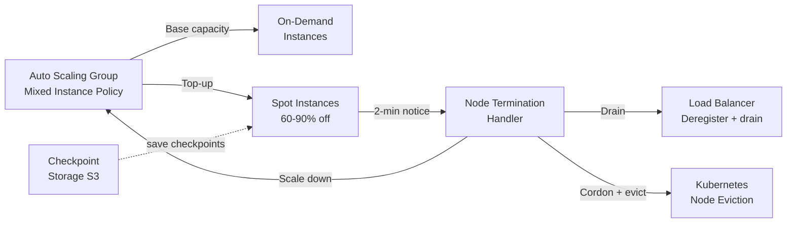

# Spot & Preemptible Instances

## Category

**Domain:** FinOps · **Stack:** AWS, GCP, Kubernetes · **Scope:** Interruptible Compute Discount

---

## Context

Spot Instances (AWS), Preemptible VMs (GCP), and Spot VMs (Azure) offer spare cloud capacity at 60–90% off On-Demand prices. The trade-off: the cloud provider can reclaim the instance with a 2-minute warning. This makes them ideal for **fault-tolerant, stateless, interruptible** workloads.

### Workload Fit

| Workload | Spot-Safe? | Notes |
|----------|-----------|-------|
| Batch data processing (Spark, Ray) | ✅ | Checkpoint to S3/GCS; retry on re-spot |
| CI/CD runners | ✅ | Jobs restart on interruption |
| ML training | ✅ | Save checkpoints every N steps |
| Stateless web tier (with ASG) | ✅ | Mixed On-Demand + Spot instances |
| Stateful databases | ❌ | Data loss risk on interruption |
| Leader-election singletons | ❌ | Interruption causes split-brain |

### AWS Strategies

| Strategy | Use Case |
|----------|---------|
| **Mixed Instance Policy** | ASG with On-Demand base + Spot top-up |
| **Spot Fleet** | Diversify across multiple pools to reduce interruption rate |
| **Capacity-Optimised** allocation | AWS picks the pool with most available capacity |
| **`spot-interruption-handler`** | Daemon reacts to EC2 metadata interruption notice + ASG lifecycle hook |

---

## Pros

- 60–90% cost reduction on compute-heavy workloads
- `capacity-optimized` allocation strategy reduces interruption rates
- AWS Node Termination Handler and KARPENTER support spot in Kubernetes natively
- Interruption notices (2 min) are enough to drain HTTP connections gracefully
- Spot Fleet diversification across families/sizes reduces single-pool interruption risk

## Cons

- Requires stateless or checkpoint-capable workload design
- Spot capacity is not guaranteed under high demand — needs fallback to On-Demand
- Long-running tasks (>hours) must implement robust checkpointing
- Interruption handler adds operational complexity
- Not available in all regions/AZs for all instance families

---

## Design Diagram



---

## Code Sample

### Terraform — Auto Scaling Group with Mixed Instance Policy

```hcl
# finops/spot-mixed-asg.tf

resource "aws_autoscaling_group" "app" {
  name                = "${var.app_name}-asg"
  min_size            = var.asg_min_size
  max_size            = var.asg_max_size
  desired_capacity    = var.asg_desired
  vpc_zone_identifier = var.private_subnet_ids

  mixed_instances_policy {
    launch_template {
      launch_template_specification {
        launch_template_id = aws_launch_template.app.id
        version            = "$Latest"
      }

      # Diversify across similar families to reduce interruption rate
      override {
        instance_type = "m5.xlarge"
      }
      override {
        instance_type = "m5a.xlarge"
      }
      override {
        instance_type = "m5n.xlarge"
      }
      override {
        instance_type = "m4.xlarge"
      }
    }

    instances_distribution {
      on_demand_base_capacity                  = var.on_demand_base    # always-on baseline
      on_demand_percentage_above_base_capacity = 0                     # rest = Spot
      spot_allocation_strategy                 = "capacity-optimized"  # lowest interruption
    }
  }

  lifecycle {
    create_before_destroy = true
  }

  tag {
    key                 = "aws-node-termination-handler/managed"
    value               = "true"
    propagate_at_launch = true
  }
}

resource "aws_launch_template" "app" {
  name_prefix   = "${var.app_name}-lt-"
  image_id      = var.ami_id
  instance_type = "m5.xlarge"

  iam_instance_profile {
    arn = aws_iam_instance_profile.app.arn
  }

  instance_market_options {
    market_type = "spot"
    spot_options {
      interruption_behavior = "terminate"
    }
  }

  network_interfaces {
    associate_public_ip_address = false
    security_groups             = [aws_security_group.app.id]
  }

  user_data = base64encode(var.user_data_script)
}
```

### Helm — AWS Node Termination Handler (Kubernetes)

```yaml
# k8s/spot-termination-handler/values.yaml
# helm install aws-node-termination-handler eks/aws-node-termination-handler -f values.yaml

enableSqsTerminationDraining: true    # use SQS event bridge — preferred over IMDS polling
queueURL: "https://sqs.us-east-1.amazonaws.com/123456789012/nth-queue"

enableSpotInterruptionDraining: true
enableScheduledEventDraining: true
enableRebalanceMonitoring: true
enableRebalanceDraining: true

podTerminationGracePeriod: 120        # 2 minutes to match interruption window
nodeTerminationGracePeriod: 120

webhookURL: ""                        # optionally send to Slack
webhookTemplate: |
  {
    "text": ":warning: Spot interruption: {{ .NodeName }} ({{ .InstanceType }}) in {{ .AvailabilityZone }}"
  }
```

### Python — Spot Interruption Simulation Test

```python
# scripts/spot/simulate_interruption.py
"""
Simulates an EC2 Spot interruption notice by calling the metadata endpoint
on a test instance. Use in staging to verify drain behaviour.
Requires SSM access to the instance.
"""
import boto3
import sys
import time


def simulate_spot_interruption(instance_id: str, region: str = "us-east-1") -> None:
    """
    Sends a simulated Spot interruption via EC2 action endpoint.
    Only works on instances launched with spot market type.
    """
    ec2 = boto3.client("ec2", region_name=region)

    print(f"[SIMULATE] Sending spot interruption to {instance_id} ...")
    ec2.send_spot_instance_interruptions(
        SpotInstanceIds=[instance_id],
        InterruptionBehavior="terminate",
    )
    print(f"[SIMULATE] Interruption sent. Monitor CloudWatch + ASG lifecycle hooks.")


def check_instance_health(instance_id: str, region: str = "us-east-1") -> None:
    ec2 = boto3.client("ec2", region_name=region)
    for _ in range(12):
        state = ec2.describe_instances(InstanceIds=[instance_id])
        status = state["Reservations"][0]["Instances"][0]["State"]["Name"]
        print(f"  Instance {instance_id}: {status}")
        if status in ("terminated", "shutting-down"):
            print("[OK] Instance terminated as expected.")
            return
        time.sleep(10)
    print("[WARN] Instance still running after 2 minutes.")


if __name__ == "__main__":
    if len(sys.argv) < 2:
        print("Usage: python simulate_interruption.py <instance-id>")
        sys.exit(1)
    iid = sys.argv[1]
    simulate_spot_interruption(iid)
    check_instance_health(iid)
```

### YAML — GitHub Actions Spot Usage Report

```yaml
# .github/workflows/spot-usage-report.yml
name: Weekly Spot Usage Report

on:
  schedule:
    - cron: "0 8 * * 1"   # Monday 08:00 UTC
  workflow_dispatch:

permissions:
  contents: none

jobs:
  report:
    runs-on: ubuntu-latest
    steps:
      - uses: aws-actions/configure-aws-credentials@v4
        with:
          role-to-assume: ${{ secrets.AWS_FINOPS_ROLE_ARN }}
          aws-region: us-east-1

      - name: Collect Spot vs On-Demand spend
        run: |
          aws ce get-cost-and-usage \
            --time-period Start=$(date -d 'last monday' +%Y-%m-%d),End=$(date +%Y-%m-%d) \
            --granularity WEEKLY \
            --metrics BlendedCost \
            --group-by Type=DIMENSION,Key=PURCHASE_TYPE \
            --filter '{"Dimensions":{"Key":"SERVICE","Values":["Amazon Elastic Compute Cloud - Compute"]}}' \
            --output json | tee spot-report.json

      - name: Parse and notify Slack
        env:
          SLACK_WEBHOOK_URL: ${{ secrets.SLACK_FINOPS_WEBHOOK }}
        run: |
          SPOT=$(jq -r '[.ResultsByTime[].Groups[]|select(.Keys[0]=="Spot")|.Metrics.BlendedCost.Amount]|add//0' spot-report.json)
          OD=$(jq -r '[.ResultsByTime[].Groups[]|select(.Keys[0]=="On Demand")|.Metrics.BlendedCost.Amount]|add//0' spot-report.json)
          curl -s -X POST "$SLACK_WEBHOOK_URL" \
            -H "Content-Type: application/json" \
            -d "{\"text\": \":cloud: *Weekly Spot Report*\nSpot: \$${SPOT}\nOn-Demand: \$${OD}\"}"
```
