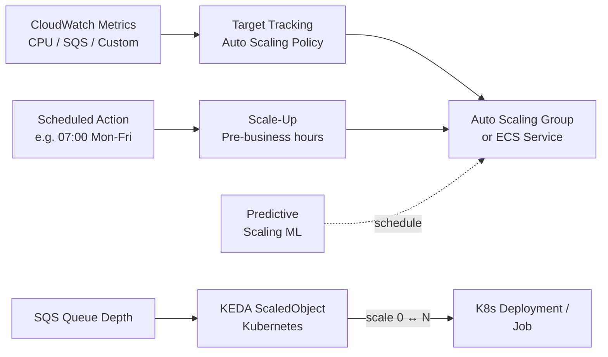

# Auto-Scaling & Scale-to-Zero

## Category

**Domain:** FinOps · **Stack:** AWS, Kubernetes, KEDA · **Scope:** Elastic Capacity Management

---

## Context

Auto-scaling eliminates the biggest cloud waste pattern: **over-provisioned idle capacity**. The goal is to match provisioned compute to actual demand — elastically expanding under load and shrinking (ideally to zero) during quiet periods.

### Scaling Strategies

| Strategy | Trigger | Latency | Best For |
|----------|---------|---------|---------|
| **Target Tracking (ASG)** | CPU / request count % | ~3 min | Steady web traffic |
| **Step Scaling** | CloudWatch alarm breach | ~2 min | Spiky but predictable |
| **Predictive Scaling** | ML forecast of past patterns | Proactive | Day/week cycles |
| **KEDA (Kubernetes)** | Queue depth, custom metrics | ~30 s | Event-driven workloads |
| **Scale-to-Zero (KEDA / Knative)** | Zero events/requests | Instant | Dev, batch, off-hours |
| **Scheduled Scaling** | Cron time expression | Instant | Known business hours |

### Cost Impact

| Pattern | Typical Saving |
|---------|---------------|
| Dev/test scale-to-zero (nights & weekends) | 60–70% off base capacity |
| Production right-size + target tracking | 20–40% |
| Predictive scaling (prevent over-provision spikes) | 10–20% |

---

## Pros

- Fully elastic — pay only for what you use during demand spikes
- Scale-to-zero for non-production environments delivers largest dev cost saving
- KEDA supports 60+ scalers (SQS, Kafka, Prometheus, HTTP, cron)
- Predictive scaling prevents cold starts from under-provisioning
- AWS Auto Scaling integrates natively with ASGs, ECS Services, and Aurora Serverless

## Cons

- Scale-in delays cause over-spending if not tuned (default 300 s cooldown)
- Scale-to-zero introduces cold-start latency when traffic resumes
- KEDA adds a cluster component to manage and version
- Predictive scaling requires 14+ days of CloudWatch history
- Aggressive scale-in of stateful services risks data loss

---

## Design Diagram



---

## Code Sample

### Terraform — ASG Target Tracking + Scheduled Scale-Down

```hcl
# finops/auto-scaling.tf

# ---------- Target Tracking — keep avg CPU at 60% ----------
resource "aws_autoscaling_policy" "cpu_target" {
  name                   = "${var.app_name}-cpu-target"
  autoscaling_group_name = aws_autoscaling_group.app.name
  policy_type            = "TargetTrackingScaling"

  target_tracking_configuration {
    predefined_metric_specification {
      predefined_metric_type = "ASGAverageCPUUtilization"
    }
    target_value     = 60.0
    disable_scale_in = false
  }
}

# ---------- Predictive Scaling (ML-based pre-warming) ----------
resource "aws_autoscaling_policy" "predictive" {
  name                   = "${var.app_name}-predictive"
  autoscaling_group_name = aws_autoscaling_group.app.name
  policy_type            = "PredictiveScaling"

  predictive_scaling_configuration {
    mode                          = "ForecastAndScale"
    scheduling_buffer_time        = 300   # seconds to pre-scale before forecast peak

    metric_specification {
      target_value = 60

      predefined_scaling_metric_specification {
        predefined_metric_type = "ASGAverageCPUUtilization"
        resource_label         = ""
      }

      predefined_load_metric_specification {
        predefined_metric_type = "ASGTotalCPUUtilization"
        resource_label         = ""
      }
    }
  }
}

# ---------- Scheduled: scale down nights/weekends (cost saving) ----------
resource "aws_autoscaling_schedule" "scale_down_evening" {
  scheduled_action_name  = "scale-down-evening"
  autoscaling_group_name = aws_autoscaling_group.app.name
  recurrence             = "0 19 * * 1-5"   # weekday 19:00 UTC
  min_size               = 1
  max_size               = var.asg_max_size
  desired_capacity       = 1
}

resource "aws_autoscaling_schedule" "scale_up_morning" {
  scheduled_action_name  = "scale-up-morning"
  autoscaling_group_name = aws_autoscaling_group.app.name
  recurrence             = "0 7 * * 1-5"    # weekday 07:00 UTC
  min_size               = var.asg_min_size
  max_size               = var.asg_max_size
  desired_capacity       = var.asg_desired
}
```

### YAML — KEDA ScaledObject (SQS trigger, scale-to-zero)

```yaml
# k8s/keda/scaled-object-sqs.yaml
apiVersion: keda.sh/v1alpha1
kind: ScaledObject
metadata:
  name: worker-sqs-scaler
  namespace: processing
spec:
  scaleTargetRef:
    name: worker-deployment

  minReplicaCount: 0          # scale fully to zero when queue empty
  maxReplicaCount: 20
  pollingInterval: 15          # seconds between metric checks
  cooldownPeriod: 30           # seconds to wait before scaling in to 0

  triggers:
    - type: aws-sqs-queue
      authenticationRef:
        name: keda-aws-credentials
      metadata:
        queueURL: "https://sqs.us-east-1.amazonaws.com/123456789012/work-queue"
        queueLength: "5"           # target messages per replica
        awsRegion: "us-east-1"
        identityOwner: operator    # use KEDA operator IAM role

---
apiVersion: keda.sh/v1alpha1
kind: TriggerAuthentication
metadata:
  name: keda-aws-credentials
  namespace: processing
spec:
  podIdentity:
    provider: aws                  # use EKS IRSA — no static credentials
```

### YAML — KEDA Cron Scaler (dev environment scale-to-zero)

```yaml
# k8s/keda/dev-scale-to-zero.yaml
apiVersion: keda.sh/v1alpha1
kind: ScaledObject
metadata:
  name: dev-scale-to-zero
  namespace: dev
spec:
  scaleTargetRef:
    name: dev-api

  minReplicaCount: 0
  maxReplicaCount: 2

  triggers:
    - type: cron
      metadata:
        timezone: "Europe/Amsterdam"
        start: "0 8 * * 1-5"     # Mon-Fri 08:00 → scale up
        end:   "0 19 * * 1-5"    # Mon-Fri 19:00 → scale to zero
        desiredReplicas: "2"
```

### Python — ECS Service Scale-to-Zero (Off-Hours Script)

```python
# scripts/scaling/ecs_scale_to_zero.py
"""
Scales non-production ECS services to 0 outside business hours.
Designed to run as a Lambda or scheduled GitHub Actions job.
"""
import boto3
import os
from datetime import datetime, UTC

NON_PROD_CLUSTERS = os.environ.get("NON_PROD_CLUSTERS", "dev-cluster,staging-cluster").split(",")
REGION = os.environ.get("AWS_REGION", "us-east-1")
BUSINESS_START = 8   # UTC
BUSINESS_END   = 19  # UTC


def should_scale_down() -> bool:
    now = datetime.now(UTC)
    is_weekend = now.weekday() >= 5
    is_outside_hours = now.hour < BUSINESS_START or now.hour >= BUSINESS_END
    return is_weekend or is_outside_hours


def scale_cluster_services(cluster: str, desired: int) -> None:
    ecs = boto3.client("ecs", region_name=REGION)
    services = ecs.list_services(cluster=cluster)["serviceArns"]

    for svc_arn in services:
        svc_name = svc_arn.split("/")[-1]
        ecs.update_service(cluster=cluster, service=svc_name, desiredCount=desired)
        print(f"  {cluster}/{svc_name} → desiredCount={desired}")


def handler(event=None, context=None) -> dict:
    desired = 0 if should_scale_down() else None
    if desired is None:
        print("Within business hours — no action.")
        return {"status": "no-op"}

    for cluster in NON_PROD_CLUSTERS:
        print(f"Scaling {cluster} to desiredCount=0 ...")
        scale_cluster_services(cluster, 0)

    return {"status": "scaled-to-zero", "clusters": NON_PROD_CLUSTERS}


if __name__ == "__main__":
    print(handler())
```
