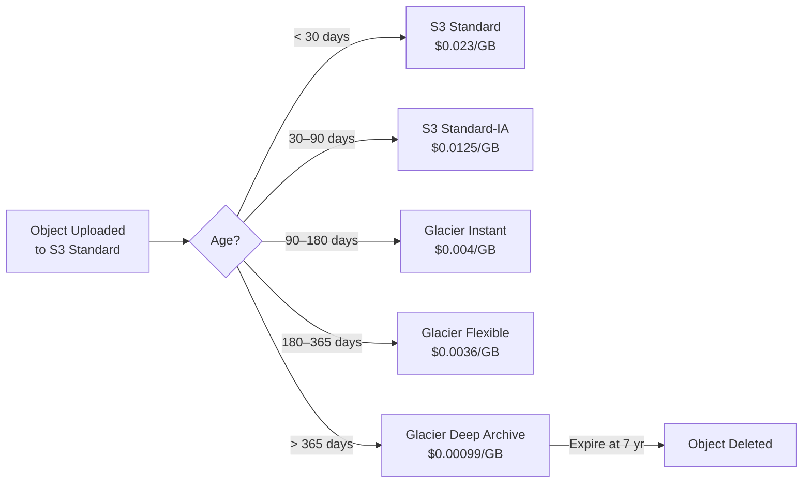

# Storage Tiering & Lifecycle Policies

## Category

**Domain:** FinOps · **Stack:** AWS S3, EBS, EFS, Terraform · **Scope:** Storage Cost Reduction

---

## Context

Storage is often the **second-largest cloud bill item** after compute, yet most organisations pay premium prices for all data regardless of access frequency. Storage tiering automatically migrates data to cheaper tiers as it ages — with no application changes required.

### AWS S3 Storage Tiers (Cost Order — Cheapest to Costliest)

| Tier | $/GB/month* | Access Cost | Retrieval | Use Case |
|------|------------|------------|-----------|---------|
| S3 Glacier Deep Archive | $0.00099 | $0.0025/1k GET | 12 h | Compliance archive |
| S3 Glacier Flexible | $0.0036 | $0.01/1k GET | 3–5 h | Long-term backup |
| S3 Glacier Instant | $0.004 | $0.02/1k GET | Milliseconds | Quarterly access |
| S3 Standard-IA | $0.0125 | $0.01/1k GET | Milliseconds | Monthly access |
| S3 One Zone-IA | $0.01 | $0.01/1k GET | Milliseconds | Recreatable infrequent |
| S3 Intelligent-Tiering | $0.023+ monitoring | Automatic move | Auto | Unknown access pattern |
| S3 Standard | $0.023 | $0.0004/1k GET | Milliseconds | Frequent access |

*us-east-1 approximate prices

### EBS Volume Cost Reduction

| Action | Saving |
|--------|-------|
| GP2 → GP3 migration | ~20% cheaper, better baseline performance |
| Delete unattached EBS volumes | 100% saving — pure waste |
| Snapshot lifecycle (delete old snapshots) | Up to 80% of snapshot spend |

---

## Pros

- Fully automated with S3 Lifecycle Rules — zero application changes required
- S3 Intelligent-Tiering handles unknown or changing access patterns automatically
- GP2 → GP3 migration is non-disruptive and delivers immediate cost reduction
- Snapshot lifecycle policies prevent silent snapshot cost accumulation
- EFS Lifecycle Management mirrors the S3 pattern for NFS workloads

## Cons

- S3 Standard-IA has 30-day minimum storage and 128 KB minimum object charges
- Glacier retrievals take hours — not suitable for data that may need urgent access
- Intelligent-Tiering monitoring fee ($0.0025/1k objects) makes it uneconomical for tiny objects
- EBS snapshots billed on changed blocks — deleting a chain may not free all expected space
- Lifecycle rule errors (wrong prefixes) can accidentally archive active data

---

## Design Diagram



---

## Code Sample

### Terraform — S3 Lifecycle Rules

```hcl
# finops/s3-lifecycle.tf

resource "aws_s3_bucket" "data_lake" {
  bucket = "${var.project}-data-lake-${var.account_id}"

  tags = {
    DataClassification = "internal"
    ManagedBy          = "terraform"
  }
}

resource "aws_s3_bucket_lifecycle_configuration" "data_lake" {
  bucket = aws_s3_bucket.data_lake.id

  rule {
    id     = "transition-to-ia"
    status = "Enabled"

    filter {
      prefix = "raw/"   # apply only to raw prefix
    }

    transition {
      days          = 30
      storage_class = "STANDARD_IA"
    }

    transition {
      days          = 90
      storage_class = "GLACIER_IR"   # Glacier Instant Retrieval
    }

    transition {
      days          = 180
      storage_class = "GLACIER"      # Glacier Flexible Retrieval
    }

    transition {
      days          = 365
      storage_class = "DEEP_ARCHIVE"
    }

    expiration {
      days = 2555   # 7 years — comply with typical regulatory retention
    }
  }

  rule {
    id     = "abort-incomplete-multipart"
    status = "Enabled"

    filter {}

    abort_incomplete_multipart_upload {
      days_after_initiation = 7
    }
  }

  rule {
    id     = "intelligent-tiering-unclassified"
    status = "Enabled"

    filter {
      prefix = "processed/"
    }

    transition {
      days          = 0
      storage_class = "INTELLIGENT_TIERING"
    }
  }
}

# Optional: S3 Intelligent-Tiering configuration (archive tiers)
resource "aws_s3_bucket_intelligent_tiering_configuration" "data_lake" {
  bucket = aws_s3_bucket.data_lake.id
  name   = "EntireDataLake"

  tiering {
    access_tier = "ARCHIVE_ACCESS"
    days        = 90
  }

  tiering {
    access_tier = "DEEP_ARCHIVE_ACCESS"
    days        = 180
  }
}
```

### Terraform — EBS Snapshot Lifecycle (Data Lifecycle Manager)

```hcl
# finops/ebs-snapshot-lifecycle.tf

resource "aws_dlm_lifecycle_policy" "ebs_snapshots" {
  description        = "Retain 7 daily + 4 weekly + 6 monthly EBS snapshots"
  execution_role_arn = aws_iam_role.dlm.arn
  state              = "ENABLED"

  policy_details {
    resource_types = ["VOLUME"]

    target_tags = {
      "aws:dlm:managed" = "true"
    }

    schedule {
      name = "Daily snapshots"

      create_rule {
        interval      = 24
        interval_unit = "HOURS"
        times         = ["03:00"]  # 03:00 UTC
      }

      retain_rule {
        count = 7   # keep 7 daily snapshots
      }

      tags_to_add = {
        SnapshotType = "daily"
      }

      copy_tags = true
    }

    schedule {
      name = "Weekly snapshots"

      create_rule {
        cron_expression = "cron(0 3 ? * 1 *)"  # every Sunday 03:00
      }

      retain_rule {
        count = 4   # keep last 4 weekly snapshots
      }

      tags_to_add = {
        SnapshotType = "weekly"
      }

      copy_tags = true
    }
  }

  tags = {
    ManagedBy = "terraform"
  }
}

resource "aws_iam_role" "dlm" {
  name               = "dlm-lifecycle-role"
  assume_role_policy = data.aws_iam_policy_document.dlm_assume.json
}

data "aws_iam_policy_document" "dlm_assume" {
  statement {
    actions = ["sts:AssumeRole"]
    principals {
      type        = "Service"
      identifiers = ["dlm.amazonaws.com"]
    }
  }
}

resource "aws_iam_role_policy_attachment" "dlm" {
  role       = aws_iam_role.dlm.name
  policy_arn = "arn:aws:iam::aws:policy/service-role/AWSDataLifecycleManagerServiceRole"
}
```

### Python — GP2 to GP3 Migration Script

```python
# scripts/storage/migrate_gp2_to_gp3.py
"""
Identifies all gp2 EBS volumes and migrates them to gp3.
gp3 is ~20% cheaper and has higher baseline IOPS/throughput.
Runs migration in-place (no downtime, no data copy required).
"""
import boto3
import sys


def get_gp2_volumes(region: str) -> list[dict]:
    ec2 = boto3.client("ec2", region_name=region)
    paginator = ec2.get_paginator("describe_volumes")
    volumes = []
    for page in paginator.paginate(Filters=[{"Name": "volume-type", "Values": ["gp2"]}]):
        volumes.extend(page["Volumes"])
    return volumes


def migrate_to_gp3(volume_id: str, region: str, dry_run: bool = True) -> None:
    ec2 = boto3.client("ec2", region_name=region)
    if dry_run:
        print(f"  [DRY-RUN] Would modify {volume_id} gp2 → gp3")
        return

    ec2.modify_volume(
        VolumeId=volume_id,
        VolumeType="gp3",
        # gp3 defaults: 3000 IOPS, 125 MB/s throughput (free)
        # gp2 defaults match automatically; no perf regression
    )
    print(f"  [OK] Modified {volume_id}: gp2 → gp3")


def main() -> None:
    region = sys.argv[1] if len(sys.argv) > 1 else "us-east-1"
    dry_run = "--apply" not in sys.argv

    if dry_run:
        print("=== DRY RUN — pass --apply to execute ===")

    volumes = get_gp2_volumes(region)
    total_gb = sum(v["Size"] for v in volumes)
    print(f"Found {len(volumes)} gp2 volumes, total {total_gb} GB in {region}")

    for vol in volumes:
        vid = vol["VolumeId"]
        size = vol["Size"]
        state = vol["State"]
        attachments = [a["InstanceId"] for a in vol.get("Attachments", [])]
        print(f"  {vid}  {size} GB  state={state}  attached={attachments or 'unattached'}")
        migrate_to_gp3(vid, region, dry_run=dry_run)


if __name__ == "__main__":
    main()
```
