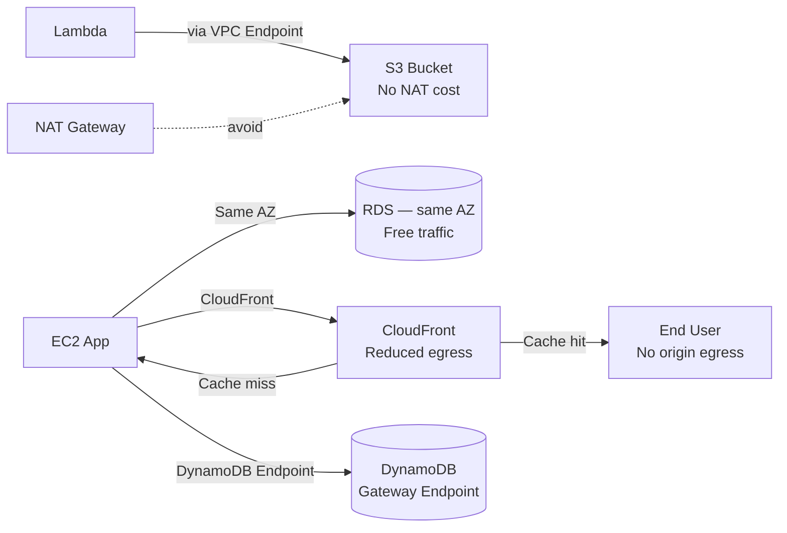

# Data Transfer Cost Optimisation

## Category

**Domain:** FinOps · **Stack:** AWS, Terraform · **Scope:** Network Egress & Inter-Service Traffic

---

## Context

Data transfer ("egress") is one of the most **hidden and rapidly-growing** cloud cost categories. AWS charges for data leaving a region, crossing AZs, and exiting via NAT Gateways — but does not charge for inbound data or same-AZ traffic within a VPC.

### AWS Data Transfer Pricing (Approximate)

| Transfer Type | Cost |
|--------------|------|
| Internet egress (first 10 TB/month) | $0.09/GB |
| Cross-region egress | $0.02/GB |
| Cross-AZ (same region) | $0.01/GB (each direction) |
| NAT Gateway data processing | $0.045/GB |
| VPC Gateway Endpoint (S3/DynamoDB) | $0.00 — free |
| VPC Interface Endpoint | $0.01/GB (vs $0.045 NAT) |
| CloudFront → origin | $0.0085/GB |

### Key Cost Drivers

| Driver | Fix |
|--------|-----|
| Services calling S3 via NAT Gateway | VPC Gateway Endpoint — free, no NAT cost |
| Cross-AZ traffic (app → DB different AZ) | Deploy replicas in same AZ; use local-zone routing |
| Lambda calling AWS services via NAT | VPC Interface Endpoint; or remove Lambda from VPC |
| EC2 serving large files to internet | CloudFront CDN (lower egress rate + caching) |
| CloudWatch Logs ingestion from EC2 | Reduce log verbosity; use EMF structured metrics |

---

## Pros

- VPC Gateway Endpoints for S3/DynamoDB are free and require only minor routing changes
- CloudFront front-ending origins reduces origin egress by 60–90% via cache
- Same-AZ traffic is free — simple architectural decisions deliver large savings
- VPC Flow Logs + Cost Explorer can identify egress top-talkers automatically
- PrivateLink Interface Endpoints reduce NAT Gateway data processing fees

## Cons

- VPC Interface Endpoints cost ~$7–8/month per endpoint per AZ (hourly charge)
- Eliminating cross-AZ traffic requires AZ-aware load balancing configuration
- CloudFront adds caching complexity and cache-invalidation workflow
- VPC Flow Logs themselves cost $0.50/GB — must be sampled or filtered
- Measuring cross-AZ traffic requires custom VPC Flow Log analysis (not in Cost Explorer by default)

---

## Design Diagram



---

## Code Sample

### Terraform — VPC Gateway Endpoints (S3 & DynamoDB)

```hcl
# finops/vpc-endpoints.tf

# Free Gateway Endpoints — route S3 and DynamoDB traffic inside the VPC
# No NAT Gateway data processing charges

resource "aws_vpc_endpoint" "s3" {
  vpc_id            = var.vpc_id
  service_name      = "com.amazonaws.${var.aws_region}.s3"
  vpc_endpoint_type = "Gateway"
  route_table_ids   = var.private_route_table_ids

  policy = data.aws_iam_policy_document.s3_endpoint.json

  tags = { Name = "s3-gateway-endpoint" }
}

resource "aws_vpc_endpoint" "dynamodb" {
  vpc_id            = var.vpc_id
  service_name      = "com.amazonaws.${var.aws_region}.dynamodb"
  vpc_endpoint_type = "Gateway"
  route_table_ids   = var.private_route_table_ids

  tags = { Name = "dynamodb-gateway-endpoint" }
}

data "aws_iam_policy_document" "s3_endpoint" {
  statement {
    effect    = "Allow"
    actions   = ["s3:*"]
    resources = ["*"]
    principals {
      type        = "AWS"
      identifiers = ["*"]
    }
    condition {
      test     = "StringEquals"
      variable = "aws:SourceVpc"
      values   = [var.vpc_id]
    }
  }
}

# Interface Endpoint for Secrets Manager — avoids NAT for Lambda/ECS lookups
resource "aws_vpc_endpoint" "secrets_manager" {
  vpc_id              = var.vpc_id
  service_name        = "com.amazonaws.${var.aws_region}.secretsmanager"
  vpc_endpoint_type   = "Interface"
  subnet_ids          = var.private_subnet_ids
  security_group_ids  = [aws_security_group.vpc_endpoint.id]
  private_dns_enabled = true

  tags = { Name = "secretsmanager-interface-endpoint" }
}

resource "aws_security_group" "vpc_endpoint" {
  name        = "vpc-endpoint-sg"
  description = "Allow HTTPS from VPC CIDR to VPC endpoints"
  vpc_id      = var.vpc_id

  ingress {
    from_port   = 443
    to_port     = 443
    protocol    = "tcp"
    cidr_blocks = [data.aws_vpc.main.cidr_block]
  }

  egress {
    from_port   = 0
    to_port     = 0
    protocol    = "-1"
    cidr_blocks = ["0.0.0.0/0"]
  }
}
```

### Python — VPC Flow Log Egress Analyser (Athena)

```python
# scripts/network/egress_cost_report.py
"""
Queries Athena VPC Flow Logs to find top cross-AZ and internet egress pairs.
Set up VPC Flow Logs → S3 + Athena table before running.
"""
import boto3
import time


ATHENA_DB      = "vpc_flow_logs"
ATHENA_TABLE   = "flow_logs"
RESULTS_BUCKET = "s3://my-athena-results/"
REGION         = "us-east-1"
LOOKBACK_HOURS = 24


QUERY = f"""
SELECT
    srcaddr,
    dstaddr,
    SUM(bytes) / (1024 * 1024 * 1024.0) AS transferred_gb,
    availability_zone
FROM "{ATHENA_DB}"."{ATHENA_TABLE}"
WHERE
    "date" >= date_add('hour', -{LOOKBACK_HOURS}, now())
    AND action = 'ACCEPT'
    AND flow_direction = 'egress'
GROUP BY srcaddr, dstaddr, availability_zone
ORDER BY transferred_gb DESC
LIMIT 20
"""


def run_athena_query(query: str) -> list[dict]:
    client = boto3.client("athena", region_name=REGION)
    response = client.start_query_execution(
        QueryString=query,
        QueryExecutionContext={"Database": ATHENA_DB},
        ResultConfiguration={"OutputLocation": RESULTS_BUCKET},
    )
    qid = response["QueryExecutionId"]

    # Poll until complete
    for _ in range(30):
        status = client.get_query_execution(QueryExecutionId=qid)["QueryExecution"]["Status"]["State"]
        if status in ("SUCCEEDED", "FAILED", "CANCELLED"):
            break
        time.sleep(5)

    if status != "SUCCEEDED":
        raise RuntimeError(f"Athena query {status}")

    pages = client.get_paginator("get_query_results").paginate(QueryExecutionId=qid)
    rows = []
    headers = None
    for page in pages:
        result_rows = page["ResultSet"]["Rows"]
        if headers is None:
            headers = [h["VarCharValue"] for h in result_rows[0]["Data"]]
            result_rows = result_rows[1:]
        for row in result_rows:
            values = [d.get("VarCharValue", "") for d in row["Data"]]
            rows.append(dict(zip(headers, values)))
    return rows


def main() -> None:
    print(f"Top egress pairs — last {LOOKBACK_HOURS}h\n")
    rows = run_athena_query(QUERY)
    for row in rows:
        print(
            f"  {row.get('srcaddr', '?'):>15} → {row.get('dstaddr', '?'):<15}  "
            f"{float(row.get('transferred_gb', 0)):>8.2f} GB  "
            f"AZ: {row.get('availability_zone', '?')}"
        )


if __name__ == "__main__":
    main()
```

### Terraform — NAT Gateway Cost Control (Centralised NAT)

```hcl
# finops/nat-gateway.tf
# Use a SINGLE NAT Gateway per region (not one per AZ) for non-production
# to avoid paying for unused NAT GW hours in every AZ.
# For production, keep per-AZ for resilience — centralise only for dev/test.

resource "aws_eip" "nat" {
  count  = var.environment == "production" ? length(var.private_subnet_ids) : 1
  domain = "vpc"
  tags   = { Name = "nat-eip-${count.index}" }
}

resource "aws_nat_gateway" "main" {
  count         = var.environment == "production" ? length(var.private_subnet_ids) : 1
  allocation_id = aws_eip.nat[count.index].id
  subnet_id     = var.public_subnet_ids[count.index]
  tags          = { Name = "nat-gw-${count.index}" }
}

# Non-prod: all private subnets route through the single NAT GW
resource "aws_route" "private_nat" {
  count                  = var.environment == "production" ? 0 : length(var.private_route_table_ids)
  route_table_id         = var.private_route_table_ids[count.index]
  destination_cidr_block = "0.0.0.0/0"
  nat_gateway_id         = aws_nat_gateway.main[0].id
}
```
