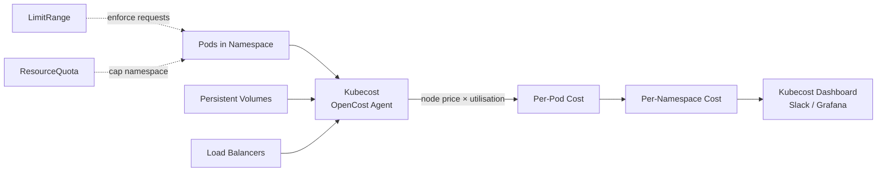

# Kubernetes Cost Allocation

## Category

**Domain:** FinOps · **Stack:** Kubernetes, Kubecost, Helm, Terraform · **Scope:** Container Cost Visibility & Efficiency

---

## Context

Kubernetes clusters are shared infrastructure — without cost allocation, every team sees "the EKS bill" as one opaque number. Kubernetes cost allocation assigns actual cloud spend to namespaces, teams, and workloads by correlating pod CPU/memory consumption with node pricing.

### Cost Attribution Layers

| Layer | What to Measure | Tool |
|-------|----------------|------|
| **Node cost** | EC2/GKE VM price × uptime | Kubecost, OpenCost |
| **Pod cost** | Node cost × (pod CPU+mem / node capacity) | Kubecost |
| **Namespace cost** | Sum of all pod costs in namespace | Kubecost, built-in |
| **Persistent Volume cost** | EBS/PD volume cost | Kubecost |
| **Load Balancer cost** | ELB/ALB per service | Kubecost |
| **Idle cost** | Requested but un-consumed compute | Kubecost |

### Key Concepts

| Concept | Definition |
|---------|-----------|
| **Efficiency** | `actual usage / requested resources` — low = wasting provisioned resources |
| **Idle cost** | Paying for requested resources that are not consumed |
| **Shared cost** | System pods, logging agents — amortised across all namespaces |
| **LimitRange** | Enforces min/max per container — prevents unlimited resource requests |
| **ResourceQuota** | Namespace-level ceiling — prevents one team consuming entire cluster |

---

## Pros

- Kubecost (open-source) provides sub-hour, per-workload cost breakdown at no extra cloud cost
- Resource requests are required for accurate cost attribution (forces good hygiene)
- LimitRange prevents missing resource requests — enforces cost attribution accuracy
- Cost efficiency score creates a simple KPI teams can optimise
- OpenCost is CNCF-sandbox — vendor-neutral alternative to Kubecost

## Cons

- Kubecost requires persistent storage and metric retention (adds infra overhead)
- Cost attribution accuracy depends on consistent resource request/limit discipline across teams
- Shared cluster costs (system daemons, monitoring) must be allocated with a strategy — creates political friction
- Multi-tenant clusters blur accountability — clear namespace-to-team mapping is essential
- Not all cloud costs are K8s-allocatable (data transfer, Route53, managed services)

---

## Design Diagram



---

## Code Sample

### Helm — Kubecost Installation on EKS

```yaml
# k8s/kubecost/values.yaml
# helm repo add kubecost https://kubecost.github.io/cost-analyzer/
# helm install kubecost kubecost/cost-analyzer -n kubecost --create-namespace -f values.yaml

global:
  prometheus:
    enabled: false                     # use existing cluster Prometheus
    fqdn: http://prometheus-server.monitoring.svc.cluster.local

kubecostToken: ""                      # leave empty for free OSS tier

networkCosts:
  enabled: true                        # track per-pod egress costs
  podMonitor:
    enabled: false

persistentVolume:
  enabled: true
  size: 32Gi
  storageClass: gp3

grafana:
  enabled: false                       # use existing Grafana

reporting:
  productAnalytics: false              # no telemetry
```

### YAML — LimitRange (Enforce Resource Requests)

```yaml
# k8s/policy/limitrange.yaml
apiVersion: v1
kind: LimitRange
metadata:
  name: default-limits
  namespace: ""        # applied per-namespace via Helm or Kustomize
spec:
  limits:
    - type: Container
      defaultRequest:
        cpu: "100m"
        memory: "128Mi"
      default:
        cpu: "500m"
        memory: "512Mi"
      max:
        cpu: "4"
        memory: "8Gi"
      min:
        cpu: "50m"
        memory: "64Mi"
    - type: PersistentVolumeClaim
      max:
        storage: "50Gi"
```

### YAML — ResourceQuota (Namespace Ceiling)

```yaml
# k8s/policy/resource-quota-team.yaml
apiVersion: v1
kind: ResourceQuota
metadata:
  name: team-quota
  namespace: team-alpha       # one per team namespace
spec:
  hard:
    requests.cpu: "20"
    requests.memory: "40Gi"
    limits.cpu: "40"
    limits.memory: "80Gi"
    persistentvolumeclaims: "10"
    requests.storage: "200Gi"
    count/services.loadbalancers: "2"    # limit expensive load balancers
```

### Python — Kubecost API Cost Report

```python
# scripts/k8s/kubecost_report.py
"""
Fetches team namespace costs from Kubecost REST API.
Outputs a cost-per-team report with efficiency score.
Designed for weekly Slack digest or CI job.
"""
import os
import requests
from datetime import datetime, timedelta, UTC


KUBECOST_HOST = os.environ.get("KUBECOST_HOST", "http://kubecost.kubecost.svc.cluster.local:9090")
WINDOW_DAYS   = int(os.environ.get("KUBECOST_WINDOW_DAYS", "7"))


def get_namespace_costs(window_days: int = 7) -> list[dict]:
    end   = datetime.now(UTC).date()
    start = end - timedelta(days=window_days)
    url   = f"{KUBECOST_HOST}/model/allocation"
    params = {
        "window": f"{start},{end}",
        "aggregate": "namespace",
        "step":      "1d",
        "accumulate": "true",
        "shareIdle":  "true",
    }
    resp = requests.get(url, params=params, timeout=30)
    resp.raise_for_status()
    data = resp.json().get("data", [{}])[0]
    return list(data.values())


def print_report(costs: list[dict]) -> None:
    print(f"\n{'Namespace':<25} {'Total Cost':>12} {'Efficiency':>12} {'Idle Cost':>12}")
    print("-" * 65)
    sorted_costs = sorted(costs, key=lambda c: c.get("totalCost", 0), reverse=True)
    for ns in sorted_costs:
        name       = ns.get("name", "?")
        total      = ns.get("totalCost", 0)
        efficiency = ns.get("totalEfficiency", 0) * 100
        idle       = ns.get("idleCost", 0)
        print(f"  {name:<23} ${total:>10.2f}  {efficiency:>10.1f}%  ${idle:>10.2f}")


if __name__ == "__main__":
    costs = get_namespace_costs(WINDOW_DAYS)
    print(f"Kubecost report — last {WINDOW_DAYS} days")
    print_report(costs)
```

### YAML — Weekly Kubecost Digest (GitHub Actions)

```yaml
# .github/workflows/kubecost-report.yml
name: Weekly Kubernetes Cost Digest

on:
  schedule:
    - cron: "0 8 * * 1"   # Monday 08:00 UTC
  workflow_dispatch:

permissions:
  contents: none

jobs:
  report:
    runs-on: ubuntu-latest
    steps:
      - uses: actions/checkout@v4

      - name: Configure AWS
        uses: aws-actions/configure-aws-credentials@v4
        with:
          role-to-assume: ${{ secrets.AWS_EKS_ROLE_ARN }}
          aws-region: eu-west-1

      - name: Setup kubeconfig
        run: aws eks update-kubeconfig --name ${{ secrets.EKS_CLUSTER_NAME }} --region eu-west-1

      - name: Set up Python
        uses: actions/setup-python@v5
        with:
          python-version: "3.12"

      - name: Install dependencies
        run: pip install requests

      - name: Run cost report via port-forward
        run: |
          kubectl port-forward svc/kubecost-cost-analyzer 9090:9090 -n kubecost &
          sleep 5
          KUBECOST_HOST=http://localhost:9090 python scripts/k8s/kubecost_report.py > report.txt
          kill %1

      - name: Post to Slack
        env:
          SLACK_WEBHOOK_URL: ${{ secrets.SLACK_FINOPS_WEBHOOK }}
        run: |
          REPORT=$(cat report.txt)
          curl -s -X POST "$SLACK_WEBHOOK_URL" \
            -H "Content-Type: application/json" \
            -d "{\"text\": \":kubernetes: *Weekly K8s Cost Report*\n\`\`\`${REPORT}\`\`\`\"}"
```
