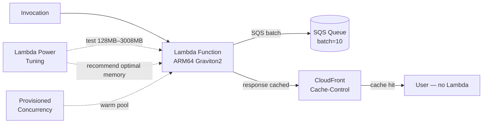

# Serverless Cost Optimisation

## Category

**Domain:** FinOps · **Stack:** AWS Lambda, Terraform · **Scope:** Function-Level Cost Efficiency

---

## Context

AWS Lambda pricing has two components: **invocations** ($0.20/million) and **duration** (GB-seconds × $0.0000166667). The duration cost dominates for long- or memory-intensive functions. Counterintuitively, **increasing memory often reduces total cost** because it speeds execution and reduces GB-second consumption. Lambda also supports ARM64 (Graviton2) — same memory options at ~20% lower cost per GB-second.

### Cost Optimisation Levers

| Lever | Typical Saving | Risk |
|-------|--------------|------|
| **Memory right-sizing** | 20–70% | Testing required |
| **ARM64 (Graviton2)** | ~20% | Code must be ARM-compatible |
| **Lambda Power Tuning** | Automated optimal memory | Requires open-source SAR app |
| **Reduce cold starts via Provisioned Concurrency** | Quality improvement (latency cost) | $0.015/GBh extra |
| **Avoid Lambda inside VPC for non-VPC workloads** | Removes ENI attach latency | Security review |
| **Batch SQS message processing** | Fewer invocations | Larger payload handling |
| **Use S3/CloudFront instead of Lambda for static responses** | Eliminate invocation entirely | Architecture change |

### True Cost Formula

$$
\text{Monthly cost} = \frac{\text{invocations}}{10^6} \times \$0.20 + \text{duration\_ms} \times \frac{\text{mem\_GB}}{1000} \times \$0.0000166667 \times \text{invocations}
$$

---

## Pros

- Lambda is already pay-per-use — no idle cost unlike EC2 or containers
- ARM64 (Graviton2) delivers same performance at ~20% lower $/GB-second
- Lambda Power Tuning is a free, open-source AWS SAR tool that tests memory configs automatically
- Reserved Concurrency caps maximum Lambda invocations (cost control)
- Bundling dependencies and optimising initialisation code speeds cold starts and lowers duration cost

## Cons

- Provisioned Concurrency costs money even when no requests are served
- Lambda cold start adds latency — critical path functions need warming strategy
- Memory increase to speed execution trades memory cost for duration savings — must validate with Power Tuning
- Lambda execution limits (15 min, 10 GB) constrain long-running workloads
- VPC Lambdas need ENI attachment — slower cold start + NAT costs for egress

---

## Design Diagram



---

## Code Sample

### Terraform — Lambda ARM64 with Optimised Settings

```hcl
# finops/lambda-optimised.tf

resource "aws_lambda_function" "api" {
  function_name = "${var.app_name}-api"
  filename      = data.archive_file.api.output_path
  source_code_hash = data.archive_file.api.output_base64sha256

  handler     = "handler.handle"
  runtime     = "python3.12"
  architectures = ["arm64"]   # Graviton2 — 20% cheaper than x86_64

  # Memory tuning: start here, refine with Lambda Power Tuning
  memory_size = var.lambda_memory_mb   # e.g. 512

  timeout     = 30
  role        = aws_iam_role.lambda.arn

  environment {
    variables = {
      LOG_LEVEL = "WARNING"     # reduce CloudWatch Logs cost
    }
  }

  # Reserved concurrency: hard cap to prevent runaway invocation cost
  reserved_concurrent_executions = var.lambda_reserved_concurrency   # e.g. 50

  tracing_config {
    mode = "PassThrough"        # "Active" adds X-Ray cost; use PassThrough unless debugging
  }

  tags = {
    ManagedBy = "terraform"
    CostCentre = var.team_tag
  }
}

# Provisioned Concurrency — only for latency-sensitive functions
resource "aws_lambda_provisioned_concurrency_config" "api" {
  count = var.provisioned_concurrency > 0 ? 1 : 0

  function_name                  = aws_lambda_function.api.function_name
  qualifier                      = aws_lambda_alias.live.name
  provisioned_concurrent_executions = var.provisioned_concurrency  # e.g. 5
}

resource "aws_lambda_alias" "live" {
  name             = "live"
  function_name    = aws_lambda_function.api.function_name
  function_version = "$LATEST"
}

# SQS with batching — fewer Lambda invocations per message
resource "aws_lambda_event_source_mapping" "sqs" {
  event_source_arn                   = aws_sqs_queue.jobs.arn
  function_name                      = aws_lambda_function.api.arn
  batch_size                         = 10           # process up to 10 messages per invoke
  maximum_batching_window_in_seconds = 20           # wait 20s to fill batch — reduces invocations
  function_response_types            = ["ReportBatchItemFailures"]
}
```

### Python — Lambda Cost Estimator

```python
# scripts/serverless/lambda_cost_estimator.py
"""
Estimates monthly Lambda cost based on CloudWatch invocation + duration metrics.
Compares cost at current memory vs alternative memory settings.
"""
import boto3
from datetime import datetime, timedelta, UTC

REGION             = "us-east-1"
PRICE_PER_GB_SEC   = 0.0000166667   # us-east-1
PRICE_PER_MILLION  = 0.20           # per 1M invocations
PRICE_ARM_DISCOUNT = 0.80           # arm64 is 20% cheaper


def get_lambda_metrics(function_name: str, days: int = 30) -> dict:
    cw = boto3.client("cloudwatch", region_name=REGION)
    end   = datetime.now(UTC)
    start = end - timedelta(days=days)

    def get_metric(metric_name: str, stat: str) -> float:
        resp = cw.get_metric_statistics(
            Namespace="AWS/Lambda",
            MetricName=metric_name,
            Dimensions=[{"Name": "FunctionName", "Value": function_name}],
            StartTime=start,
            EndTime=end,
            Period=days * 86400,
            Statistics=[stat],
        )
        if not resp["Datapoints"]:
            return 0.0
        return resp["Datapoints"][0][stat]

    return {
        "invocations": get_metric("Invocations", "Sum"),
        "duration_avg_ms": get_metric("Duration", "Average"),
    }


def estimate_cost(invocations: float, avg_duration_ms: float, memory_mb: int, arm64: bool = True) -> float:
    duration_sec = avg_duration_ms / 1000.0
    memory_gb    = memory_mb / 1024.0
    gb_seconds   = invocations * duration_sec * memory_gb
    arm_factor   = PRICE_ARM_DISCOUNT if arm64 else 1.0

    invocation_cost = (invocations / 1_000_000) * PRICE_PER_MILLION
    duration_cost   = gb_seconds * PRICE_PER_GB_SEC * arm_factor
    return invocation_cost + duration_cost


def report(function_name: str) -> None:
    lam = boto3.client("lambda", region_name=REGION)
    fn  = lam.get_function_configuration(FunctionName=function_name)
    current_mem = fn["MemorySize"]
    arch = fn.get("Architectures", ["x86_64"])[0]
    metrics = get_lambda_metrics(function_name)

    print(f"Function: {function_name}  Arch: {arch}  Memory: {current_mem}MB")
    print(f"Invocations/30d: {metrics['invocations']:,.0f}  Avg Duration: {metrics['duration_avg_ms']:.0f}ms\n")
    print(f"{'Memory':>10} {'Est. Monthly Cost':>20}")

    for mem in [128, 256, 512, 1024, 2048, 3008]:
        cost = estimate_cost(
            metrics["invocations"],
            metrics["duration_avg_ms"],
            mem,
            arm64=(arch == "arm64"),
        )
        marker = " ← current" if mem == current_mem else ""
        print(f"  {mem:>6}MB  ${cost:>16.4f}{marker}")


if __name__ == "__main__":
    import sys
    if len(sys.argv) < 2:
        print("Usage: python lambda_cost_estimator.py <function-name>")
        sys.exit(1)
    report(sys.argv[1])
```

### YAML — Lambda Power Tuning Step Function (SAR Deployment)

```yaml
# .github/workflows/lambda-power-tuning.yml
name: Run Lambda Power Tuning

on:
  workflow_dispatch:
    inputs:
      function_arn:
        description: "Lambda function ARN to tune"
        required: true
      strategy:
        description: "cost | speed | balanced"
        default: "cost"

permissions:
  contents: none

jobs:
  power-tuning:
    runs-on: ubuntu-latest
    steps:
      - uses: aws-actions/configure-aws-credentials@v4
        with:
          role-to-assume: ${{ secrets.AWS_FINOPS_ROLE_ARN }}
          aws-region: us-east-1

      - name: Start Lambda Power Tuning execution
        id: start
        run: |
          # Assumes Lambda Power Tuning SAR app deployed as 'lambda-power-tuning' state machine
          EXECUTION_ARN=$(aws stepfunctions start-execution \
            --state-machine-arn "${{ secrets.POWER_TUNING_STATE_MACHINE_ARN }}" \
            --input '{
              "lambdaARN": "${{ inputs.function_arn }}",
              "powerValues": [128, 256, 512, 1024, 2048, 3008],
              "num": 20,
              "payload": {},
              "parallelInvocation": true,
              "strategy": "${{ inputs.strategy }}"
            }' \
            --query executionArn --output text)
          echo "execution_arn=$EXECUTION_ARN" >> $GITHUB_OUTPUT

      - name: Wait and get result
        run: |
          EXECUTION_ARN="${{ steps.start.outputs.execution_arn }}"
          for i in $(seq 1 30); do
            STATUS=$(aws stepfunctions describe-execution \
              --execution-arn "$EXECUTION_ARN" --query status --output text)
            echo "Status: $STATUS"
            if [[ "$STATUS" == "SUCCEEDED" ]]; then
              aws stepfunctions describe-execution \
                --execution-arn "$EXECUTION_ARN" \
                --query output --output text | jq .visualization
              break
            fi
            sleep 10
          done
```
