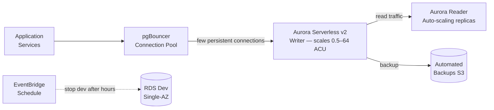

# Database Cost Optimisation

## Category

**Domain:** FinOps · **Stack:** AWS RDS, Aurora, Terraform · **Scope:** Managed Database Spend Reduction

---

## Context

Databases tend to be **always-on, heavily over-provisioned, and upgrade-driven** — making them a prime target for cost reduction without touching application code. Key opportunities: Aurora Serverless for variable workloads, RDS stop/start for non-production, read replica elimination, and connection pooling to reduce multi-AZ writer pressure.

### Cost Optimisation Options

| Technique | Workload | Typical Saving |
|-----------|---------|---------------|
| **Aurora Serverless v2** | Variable OLTP | 40–60% vs provisioned peak |
| **RDS stop/start schedule** | Dev/test | 65–70% (12h/day saved) |
| **Delete unused read replicas** | Replicas serving no traffic | 100% of replica cost |
| **GP2 storage → GP3** | RDS storage | ~20% |
| **Multi-AZ → Single-AZ (non-prod)** | Dev/test DBs | 50% of DB instance cost |
| **RDS Reserved Instances** | Production 24/7 DB | 30–50% |
| **pgBouncer connection pooling** | High-connection workloads | Reduces Aurora ACU usage |
| **Delete idle databases** | Forgotten dev clusters | 100% |

---

## Pros

- Aurora Serverless v2 scales in 0.5 ACU increments with sub-second response — very granular
- RDS start/stop for dev/test is built-in and free; no code changes needed
- RDS Performance Insights identifies idle databases and over-provisioned instances
- Multi-AZ → Single-AZ is a one-click change for non-production
- pgBouncer reduces ACU consumption by multiplexing connections

## Cons

- Aurora Serverless v2 has a minimum ACU (0.5 ACU / ~$40/month minimum) — not truly scale-to-zero
- RDS stop only lasts 7 days — it auto-starts after 7 days (AWS limitation)
- Connection pooling adds an extra hop and can hide connection leak bugs
- GP3 storage upgrade for RDS requires a modification window (brief I/O impact)
- Aurora Serverless v2 scaling has a latency penalty during rapid scale events

---

## Design Diagram



---

## Code Sample

### Terraform — Aurora Serverless v2 Cluster

```hcl
# finops/aurora-serverless.tf

resource "aws_rds_cluster" "main" {
  cluster_identifier     = "${var.app_name}-db"
  engine                 = "aurora-postgresql"
  engine_mode            = "provisioned"   # Serverless v2 uses 'provisioned' mode
  engine_version         = "16.3"

  database_name          = var.db_name
  master_username        = var.db_username
  master_password        = var.db_password   # use secrets manager in production

  db_subnet_group_name   = aws_db_subnet_group.main.name
  vpc_security_group_ids = [aws_security_group.db.id]

  serverlessv2_scaling_configuration {
    min_capacity = 0.5    # minimum ACU — ~$40/month when idle
    max_capacity = 16     # scale up to 16 ACU under load — ~$5/hour at max
  }

  backup_retention_period = 7
  preferred_backup_window = "02:00-03:00"

  deletion_protection    = var.environment == "production"
  skip_final_snapshot    = var.environment != "production"

  tags = {
    Environment = var.environment
    ManagedBy   = "terraform"
  }
}

resource "aws_rds_cluster_instance" "writer" {
  identifier         = "${var.app_name}-db-writer"
  cluster_identifier = aws_rds_cluster.main.id
  instance_class     = "db.serverless"    # required for Serverless v2
  engine             = aws_rds_cluster.main.engine
  engine_version     = aws_rds_cluster.main.engine_version
}

resource "aws_rds_cluster_instance" "readers" {
  count              = var.environment == "production" ? 1 : 0
  identifier         = "${var.app_name}-db-reader-${count.index}"
  cluster_identifier = aws_rds_cluster.main.id
  instance_class     = "db.serverless"
  engine             = aws_rds_cluster.main.engine
  engine_version     = aws_rds_cluster.main.engine_version
}
```

### Terraform — RDS Stop/Start Schedule (EventBridge + Lambda)

```hcl
# finops/rds-stop-start.tf
# Stops non-production RDS instances at 19:00 and starts at 07:00 Mon-Fri

resource "aws_lambda_function" "rds_scheduler" {
  function_name = "rds-stop-start-scheduler"
  filename      = data.archive_file.rds_scheduler.output_path
  source_code_hash = data.archive_file.rds_scheduler.output_base64sha256
  handler       = "handler.handle"
  runtime       = "python3.12"
  architectures = ["arm64"]
  role          = aws_iam_role.rds_scheduler.arn
  timeout       = 60

  environment {
    variables = {
      DB_CLUSTER_IDS = join(",", var.non_prod_cluster_ids)
    }
  }
}

resource "aws_cloudwatch_event_rule" "rds_stop" {
  name                = "rds-stop-evenings"
  description         = "Stop dev RDS clusters at 19:00 UTC Mon-Fri"
  schedule_expression = "cron(0 19 ? * MON-FRI *)"
}

resource "aws_cloudwatch_event_rule" "rds_start" {
  name                = "rds-start-mornings"
  description         = "Start dev RDS clusters at 07:00 UTC Mon-Fri"
  schedule_expression = "cron(0 7 ? * MON-FRI *)"
}

resource "aws_cloudwatch_event_target" "stop_lambda" {
  rule = aws_cloudwatch_event_rule.rds_stop.name
  arn  = aws_lambda_function.rds_scheduler.arn
  input = jsonencode({ action = "stop" })
}

resource "aws_cloudwatch_event_target" "start_lambda" {
  rule = aws_cloudwatch_event_rule.rds_start.name
  arn  = aws_lambda_function.rds_scheduler.arn
  input = jsonencode({ action = "start" })
}

resource "aws_lambda_permission" "allow_stop_eventbridge" {
  statement_id  = "AllowStopEventBridge"
  action        = "lambda:InvokeFunction"
  function_name = aws_lambda_function.rds_scheduler.function_name
  principal     = "events.amazonaws.com"
  source_arn    = aws_cloudwatch_event_rule.rds_stop.arn
}

resource "aws_lambda_permission" "allow_start_eventbridge" {
  statement_id  = "AllowStartEventBridge"
  action        = "lambda:InvokeFunction"
  function_name = aws_lambda_function.rds_scheduler.function_name
  principal     = "events.amazonaws.com"
  source_arn    = aws_cloudwatch_event_rule.rds_start.arn
}
```

### Python — RDS Scheduler Lambda Handler

```python
# lambdas/rds_scheduler/handler.py
"""
Lambda handler for starting and stopping Aurora/RDS clusters on a schedule.
Triggered by EventBridge with payload: {"action": "start"} or {"action": "stop"}.
"""
import os
import boto3


DB_CLUSTER_IDS = os.environ.get("DB_CLUSTER_IDS", "").split(",")
REGION         = os.environ.get("AWS_REGION", "us-east-1")


def handle(event: dict, context=None) -> dict:
    action = event.get("action")
    if action not in ("start", "stop"):
        raise ValueError(f"Invalid action: {action!r}. Must be 'start' or 'stop'.")

    rds = boto3.client("rds", region_name=REGION)
    results = []

    for cluster_id in DB_CLUSTER_IDS:
        cluster_id = cluster_id.strip()
        if not cluster_id:
            continue
        try:
            if action == "stop":
                rds.stop_db_cluster(DBClusterIdentifier=cluster_id)
            else:
                rds.start_db_cluster(DBClusterIdentifier=cluster_id)
            print(f"[OK] {action} {cluster_id}")
            results.append({"cluster": cluster_id, "status": "ok"})
        except rds.exceptions.InvalidDBClusterStateFault as exc:
            # Already in target state — not an error
            print(f"[SKIP] {cluster_id}: {exc}")
            results.append({"cluster": cluster_id, "status": "skipped"})

    return {"action": action, "results": results}
```

### Python — Idle Database Detector

```python
# scripts/db/find_idle_databases.py
"""
Finds RDS instances and Aurora clusters that have had no connections in the last N days.
Reports candidates for deletion or downsize.
"""
import boto3
from datetime import datetime, timedelta, UTC

REGION       = "us-east-1"
LOOKBACK_DAYS = 14


def get_rds_instances(region: str) -> list[dict]:
    rds = boto3.client("rds", region_name=region)
    paginator = rds.get_paginator("describe_db_instances")
    instances = []
    for page in paginator.paginate():
        instances.extend(page["DBInstances"])
    return instances


def get_max_connections(db_id: str, is_cluster: bool, days: int, region: str) -> float:
    cw = boto3.client("cloudwatch", region_name=region)
    end   = datetime.now(UTC)
    start = end - timedelta(days=days)
    dim_name = "DBClusterIdentifier" if is_cluster else "DBInstanceIdentifier"

    resp = cw.get_metric_statistics(
        Namespace="AWS/RDS",
        MetricName="DatabaseConnections",
        Dimensions=[{"Name": dim_name, "Value": db_id}],
        StartTime=start,
        EndTime=end,
        Period=days * 86400,
        Statistics=["Maximum"],
    )
    if not resp["Datapoints"]:
        return 0.0
    return max(dp["Maximum"] for dp in resp["Datapoints"])


def main() -> None:
    instances = get_rds_instances(REGION)
    print(f"Checking {len(instances)} RDS instances for idle status (last {LOOKBACK_DAYS}d)\n")

    for inst in instances:
        iid   = inst["DBInstanceIdentifier"]
        cls   = inst.get("DBInstanceClass", "?")
        state = inst.get("DBInstanceStatus", "?")
        max_conn = get_max_connections(iid, is_cluster=False, days=LOOKBACK_DAYS, region=REGION)
        if max_conn == 0:
            print(f" [IDLE] {iid}  class={cls}  status={state}  max_connections_14d={max_conn}")


if __name__ == "__main__":
    main()
```
