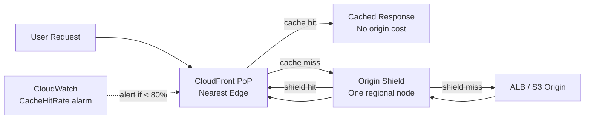

# CDN & Caching Cost Reduction

## Category

**Domain:** FinOps · **Stack:** AWS CloudFront, Terraform · **Scope:** Egress & Origin Request Reduction

---

## Context

A CDN is the highest-leverage FinOps tool for read-heavy web workloads: **traffic served from cache costs 4–10× less than traffic hitting the origin**. CloudFront egress to the internet is $0.0085–0.02/GB (vs $0.09/GB direct EC2 egress). Every cache hit also offloads compute from origin servers, reducing instance size requirements.

### Cost Levers

| Lever | Impact |
|-------|-------|
| **Increase cache TTL** | More cache hits, fewer origin requests |
| **Origin Shield** | Single regional hit layer — reduces multi-PoP origin fan-out |
| **Cache-based invalidation (versioned assets)** | Use `?v=hash` or filename hashing — avoids costly explicit invalidations |
| **CloudFront price class** | `PriceClass_100` (US/EU only) vs all edges — 30% cost reduction for regional apps |
| **Compress responses** | Gzip/Brotli reduces bytes transferred (CloudFront does this free) |
| **Function at edge (lightweight)** | CloudFront Functions (~$0.10/million) vs Lambda@Edge (~$0.60/million) |
| **Cache hit ratio monitoring** | Alarm on ratio < 80% — triggers tuning |

### Cache-Control Quick Reference

| Response Type | Recommended `Cache-Control` |
|--------------|---------------------------|
| Immutable assets (JS/CSS with hash) | `public, max-age=31536000, immutable` |
| HTML pages | `public, max-age=0, must-revalidate` or `no-cache` |
| API responses (safe to cache) | `public, max-age=60, s-maxage=300` |
| Auth-dependent responses | `private, no-store` |
| Static images | `public, max-age=86400` |

---

## Pros

- CloudFront egress is 4–10× cheaper than direct EC2/S3 egress to internet
- Origin Shield cuts multi-PoP origin fan-out — single origin request per cache miss
- `PriceClass_100` reduces edge location cost while covering 90%+ of traffic
- Automatic gzip/Brotli compression is free and reduces GB transferred
- Cache hit ratio is a single actionable KPI for engineering teams

## Cons

- Stale cache after deployments requires either versioned URLs or explicit invalidation ($0.005/path)
- Long TTLs complicate rollback — requires version-based asset naming discipline
- CloudFront distributions take 15–30 minutes to fully deploy
- Cache key policy misconfiguration (e.g. including unnecessary cookies) tanks hit ratio
- Origin Shield adds one extra network hop — slightly increases latency for cache misses

---

## Design Diagram



---

## Code Sample

### Terraform — CloudFront Distribution with Origin Shield

```hcl
# finops/cloudfront.tf

resource "aws_cloudfront_distribution" "main" {
  enabled             = true
  is_ipv6_enabled     = true
  price_class         = "PriceClass_100"   # US, Canada, Europe — lower cost, >90% traffic

  origin {
    domain_name = aws_lb.api.dns_name
    origin_id   = "api-alb"

    # Origin Shield reduces origin fan-out from all edge PoPs to one regional node
    origin_shield {
      enabled              = true
      origin_shield_region = var.aws_region   # e.g. "us-east-1"
    }

    custom_origin_config {
      http_port              = 80
      https_port             = 443
      origin_protocol_policy = "https-only"
      origin_ssl_protocols   = ["TLSv1.2"]
    }
  }

  default_cache_behavior {
    target_origin_id       = "api-alb"
    allowed_methods        = ["DELETE", "GET", "HEAD", "OPTIONS", "PATCH", "POST", "PUT"]
    cached_methods         = ["GET", "HEAD"]
    viewer_protocol_policy = "redirect-to-https"
    compress               = true   # free gzip/Brotli

    cache_policy_id          = aws_cloudfront_cache_policy.api.id
    origin_request_policy_id = data.aws_cloudfront_origin_request_policy.all_viewer.id

    min_ttl     = 0
    default_ttl = 60
    max_ttl     = 300
  }

  # Separate behaviour for immutable static assets
  ordered_cache_behavior {
    path_pattern           = "/static/*"
    target_origin_id       = "api-alb"
    allowed_methods        = ["GET", "HEAD"]
    cached_methods         = ["GET", "HEAD"]
    viewer_protocol_policy = "redirect-to-https"
    compress               = true

    cache_policy_id = aws_cloudfront_cache_policy.static_immutable.id
    min_ttl         = 31536000
    default_ttl     = 31536000
    max_ttl         = 31536000
  }

  viewer_certificate {
    acm_certificate_arn      = var.acm_cert_arn
    ssl_support_method       = "sni-only"
    minimum_protocol_version = "TLSv1.2_2021"
  }

  restrictions {
    geo_restriction {
      restriction_type = "none"
    }
  }

  tags = {
    ManagedBy = "terraform"
  }
}

resource "aws_cloudfront_cache_policy" "api" {
  name        = "api-cache-policy"
  min_ttl     = 0
  default_ttl = 60
  max_ttl     = 300

  parameters_in_cache_key_and_forwarded_to_origin {
    cookies_config {
      cookie_behavior = "none"   # don't vary cache by cookies — improves hit ratio
    }
    headers_config {
      header_behavior = "none"
    }
    query_strings_config {
      query_string_behavior = "whitelist"
      query_strings {
        items = ["page", "size"]   # only cache-key on necessary params
      }
    }
    enable_accept_encoding_gzip   = true
    enable_accept_encoding_brotli = true
  }
}

resource "aws_cloudfront_cache_policy" "static_immutable" {
  name        = "static-immutable"
  min_ttl     = 31536000
  default_ttl = 31536000
  max_ttl     = 31536000

  parameters_in_cache_key_and_forwarded_to_origin {
    cookies_config {
      cookie_behavior = "none"
    }
    headers_config {
      header_behavior = "none"
    }
    query_strings_config {
      query_string_behavior = "none"
    }
    enable_accept_encoding_gzip   = true
    enable_accept_encoding_brotli = true
  }
}
```

### Terraform — CloudWatch Cache Hit Ratio Alarm

```hcl
# finops/cloudfront-alarms.tf

resource "aws_cloudwatch_metric_alarm" "cache_hit_ratio_low" {
  alarm_name          = "${var.app_name}-cloudfront-low-cache-hit"
  alarm_description   = "CloudFront cache hit ratio below 80% — review cache policies"
  comparison_operator = "LessThanThreshold"
  evaluation_periods  = 3
  metric_name         = "CacheHitRate"
  namespace           = "AWS/CloudFront"
  period              = 3600    # evaluate hourly
  statistic           = "Average"
  threshold           = 80
  treat_missing_data  = "notBreaching"

  dimensions = {
    DistributionId = aws_cloudfront_distribution.main.id
    Region         = "Global"
  }

  alarm_actions = [var.sns_finops_topic_arn]
}
```

### Python — CloudFront Cache Hit Report

```python
# scripts/cdn/cache_hit_report.py
"""
Reports CloudFront cache hit ratio and bandwidth saved vs direct origin egress.
Outputs estimated cost savings from CloudFront caching this period.
"""
import boto3
from datetime import datetime, timedelta, UTC

DISTRIBUTION_ID   = "EXXXXXXXXXXXX"   # set via env var in production
REGION            = "us-east-1"
LOOKBACK_DAYS     = 7
PRICE_CF_GB       = 0.0085    # CloudFront US/EU egress $/GB
PRICE_EC2_EGRESS  = 0.09      # Direct EC2 internet egress $/GB (first 10TB)

def get_cf_metric(cw: any, metric: str, stat: str, days: int) -> float:
    end   = datetime.now(UTC)
    start = end - timedelta(days=days)
    resp = cw.get_metric_statistics(
        Namespace="AWS/CloudFront",
        MetricName=metric,
        Dimensions=[
            {"Name": "DistributionId", "Value": DISTRIBUTION_ID},
            {"Name": "Region", "Value": "Global"},
        ],
        StartTime=start,
        EndTime=end,
        Period=days * 86400,
        Statistics=[stat],
    )
    if not resp["Datapoints"]:
        return 0.0
    return resp["Datapoints"][0][stat]


def main() -> None:
    import os
    dist_id = os.environ.get("CF_DISTRIBUTION_ID", DISTRIBUTION_ID)

    cw = boto3.client("cloudwatch", region_name=REGION)

    bytes_downloaded = get_cf_metric(cw, "BytesDownloaded", "Sum", LOOKBACK_DAYS)
    cache_hit_rate   = get_cf_metric(cw, "CacheHitRate",    "Average", LOOKBACK_DAYS)

    gb_total     = bytes_downloaded / (1024 ** 3)
    gb_from_cf   = gb_total                          # all egress via CloudFront
    gb_cache_hit = gb_total * (cache_hit_rate / 100)
    gb_origin    = gb_total * (1 - cache_hit_rate / 100)

    cost_cf      = gb_from_cf   * PRICE_CF_GB
    cost_direct  = gb_from_cf   * PRICE_EC2_EGRESS   # what it would cost without CF
    saved        = cost_direct - cost_cf

    print(f"CloudFront Cost Report — last {LOOKBACK_DAYS} days")
    print(f"  Total bandwidth:   {gb_total:>8.2f} GB")
    print(f"  Cache hit ratio:   {cache_hit_rate:>7.1f}%")
    print(f"  Served from cache: {gb_cache_hit:>8.2f} GB  (no origin cost)")
    print(f"  Forwarded to origin:{gb_origin:>7.2f} GB")
    print(f"  CloudFront cost:   ${cost_cf:>8.4f}")
    print(f"  Without CloudFront:${cost_direct:>8.4f}")
    print(f"  Estimated savings: ${saved:>8.4f}")


if __name__ == "__main__":
    main()
```
