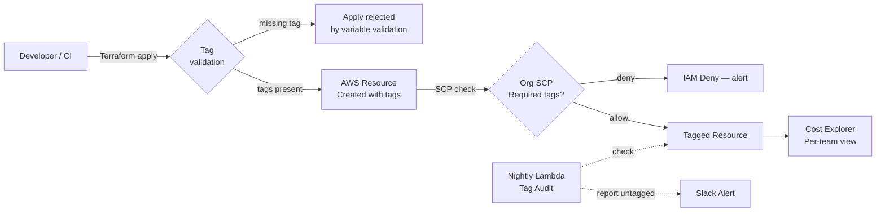

# Tagging & Cost Allocation

## Category

**Domain:** FinOps · **Stack:** AWS, Terraform, Python · **Scope:** Cloud Resource Attribution & Governance

---

## Context

Without consistent tagging, cloud bills are opaque. You know the total, but not which team, product, or environment owns what. A tagging strategy converts an undifferentiated cloud bill into per-team, per-product, per-environment cost attribution — the prerequisite for showback, chargeback, and rightsizing decisions.

### Minimum Required Tag Set

| Tag Key | Example Values | Purpose |
|---------|---------------|---------|
| `Environment` | `production`, `staging`, `dev` | Filter by environment |
| `Team` | `platform`, `payments`, `checkout` | Cost by team |
| `Product` | `api-gateway`, `event-bus` | Cost by product/service |
| `CostCentre` | `CC-1234` | Finance allocation |
| `ManagedBy` | `terraform`, `manual` | Drift detection |
| (optional) `Owner` | `jane.doe` | Individual accountability |

### Enforcement Layers

| Layer | Tool | Enforces |
|-------|------|---------|
| **SCP (org-level)** | AWS Organizations SCP | Deny resource creation without required tags |
| **Tag Policy** | AWS Tag Policies | Case-insensitive enforcement of allowed values |
| **AWS Config Rule** | `required-tags` managed rule | Detect non-compliant resources |
| **Terraform `required_tags` variable** | Terraform variable validation | Enforce at IaC level |
| **Nightly Lambda audit** | Custom Python | Report untagged resources + alert |

---

## Pros

- Tagged resources unlock Cost Explorer dimensions for per-team and per-product reporting
- AWS Tag Policies enforce allowed values (prevents `prod` vs `production` inconsistency)
- SCPs can deny resource creation without required tags — prevents untagged sprawl
- Terraform variable validation catches missing tags before `apply`
- Cost allocation tags are activated in Billing Console — appear in CUR within 24h

## Cons

- Existing untagged resources require a retroactive tagging project before data is clean
- SCP-based enforcement blocks developers if CI/CD pipelines don't supply required tags
- AWS Tag Policies apply only to supported resource types — not all services support all tags
- Tag limits: 50 user tags per resource (AWS) — plan tag set carefully
- `ManagedBy = terraform` is only meaningful if all provisioning goes through IaC

---

## Design Diagram



---

## Code Sample

### Terraform — Required Tag Enforcement with Variable Validation

```hcl
# finops/tagging.tf

variable "required_tags" {
  description = "Tags that must be present on every resource in this module"
  type = object({
    Environment = string
    Team        = string
    Product     = string
    CostCentre  = string
    ManagedBy   = string
  })

  validation {
    condition = contains(
      ["production", "staging", "dev", "sandbox"],
      var.required_tags.Environment
    )
    error_message = "Environment must be one of: production, staging, dev, sandbox."
  }

  validation {
    condition     = length(var.required_tags.Team) >= 2
    error_message = "Team tag must be at least 2 characters."
  }
}

locals {
  # Merge required tags with any optional module-specific tags
  common_tags = merge(var.required_tags, var.extra_tags)
}

# Example: every EC2 instance gets the common_tags merged in
resource "aws_instance" "app" {
  ami           = var.ami_id
  instance_type = var.instance_type

  tags = merge(local.common_tags, {
    Name = "${var.app_name}-${var.required_tags.Environment}"
  })
}
```

### Terraform — AWS Tag Policy (Organisation-Level)

```hcl
# finops/tag-policy.tf

resource "aws_organizations_policy" "required_tags" {
  name        = "required-resource-tags"
  description = "Enforce required tags and allowed values on all resources"
  type        = "TAG_POLICY"

  content = jsonencode({
    tags = {
      Environment = {
        tag_key = {
          "@@assign" = "Environment"
        }
        tag_value = {
          "@@assign" = ["production", "staging", "dev", "sandbox"]
        }
        enforced_for = {
          "@@assign" = [
            "ec2:instance",
            "rds:db",
            "rds:cluster",
            "s3:bucket",
            "lambda:function",
          ]
        }
      }
      Team = {
        tag_key = {
          "@@assign" = "Team"
        }
        enforced_for = {
          "@@assign" = [
            "ec2:instance",
            "rds:db",
            "s3:bucket",
            "lambda:function",
          ]
        }
      }
    }
  })
}

resource "aws_organizations_policy_attachment" "org_root" {
  policy_id = aws_organizations_policy.required_tags.id
  target_id = var.org_root_id
}
```

### Python — Untagged Resource Auditor (Lambda)

```python
# scripts/tagging/untagged_audit.py
"""
Finds EC2 instances, S3 buckets, RDS instances, and Lambda functions
that are missing any required tags.
Reports results and optionally posts to Slack.
"""
import boto3
import os
from collections import defaultdict

REGION        = os.environ.get("AWS_REGION", "us-east-1")
REQUIRED_TAGS = {"Environment", "Team", "Product", "CostCentre"}
SLACK_WEBHOOK = os.environ.get("SLACK_WEBHOOK_URL", "")


def missing_tags(tags: list[dict]) -> set[str]:
    present = {t["Key"] for t in tags}
    return REQUIRED_TAGS - present


def audit_ec2(ec2: any) -> list[dict]:
    issues = []
    pages = ec2.get_paginator("describe_instances").paginate()
    for page in pages:
        for res in page["Reservations"]:
            for inst in res["Instances"]:
                if inst["State"]["Name"] == "terminated":
                    continue
                missing = missing_tags(inst.get("Tags", []))
                if missing:
                    issues.append({
                        "resource": inst["InstanceId"],
                        "type": "EC2",
                        "missing": sorted(missing),
                    })
    return issues


def audit_lambda(lam: any) -> list[dict]:
    issues = []
    pages = lam.get_paginator("list_functions").paginate()
    for page in pages:
        for fn in page["Functions"]:
            fn_tags = lam.list_tags(Resource=fn["FunctionArn"]).get("Tags", {})
            tags_list = [{"Key": k, "Value": v} for k, v in fn_tags.items()]
            missing = missing_tags(tags_list)
            if missing:
                issues.append({
                    "resource": fn["FunctionName"],
                    "type": "Lambda",
                    "missing": sorted(missing),
                })
    return issues


def handler(event=None, context=None) -> dict:
    ec2 = boto3.client("ec2", region_name=REGION)
    lam = boto3.client("lambda", region_name=REGION)

    issues = audit_ec2(ec2) + audit_lambda(lam)

    if not issues:
        print("[OK] All resources are properly tagged.")
        return {"untagged": 0}

    report_lines = [f"Untagged resource audit — {len(issues)} issues:"]
    for issue in issues:
        report_lines.append(f"  [{issue['type']}] {issue['resource']} — missing: {', '.join(issue['missing'])}")

    report = "\n".join(report_lines)
    print(report)

    if SLACK_WEBHOOK:
        import urllib.request, json
        payload = json.dumps({"text": f":label: *Tag Audit*\n```{report}```"}).encode()
        urllib.request.urlopen(urllib.request.Request(
            SLACK_WEBHOOK,
            data=payload,
            headers={"Content-Type": "application/json"},
        ))

    return {"untagged": len(issues)}


if __name__ == "__main__":
    handler()
```

### YAML — AWS Config Managed Rule (required-tags)

```yaml
# infra/config-rules/required-tags.yaml
# Deployed via CloudFormation or Terraform aws_config_config_rule

RuleName: required-resource-tags
Source:
  Owner: AWS
  SourceIdentifier: REQUIRED_TAGS
InputParameters:
  tag1Key: Environment
  tag1Value: production,staging,dev,sandbox
  tag2Key: Team
  tag3Key: Product
  tag4Key: CostCentre
MaximumExecutionFrequency: TwentyFour_Hours
Scope:
  ComplianceResourceTypes:
    - AWS::EC2::Instance
    - AWS::RDS::DBInstance
    - AWS::S3::Bucket
    - AWS::Lambda::Function
    - AWS::ECS::Service
```
