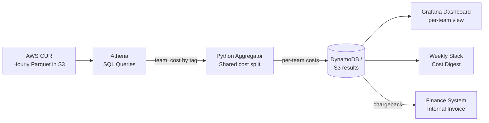

# Showback & Chargeback

## Category

**Domain:** FinOps · **Stack:** AWS Athena, CUR, Python · **Scope:** Cost Visibility & Internal Billing

---

## Context

**Showback** makes cloud costs visible to each team — without transferring the bill. **Chargeback** goes further: teams are actually billed for their cloud consumption, creating financial accountability. Both require accurate cost allocation (tagging + CUR), a data pipeline to aggregate it, and a reporting layer teams can understand.

### Showback vs Chargeback

| Aspect | Showback | Chargeback |
|--------|---------|-----------|
| Teams see their costs | ✅ | ✅ |
| Teams are invoiced | ❌ | ✅ |
| Finance impact | Informational | Actual budget debit |
| Adoption friction | Low | High (requires finance process) |
| Behaviour change | Moderate | Strong |
| Starting point | ✅ Start here | After showback is mature |

### Architecture

| Layer | Tool | Purpose |
|-------|------|---------|
| **Raw data** | AWS Cost & Usage Report (CUR) | Hourly/daily resource-level billing data |
| **Query engine** | AWS Athena | SQL on CUR parquet files in S3 |
| **Aggregation** | Python / dbt | Roll up by team/product/env |
| **Delivery** | Grafana / Slack / Email | Team-facing cost dashboard or digest |
| **Allocation adjustments** | Shared cost allocation rules | Amortise platform costs across teams |

---

## Pros

- CUR provides the most granular billing data available from AWS — supports any allocation model
- Athena lets you query billions of billing rows with standard SQL at low cost
- Showback alone drives behaviour change — teams reduce idle resources when they see the bill
- Shared platform costs can be allocated proportionally (by usage share, headcount, or flat split)
- Grafana dashboards updated nightly give instant cost feedback to engineers without finance involvement

## Cons

- CUR setup requires S3 bucket, Glue crawler, and Athena — non-trivial first-time setup
- Untagged resources become an "unknown" cost bucket — tagging hygiene is a blocker
- Shared cost allocation (e.g. EKS control plane, monitoring) requires documented allocation rules
- Chargeback requires finance system integration — significant process overhead
- CUR data is delayed up to 24 hours — not suitable for real-time cost tracking

---

## Design Diagram



---

## Code Sample

### SQL — Athena CUR Query: Team Cost by Month

```sql
-- athena/queries/team_monthly_cost.sql
-- Run against AWS CUR Athena table configured from CUR Export
-- Requires: tag columns activated in Cost Allocation Tags console

SELECT
    bill_billing_period_start_date                AS billing_month,
    resource_tags_user_team                        AS team,
    resource_tags_user_environment                 AS environment,
    resource_tags_user_product                     AS product,
    line_item_product_code                         AS service,
    SUM(line_item_unblended_cost)                  AS total_unblended_cost,
    SUM(line_item_blended_cost)                    AS total_blended_cost,
    SUM(CASE
        WHEN line_item_line_item_type = 'SavingsPlanCoveredUsage'
            THEN savings_plan_savings_plan_effective_cost
        WHEN line_item_line_item_type = 'SavingsPlanNegation'
            THEN 0
        ELSE line_item_unblended_cost
    END)                                           AS amortised_cost
FROM cur.aws_cost_and_usage
WHERE
    bill_billing_period_start_date >= date_trunc('month', current_date - interval '3' month)
    AND line_item_line_item_type NOT IN ('Tax', 'Credit', 'Refund')
GROUP BY 1, 2, 3, 4, 5
ORDER BY billing_month DESC, total_unblended_cost DESC;
```

### SQL — Athena: Shared Platform Cost Allocation

```sql
-- athena/queries/shared_cost_allocation.sql
-- Amortise shared platform costs (EKS control plane, monitoring, networking)
-- proportionally across teams by their compute spend share

WITH team_compute AS (
    SELECT
        resource_tags_user_team                      AS team,
        SUM(line_item_unblended_cost)                AS compute_cost
    FROM cur.aws_cost_and_usage
    WHERE
        bill_billing_period_start_date >= date_trunc('month', current_date)
        AND line_item_product_code IN ('AmazonEC2', 'AmazonEKS', 'AWSFargate')
        AND resource_tags_user_team IS NOT NULL
    GROUP BY 1
),
total_compute AS (
    SELECT SUM(compute_cost) AS grand_total FROM team_compute
),
shared_cost AS (
    SELECT SUM(line_item_unblended_cost) AS shared_total
    FROM cur.aws_cost_and_usage
    WHERE
        bill_billing_period_start_date >= date_trunc('month', current_date)
        AND resource_tags_user_team IS NULL   -- untagged = shared platform
)
SELECT
    tc.team,
    tc.compute_cost,
    ROUND(tc.compute_cost / tt.grand_total, 4)               AS share_pct,
    ROUND(sc.shared_total * tc.compute_cost / tt.grand_total, 2) AS allocated_shared_cost,
    ROUND(tc.compute_cost + sc.shared_total * tc.compute_cost / tt.grand_total, 2) AS total_cost
FROM team_compute tc
CROSS JOIN total_compute tt
CROSS JOIN shared_cost sc
ORDER BY total_cost DESC;
```

### Python — Weekly Team Cost Digest (Slack)

```python
# scripts/showback/weekly_digest.py
"""
Queries Athena for per-team costs and posts a Slack digest.
Designed as a Lambda or GitHub Actions scheduled job.
"""
import boto3
import os
import time
import json
import urllib.request

ATHENA_DB          = os.environ.get("ATHENA_DB", "cur")
ATHENA_RESULTS     = os.environ.get("ATHENA_RESULTS_BUCKET", "s3://my-athena-results/")
REGION             = os.environ.get("AWS_REGION", "us-east-1")
SLACK_WEBHOOK_URL  = os.environ.get("SLACK_FINOPS_WEBHOOK", "")

QUERY = """
SELECT
    resource_tags_user_team AS team,
    ROUND(SUM(line_item_unblended_cost), 2) AS cost_usd
FROM cur.aws_cost_and_usage
WHERE
    bill_billing_period_start_date >= date_trunc('month', current_date)
    AND line_item_line_item_type NOT IN ('Tax', 'Credit', 'Refund')
    AND resource_tags_user_team IS NOT NULL
GROUP BY 1
ORDER BY cost_usd DESC
LIMIT 20
"""


def run_athena(query: str) -> list[dict]:
    client = boto3.client("athena", region_name=REGION)
    resp = client.start_query_execution(
        QueryString=query,
        QueryExecutionContext={"Database": ATHENA_DB},
        ResultConfiguration={"OutputLocation": ATHENA_RESULTS},
    )
    qid = resp["QueryExecutionId"]
    for _ in range(60):
        status = client.get_query_execution(QueryExecutionId=qid)["QueryExecution"]["Status"]["State"]
        if status == "SUCCEEDED":
            break
        if status in ("FAILED", "CANCELLED"):
            raise RuntimeError(f"Athena query {status}")
        time.sleep(5)

    pages = client.get_paginator("get_query_results").paginate(QueryExecutionId=qid)
    rows, headers = [], None
    for page in pages:
        result_rows = page["ResultSet"]["Rows"]
        if headers is None:
            headers = [h["VarCharValue"] for h in result_rows[0]["Data"]]
            result_rows = result_rows[1:]
        for row in result_rows:
            values = [d.get("VarCharValue", "") for d in row["Data"]]
            rows.append(dict(zip(headers, values)))
    return rows


def post_slack(message: str) -> None:
    if not SLACK_WEBHOOK_URL:
        print("[DRY-RUN] Slack webhook not configured:")
        print(message)
        return
    payload = json.dumps({"text": message}).encode()
    req = urllib.request.Request(
        SLACK_WEBHOOK_URL,
        data=payload,
        headers={"Content-Type": "application/json"},
    )
    urllib.request.urlopen(req)


def handler(event=None, context=None) -> None:
    rows = run_athena(QUERY)
    lines = [":bar_chart: *Monthly Cloud Spend by Team (MTD)*\n"]
    for row in rows:
        team = row.get("team") or "untagged"
        cost = float(row.get("cost_usd", 0))
        lines.append(f"  {team:<25} ${cost:>10,.2f}")
    post_slack("\n".join(lines))


if __name__ == "__main__":
    handler()
```

### Terraform — CUR + Athena Setup

```hcl
# finops/cur-setup.tf

resource "aws_s3_bucket" "cur" {
  bucket = "${var.project}-cur-${var.account_id}"
  tags   = { ManagedBy = "terraform", Purpose = "cost-and-usage-reports" }
}

resource "aws_cur_report_definition" "main" {
  report_name                = "cur-daily"
  time_unit                  = "DAILY"
  format                     = "Parquet"
  compression                = "Parquet"
  additional_schema_elements = ["RESOURCES"]
  s3_bucket                  = aws_s3_bucket.cur.bucket
  s3_prefix                  = "cur"
  s3_region                  = var.aws_region
  additional_artifacts       = ["ATHENA"]
  report_versioning          = "OVERWRITE_REPORT"
}

# Glue database for Athena
resource "aws_glue_catalog_database" "cur" {
  name = "cur"
}
```
