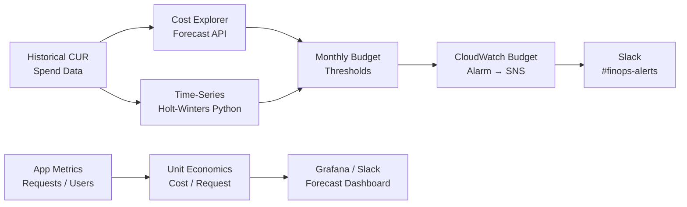

# Cost Forecasting & Budgeting

## Category

**Domain:** FinOps · **Stack:** AWS Cost Explorer, Python, Terraform · **Scope:** Spend Prediction & Unit Economics

---

## Context

Cost forecasting moves FinOps from reactive (why was last month's bill high?) to proactive (next month will be $X — we need to act now). Effective forecasting combines **statistical models** on historical spend with **unit economics** (cost per customer, cost per request, cost per order) that decouple absolute spend growth from business growth.

### Forecasting Approaches

| Approach | Accuracy | Complexity | Use Case |
|----------|---------|-----------|---------|
| **AWS Cost Explorer built-in forecast** | Medium | Low | Quick 3–12 month estimate |
| **Time-series (Holt-Winters/ARIMA)** | High (seasonal patterns) | Medium | Monthly billing cycles |
| **Unit-based forecast** | High (growth-aligned) | High | Product-level financial planning |
| **Anomaly baseline** | N/A (detection) | Low | Catch unexpected spend spikes |

### Unit Economics KPIs

| Metric | Formula | Target Direction |
|--------|---------|-----------------|
| Cost per active user | `monthly_cloud_cost / MAU` | Decrease as scale grows |
| Cost per API request | `compute_cost / request_count` | Decrease (efficiency) |
| Cost per transaction | `total_cost / transaction_count` | Stable or decrease |
| Infrastructure % of revenue | `cloud_cost / revenue` | < 10–15% SaaS benchmark |

---

## Pros

- AWS Cost Explorer forecast API requires no ML infrastructure — instant 12-month projection
- Unit economics decouple "cloud cost growing" from "cloud cost growing faster than the business"
- Budget alerts prevent end-of-month surprises for finance and engineering
- Historical trend + seasonality models catch recurring spikes (e.g. monthly batch, year-end peak)
- Forecast + anomaly baseline together cover both slow drift and sudden spikes

## Cons

- AWS Cost Explorer forecast requires at least 12 months of data for seasonal patterns
- Unit metrics need custom instrumentation — require log/metric pipeline investment
- Forecast accuracy degrades during rapid business change (new product launch, migration)
- Time-series models can overfit to historical anomalies if not cleaned first
- Budget alerts without forecasting only detect past-month overruns, not future ones

---

## Design Diagram



---

## Code Sample

### Python — AWS Cost Explorer Forecast

```python
# scripts/forecasting/ce_forecast.py
"""
Fetches a 3-month spend forecast from AWS Cost Explorer.
Outputs current MTD spend + forecast for next 3 months.
"""
import boto3
from datetime import datetime, timedelta, UTC

REGION = "us-east-1"


def get_mtd_spend() -> float:
    client = boto3.client("ce", region_name=REGION)
    today  = datetime.now(UTC).date()
    start  = today.replace(day=1)
    resp = client.get_cost_and_usage(
        TimePeriod={"Start": str(start), "End": str(today)},
        Granularity="MONTHLY",
        Metrics=["UnblendedCost"],
    )
    return sum(
        float(period["Total"]["UnblendedCost"]["Amount"])
        for period in resp["ResultsByTime"]
    )


def get_forecast(months: int = 3) -> list[dict]:
    client = boto3.client("ce", region_name=REGION)
    today  = datetime.now(UTC).date()
    start  = (today.replace(day=1) + timedelta(days=32)).replace(day=1)
    end    = (start.replace(day=1) + timedelta(days=32 * months)).replace(day=1)

    resp = client.get_cost_forecast(
        TimePeriod={"Start": str(start), "End": str(end)},
        Metric="UNBLENDED_COST",
        Granularity="MONTHLY",
        PredictionIntervalLevel=80,   # 80% confidence interval
    )
    return [
        {
            "period": fc["TimePeriod"]["Start"][:7],
            "mean": float(fc["MeanValue"]),
            "lower": float(fc["PredictionIntervalLowerBound"]),
            "upper": float(fc["PredictionIntervalUpperBound"]),
        }
        for fc in resp["ForecastResultsByTime"]
    ]


def main() -> None:
    mtd = get_mtd_spend()
    forecasts = get_forecast(3)

    print(f"Current month-to-date spend: ${mtd:,.2f}\n")
    print(f"{'Month':<10} {'Forecast':>12} {'Lower (80%)':>14} {'Upper (80%)':>14}")
    print("-" * 55)
    for f in forecasts:
        print(f"  {f['period']}   ${f['mean']:>10,.2f}   ${f['lower']:>12,.2f}   ${f['upper']:>12,.2f}")


if __name__ == "__main__":
    main()
```

### Python — Unit Economics Calculator

```python
# scripts/forecasting/unit_economics.py
"""
Calculates cost-per-unit metrics by correlating cloud spend (from Cost Explorer)
with business metrics (from CloudWatch custom metrics or external APIs).
"""
import boto3
import os
from datetime import datetime, timedelta, UTC

REGION           = "us-east-1"
NAMESPACE        = os.environ.get("METRICS_NAMESPACE", "MyApp/Business")
REQUEST_METRIC   = os.environ.get("REQUEST_METRIC_NAME", "ApiRequestCount")
USER_METRIC      = os.environ.get("USER_METRIC_NAME", "DailyActiveUsers")
LOOKBACK_DAYS    = 30


def get_cloud_spend(days: int) -> float:
    client = boto3.client("ce", region_name=REGION)
    end    = datetime.now(UTC).date()
    start  = end - timedelta(days=days)
    resp = client.get_cost_and_usage(
        TimePeriod={"Start": str(start), "End": str(end)},
        Granularity="MONTHLY",
        Metrics=["UnblendedCost"],
    )
    return sum(float(p["Total"]["UnblendedCost"]["Amount"]) for p in resp["ResultsByTime"])


def get_metric_sum(metric_name: str, days: int) -> float:
    cw    = boto3.client("cloudwatch", region_name=REGION)
    end   = datetime.now(UTC)
    start = end - timedelta(days=days)
    resp = cw.get_metric_statistics(
        Namespace=NAMESPACE,
        MetricName=metric_name,
        StartTime=start,
        EndTime=end,
        Period=days * 86400,
        Statistics=["Sum"],
    )
    if not resp["Datapoints"]:
        return 0.0
    return resp["Datapoints"][0]["Sum"]


def main() -> None:
    spend    = get_cloud_spend(LOOKBACK_DAYS)
    requests = get_metric_sum(REQUEST_METRIC, LOOKBACK_DAYS)
    users    = get_metric_sum(USER_METRIC, LOOKBACK_DAYS)

    cost_per_request = spend / requests if requests else 0
    cost_per_user    = spend / users    if users else 0

    print(f"Unit Economics — last {LOOKBACK_DAYS} days")
    print(f"  Total cloud spend:     ${spend:>12,.2f}")
    print(f"  Total API requests:    {requests:>14,.0f}")
    print(f"  Daily active users:    {users:>14,.0f}")
    print(f"  Cost per request:      ${cost_per_request:>12.6f}")
    print(f"  Cost per active user:  ${cost_per_user:>12.4f}")


if __name__ == "__main__":
    main()
```

### Python — Holt-Winters Seasonal Forecast (pandas + statsmodels)

```python
# scripts/forecasting/holt_winters_forecast.py
"""
Fits a Holt-Winters exponential smoothing model to 12+ months of
historical spend data and forecasts the next 3 months.
Requires: pip install pandas statsmodels boto3
"""
import boto3
import pandas as pd
from datetime import datetime, timedelta, UTC
from statsmodels.tsa.holtwinters import ExponentialSmoothing


def fetch_monthly_spend(months: int = 18) -> pd.Series:
    client = boto3.client("ce", region_name="us-east-1")
    end    = datetime.now(UTC).date().replace(day=1)
    start  = (end - timedelta(days=30 * months)).replace(day=1)

    resp = client.get_cost_and_usage(
        TimePeriod={"Start": str(start), "End": str(end)},
        Granularity="MONTHLY",
        Metrics=["UnblendedCost"],
    )
    data = {
        period["TimePeriod"]["Start"][:7]: float(period["Total"]["UnblendedCost"]["Amount"])
        for period in resp["ResultsByTime"]
    }
    series = pd.Series(data)
    series.index = pd.PeriodIndex(series.index, freq="M")
    return series


def forecast_spend(series: pd.Series, periods: int = 3) -> pd.Series:
    model = ExponentialSmoothing(
        series,
        trend="add",
        seasonal="add",
        seasonal_periods=12,
    ).fit(optimized=True)
    return model.forecast(periods)


def main() -> None:
    spend    = fetch_monthly_spend(18)
    forecast = forecast_spend(spend, 3)

    print("Historical spend (last 6 months):")
    for period, cost in spend.iloc[-6:].items():
        print(f"  {period}   ${cost:>10,.2f}")

    print("\nHolt-Winters Forecast (next 3 months):")
    for period, cost in forecast.items():
        print(f"  {period}   ${cost:>10,.2f}")


if __name__ == "__main__":
    main()
```

### Terraform — AWS Budget with Forecast Alert

```hcl
# finops/budget-forecast.tf
# Alerts when forecasted spend is projected to exceed the monthly budget target

resource "aws_budgets_budget" "monthly_forecast" {
  name         = "${var.project}-monthly-forecast"
  budget_type  = "COST"
  limit_amount = var.monthly_budget_usd
  limit_unit   = "USD"
  time_unit    = "MONTHLY"

  notification {
    comparison_operator        = "GREATER_THAN"
    threshold                  = 100
    threshold_type             = "PERCENTAGE"
    notification_type          = "FORECASTED"   # alert when FORECAST exceeds budget
    subscriber_sns_topic_arns  = [var.sns_finops_topic_arn]
  }

  notification {
    comparison_operator        = "GREATER_THAN"
    threshold                  = 90
    threshold_type             = "PERCENTAGE"
    notification_type          = "FORECASTED"
    subscriber_sns_topic_arns  = [var.sns_finops_topic_arn]
  }
}
```
