# FinOps Culture & Maturity

## Category

**Domain:** FinOps · **Stack:** Organisational · **Scope:** Cultural Transformation & Maturity Model

---

## Context

Technology changes alone do not produce sustained cost discipline. FinOps culture embeds **shared financial ownership** into engineering teams: engineers care about cost the same way they care about performance and reliability. The FinOps Foundation defines a maturity model — Crawl, Walk, Run — that provides a progression roadmap organisations can track against.

### FinOps Foundation Maturity Model

| Phase | Capability | Typical Org |
|-------|-----------|------------|
| **Crawl** | Cloud bill visible; basic tagging; budget alerts; monthly report | First 6–12 months of cloud |
| **Walk** | Per-team showback; rightsizing process; RI purchasing; anomaly detection | 1–2 years cloud experience |
| **Run** | Chargeback; real-time unit economics; automated policy enforcement; self-service | Mature cloud programme |

### FinOps Team Structure

| Model | Description | Suited For |
|-------|------------|-----------|
| **Centralised** | Single FinOps team owns cost reduction | < 200 engineers |
| **Federated** | FinOps team drives strategy; each engineering team owns their costs | > 200 engineers |
| **Hybrid** | FinOps team + Cost Champions in each domain | Most common at scale |

### Cloud Cost Champions

A **Cost Champion** is an engineer in each product team who:
- Attends monthly FinOps review
- Owns the team's cost reduction targets
- Communicates cost awareness within their team
- Reviews Rightsizing and idle resource recommendations weekly

---

## Pros

- Cultural change produces sustainable cost reduction — unlike one-off optimisation projects
- Cost Champions distribute responsibility without centralising all work in one team
- Unit economics (cost per feature, per user) align engineering with business incentives
- Public cost dashboards ("cost leaderboard") create healthy peer accountability
- FinOps Foundation provides free certification (FOCP) and community resources

## Cons

- Culture change is slow — typically 12–18 months to reach "Walk" maturity
- Chargeback (true internal billing) creates political friction — start with showback
- Engineers resist cost accountability if it conflicts with velocity/feature pressure
- FinOps ROI is hard to attribute to specific culture initiatives vs technical changes
- Without executive sponsorship, FinOps culture initiatives stall at team level

---

## Design Diagram

```mermaid
flowchart LR
    Crawl[Crawl\nVisibility] --> Walk[Walk\nOptimisation]
    Walk --> Run[Run\nAutomation & Culture]

    subgraph Crawl
        C1[Tagging + CUR]
        C2[Budget alerts]
        C3[Monthly cost review]
    end

    subgraph Walk
        W1[Per-team showback]
        W2[Rightsizing process]
        W3[RI / Savings Plans]
        W4[Anomaly detection]
    end

    subgraph Run
        R1[Chargeback]
        R2[Unit economics KPIs]
        R3[Automated policies]
        R4[Cost Champions]
    end
```



---

## Code Sample

### YAML — Monthly FinOps Review Meeting Agenda Template

```yaml
# finops/templates/monthly-review-agenda.yaml
# Use as input to a Confluence/Notion automation or Slack bot

meeting:
  name: "Monthly FinOps Review"
  cadence: "First Tuesday of every month"
  duration: "60 minutes"
  attendees:
    - role: "FinOps Lead"
      responsibility: "Prepare and present cost summary"
    - role: "Engineering Manager"
      responsibility: "Action on rightsizing recommendations"
    - role: "Cost Champions"
      responsibility: "Report on team-level actions from last month"
    - role: "Finance Stakeholder"
      responsibility: "Validate actuals vs budget"

agenda:
  - item: "Last month actuals vs budget"
    duration_min: 10
    owner: "FinOps Lead"
    artefact: "AWS Cost Explorer report by team"

  - item: "Month-over-month trend by team"
    duration_min: 10
    owner: "FinOps Lead"
    artefact: "Showback dashboard"

  - item: "Top cost driver deep dive"
    duration_min: 15
    owner: "FinOps Lead + relevant Cost Champion"
    artefact: "CUR Athena query / Kubecost"

  - item: "Rightsizing and idle resource report"
    duration_min: 10
    owner: "Cost Champions"
    artefact: "Compute Optimizer report"

  - item: "RI/SP coverage and utilisation"
    duration_min: 5
    owner: "FinOps Lead"
    artefact: "Coverage report"

  - item: "Actions from last month — status"
    duration_min: 5
    owner: "Cost Champions"

  - item: "New action items for next month"
    duration_min: 5
    owner: "All"
```

### Markdown — FinOps Maturity Self-Assessment

```markdown
<!-- finops/maturity-assessment.md -->
# FinOps Maturity Self-Assessment

Use this checklist to score your organisation against the FinOps Foundation maturity model.
Score: 0 = Not started, 1 = In progress, 2 = Complete

## Crawl (Visibility)

- [ ] Cloud Cost & Usage Report (CUR) enabled and delivered to S3
- [ ] Cost Allocation Tags activated in Billing Console
- [ ] All active resources tagged with Environment, Team, Product
- [ ] Monthly budget alerts configured for top-level account
- [ ] Cost Explorer in use — at least monthly review
- [ ] Untagged resource ratio < 20%

**Crawl score: __ / 12**

## Walk (Optimisation)

- [ ] Per-team showback reports delivered monthly (Slack / Grafana)
- [ ] Rightsizing review process in place (EC2, RDS, Lambda)
- [ ] Reserved Instances / Savings Plans covering > 70% of baseline
- [ ] Cost Anomaly Detection enabled with < $100 / 20% threshold
- [ ] Non-production environments scaled to zero outside business hours
- [ ] S3 lifecycle rules active on all data lake/archive buckets
- [ ] VPC Gateway Endpoints active (S3, DynamoDB)

**Walk score: __ / 14**

## Run (Automation & Culture)

- [ ] Chargeback or internal showback feeding into team OKRs
- [ ] Unit economics KPIs tracked (cost/user, cost/request)
- [ ] Tag compliance enforced via AWS Config or SCP
- [ ] Cost Champions nominated in every product team
- [ ] Automated rightsizing PRs raised (Compute Optimizer → Terraform)
- [ ] Monthly FinOps review cadence established
- [ ] Cloud cost forecasting within 10% accuracy
- [ ] FinOps Foundation Practitioner (FOCP) certification for FinOps lead

**Run score: __ / 16**

## Total: __ / 42

| Score | Maturity |
|-------|---------|
| 0–14  | Crawl   |
| 15–28 | Walk    |
| 29–42 | Run     |
```

### Python — FinOps KPI Dashboard Publisher (CloudWatch Custom Metrics)

```python
# scripts/culture/publish_finops_kpis.py
"""
Publishes FinOps cultural KPIs as CloudWatch custom metrics.
These can be displayed on a Grafana shared dashboard visible to all teams.
Designed to run daily as a Lambda or scheduled GitHub Actions job.
"""
import boto3
from datetime import datetime, timedelta, UTC

NAMESPACE = "FinOps/Culture"
REGION    = "us-east-1"


def get_tagging_compliance_pct() -> float:
    """Returns % of EC2 instances that have all 4 required tags."""
    ec2 = boto3.client("ec2", region_name=REGION)
    required = {"Environment", "Team", "Product", "CostCentre"}
    total, compliant = 0, 0
    resp = ec2.describe_instances(Filters=[{"Name": "instance-state-name", "Values": ["running"]}])
    for res in resp["Reservations"]:
        for inst in res["Instances"]:
            total += 1
            present = {t["Key"] for t in inst.get("Tags", [])}
            if required.issubset(present):
                compliant += 1
    return (compliant / total * 100) if total else 100.0


def get_ri_coverage_pct() -> float:
    """Returns RI/SP coverage % for the last 30 days."""
    client = boto3.client("ce", region_name=REGION)
    end    = datetime.now(UTC).date()
    start  = end - timedelta(days=30)
    resp = client.get_savings_plans_coverage(
        TimePeriod={"Start": str(start), "End": str(end)},
        Granularity="MONTHLY",
    )
    periods = resp.get("SavingsPlansCoverages", [])
    if not periods:
        return 0.0
    coverages = [float(p.get("Coverage", {}).get("CoveragePercentage", 0)) for p in periods]
    return sum(coverages) / len(coverages)


def publish_metrics(tagging_pct: float, ri_coverage_pct: float) -> None:
    cw = boto3.client("cloudwatch", region_name=REGION)
    cw.put_metric_data(
        Namespace=NAMESPACE,
        MetricData=[
            {
                "MetricName": "TaggingCompliancePct",
                "Value": tagging_pct,
                "Unit": "Percent",
            },
            {
                "MetricName": "RICoveragePct",
                "Value": ri_coverage_pct,
                "Unit": "Percent",
            },
        ],
    )


def handler(event=None, context=None) -> dict:
    tagging  = get_tagging_compliance_pct()
    coverage = get_ri_coverage_pct()

    print(f"Tagging compliance:  {tagging:.1f}%")
    print(f"RI/SP coverage:      {coverage:.1f}%")

    publish_metrics(tagging, coverage)
    return {"tagging_pct": tagging, "ri_coverage_pct": coverage}


if __name__ == "__main__":
    handler()
```

### YAML — FinOps GitHub Actions — Weekly KPI Report

```yaml
# .github/workflows/finops-kpi.yml
name: Weekly FinOps KPI Report

on:
  schedule:
    - cron: "0 7 * * 1"    # Monday 07:00 UTC
  workflow_dispatch:

permissions:
  contents: none

jobs:
  kpi:
    runs-on: ubuntu-latest
    steps:
      - uses: actions/checkout@v4

      - uses: aws-actions/configure-aws-credentials@v4
        with:
          role-to-assume: ${{ secrets.AWS_FINOPS_ROLE_ARN }}
          aws-region: us-east-1

      - uses: actions/setup-python@v5
        with:
          python-version: "3.12"

      - run: pip install boto3

      - name: Publish KPIs to CloudWatch
        run: python scripts/culture/publish_finops_kpis.py

      - name: Post weekly summary to Slack
        env:
          SLACK_WEBHOOK_URL: ${{ secrets.SLACK_FINOPS_WEBHOOK }}
        run: |
          curl -s -X POST "$SLACK_WEBHOOK_URL" \
            -H "Content-Type: application/json" \
            -d '{
              "text": ":finops: *Weekly FinOps KPI Pulse*\n• See CloudWatch FinOps/Culture dashboard for Tagging Compliance % and RI Coverage %\n• Monthly FinOps Review: _first Tuesday of the month_\n• Questions? Ping your Cost Champion."
            }'
```
