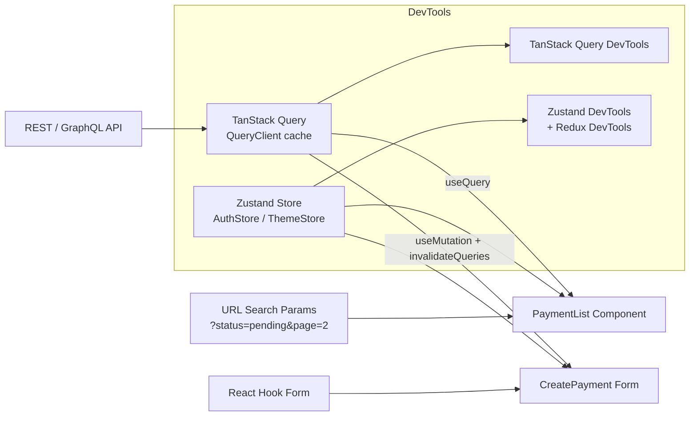

# State Management

## Category

Frontend Architecture — Data & State

## Context

Frontend state management governs how UI data is stored, updated, and shared across components. Modern React apps distinguish between server state (remote data, caching, synchronisation) and client state (UI interactions, local preferences) — and use different libraries for each concern. Conflating both in a single global store leads to over-engineering.

### State Categories

| Type | Examples | Recommended Tool |
|------|---------|-----------------|
| **Server state** | API responses, paginated lists, mutations | TanStack Query (React Query) |
| **Global client state** | Auth user, theme, feature flags | Zustand or Jotai |
| **Form state** | Field values, validation, touched/dirty | React Hook Form |
| **URL state** | Filters, pagination, sort order | `useSearchParams` (React Router) |
| **Local UI state** | Modal open, accordion expanded | `useState` / `useReducer` |

### Library Comparison

| Library | Paradigm | Bundle (min+gz) | DevTools | Best for |
|---------|----------|----------------|---------|----------|
| **TanStack Query v5** | Async/server state | ~13 kB | ✅ | Data fetching + caching |
| **Zustand v4** | Flat atom store | ~1 kB | ✅ | Simple global client state |
| **Jotai v2** | Atomic | ~3 kB | ✅ | Fine-grained reactivity |
| **Redux Toolkit v2** | Flux + slices | ~20 kB | ✅ | Large teams, complex state |
| **XState v5** | State machines | ~18 kB | ✅ | Complex workflows / statecharts |

## Pros

- Separating server state (TanStack Query) from client state (Zustand) eliminates most boilerplate
- TanStack Query handles loading, error, stale, refetch automatically — no bespoke data-fetching logic
- Zustand is zero-config — no provider wrapping, works outside React
- Atomic stores (Jotai) prevent unnecessary re-renders — only atoms that changed re-render subscribers
- Redux Toolkit reduces Redux boilerplate dramatically with `createSlice` and RTK Query

## Cons

- TanStack Query's cache invalidation strategy must be designed carefully (stale time, gc time)
- Zustand global state is unstructured without conventions — grows messy at scale
- Combining multiple state libraries increases mental overhead for new contributors
- Server state (React Query) and optimistic updates require careful rollback logic
- Redux over-used for server state leads to massive reducers that duplicate TanStack Query's job

## Design Diagram



## Code Sample

### TypeScript — TanStack Query v5 with typed API layer

```typescript
// src/api/payments.ts — typed API functions
import type { QueryClient } from '@tanstack/react-query';

export interface Payment {
  id: string;
  amount: number;
  currency: string;
  status: 'pending' | 'completed' | 'failed' | 'cancelled';
  debtorIban: string;
  creditorIban: string;
  createdAt: string;
}

export interface CreatePaymentInput {
  amount: number;
  currency: string;
  debtorIban: string;
  creditorIban: string;
  reference?: string;
}

export interface PagedResult<T> {
  items: T[];
  nextCursor?: string;
  totalCount: number;
}

const BASE = import.meta.env.VITE_API_URL;

async function fetchJson<T>(url: string, init?: RequestInit): Promise<T> {
  const res = await fetch(url, {
    ...init,
    headers: { 'Content-Type': 'application/json', ...init?.headers },
  });
  if (!res.ok) {
    const problem = await res.json().catch(() => ({}));
    throw Object.assign(new Error(problem.title ?? 'Request failed'), { status: res.status, problem });
  }
  return res.json() as Promise<T>;
}

// ── Query keys ──────────────────────────────────────────────────────────────
export const paymentKeys = {
  all: ['payments'] as const,
  list: (filters: Record<string, string>) => ['payments', 'list', filters] as const,
  detail: (id: string) => ['payments', id] as const,
};

// ── API functions ────────────────────────────────────────────────────────────
export const paymentsApi = {
  list: (params: { status?: string; cursor?: string; limit?: number }) => {
    const qs = new URLSearchParams(
      Object.entries(params)
        .filter(([, v]) => v != null)
        .map(([k, v]) => [k, String(v)]),
    );
    return fetchJson<PagedResult<Payment>>(`${BASE}/payments?${qs}`);
  },

  get: (id: string) => fetchJson<Payment>(`${BASE}/payments/${id}`),

  create: (input: CreatePaymentInput) =>
    fetchJson<Payment>(`${BASE}/payments`, {
      method: 'POST',
      body: JSON.stringify(input),
    }),

  cancel: (id: string) =>
    fetchJson<Payment>(`${BASE}/payments/${id}/cancellations`, { method: 'POST' }),
};
```

### TypeScript — TanStack Query hooks with optimistic updates

```tsx
// src/hooks/usePayments.ts
import { useQuery, useMutation, useQueryClient, infiniteQueryOptions } from '@tanstack/react-query';
import { paymentsApi, paymentKeys, type CreatePaymentInput, type Payment } from '../api/payments';

// ── List query with infinite scroll ──────────────────────────────────────────
export function usePaymentsInfinite(status?: string) {
  return useQuery(
    infiniteQueryOptions({
      queryKey: paymentKeys.list({ status: status ?? '' }),
      queryFn: ({ pageParam }) =>
        paymentsApi.list({ status, cursor: pageParam as string | undefined, limit: 20 }),
      getNextPageParam: (lastPage) => lastPage.nextCursor,
      initialPageParam: undefined as string | undefined,
      staleTime: 30_000, // data considered fresh for 30s
    }),
  );
}

// ── Single payment query ──────────────────────────────────────────────────────
export function usePayment(id: string) {
  return useQuery({
    queryKey: paymentKeys.detail(id),
    queryFn: () => paymentsApi.get(id),
    staleTime: 10_000,
    enabled: Boolean(id),
  });
}

// ── Create mutation with optimistic update ────────────────────────────────────
export function useCreatePayment() {
  const queryClient = useQueryClient();

  return useMutation({
    mutationFn: (input: CreatePaymentInput) => paymentsApi.create(input),

    onMutate: async (input) => {
      // Cancel in-flight refetches to avoid overwriting optimistic update
      await queryClient.cancelQueries({ queryKey: paymentKeys.all });

      const optimistic: Payment = {
        id: `optimistic-${Date.now()}`,
        ...input,
        status: 'pending',
        createdAt: new Date().toISOString(),
      };

      // Snapshot for rollback
      const previous = queryClient.getQueryData(paymentKeys.list({}));
      return { previous, optimistic };
    },

    onError: (_err, _vars, context) => {
      // Roll back on error
      if (context?.previous !== undefined) {
        queryClient.setQueryData(paymentKeys.list({}), context.previous);
      }
    },

    onSettled: () => {
      // Always refetch to get authoritative data
      void queryClient.invalidateQueries({ queryKey: paymentKeys.all });
    },
  });
}
```

### TypeScript — Zustand auth store

```typescript
// src/stores/authStore.ts
import { create } from 'zustand';
import { devtools, persist } from 'zustand/middleware';
import { immer } from 'zustand/middleware/immer';

interface AuthUser {
  id: string;
  email: string;
  name: string;
  roles: string[];
}

interface AuthState {
  user: AuthUser | null;
  accessToken: string | null;
  isAuthenticated: boolean;
  // Actions
  setUser: (user: AuthUser, token: string) => void;
  clearAuth: () => void;
  hasRole: (role: string) => boolean;
}

export const useAuthStore = create<AuthState>()(
  devtools(
    persist(
      immer((set, get) => ({
        user: null,
        accessToken: null,
        isAuthenticated: false,

        setUser: (user, accessToken) => {
          set((state) => {
            state.user = user;
            state.accessToken = accessToken;
            state.isAuthenticated = true;
          });
        },

        clearAuth: () => {
          set((state) => {
            state.user = null;
            state.accessToken = null;
            state.isAuthenticated = false;
          });
        },

        hasRole: (role) => get().user?.roles.includes(role) ?? false,
      })),
      {
        name: 'auth-store',
        // Only persist user identity — never persist access tokens in localStorage
        partialize: (state) => ({ user: state.user }),
      },
    ),
    { name: 'auth' },
  ),
);
```

### TypeScript — React Hook Form with Zod validation

```tsx
// src/forms/CreatePaymentForm.tsx
import { useForm } from 'react-hook-form';
import { zodResolver } from '@hookform/resolvers/zod';
import { z } from 'zod';
import { useCreatePayment } from '../hooks/usePayments';

const schema = z.object({
  amount: z.number({ required_error: 'Amount is required' }).positive('Must be positive'),
  currency: z.enum(['EUR', 'GBP', 'USD'], { required_error: 'Select a currency' }),
  debtorIban: z.string().regex(/^[A-Z]{2}\d{2}[A-Z0-9]{1,30}$/, 'Invalid IBAN format'),
  creditorIban: z.string().regex(/^[A-Z]{2}\d{2}[A-Z0-9]{1,30}$/, 'Invalid IBAN format'),
  reference: z.string().max(140).optional(),
});

type FormData = z.infer<typeof schema>;

export function CreatePaymentForm({ onSuccess }: { onSuccess: () => void }) {
  const createPayment = useCreatePayment();

  const { register, handleSubmit, formState: { errors, isSubmitting } } =
    useForm<FormData>({ resolver: zodResolver(schema) });

  const onSubmit = async (data: FormData) => {
    await createPayment.mutateAsync(data);
    onSuccess();
  };

  return (
    <form onSubmit={handleSubmit(onSubmit)} noValidate aria-label="Create payment">
      <div>
        <label htmlFor="amount">Amount</label>
        <input
          id="amount"
          type="number"
          step="0.01"
          {...register('amount', { valueAsNumber: true })}
          aria-describedby={errors.amount ? 'amount-error' : undefined}
          aria-invalid={Boolean(errors.amount)}
        />
        {errors.amount && <p id="amount-error" role="alert">{errors.amount.message}</p>}
      </div>

      <button type="submit" disabled={isSubmitting} aria-busy={isSubmitting}>
        {isSubmitting ? 'Creating…' : 'Create Payment'}
      </button>

      {createPayment.isError && (
        <p role="alert">Payment creation failed. Please try again.</p>
      )}
    </form>
  );
}
```
