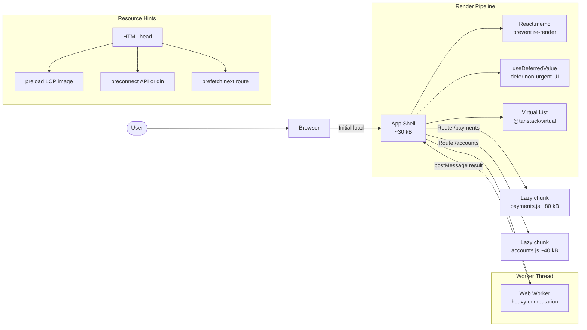

# Frontend Performance Optimisation

## Category

Frontend Architecture — Performance

## Context

Frontend performance directly impacts user experience and business metrics: a 100 ms improvement in LCP correlates with 1–2% revenue uplift (Google research). The Core Web Vitals — LCP (Largest Contentful Paint), INP (Interaction to Next Paint), and CLS (Cumulative Layout Shift) — are the measurable targets. Optimisation happens at three layers: loading, rendering, and runtime execution.

### Core Web Vitals Targets

| Metric | Good | Needs Improvement | Poor | What affects it |
|--------|------|------------------|------|----------------|
| **LCP** | ≤ 2.5s | 2.5 – 4s | > 4s | Image lazy load, server TTFB, preload |
| **INP** | ≤ 200ms | 200 – 500ms | > 500ms | Long tasks, event handler cost |
| **CLS** | ≤ 0.1 | 0.1 – 0.25 | > 0.25 | Image dimensions, skeleton screens |

### Optimisation Techniques

| Technique | Metric impact | Implementation |
|-----------|-------------|---------------|
| **Code splitting** | LCP, TTI | `React.lazy` + `Suspense` |
| **Image optimisation** | LCP, CLS | `` |
| **Preload critical assets** | LCP | `<link rel="preload">` in `<head>` |
| **Virtualised lists** | INP | `@tanstack/virtual` |
| **`useDeferredValue`** | INP | Defer non-critical renders |
| **Memoisation** | INP | `React.memo`, `useMemo`, `useCallback` |
| **Worker offload** | INP | Web Worker for CPU-intensive tasks |
| **Bundle analysis** | LCP, TTI | `rollup-plugin-visualizer`, `source-map-explorer` |
| **Resource hints** | LCP | `prefetch`, `preconnect`, `dns-prefetch` |

## Pros

- Code splitting reduces initial JS parse/exec by only loading what each route needs
- Virtualised lists render thousands of items with constant DOM size
- Memoisation prevents cascading re-renders in large component trees
- Web Workers keep the main thread free for user interactions (no INP impact)
- Bundle analysis surfaces unexpected large dependencies before they ship

## Cons

- Over-memoisation (memo on every component) increases memory and comparison overhead
- Code splitting too aggressively creates many small chunks — waterfall fetches in HTTP/1.1
- Virtual lists complicate accessibility (screen reader traversal, focus management)
- Preload hints misapplied (non-critical resources) compete with LCP resources
- Performance budgets require CI enforcement — manual audits drift

## Design Diagram



## Code Sample

### TypeScript — Route-based code splitting with Suspense

```tsx
// src/router.tsx
import { lazy, Suspense } from 'react';
import { createBrowserRouter, RouterProvider, Outlet } from 'react-router-dom';
import { PageSkeleton } from './components/PageSkeleton';

// Lazy-loaded route modules — each creates a separate async chunk
const PaymentDashboard = lazy(() => import('./pages/PaymentDashboard'));
const CreatePayment = lazy(() => import('./pages/CreatePayment'));
const AccountList = lazy(() => import('./pages/AccountList'));
const AccountDetail = lazy(() => import('./pages/AccountDetail'));

function RouteLayout() {
  return (
    <Suspense fallback={<PageSkeleton />}>
      <Outlet />
    </Suspense>
  );
}

export const router = createBrowserRouter([
  {
    element: <RouteLayout />,
    children: [
      { path: '/payments', element: <PaymentDashboard /> },
      { path: '/payments/new', element: <CreatePayment /> },
      { path: '/accounts', element: <AccountList /> },
      { path: '/accounts/:id', element: <AccountDetail /> },
    ],
  },
]);
```

### TypeScript — Virtualised payment list with @tanstack/virtual

```tsx
// src/components/VirtualPaymentList.tsx
import { useVirtualizer } from '@tanstack/react-virtual';
import { useRef } from 'react';
import type { Payment } from '../api/payments';

interface VirtualPaymentListProps {
  payments: Payment[];
  onSelect: (payment: Payment) => void;
}

export function VirtualPaymentList({ payments, onSelect }: VirtualPaymentListProps) {
  const parentRef = useRef<HTMLDivElement>(null);

  const virtualizer = useVirtualizer({
    count: payments.length,
    getScrollElement: () => parentRef.current,
    estimateSize: () => 72,       // estimated row height in px
    overscan: 5,                  // render 5 extra rows above/below visible
  });

  return (
    <div
      ref={parentRef}
      style={{ height: '600px', overflow: 'auto' }}
      role="list"
      aria-label={`${payments.length} payments`}
    >
      <div style={{ height: `${virtualizer.getTotalSize()}px`, position: 'relative' }}>
        {virtualizer.getVirtualItems().map((virtualItem) => {
          const payment = payments[virtualItem.index];
          return (
            <div
              key={payment.id}
              role="listitem"
              style={{
                position: 'absolute',
                top: 0,
                transform: `translateY(${virtualItem.start}px)`,
                height: `${virtualItem.size}px`,
                width: '100%',
              }}
            >
              <button
                onClick={() => onSelect(payment)}
                style={{ width: '100%', height: '100%', textAlign: 'left' }}
              >
                <span>{payment.id}</span>
                <span>{payment.amount} {payment.currency}</span>
                <span>{payment.status}</span>
              </button>
            </div>
          );
        })}
      </div>
    </div>
  );
}
```

### TypeScript — Web Worker for heavy computation (off main thread)

```typescript
// src/workers/csvExport.worker.ts
// Bundled as a separate worker with Vite: ?worker
export type WorkerMessage =
  | { type: 'EXPORT_CSV'; payments: Array<Record<string, unknown>> }
  | { type: 'CANCEL' };

export type WorkerResponse =
  | { type: 'PROGRESS'; percent: number }
  | { type: 'DONE'; csv: string }
  | { type: 'ERROR'; message: string };

self.onmessage = (event: MessageEvent<WorkerMessage>) => {
  const msg = event.data;

  if (msg.type !== 'EXPORT_CSV') return;

  try {
    const { payments } = msg;
    const headers = Object.keys(payments[0] ?? {}).join(',');
    const rows: string[] = [headers];

    for (let i = 0; i < payments.length; i++) {
      const row = Object.values(payments[i])
        .map((v) => `"${String(v).replace(/"/g, '""')}"`)
        .join(',');
      rows.push(row);

      if (i % 100 === 0) {
        const response: WorkerResponse = { type: 'PROGRESS', percent: Math.round((i / payments.length) * 100) };
        self.postMessage(response);
      }
    }

    const done: WorkerResponse = { type: 'DONE', csv: rows.join('\n') };
    self.postMessage(done);
  } catch (err) {
    const error: WorkerResponse = { type: 'ERROR', message: String(err) };
    self.postMessage(error);
  }
};

// Usage in React component:
// import CsvWorker from './workers/csvExport.worker?worker';
// const worker = new CsvWorker();
// worker.postMessage({ type: 'EXPORT_CSV', payments });
// worker.onmessage = (e: MessageEvent<WorkerResponse>) => { ... };
```

### TypeScript — Performance budget CI check (Vite bundle)

```typescript
// scripts/checkBundleSize.ts — run after vite build
import { statSync, readdirSync } from 'fs';
import { join } from 'path';

interface BudgetRule {
  name: string;
  pattern: RegExp;
  maxKb: number;
}

const BUDGETS: BudgetRule[] = [
  { name: 'Main bundle (index.js)', pattern: /^index-.*\.js$/, maxKb: 50 },
  { name: 'Any lazy chunk', pattern: /^[^index].*\.js$/, maxKb: 150 },
  { name: 'CSS bundle', pattern: /\.css$/, maxKb: 30 },
];

const DIST_DIR = join(process.cwd(), 'dist', 'assets');

function checkBudgets(): boolean {
  const files = readdirSync(DIST_DIR);
  let passed = true;

  for (const budget of BUDGETS) {
    const matching = files.filter((f) => budget.pattern.test(f));

    for (const file of matching) {
      const sizeKb = statSync(join(DIST_DIR, file)).size / 1024;
      const ok = sizeKb <= budget.maxKb;
      const icon = ok ? '✅' : '❌';

      console.log(
        `${icon} ${budget.name}: ${file} — ${sizeKb.toFixed(1)} kB` +
          ` (budget: ${budget.maxKb} kB)`,
      );

      if (!ok) passed = false;
    }
  }

  return passed;
}

if (!checkBudgets()) {
  console.error('\n❌ Bundle size budget exceeded — build failed');
  process.exit(1);
}
```
