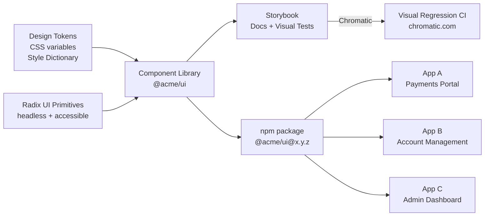

# Design System

## Category

Frontend Architecture — UI Consistency

## Context

A design system is a single source of truth for UI: design tokens (colour, spacing, typography), a component library (React components), and usage documentation (Storybook). It enables multiple product teams to ship consistent, accessible UIs without reinventing components. Radix UI primitives provide accessible, unstyled headless components that can be styled with CSS or Tailwind.

### Design System Stack Options

| Layer | Option 1 | Option 2 | Option 3 |
|-------|----------|----------|----------|
| **Primitives** | Radix UI | Headless UI | Ariakit |
| **Styling** | Tailwind CSS | CSS Modules | CSS-in-JS (Panda) |
| **Documentation** | Storybook | Ladle | Styleguidist |
| **Tokens** | Style Dictionary | Theo | CSS variables |
| **Distribution** | npm package | monorepo package | CDN |

### Design Token Categories

| Token type | Example | CSS variable |
|-----------|---------|-------------|
| **Colour** | Brand blue, error red | `--colour-primary-600` |
| **Spacing** | 4px grid | `--space-4` |
| **Typography** | Font size scale, weight | `--font-size-lg` |
| **Radius** | Button, card, input | `--radius-md` |
| **Shadow** | Elevation levels | `--shadow-sm` |
| **Duration** | Animation timing | `--duration-fast` |

## Pros

- Single implementation of accessibility (ARIA attributes, keyboard navigation) across all UIs
- Design tokens enable systematic theming — brand or white-label variants with one config change
- Storybook catches visual regressions before code review
- Headless primitives (Radix) give full style control while providing ARIA compliance
- Shared component library eliminates duplicated button/input/modal implementations

## Cons

- Upfront investment is high — design and engineering must align on API and visual language
- Versioning is complex — consumers must upgrade; breaking component API changes need migration
- Over-abstraction of one-off components adds bureaucratic overhead for feature teams
- Storybook CI (Chromatic visual regression) adds build time
- Design token sprawl — too many tokens is as bad as no tokens

## Design Diagram



## Code Sample

### TypeScript — Design tokens with CSS variables and Style Dictionary config

```javascript
// style-dictionary.config.js
export default {
  source: ['tokens/**/*.json'],
  platforms: {
    css: {
      transformGroup: 'css',
      prefix: 'ds',
      buildPath: 'src/tokens/',
      files: [
        {
          destination: 'tokens.css',
          format: 'css/variables',
          options: { outputReferences: true },
        },
      ],
    },
    typescript: {
      transformGroup: 'js',
      buildPath: 'src/tokens/',
      files: [
        {
          destination: 'tokens.ts',
          format: 'javascript/es6',
        },
      ],
    },
  },
};
```

```json
// tokens/colour.json
{
  "colour": {
    "primary": {
      "50":  { "value": "#eff6ff", "type": "colour" },
      "100": { "value": "#dbeafe", "type": "colour" },
      "600": { "value": "#2563eb", "type": "colour" },
      "700": { "value": "#1d4ed8", "type": "colour" }
    },
    "error": {
      "50":  { "value": "#fef2f2", "type": "colour" },
      "600": { "value": "#dc2626", "type": "colour" }
    },
    "neutral": {
      "0":   { "value": "#ffffff", "type": "colour" },
      "900": { "value": "#111827", "type": "colour" }
    }
  }
}
```

### TypeScript — Accessible Button component using Radix UI slot

```tsx
// src/components/Button/Button.tsx
import { Slot } from '@radix-ui/react-slot';
import { forwardRef, type ButtonHTMLAttributes, type ReactNode } from 'react';
import styles from './Button.module.css';

type ButtonVariant = 'primary' | 'secondary' | 'ghost' | 'danger';
type ButtonSize = 'sm' | 'md' | 'lg';

interface ButtonProps extends ButtonHTMLAttributes<HTMLButtonElement> {
  variant?: ButtonVariant;
  size?: ButtonSize;
  isLoading?: boolean;
  asChild?: boolean;  // render as child element (Radix Slot)
  children: ReactNode;
}

export const Button = forwardRef<HTMLButtonElement, ButtonProps>(
  (
    {
      variant = 'primary',
      size = 'md',
      isLoading = false,
      asChild = false,
      disabled,
      children,
      className,
      ...props
    },
    ref,
  ) => {
    const Comp = asChild ? Slot : 'button';

    return (
      <Comp
        ref={ref}
        className={[
          styles.button,
          styles[variant],
          styles[size],
          isLoading ? styles.loading : '',
          className,
        ]
          .filter(Boolean)
          .join(' ')}
        disabled={disabled ?? isLoading}
        aria-disabled={disabled ?? isLoading}
        aria-busy={isLoading}
        data-loading={isLoading}
        {...props}
      >
        {isLoading ? (
          <>
            <span className={styles.spinner} aria-hidden="true" />
            <span className="sr-only">Loading…</span>
          </>
        ) : (
          children
        )}
      </Comp>
    );
  },
);

Button.displayName = 'Button';
```

### TypeScript — Accessible Dialog using Radix UI Dialog primitive

```tsx
// src/components/Modal/Modal.tsx
import * as Dialog from '@radix-ui/react-dialog';
import { X } from 'lucide-react';
import type { ReactNode } from 'react';
import styles from './Modal.module.css';

export interface ModalProps {
  open: boolean;
  onOpenChange: (open: boolean) => void;
  title: string;
  description?: string;
  children: ReactNode;
  trigger?: ReactNode;
}

export function Modal({ open, onOpenChange, title, description, children, trigger }: ModalProps) {
  return (
    <Dialog.Root open={open} onOpenChange={onOpenChange}>
      {trigger && <Dialog.Trigger asChild>{trigger}</Dialog.Trigger>}

      <Dialog.Portal>
        {/* Backdrop */}
        <Dialog.Overlay className={styles.overlay} />

        <Dialog.Content
          className={styles.content}
          aria-describedby={description ? 'modal-description' : undefined}
          onInteractOutside={(e) => e.preventDefault()} // prevent accidental close
        >
          <Dialog.Title className={styles.title}>{title}</Dialog.Title>

          {description && (
            <Dialog.Description id="modal-description" className={styles.description}>
              {description}
            </Dialog.Description>
          )}

          {children}

          <Dialog.Close
            className={styles.closeButton}
            aria-label="Close dialog"
          >
            <X size={16} aria-hidden="true" />
          </Dialog.Close>
        </Dialog.Content>
      </Dialog.Portal>
    </Dialog.Root>
  );
}
```

### TypeScript — Storybook story with accessibility testing

```tsx
// src/components/Button/Button.stories.tsx
import type { Meta, StoryObj } from '@storybook/react';
import { expect, userEvent, within } from '@storybook/test';
import { Button } from './Button';

const meta: Meta<typeof Button> = {
  title: 'Components/Button',
  component: Button,
  parameters: {
    a11y: { config: { rules: [{ id: 'color-contrast', enabled: true }] } },
  },
  argTypes: {
    variant: { control: 'select', options: ['primary', 'secondary', 'ghost', 'danger'] },
    size: { control: 'select', options: ['sm', 'md', 'lg'] },
    isLoading: { control: 'boolean' },
  },
};

export default meta;
type Story = StoryObj<typeof Button>;

export const Primary: Story = {
  args: { variant: 'primary', children: 'Create Payment' },
  play: async ({ canvasElement }) => {
    const canvas = within(canvasElement);
    const button = canvas.getByRole('button', { name: 'Create Payment' });
    await expect(button).toBeEnabled();
    await userEvent.click(button);
  },
};

export const Loading: Story = {
  args: { isLoading: true, children: 'Create Payment' },
  play: async ({ canvasElement }) => {
    const canvas = within(canvasElement);
    const button = canvas.getByRole('button');
    await expect(button).toBeDisabled();
    await expect(button).toHaveAttribute('aria-busy', 'true');
  },
};

export const Danger: Story = {
  args: { variant: 'danger', children: 'Cancel Payment' },
};
```
