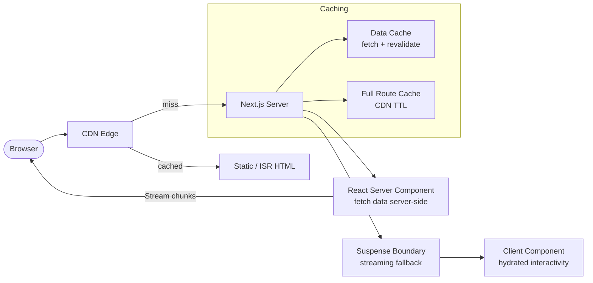

# Server-Side Rendering (SSR / SSG / ISR)

## Category

Frontend Architecture — Rendering Strategy

## Context

Next.js supports four rendering strategies that can be mixed per route. Choosing the right strategy requires understanding the freshness requirements, interactivity, and caching needs of each page. React Server Components (RSC) shift data-fetching to the server transparently, eliminating client-side loading states for server-owned data.

### Rendering Strategy Comparison

| Strategy | Rendered at | Cache | TTFB | SEO | Dynamic | Use when |
|----------|------------|-------|------|-----|---------|----------|
| **SSG** (Static) | Build time | CDN | 🟢 Fast | ✅ | ❌ | Marketing pages, docs |
| **ISR** (Incremental) | Build + revalidate | CDN | 🟢 Fast | ✅ | ⚠️ | Product listings, blogs |
| **SSR** (Server) | Request time | None | 🟡 Medium | ✅ | ✅ | Personalised, auth-gated |
| **CSR** (Client) | Browser | None | 🔴 Slow | ⚠️ | ✅ | Admin dashboards, apps |
| **RSC** (Server Component) | Request time | Per-request | 🟢 Fast | ✅ | ✅ | Data-heavy composites |
| **Streaming SSR** | Server + stream | None | 🟢 Fast TTFB | ✅ | ✅ | Large pages with sections |

### Next.js App Router Caching Layers

| Cache | Scope | Duration | Invalidation |
|-------|-------|---------|-------------|
| **Request cache** | Per render | Request lifetime | `cache: 'no-store'` |
| **Data cache** | Per `fetch` | `revalidate` seconds | `revalidatePath()` / `revalidateTag()` |
| **Full route cache** | Per route | `revalidate` | `revalidatePath()` |
| **Router cache** | Per browser session | 30 – 300s | `router.refresh()` |

## Pros

- SSG and ISR serve cached HTML at CDN edge — best possible TTFB
- RSC eliminates waterfall data fetching — server composes data before sending HTML
- Streaming SSR sends HTML shell immediately; suspense boundaries fill in progressively
- Server-rendered pages have full HTML for crawlers — strong SEO without workarounds
- ISR revalidates stale pages in the background — users always see cached content

## Cons

- RSC and client components cannot be mixed in all patterns — requires discipline
- SSR adds server compute cost and increases TTFB vs static
- `revalidatePath` cache purge is a blunt instrument — full route cache cleared
- Hydration mismatch errors (server vs client HTML) are difficult to debug
- ISR `revalidate` granularity is seconds — not suitable for real-time data

## Design Diagram



## Code Sample

### TypeScript — Next.js App Router Server Component with streaming

```tsx
// app/payments/page.tsx — React Server Component (default in App Router)
import { Suspense } from 'react';
import { PaymentTable } from './PaymentTable';
import { PaymentSummary } from './PaymentSummary';
import { TableSkeleton } from '@/components/TableSkeleton';

interface PageProps {
  searchParams: Promise<{ status?: string; cursor?: string }>;
}

// This runs on the server — no useEffect, no client bundle contribution
export default async function PaymentsPage({ searchParams }: PageProps) {
  const { status, cursor } = await searchParams;

  // Parallel data fetching on the server — no client waterfalls
  const summaryPromise = fetchPaymentSummary();
  const paymentsPromise = fetchPayments({ status, cursor });

  return (
    <main>
      <h1>Payments</h1>

      {/* Summary loads first — Suspense fallback while it resolves */}
      <Suspense fallback={<div aria-busy="true">Loading summary…</div>}>
        <PaymentSummaryWrapper promise={summaryPromise} />
      </Suspense>

      {/* Table streams in with its own boundary */}
      <Suspense fallback={<TableSkeleton rows={10} />}>
        <PaymentTableWrapper promise={paymentsPromise} status={status} />
      </Suspense>
    </main>
  );
}

async function PaymentSummaryWrapper({ promise }: { promise: ReturnType<typeof fetchPaymentSummary> }) {
  const summary = await promise;
  return <PaymentSummary summary={summary} />;
}

async function PaymentTableWrapper({
  promise,
  status,
}: {
  promise: ReturnType<typeof fetchPayments>;
  status?: string;
}) {
  const data = await promise;
  return <PaymentTable payments={data.items} nextCursor={data.nextCursor} status={status} />;
}

// ── Data fetching with Next.js data cache ──────────────────────────────────────
interface PaymentSummary {
  totalCount: number;
  totalAmount: number;
  pendingCount: number;
}

interface Payment {
  id: string;
  amount: number;
  currency: string;
  status: string;
  createdAt: string;
}

async function fetchPaymentSummary(): Promise<PaymentSummary> {
  const res = await fetch(`${process.env.API_BASE_URL}/payments/summary`, {
    headers: { Authorization: `Bearer ${process.env.API_SERVICE_TOKEN}` },
    next: { revalidate: 60, tags: ['payments'] }, // cache 60s; bust with revalidateTag('payments')
  });
  if (!res.ok) throw new Error('Failed to fetch payment summary');
  return res.json() as Promise<PaymentSummary>;
}

async function fetchPayments(params: { status?: string; cursor?: string }): Promise<{
  items: Payment[];
  nextCursor?: string;
}> {
  const qs = new URLSearchParams(
    Object.entries(params).filter(([, v]) => Boolean(v)) as [string, string][],
  );
  const res = await fetch(`${process.env.API_BASE_URL}/payments?${qs}`, {
    headers: { Authorization: `Bearer ${process.env.API_SERVICE_TOKEN}` },
    next: { revalidate: 30, tags: ['payments'] },
  });
  if (!res.ok) throw new Error('Failed to fetch payments');
  return res.json() as Promise<{ items: Payment[]; nextCursor?: string }>;
}
```

### TypeScript — Client Component with `use client` directive

```tsx
// app/payments/PaymentTable.tsx — 'use client' for interactivity
'use client';

import { useRouter, useSearchParams } from 'next/navigation';
import { useTransition } from 'react';

interface Payment {
  id: string;
  amount: number;
  currency: string;
  status: string;
  createdAt: string;
}

interface PaymentTableProps {
  payments: Payment[];
  nextCursor?: string;
  status?: string;
}

export function PaymentTable({ payments, nextCursor, status }: PaymentTableProps) {
  const router = useRouter();
  const searchParams = useSearchParams();
  const [isPending, startTransition] = useTransition();

  const loadMore = () => {
    if (!nextCursor) return;
    startTransition(() => {
      const params = new URLSearchParams(searchParams.toString());
      params.set('cursor', nextCursor);
      router.push(`/payments?${params}`);
    });
  };

  return (
    <div>
      <table aria-label="Payments" aria-busy={isPending}>
        <thead>
          <tr>
            <th scope="col">ID</th>
            <th scope="col">Amount</th>
            <th scope="col">Status</th>
            <th scope="col">Date</th>
          </tr>
        </thead>
        <tbody>
          {payments.map((p) => (
            <tr key={p.id}>
              <td>{p.id}</td>
              <td>{p.amount} {p.currency}</td>
              <td>{p.status}</td>
              <td>{new Date(p.createdAt).toLocaleDateString()}</td>
            </tr>
          ))}
        </tbody>
      </table>

      {nextCursor && (
        <button onClick={loadMore} disabled={isPending} aria-busy={isPending}>
          {isPending ? 'Loading…' : 'Load more'}
        </button>
      )}
    </div>
  );
}
```

### TypeScript — ISR route with on-demand revalidation

```tsx
// app/accounts/[id]/page.tsx — ISR with on-demand purge
import { notFound } from 'next/navigation';
import type { Metadata } from 'next';

interface Account {
  id: string;
  iban: string;
  name: string;
  balance: number;
  currency: string;
}

interface PageProps {
  params: Promise<{ id: string }>;
}

export async function generateMetadata({ params }: PageProps): Promise<Metadata> {
  const { id } = await params;
  const account = await fetchAccount(id);
  return { title: account ? `${account.name} — Account` : 'Account Not Found' };
}

export default async function AccountDetailPage({ params }: PageProps) {
  const { id } = await params;
  const account = await fetchAccount(id);

  if (!account) notFound();

  return (
    <main>
      <h1>{account.name}</h1>
      <dl>
        <dt>IBAN</dt><dd>{account.iban}</dd>
        <dt>Balance</dt><dd>{account.balance} {account.currency}</dd>
      </dl>
    </main>
  );
}

async function fetchAccount(id: string): Promise<Account | null> {
  const res = await fetch(`${process.env.API_BASE_URL}/accounts/${id}`, {
    headers: { Authorization: `Bearer ${process.env.API_SERVICE_TOKEN}` },
    next: { revalidate: 300, tags: [`account:${id}`] }, // cached 5 min
  });
  if (res.status === 404) return null;
  if (!res.ok) throw new Error('Failed to fetch account');
  return res.json() as Promise<Account>;
}

// Revalidation API route (called by webhook from account service):
// app/api/revalidate/account/route.ts
// export async function POST(req: Request) {
//   const { id, secret } = await req.json();
//   if (secret !== process.env.REVALIDATION_SECRET) return new Response('Forbidden', { status: 403 });
//   await revalidateTag(`account:${id}`);
//   return Response.json({ revalidated: true });
// }
```
