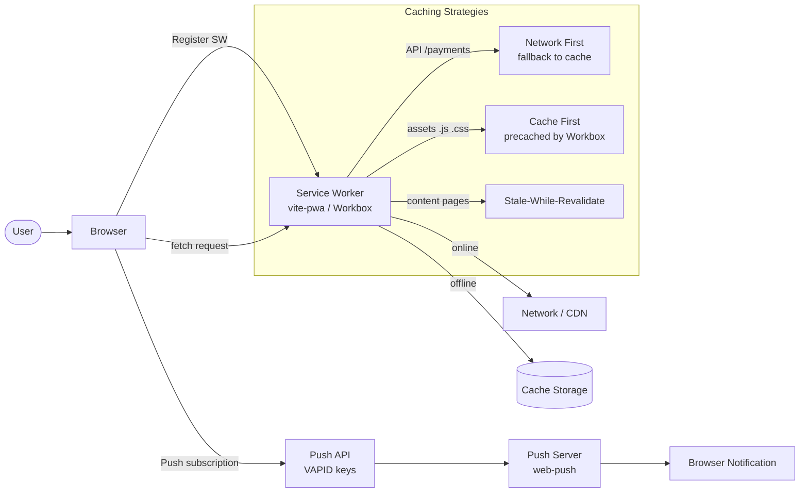

# Progressive Web App (PWA)

## Category

Frontend Architecture — Offline & Mobile

## Context

A Progressive Web App layers native-like capabilities onto a web application: offline caching via Service Worker, installability via Web App Manifest, and push notifications via the Push API. Workbox abstracts the low-level Service Worker Cache API behind composable caching strategies, while Vite PWA plugin handles SW registration and precaching of build assets.

### Caching Strategy Comparison

| Strategy | Network first | Cache first | Stale-while-revalidate | Cache only | Network only |
|----------|-------------|------------|------------------------|-----------|-------------|
| **When to use** | API responses | Versioned assets | Mostly-static content | Offline fallback | Real-time data |
| **Latency** | Network | Fast (cache) | Cache speed | Instant | Network |
| **Freshness** | Always fresh | Stale until cache busted | Background refresh | Stale | Always fresh |
| **Offline** | ❌ | ✅ | ✅ (stale) | ✅ | ❌ |

### PWA Feature Checklist

| Feature | Required for installability? | API |
|---------|---------------------------|-----|
| HTTPS | ✅ | TLS |
| Web App Manifest | ✅ | `manifest.webmanifest` |
| Service Worker registered | ✅ | `navigator.serviceWorker` |
| Icons (192×192, 512×512) | ✅ | Manifest `icons` |
| `start_url` reachable | ✅ | Manifest |
| `display: standalone` | ✅ | Manifest |
| Push notifications | ❌ | Push API + VAPID |
| Background sync | ❌ | Background Sync API |

## Pros

- Offline-capable apps work in poor connectivity environments (field agents, mobile banking)
- Precached assets load instantly on repeat visits — Service Worker serves from cache
- Push notifications re-engage users without requiring native app store presence
- Install prompt (`beforeinstallprompt`) enables app-like UX on Android / desktop Chrome
- Workbox strategies (Network First, Stale-While-Revalidate) make caching declarative

## Cons

- Service Worker debugging is complex — devtools cache panel required
- iOS Safari limits SW capabilities: no push, no Background Sync, buggy `beforeinstallprompt`
- Cached API responses become stale — requires versioning and cache invalidation logic
- Precaching large app shells increases first install time
- Service Worker updates require activation — stale SW may serve old assets until user revisits

## Design Diagram



## Code Sample

### TypeScript — Vite PWA plugin config with Workbox

```typescript
// vite.config.ts
import { defineConfig } from 'vite';
import react from '@vitejs/plugin-react';
import { VitePWA } from 'vite-plugin-pwa';

export default defineConfig({
  plugins: [
    react(),
    VitePWA({
      registerType: 'autoUpdate',          // auto update SW on new build
      injectRegister: 'auto',
      workbox: {
        // Assets to precache (generated by Workbox from build output)
        globPatterns: ['**/*.{js,css,html,svg,png,woff2}'],
        // Runtime caching strategies
        runtimeCaching: [
          {
            // API responses — Network First with 30s timeout fallback to cache
            urlPattern: ({ url }) => url.pathname.startsWith('/api/'),
            handler: 'NetworkFirst',
            options: {
              cacheName: 'api-cache',
              networkTimeoutSeconds: 10,
              expiration: { maxEntries: 200, maxAgeSeconds: 24 * 60 * 60 }, // 24h
              cacheableResponse: { statuses: [0, 200] },
            },
          },
          {
            // Google Fonts — Cache First (never changes)
            urlPattern: /^https:\/\/fonts\.(googleapis|gstatic)\.com\/.*/i,
            handler: 'CacheFirst',
            options: {
              cacheName: 'google-fonts',
              expiration: { maxEntries: 10, maxAgeSeconds: 365 * 24 * 60 * 60 },
              cacheableResponse: { statuses: [0, 200] },
            },
          },
        ],
        // Offline fallback page
        offlineFallbackPage: '/offline.html',
        navigateFallback: '/index.html',
        navigateFallbackDenylist: [/^\/api\//],
      },
      manifest: {
        name: 'Payments Portal',
        short_name: 'Payments',
        description: 'Manage your payments and accounts',
        theme_color: '#2563eb',
        background_color: '#ffffff',
        display: 'standalone',
        orientation: 'portrait',
        start_url: '/',
        scope: '/',
        icons: [
          { src: '/icons/icon-192.png', sizes: '192x192', type: 'image/png' },
          { src: '/icons/icon-512.png', sizes: '512x512', type: 'image/png' },
          { src: '/icons/icon-512-maskable.png', sizes: '512x512', type: 'image/png', purpose: 'maskable' },
        ],
        shortcuts: [
          {
            name: 'New Payment',
            short_name: 'Pay',
            description: 'Create a new payment',
            url: '/payments/new',
            icons: [{ src: '/icons/shortcut-pay.png', sizes: '96x96' }],
          },
        ],
      },
    }),
  ],
});
```

### TypeScript — Push notification subscription (client-side)

```typescript
// src/notifications/pushSubscription.ts
const VAPID_PUBLIC_KEY = import.meta.env.VITE_VAPID_PUBLIC_KEY as string;

function urlBase64ToUint8Array(base64String: string): Uint8Array {
  const padding = '='.repeat((4 - (base64String.length % 4)) % 4);
  const base64 = (base64String + padding).replace(/-/g, '+').replace(/_/g, '/');
  const rawData = atob(base64);
  return Uint8Array.from([...rawData].map((ch) => ch.charCodeAt(0)));
}

export async function subscribeToPush(): Promise<PushSubscription | null> {
  if (!('serviceWorker' in navigator) || !('PushManager' in window)) {
    console.warn('[push] Push not supported in this browser');
    return null;
  }

  const permission = await Notification.requestPermission();
  if (permission !== 'granted') {
    console.warn('[push] Notification permission denied');
    return null;
  }

  const registration = await navigator.serviceWorker.ready;

  const subscription = await registration.pushManager.subscribe({
    userVisibleOnly: true,    // required for Chrome — all notifications must be shown
    applicationServerKey: urlBase64ToUint8Array(VAPID_PUBLIC_KEY),
  });

  // Send subscription to server
  await fetch('/api/push/subscribe', {
    method: 'POST',
    headers: { 'Content-Type': 'application/json' },
    body: JSON.stringify(subscription),
  });

  return subscription;
}

export async function unsubscribeFromPush(): Promise<void> {
  const registration = await navigator.serviceWorker.ready;
  const subscription = await registration.pushManager.getSubscription();
  if (!subscription) return;

  await subscription.unsubscribe();
  await fetch('/api/push/unsubscribe', {
    method: 'POST',
    headers: { 'Content-Type': 'application/json' },
    body: JSON.stringify({ endpoint: subscription.endpoint }),
  });
}
```

### TypeScript — Push notification server with web-push (Node.js)

```typescript
// server/pushService.ts
import webpush from 'web-push';
import { Pool } from 'pg';

const pool = new Pool({ connectionString: process.env.DATABASE_URL });

webpush.setVapidDetails(
  'mailto:admin@example.com',
  process.env.VAPID_PUBLIC_KEY ?? '',
  process.env.VAPID_PRIVATE_KEY ?? '',
);

interface PushPayload {
  title: string;
  body: string;
  icon?: string;
  badge?: string;
  url?: string;
  tag?: string;
}

export async function sendPushNotification(
  userId: string,
  payload: PushPayload,
): Promise<void> {
  const { rows } = await pool.query<{ subscription: webpush.PushSubscription }>(
    'SELECT subscription FROM push_subscriptions WHERE user_id = $1 AND active = true',
    [userId],
  );

  const notifications = rows.map(async ({ subscription }) => {
    try {
      await webpush.sendNotification(subscription, JSON.stringify(payload));
    } catch (err) {
      const error = err as { statusCode?: number };
      if (error.statusCode === 410 || error.statusCode === 404) {
        // Subscription expired or revoked — remove from DB
        await pool.query(
          'UPDATE push_subscriptions SET active = false WHERE endpoint = $1',
          [subscription.endpoint],
        );
      }
    }
  });

  await Promise.allSettled(notifications);
}
```

### TypeScript — Service Worker push event handler

```typescript
// sw.ts — custom SW code added to Workbox-generated SW
// In vite-plugin-pwa: additionalManifestEntries + importScripts

declare const self: ServiceWorkerGlobalScope;

self.addEventListener('push', (event: PushEvent) => {
  if (!event.data) return;

  interface PushPayload {
    title: string;
    body: string;
    icon?: string;
    badge?: string;
    url?: string;
    tag?: string;
  }

  const data = event.data.json() as PushPayload;

  event.waitUntil(
    self.registration.showNotification(data.title, {
      body: data.body,
      icon: data.icon ?? '/icons/icon-192.png',
      badge: data.badge ?? '/icons/badge-72.png',
      tag: data.tag,
      data: { url: data.url ?? '/' },
    }),
  );
});

self.addEventListener('notificationclick', (event: NotificationEvent) => {
  event.notification.close();

  const url = (event.notification.data as { url: string }).url;

  event.waitUntil(
    self.clients
      .matchAll({ type: 'window', includeUncontrolled: true })
      .then((clientList) => {
        const existing = clientList.find((c) => c.url === url);
        if (existing) return existing.focus();
        return self.clients.openWindow(url);
      }),
  );
});
```
