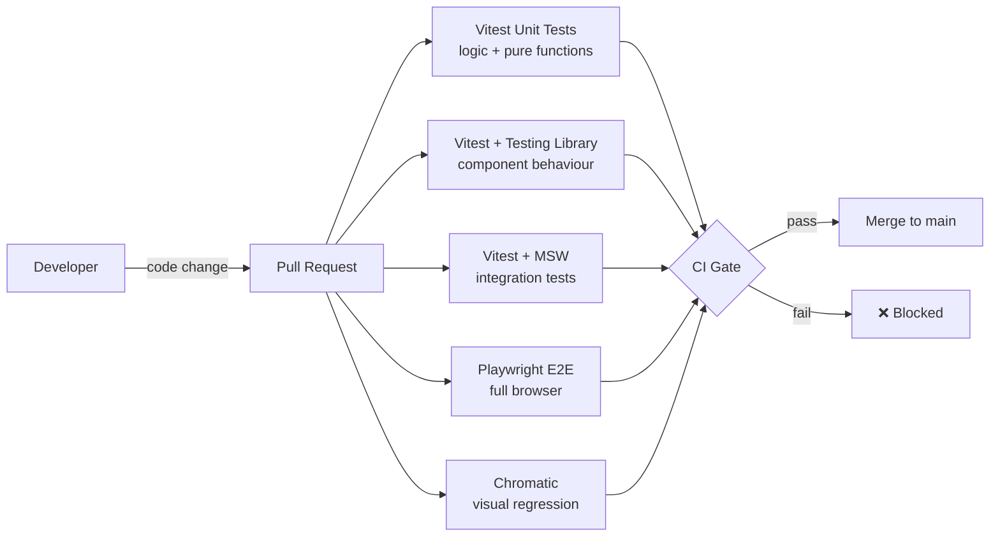

# Frontend Testing

## Category

Frontend Architecture — Quality

## Context

A healthy frontend test suite has three layers: unit tests for logic (Vitest), component integration tests with DOM (Testing Library), and end-to-end browser tests (Playwright). Visual regression (Chromatic) catches unintended UI changes. The goal is high confidence with fast feedback — heavy reliance on E2E slows CI and creates flaky tests.

### Testing Pyramid for Frontend

| Layer | Tool | Speed | Confidence | Flakiness | Count |
|-------|------|-------|-----------|----------|-------|
| **Unit** | Vitest | 🟢 Fast (<1s) | Logic only | Low | Many |
| **Component** | Vitest + Testing Library | 🟢 Fast (<2s) | UI behaviour | Low | Many |
| **Integration** | Vitest + MSW | 🟡 Medium | Data flows | Low | Medium |
| **E2E** | Playwright | 🔴 Slow (5–30s) | Full stack | Medium | Few |
| **Visual** | Chromatic / Percy | 🟡 Medium | Pixel diff | Low | Per component |

### Testing Library Query Priority

| Priority | Query | When to use |
|----------|-------|-------------|
| 1st | `getByRole` | Always prefer — matches assistive tech |
| 2nd | `getByLabelText` | Form fields with labels |
| 3rd | `getByPlaceholderText` | Input with placeholder only |
| 4th | `getByText` | Non-interactive elements |
| 5th | `getByDisplayValue` | Select, input with current value |
| Last | `getByTestId` | Only when nothing else works |

## Pros

- Vitest shares Vite config — no separate Jest config; transforms work identically
- Testing Library enforces user-centric queries (`getByRole`) — tests resemble real usage
- MSW in Vitest provides realistic server interaction without real network calls
- Playwright auto-waits for element state — eliminates most manual `waitFor` calls
- Component testing in Storybook + `@storybook/test` reuses stories as test cases

## Cons

- E2E tests are inherently slower and more brittle — require a running app
- Testing Library queries by role require components to have correct ARIA roles
- MSW mock handlers must be kept in sync with real API contracts
- Playwright cross-browser testing multiplies CI time (Chromium × Firefox × WebKit)
- Visual regression adds review overhead — every intentional UI change produces a diff

## Design Diagram



## Code Sample

### TypeScript — Vitest unit test for pure function

```typescript
// src/utils/formatCurrency.test.ts
import { describe, it, expect } from 'vitest';
import { formatCurrency } from './formatCurrency';

describe('formatCurrency', () => {
  it('formats EUR amounts correctly', () => {
    expect(formatCurrency(1500.50, 'EUR', 'en-GB')).toBe('€1,500.50');
  });

  it('formats GBP amounts correctly', () => {
    expect(formatCurrency(99.99, 'GBP', 'en-GB')).toBe('£99.99');
  });

  it('handles zero amount', () => {
    expect(formatCurrency(0, 'EUR', 'en-GB')).toBe('€0.00');
  });

  it('handles negative amounts', () => {
    expect(formatCurrency(-250, 'EUR', 'en-GB')).toBe('-€250.00');
  });
});

// src/utils/formatCurrency.ts
export function formatCurrency(amount: number, currency: string, locale: string): string {
  return new Intl.NumberFormat(locale, {
    style: 'currency',
    currency,
    minimumFractionDigits: 2,
  }).format(amount);
}
```

### TypeScript — Component test with Testing Library

```tsx
// src/components/PaymentStatusBadge.test.tsx
import { describe, it, expect } from 'vitest';
import { render, screen } from '@testing-library/react';
import { PaymentStatusBadge } from './PaymentStatusBadge';

describe('PaymentStatusBadge', () => {
  it('renders "pending" status with correct accessible label', () => {
    render(<PaymentStatusBadge status="pending" />);
    const badge = screen.getByRole('status');
    expect(badge).toHaveTextContent('Pending');
    expect(badge).toHaveAttribute('data-status', 'pending');
  });

  it('renders "completed" status', () => {
    render(<PaymentStatusBadge status="completed" />);
    expect(screen.getByRole('status')).toHaveTextContent('Completed');
  });

  it('renders "failed" status with alert role', () => {
    render(<PaymentStatusBadge status="failed" />);
    // Failed status uses role="alert" to announce to screen readers immediately
    expect(screen.getByRole('alert')).toHaveTextContent('Failed');
  });
});
```

### TypeScript — Integration test with MSW and React Query

```tsx
// src/pages/PaymentList.test.tsx
import { describe, it, expect, beforeAll, afterAll, afterEach } from 'vitest';
import { render, screen, waitFor } from '@testing-library/react';
import userEvent from '@testing-library/user-event';
import { http, HttpResponse } from 'msw';
import { setupServer } from 'msw/node';
import { QueryClient, QueryClientProvider } from '@tanstack/react-query';
import { PaymentListPage } from './PaymentListPage';

const server = setupServer(
  http.get('/api/payments', () =>
    HttpResponse.json({
      items: [
        { id: 'pay_001', amount: 1500, currency: 'EUR', status: 'pending', createdAt: '2024-04-01T10:00:00Z' },
        { id: 'pay_002', amount: 750, currency: 'GBP', status: 'completed', createdAt: '2024-04-02T09:00:00Z' },
      ],
      totalCount: 2,
    }),
  ),
);

beforeAll(() => server.listen({ onUnhandledRequest: 'error' }));
afterEach(() => server.resetHandlers());
afterAll(() => server.close());

function renderWithProviders(ui: React.ReactElement) {
  const queryClient = new QueryClient({
    defaultOptions: { queries: { retry: false } },
  });
  return render(
    <QueryClientProvider client={queryClient}>{ui}</QueryClientProvider>,
  );
}

describe('PaymentListPage', () => {
  it('renders payment list after loading', async () => {
    renderWithProviders(<PaymentListPage />);

    // Loading state
    expect(screen.getByRole('status', { name: /loading/i })).toBeInTheDocument();

    // Data loaded
    await waitFor(() =>
      expect(screen.getByRole('table', { name: /payments/i })).toBeInTheDocument(),
    );

    expect(screen.getByText('pay_001')).toBeInTheDocument();
    expect(screen.getByText('pay_002')).toBeInTheDocument();
  });

  it('shows error state when API fails', async () => {
    server.use(
      http.get('/api/payments', () => HttpResponse.json({ title: 'Server Error' }, { status: 500 })),
    );

    renderWithProviders(<PaymentListPage />);

    await waitFor(() =>
      expect(screen.getByRole('alert')).toHaveTextContent(/failed to load/i),
    );
  });

  it('filters by status when status filter is changed', async () => {
    const user = userEvent.setup();
    renderWithProviders(<PaymentListPage />);

    await waitFor(() => screen.getByRole('table'));

    const filter = screen.getByRole('combobox', { name: /status/i });
    await user.selectOptions(filter, 'pending');

    // MSW will receive the filtered request — verify URL param sent
    await waitFor(() =>
      expect(screen.getAllByText('pending')).toHaveLength(1),
    );
  });
});
```

### TypeScript — Playwright E2E test

```typescript
// e2e/payments.spec.ts
import { test, expect } from '@playwright/test';

test.describe('Payments', () => {
  test.beforeEach(async ({ page }) => {
    // Sign in via API to avoid going through the UI login flow in every test
    await page.request.post('/api/test/session', {
      data: { userId: 'test-user-01', role: 'payments.write' },
    });
    await page.goto('/payments');
  });

  test('displays payment list', async ({ page }) => {
    await expect(page.getByRole('table', { name: /payments/i })).toBeVisible();
    await expect(page.getByRole('row')).toHaveCount({ min: 2 });
  });

  test('creates a new payment', async ({ page }) => {
    await page.getByRole('link', { name: /create payment/i }).click();
    await expect(page).toHaveURL('/payments/new');

    await page.getByLabel('Amount').fill('500');
    await page.getByLabel('Currency').selectOption('EUR');
    await page.getByLabel('Debtor IBAN').fill('DE89370400440532013000');
    await page.getByLabel('Creditor IBAN').fill('GB29NWBK60161331926819');
    await page.getByRole('button', { name: /create payment/i }).click();

    // Expect redirect to payment detail
    await expect(page).toHaveURL(/\/payments\/pay_/);
    await expect(page.getByRole('status')).toHaveText('Pending');
  });

  test('shows validation errors for invalid amount', async ({ page }) => {
    await page.goto('/payments/new');
    await page.getByRole('button', { name: /create payment/i }).click();

    await expect(page.getByRole('alert', { name: /amount/i })).toBeVisible();
  });
});
```
