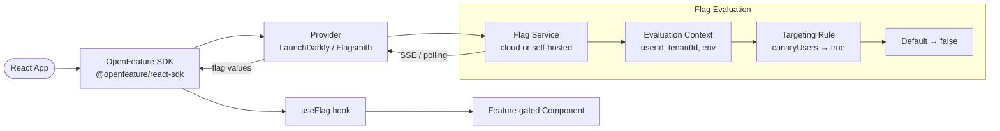

# Feature Flags for Frontend

## Category

Frontend Architecture — Experimentation & Rollout

## Context

Feature flags (feature toggles) decouple deployment from release, enabling trunk-based development, A/B experiments, and controlled rollouts without branching or redeployment. The OpenFeature standard provides a vendor-neutral SDK interface; providers like LaunchDarkly, Flagsmith, or OpenFeature DevCycle implement the backend.

### Feature Flag Types

| Type | Purpose | Lifetime |
|------|---------|---------|
| **Release toggle** | Dark-launch a feature; enable per environment | Days to weeks |
| **Experiment toggle** | A/B testing — split traffic, measure outcome | Days to weeks |
| **Ops toggle** | Kill switch for a feature under incident | Hours |
| **Permission toggle** | Enable for specific users / tenants only | Long-lived |
| **Infrastructure toggle** | Switch between implementations (old vs new API) | Medium |

### Provider Comparison

| Provider | Open-source | Self-hosted | Real-time updates | SDKs |
|----------|------------|------------|-----------------|------|
| **OpenFeature (interface only)** | ✅ | N/A | N/A | Many |
| **LaunchDarkly** | ❌ | ❌ | ✅ SSE | Full |
| **Flagsmith** | ✅ | ✅ | ✅ | Full |
| **DevCycle** | ❌ | ❌ | ✅ | Full (OpenFeature) |
| **Growthbook** | ✅ | ✅ | ✅ | Full |
| **ConfigCat** | ❌ | ❌ | ✅ | Full |

## Pros

- Dark-launch unfinished features behind a flag — merge to main without user impact
- Instant kill switch for a broken feature without redeployment
- A/B experiments measure real user behaviour before permanent rollout
- Per-tenant / per-user flags enable beta access without separate deployments
- OpenFeature standard decouples app code from flag provider — swap providers without refactoring

## Cons

- Flag accumulation (`tech debt` — undead flags) increases codebase complexity
- Incorrect flag evaluation order (default → targeting → override) causes confusion
- SSE or polling for real-time updates adds persistent connection overhead
- Testing all flag permutations is combinatorially explosive without discipline
- Flags stored in localStorage or cookies are client-mutable — do not gate security decisions

## Design Diagram



## Code Sample

### TypeScript — OpenFeature setup with LaunchDarkly provider

```typescript
// src/flags/featureFlags.ts
import { OpenFeature } from '@openfeature/react-sdk';
import { LaunchDarklyClientProvider } from '@openfeature/launchdarkly-client-provider';

export interface FlagContext {
  userId: string;
  tenantId: string;
  email: string;
  plan: 'free' | 'pro' | 'enterprise';
}

export async function initialiseFlags(context: FlagContext): Promise<void> {
  const provider = new LaunchDarklyClientProvider(
    import.meta.env.VITE_LD_CLIENT_KEY,
    {
      // Stream real-time flag updates via SSE
      streaming: true,
      // Evaluation context sent to LaunchDarkly for targeting rules
      context: {
        kind: 'multi',
        user: {
          key: context.userId,
          email: context.email,
          name: context.email,
        },
        tenant: {
          key: context.tenantId,
          plan: context.plan,
        },
      },
    },
  );

  // Set provider — waits until provider is ready before resolving
  await OpenFeature.setProviderAndWait(provider);
}

// Flag key registry — single source of truth for all flag names
export const FLAGS = {
  NEW_PAYMENT_FLOW: 'new-payment-flow',
  INSTANT_PAYMENTS: 'instant-payments-enabled',
  DARK_MODE: 'dark-mode',
  PAYMENT_ANALYTICS: 'payment-analytics-dashboard',
} as const;
```

### TypeScript — React hook and component-level flag gating

```tsx
// src/flags/useFlag.ts
import { useBooleanFlagValue, useStringFlagValue, useNumberFlagValue } from '@openfeature/react-sdk';
import { FLAGS } from './featureFlags';

// ── Typed flag hooks ────────────────────────────────────────────────────────
export function useNewPaymentFlow(): boolean {
  return useBooleanFlagValue(FLAGS.NEW_PAYMENT_FLOW, false);
}

export function useInstantPayments(): boolean {
  return useBooleanFlagValue(FLAGS.INSTANT_PAYMENTS, false);
}

export function usePaymentAnalytics(): boolean {
  return useBooleanFlagValue(FLAGS.PAYMENT_ANALYTICS, false);
}

// ── Feature gate component ───────────────────────────────────────────────────
// src/flags/FeatureGate.tsx
import { type ReactNode } from 'react';
import { useBooleanFlagValue } from '@openfeature/react-sdk';

interface FeatureGateProps {
  flag: string;
  defaultValue?: boolean;
  children: ReactNode;
  fallback?: ReactNode;
}

export function FeatureGate({
  flag,
  defaultValue = false,
  children,
  fallback = null,
}: FeatureGateProps) {
  const enabled = useBooleanFlagValue(flag, defaultValue);
  return enabled ? <>{children}</> : <>{fallback}</>;
}

// ── Usage in route component ──────────────────────────────────────────────────
// src/pages/CreatePaymentPage.tsx
import { FeatureGate } from '../flags/FeatureGate';
import { FLAGS } from '../flags/featureFlags';

export function CreatePaymentPage() {
  return (
    <FeatureGate
      flag={FLAGS.NEW_PAYMENT_FLOW}
      fallback={<LegacyPaymentForm />}
    >
      <NewPaymentFlow />
    </FeatureGate>
  );
}

function LegacyPaymentForm() { return <p>Legacy payment form</p>; }
function NewPaymentFlow() { return <p>New payment flow (flagged)</p>; }
```

### TypeScript — Vitest setup for flag testing with in-memory provider

```typescript
// src/flags/testing/inMemoryProvider.ts
import {
  OpenFeature,
  InMemoryProvider,
  type EvaluationContext,
} from '@openfeature/react-sdk';
import { FLAGS } from '../featureFlags';

// Default flag values for tests — all off unless overridden
const DEFAULT_TEST_FLAGS: Record<string, boolean> = {
  [FLAGS.NEW_PAYMENT_FLOW]: false,
  [FLAGS.INSTANT_PAYMENTS]: false,
  [FLAGS.DARK_MODE]: false,
  [FLAGS.PAYMENT_ANALYTICS]: false,
};

export async function setupTestFlags(
  overrides: Partial<Record<string, boolean>> = {},
): Promise<void> {
  const flags = { ...DEFAULT_TEST_FLAGS, ...overrides };

  const flagConfig = Object.fromEntries(
    Object.entries(flags).map(([key, value]) => [key, { defaultVariant: value ? 'on' : 'off', variants: { on: true, off: false } }]),
  );

  await OpenFeature.setProviderAndWait(new InMemoryProvider(flagConfig));
}

// Usage in test:
// beforeEach(() => setupTestFlags({ [FLAGS.NEW_PAYMENT_FLOW]: true }));
```

### TypeScript — A/B experiment flag with variant string

```tsx
// src/experiments/PaymentButtonExperiment.tsx
import { useStringFlagValue } from '@openfeature/react-sdk';

type ButtonVariant = 'control' | 'variant-a' | 'variant-b';

export function PaymentButtonExperiment() {
  // String flag with multiple variants for A/B/C test
  const variant = useStringFlagValue<ButtonVariant>('payment-cta-experiment', 'control');

  const copy: Record<ButtonVariant, string> = {
    control: 'Create Payment',
    'variant-a': 'Send Money',
    'variant-b': 'Transfer Now',
  };

  return (
    <button
      data-experiment="payment-cta"
      data-variant={variant}
      onClick={() => {
        // Track conversion event with variant info
        analytics.track('payment_cta_clicked', { variant });
      }}
    >
      {copy[variant]}
    </button>
  );
}
```
