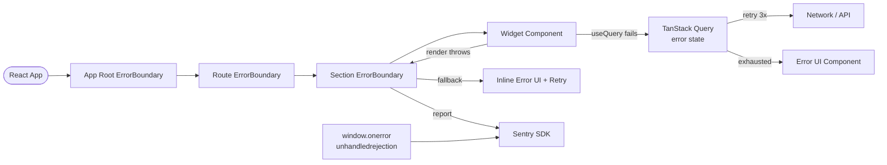

# Frontend Error Handling

## Category

Frontend Architecture — Resilience

## Context

Frontend error handling spans three categories: React rendering errors (caught by Error Boundaries), async data errors (caught by TanStack Query / async handlers), and uncaught global errors (caught by `window.onerror` and `unhandledrejection`). All categories send errors to an observability service (Sentry) with rich context: user ID, component tree, breadcrumbs, and feature flags active at the time.

### Error Categories

| Category | Catch mechanism | Recovery | Example |
|----------|---------------|---------|---------|
| **React render error** | `ErrorBoundary` | Fallback UI | Component throws in render |
| **Async / data error** | TanStack Query `error` state | Retry / error UI | API 500 |
| **Event handler error** | try/catch + global handler | Toast notification | Button click throws |
| **Network error** | Fetch error + retry | Retry with backoff | DNS failure |
| **Script load error** | `window.onerror` | Reload prompt | Module Federation chunk fails |
| **Unhandled promise** | `unhandledrejection` event | Log + report | Missing `.catch()` |

### Error Boundary Placement Strategy

| Level | Scope | Fallback |
|-------|-------|---------|
| **App root** | Catches everything | Full-page error screen |
| **Route level** | Catches page-specific errors | Page error with back button |
| **Section level** | Catches widget / panel | Inline error with retry |

## Pros

- Error boundaries prevent a single failing component from crashing the entire app
- Sentry captures full stack trace, component tree, breadcrumbs, and user context automatically
- TanStack Query's `retry` and `retryDelay` options implement exponential backoff transparently
- Global `unhandledrejection` catchall ensures no error silently disappears
- Error IDs in Sentry responses allow users to report errors to support with a reference number

## Cons

- React Error Boundaries do not catch errors in async `useEffect` — requires manual try/catch
- Sentry `beforeSend` filtering must be maintained to avoid PII leakage in error payloads
- Error boundary position too high catches all child errors — hard to recover specific widgets
- Over-reporting noise (network timeout flakes) pollutes Sentry — requires `ignoreErrors` tuning
- Error recovery logic (retry buttons) requires re-mounting the error boundary — not automatic

## Design Diagram



## Code Sample

### TypeScript — Typed Error Boundary component

```tsx
// src/components/ErrorBoundary/ErrorBoundary.tsx
import React, { type ReactNode } from 'react';
import * as Sentry from '@sentry/react';

export interface ErrorBoundaryFallbackProps {
  error: Error;
  errorId: string;
  resetError: () => void;
}

interface ErrorBoundaryProps {
  children: ReactNode;
  fallback?: (props: ErrorBoundaryFallbackProps) => ReactNode;
  name?: string; // component name for Sentry context
}

interface ErrorBoundaryState {
  hasError: boolean;
  error: Error | null;
  errorId: string;
}

export class ErrorBoundary extends React.Component<ErrorBoundaryProps, ErrorBoundaryState> {
  state: ErrorBoundaryState = { hasError: false, error: null, errorId: '' };

  static getDerivedStateFromError(error: Error): Partial<ErrorBoundaryState> {
    return { hasError: true, error, errorId: crypto.randomUUID() };
  }

  componentDidCatch(error: Error, info: React.ErrorInfo): void {
    Sentry.withScope((scope) => {
      scope.setTag('errorBoundary', this.props.name ?? 'unknown');
      scope.setContext('componentStack', { componentStack: info.componentStack });
      scope.setExtra('errorId', this.state.errorId);
      Sentry.captureException(error);
    });
  }

  resetError = () => this.setState({ hasError: false, error: null, errorId: '' });

  render() {
    if (!this.state.hasError || !this.state.error) return this.props.children;

    if (this.props.fallback) {
      return this.props.fallback({
        error: this.state.error,
        errorId: this.state.errorId,
        resetError: this.resetError,
      });
    }

    return (
      <DefaultErrorFallback
        error={this.state.error}
        errorId={this.state.errorId}
        resetError={this.resetError}
      />
    );
  }
}

function DefaultErrorFallback({ error, errorId, resetError }: ErrorBoundaryFallbackProps) {
  return (
    <div role="alert" aria-live="assertive">
      <h2>Something went wrong</h2>
      <p>{error.message}</p>
      <p>
        <small>Error reference: <code>{errorId}</code></small>
      </p>
      <button onClick={resetError}>Try again</button>
    </div>
  );
}
```

### TypeScript — Sentry initialisation with PII scrubbing

```typescript
// src/monitoring/sentry.ts
import * as Sentry from '@sentry/react';
import { useAuthStore } from '../stores/authStore';

export function initialiseSentry(): void {
  if (!import.meta.env.VITE_SENTRY_DSN) return;

  Sentry.init({
    dsn: import.meta.env.VITE_SENTRY_DSN,
    environment: import.meta.env.VITE_ENV ?? 'development',
    release: import.meta.env.VITE_APP_VERSION,
    integrations: [
      Sentry.browserTracingIntegration(),
      Sentry.replayIntegration({
        maskAllText: true,   // mask all text in session replay — PII protection
        blockAllMedia: true,
      }),
    ],
    tracesSampleRate: import.meta.env.PROD ? 0.1 : 1.0,
    replaysSessionSampleRate: 0.05,
    replaysOnErrorSampleRate: 1.0,

    beforeSend: (event) => {
      // Strip sensitive query params from URLs
      if (event.request?.url) {
        const url = new URL(event.request.url);
        ['token', 'code', 'state', 'session'].forEach((p) => url.searchParams.delete(p));
        event.request.url = url.toString();
      }
      // Remove cookie header
      if (event.request?.headers) {
        delete event.request.headers['Cookie'];
        delete event.request.headers['Authorization'];
      }
      return event;
    },
  });
}

// Call after auth — set user context for error correlation
export function setSentryUser(): void {
  const user = useAuthStore.getState().user;
  if (user) {
    // Send user ID only — never PII like full email or name
    Sentry.setUser({ id: user.id });
  }
}
```

### TypeScript — Global error handler setup

```typescript
// src/monitoring/globalErrorHandler.ts
import * as Sentry from '@sentry/react';

export function installGlobalErrorHandlers(): void {
  // Catch synchronous errors not caught by Error Boundaries
  window.addEventListener('error', (event: ErrorEvent) => {
    console.error('[global] Uncaught error:', event.error);
    Sentry.captureException(event.error, {
      extra: { filename: event.filename, lineno: event.lineno, colno: event.colno },
    });
    // Prevent duplicate reporting by browser default
    event.preventDefault();
  });

  // Catch unhandled promise rejections (async code without .catch())
  window.addEventListener('unhandledrejection', (event: PromiseRejectionEvent) => {
    console.error('[global] Unhandled promise rejection:', event.reason);
    Sentry.captureException(event.reason, {
      extra: { type: 'unhandledrejection' },
    });
    event.preventDefault();
  });
}

// Async error helper — standardised error reporting from event handlers
export async function withErrorReporting<T>(
  fn: () => Promise<T>,
  context?: Record<string, unknown>,
): Promise<T | null> {
  try {
    return await fn();
  } catch (err) {
    Sentry.captureException(err, { extra: context });
    console.error('[error]', err);
    return null;
  }
}
```

### TypeScript — TanStack Query error boundary integration

```tsx
// src/components/QueryErrorBoundary.tsx
import { QueryErrorResetBoundary } from '@tanstack/react-query';
import { ErrorBoundary } from './ErrorBoundary';
import type { ReactNode } from 'react';

interface QueryErrorBoundaryProps {
  children: ReactNode;
  name?: string;
}

/**
 * Combines React Query's error reset capability with the Error Boundary.
 * Calling resetError() also resets query errors so data is re-fetched.
 */
export function QueryErrorBoundary({ children, name }: QueryErrorBoundaryProps) {
  return (
    <QueryErrorResetBoundary>
      {({ reset }) => (
        <ErrorBoundary
          name={name}
          fallback={({ error, errorId, resetError }) => (
            <div role="alert">
              <p>Failed to load data: {error.message}</p>
              <p><small>Ref: {errorId}</small></p>
              <button
                onClick={() => {
                  reset();       // reset TanStack Query error state
                  resetError();  // reset Error Boundary
                }}
              >
                Retry
              </button>
            </div>
          )}
        >
          {children}
        </ErrorBoundary>
      )}
    </QueryErrorResetBoundary>
  );
}
```
