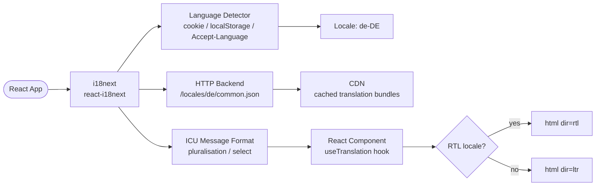

# Internationalisation & Localisation (i18n)

## Category

Frontend Architecture — Globalisation

## Context

Internationalisation (i18n) makes an app adaptable to different languages and locales without code changes. Localisation (L10n) applies those adaptations for a specific locale. `i18next` with `react-i18next` is the de facto standard: it supports ICU message format (plurals, selects, interpolation), namespace splitting per feature, lazy-loaded translation bundles, and RTL layout switching.

### i18n Dimensions

| Dimension | Example | API |
|-----------|---------|-----|
| **Translation** | `"Create Payment"` → `"Zahlung erstellen"` | i18next `t()` |
| **Pluralisation** | `"1 item" / "3 items"` | ICU `{count, plural}` |
| **Date formatting** | `2024-04-01` → `1 Apr 2024` (en-GB) | `Intl.DateTimeFormat` |
| **Number formatting** | `1500.5` → `1.500,50` (de-DE) | `Intl.NumberFormat` |
| **Currency** | `€1,500.50` | `Intl.NumberFormat` with `style: 'currency'` |
| **RTL layout** | Arabic, Hebrew text direction | `dir="rtl"` attribute |
| **Relative time** | `"3 minutes ago"` | `Intl.RelativeTimeFormat` |

### Locale Detection Priority

```
1. User preference saved in localStorage / cookie
2. URL path prefix (/de/payments)
3. Accept-Language HTTP header (server-side)
4. Browser navigator.language
5. Fallback: en-GB
```

## Pros

- i18next namespace splitting loads only translations needed for the active route
- ICU message format handles plural rules for all major languages (no concatenation hacks)
- `Intl.*` APIs use browser-native locale data — no large polyfill bundles
- RTL support via logical CSS properties (`margin-inline-start` vs `margin-left`) works with a single stylesheet
- Language switching is instant — no page reload required with react-i18next context

## Cons

- Translation strings extracted from code require CI tooling (`i18next-parser` or `@formatjs/cli`)
- Backend translation management (Lokalise, Phrase) adds dependency on third-party SaaS
- Missing translation keys silently fall back to the key string — hard to detect without CI checks
- RTL layout requires full CSS review — not automatic even with logical properties
- ICU format is verbose — teams sometimes revert to interpolation which cannot handle plurals

## Design Diagram



## Code Sample

### TypeScript — i18next initialisation with ICU and lazy HTTP backend

```typescript
// src/i18n/i18n.ts
import i18n from 'i18next';
import { initReactI18next } from 'react-i18next';
import HttpBackend from 'i18next-http-backend';
import LanguageDetector from 'i18next-browser-languagedetector';
import ICU from 'i18next-icu';

await i18n
  .use(ICU)                  // ICU message format for plurals + gender
  .use(HttpBackend)          // lazy-load translation JSON over HTTP
  .use(LanguageDetector)     // auto-detect locale (localStorage → navigator)
  .use(initReactI18next)
  .init({
    fallbackLng: 'en-GB',
    supportedLngs: ['en-GB', 'en-US', 'de-DE', 'fr-FR', 'ar-SA'],
    defaultNS: 'common',
    ns: ['common', 'payments', 'accounts', 'errors'],

    backend: {
      loadPath: '/locales/{{lng}}/{{ns}}.json',
      crossDomain: false,
    },

    detection: {
      order: ['localStorage', 'navigator'],
      caches: ['localStorage'],
      lookupLocalStorage: 'preferred-language',
    },

    interpolation: {
      escapeValue: false, // React escapes by default
    },

    react: {
      useSuspense: true,   // Suspense while translation bundle loads
    },
  });

export default i18n;
export type SupportedLocale = 'en-GB' | 'en-US' | 'de-DE' | 'fr-FR' | 'ar-SA';
```

### JSON — Translation file with ICU plurals and interpolation

```json
// public/locales/en-GB/payments.json
{
  "title": "Payments",
  "createPayment": "Create Payment",
  "paymentCount": "{count, plural, =0 {No payments} one {# payment} other {# payments}}",
  "totalAmount": "Total: {amount}",
  "status": {
    "pending": "Pending",
    "completed": "Completed",
    "failed": "Failed",
    "cancelled": "Cancelled"
  },
  "errors": {
    "createFailed": "Failed to create the payment. Please try again.",
    "invalidIban": "The IBAN you entered is not valid."
  },
  "confirmCancel": "{name}, are you sure you want to cancel this payment of {amount}?"
}
```

```json
// public/locales/de-DE/payments.json
{
  "title": "Zahlungen",
  "createPayment": "Zahlung erstellen",
  "paymentCount": "{count, plural, =0 {Keine Zahlungen} one {# Zahlung} other {# Zahlungen}}",
  "totalAmount": "Gesamt: {amount}",
  "status": {
    "pending": "Ausstehend",
    "completed": "Abgeschlossen",
    "failed": "Fehlgeschlagen",
    "cancelled": "Storniert"
  },
  "errors": {
    "createFailed": "Die Zahlung konnte nicht erstellt werden. Bitte versuchen Sie es erneut.",
    "invalidIban": "Die eingegebene IBAN ist nicht gültig."
  },
  "confirmCancel": "{name}, möchten Sie diese Zahlung über {amount} wirklich stornieren?"
}
```

### TypeScript — React component with useTranslation and Intl formatting

```tsx
// src/components/PaymentSummary.tsx
import { useTranslation } from 'react-i18next';
import { useCallback } from 'react';
import type { SupportedLocale } from '../i18n/i18n';

interface PaymentSummaryProps {
  count: number;
  totalAmount: number;
  currency: string;
  locale: SupportedLocale;
}

export function PaymentSummary({ count, totalAmount, currency, locale }: PaymentSummaryProps) {
  const { t } = useTranslation('payments');

  const formatCurrency = useCallback(
    (amount: number): string =>
      new Intl.NumberFormat(locale, {
        style: 'currency',
        currency,
        minimumFractionDigits: 2,
      }).format(amount),
    [locale, currency],
  );

  return (
    <section aria-label={t('title')}>
      <h2>{t('title')}</h2>
      <p>{t('paymentCount', { count })}</p>
      <p>{t('totalAmount', { amount: formatCurrency(totalAmount) })}</p>
    </section>
  );
}
```

### TypeScript — RTL support and language switcher

```tsx
// src/components/LanguageSwitcher.tsx
import { useTranslation } from 'react-i18next';
import { useEffect } from 'react';
import type { SupportedLocale } from '../i18n/i18n';

const RTL_LOCALES: SupportedLocale[] = ['ar-SA'];

const LOCALE_LABELS: Record<SupportedLocale, string> = {
  'en-GB': 'English (UK)',
  'en-US': 'English (US)',
  'de-DE': 'Deutsch',
  'fr-FR': 'Français',
  'ar-SA': 'العربية',
};

export function LanguageSwitcher() {
  const { i18n } = useTranslation();
  const currentLocale = i18n.language as SupportedLocale;
  const isRtl = RTL_LOCALES.includes(currentLocale);

  // Apply text direction globally
  useEffect(() => {
    document.documentElement.setAttribute('dir', isRtl ? 'rtl' : 'ltr');
    document.documentElement.setAttribute('lang', currentLocale);
  }, [currentLocale, isRtl]);

  const changeLanguage = (locale: SupportedLocale) => {
    void i18n.changeLanguage(locale);
  };

  return (
    <nav aria-label="Language selection">
      <select
        value={currentLocale}
        onChange={(e) => changeLanguage(e.target.value as SupportedLocale)}
        aria-label="Select language"
      >
        {(Object.entries(LOCALE_LABELS) as [SupportedLocale, string][]).map(([locale, label]) => (
          <option key={locale} value={locale} lang={locale}>
            {label}
          </option>
        ))}
      </select>
    </nav>
  );
}
```

### TypeScript — Relative time formatter hook

```typescript
// src/hooks/useRelativeTime.ts
import { useTranslation } from 'react-i18next';
import { useMemo } from 'react';

const UNITS: Array<{ unit: Intl.RelativeTimeFormatUnit; ms: number }> = [
  { unit: 'year', ms: 365 * 24 * 60 * 60 * 1000 },
  { unit: 'month', ms: 30 * 24 * 60 * 60 * 1000 },
  { unit: 'day', ms: 24 * 60 * 60 * 1000 },
  { unit: 'hour', ms: 60 * 60 * 1000 },
  { unit: 'minute', ms: 60 * 1000 },
  { unit: 'second', ms: 1000 },
];

export function useRelativeTime(date: Date): string {
  const { i18n } = useTranslation();

  return useMemo(() => {
    const rtf = new Intl.RelativeTimeFormat(i18n.language, { numeric: 'auto' });
    const diffMs = date.getTime() - Date.now();
    const absDiff = Math.abs(diffMs);

    for (const { unit, ms } of UNITS) {
      if (absDiff >= ms) {
        return rtf.format(Math.round(diffMs / ms), unit);
      }
    }

    return rtf.format(0, 'second');
  }, [date, i18n.language]);
}
```
