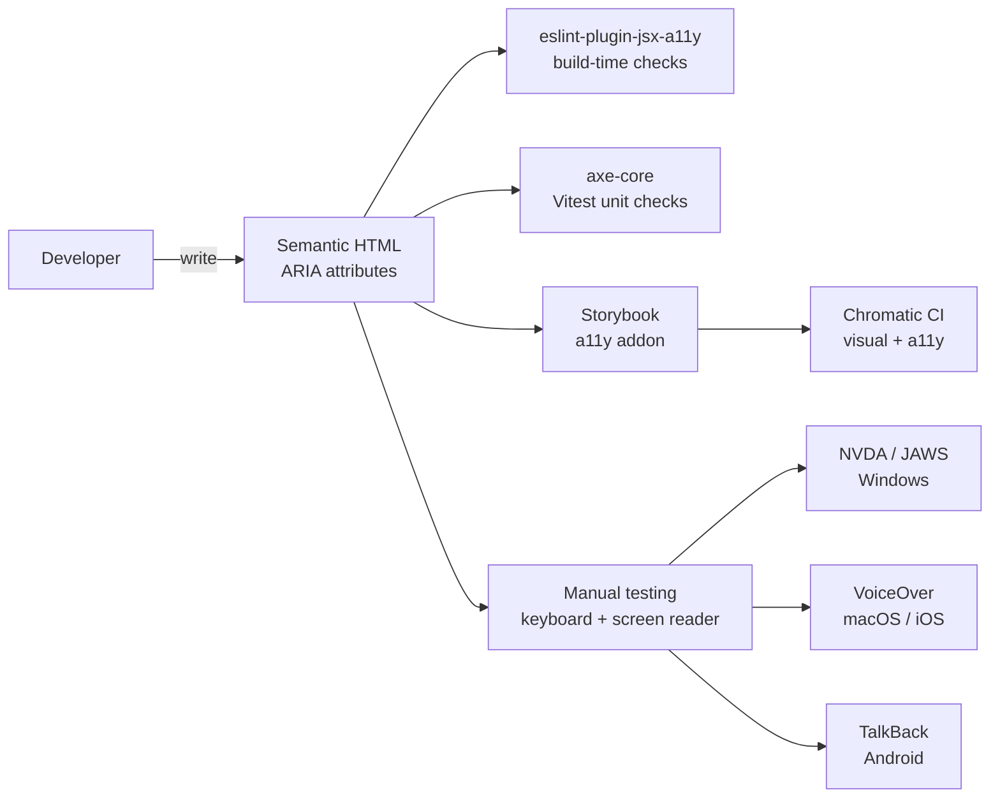

# Accessibility (a11y)

## Category

Frontend Architecture — Inclusivity

## Context

Accessibility ensures UIs work for all users — including those using screen readers, keyboard-only navigation, voice control, and alternative pointing devices. WCAG 2.1 Level AA is the legal requirement in the EU (EAA), UK (Equality Act), and US (ADA/Section 508). Accessibility is also a performance concern: semantic HTML is faster to parse and improves Core Web Vitals.

### WCAG 2.1 Principles (POUR)

| Principle | Key requirements | Common failures |
|-----------|----------------|----------------|
| **Perceivable** | Alt text, captions, colour contrast ≥ 4.5:1 | Missing alt, low contrast |
| **Operable** | Keyboard nav, no seizure triggers, skip links | Focus trap, no skip link |
| **Understandable** | Labels, error messages, consistent navigation | Unlabelled input, generic "click here" |
| **Robust** | Valid HTML, ARIA roles, assistive tech compatibility | div-soup, incorrect ARIA |

### ARIA Role Quick Reference

| Pattern | Role / Attribute | Example |
|---------|----------------|---------|
| Interactive button | `role="button"` or `<button>` | Submit, cancel |
| Live region | `aria-live="polite"` | Status updates |
| Error message | `aria-describedby` + `role="alert"` | Form validation |
| Loading state | `aria-busy="true"` | Data table updating |
| Modal | `role="dialog"` + `aria-modal` | Confirm dialog |
| Progress | `role="progressbar"` + `aria-valuenow` | File upload |
| Expanded panel | `aria-expanded` | Accordion |
| Required field | `aria-required="true"` | Form field |

## Pros

- Semantic HTML provides accessibility for free — `<button>` vs `<div onClick>` requires zero ARIA
- `axe-core` in Vitest and Storybook catches ~55% of WCAG issues automatically
- Accessible forms (`<label>`, `aria-describedby`) also improve SEO and usability for all users
- Keyboard navigation testing surfaces focus management issues before screen reader testing
- EU EAA (2025 enforcement) and US Section 508 make compliance a legal, not optional, concern

## Cons

- ARIA `live` regions can be noisy on screen readers if over-used
- Focus management in SPAs (after navigation, modal close) must be implemented manually
- Colour contrast in design tokens must be verified for all theme combinations (light/dark)
- Automated tools catch only ~30–55% of issues — manual and assistive tech testing is required
- Third-party components (charts, maps, date pickers) often have poor built-in accessibility

## Design Diagram



## Code Sample

### TypeScript — Accessible form with complete ARIA pattern

```tsx
// src/components/AccessiblePaymentForm.tsx
import { useId } from 'react';
import { useForm } from 'react-hook-form';
import { zodResolver } from '@hookform/resolvers/zod';
import { z } from 'zod';

const schema = z.object({
  amount: z.number().positive('Amount must be greater than 0'),
  currency: z.enum(['EUR', 'GBP', 'USD']),
  debtorIban: z.string().min(15, 'Enter a valid IBAN'),
  reference: z.string().max(140).optional(),
});

type FormData = z.infer<typeof schema>;

export function AccessiblePaymentForm({ onSubmit }: { onSubmit: (data: FormData) => void }) {
  // useId generates stable IDs for label associations — required for SSR hydration
  const amountId = useId();
  const currencyId = useId();
  const ibanId = useId();
  const referenceId = useId();
  const formErrorId = useId();

  const {
    register,
    handleSubmit,
    formState: { errors, isSubmitting, isDirty },
  } = useForm<FormData>({ resolver: zodResolver(schema) });

  return (
    <form
      onSubmit={handleSubmit(onSubmit)}
      noValidate              // disable browser validation — use our custom errors
      aria-label="Create payment"
      aria-describedby={errors.root ? formErrorId : undefined}
    >
      {/* Form-level error */}
      {errors.root && (
        <div id={formErrorId} role="alert" aria-live="assertive">
          {errors.root.message}
        </div>
      )}

      {/* Amount field */}
      <div>
        <label htmlFor={amountId}>
          Amount <span aria-hidden="true">*</span>
        </label>
        <input
          id={amountId}
          type="number"
          step="0.01"
          inputMode="decimal"    // show numeric keyboard on mobile
          autoComplete="off"
          {...register('amount', { valueAsNumber: true })}
          aria-required="true"
          aria-invalid={Boolean(errors.amount)}
          aria-describedby={errors.amount ? `${amountId}-error` : `${amountId}-hint`}
        />
        <span id={`${amountId}-hint`} className="sr-only">
          Enter amount in the selected currency, e.g. 1500.00
        </span>
        {errors.amount && (
          <span id={`${amountId}-error`} role="alert">
            {errors.amount.message}
          </span>
        )}
      </div>

      {/* Currency select */}
      <div>
        <label htmlFor={currencyId}>Currency <span aria-hidden="true">*</span></label>
        <select
          id={currencyId}
          {...register('currency')}
          aria-required="true"
          aria-invalid={Boolean(errors.currency)}
        >
          <option value="">Select currency</option>
          <option value="EUR">EUR — Euro</option>
          <option value="GBP">GBP — British Pound</option>
          <option value="USD">USD — US Dollar</option>
        </select>
        {errors.currency && <span role="alert">{errors.currency.message}</span>}
      </div>

      {/* IBAN field */}
      <div>
        <label htmlFor={ibanId}>Debtor IBAN <span aria-hidden="true">*</span></label>
        <input
          id={ibanId}
          type="text"
          inputMode="text"
          autoComplete="off"
          spellCheck="false"
          {...register('debtorIban')}
          aria-required="true"
          aria-invalid={Boolean(errors.debtorIban)}
          aria-describedby={errors.debtorIban ? `${ibanId}-error` : `${ibanId}-hint`}
        />
        <span id={`${ibanId}-hint`} className="sr-only">
          Enter IBAN in format: GB29NWBK60161331926819
        </span>
        {errors.debtorIban && (
          <span id={`${ibanId}-error`} role="alert">{errors.debtorIban.message}</span>
        )}
      </div>

      <button
        type="submit"
        disabled={isSubmitting || !isDirty}
        aria-busy={isSubmitting}
      >
        {isSubmitting ? 'Creating…' : 'Create Payment'}
      </button>
    </form>
  );
}
```

### TypeScript — Focus management after modal close

```tsx
// src/components/FocusManager.tsx
import { useEffect, useRef, type RefObject } from 'react';

/**
 * Restores focus to a trigger element when a modal/drawer closes.
 * Prevents screen readers from losing their position in the document.
 */
export function useFocusRestore(isOpen: boolean): RefObject<HTMLButtonElement | null> {
  const triggerRef = useRef<HTMLButtonElement | null>(null);

  useEffect(() => {
    if (!isOpen && triggerRef.current) {
      // Return focus to trigger when dialog closes
      triggerRef.current.focus();
    }
  }, [isOpen]);

  return triggerRef;
}

/**
 * Traps focus within a container while it is active.
 * Use for modals, drawers, and popups.
 */
export function useFocusTrap(containerRef: RefObject<HTMLElement | null>, isActive: boolean): void {
  useEffect(() => {
    if (!isActive || !containerRef.current) return;

    const container = containerRef.current;
    const focusableSelectors = [
      'a[href]', 'button:not([disabled])', 'input:not([disabled])',
      'select:not([disabled])', 'textarea:not([disabled])',
      '[tabindex]:not([tabindex="-1"])',
    ].join(', ');

    const focusable = Array.from(container.querySelectorAll<HTMLElement>(focusableSelectors));
    const first = focusable[0];
    const last = focusable[focusable.length - 1];

    first?.focus();

    const handleKeyDown = (e: KeyboardEvent) => {
      if (e.key !== 'Tab') return;

      if (e.shiftKey) {
        if (document.activeElement === first) {
          e.preventDefault();
          last?.focus();
        }
      } else {
        if (document.activeElement === last) {
          e.preventDefault();
          first?.focus();
        }
      }
    };

    container.addEventListener('keydown', handleKeyDown);
    return () => container.removeEventListener('keydown', handleKeyDown);
  }, [containerRef, isActive]);
}
```

### TypeScript — axe-core accessibility test in Vitest

```typescript
// src/setupTests.ts — add to Vitest setup
import { configureAxe, toHaveNoViolations } from 'jest-axe';
import { expect } from 'vitest';

expect.extend(toHaveNoViolations);

export const axe = configureAxe({
  rules: {
    // Enforce WCAG 2.1 Level AA
    'color-contrast': { enabled: true },
    'image-alt': { enabled: true },
    'label': { enabled: true },
    'link-name': { enabled: true },
  },
});

// Usage in test:
// import { render } from '@testing-library/react';
// import { axe } from '../setupTests';
// it('has no accessibility violations', async () => {
//   const { container } = render(<MyComponent />);
//   const results = await axe(container);
//   expect(results).toHaveNoViolations();
// });
```

### TypeScript — Skip navigation link (WCAG 2.4.1)

```tsx
// src/components/SkipNav.tsx — render as first element in <body>
export function SkipNav() {
  return (
    <a
      href="#main-content"
      style={{
        position: 'absolute',
        top: '-40px',
        left: 0,
        padding: '8px',
        background: '#2563eb',
        color: '#fff',
        zIndex: 9999,
        textDecoration: 'none',
        // Visible only on focus (for keyboard users)
        transition: 'top 0.1s',
      }}
      onFocus={(e) => ((e.currentTarget as HTMLAnchorElement).style.top = '0')}
      onBlur={(e) => ((e.currentTarget as HTMLAnchorElement).style.top = '-40px')}
    >
      Skip to main content
    </a>
  );
}

// Usage:
// <body>
//   <SkipNav />
//   <Header />
//   <main id="main-content">...</main>
// </body>
```
