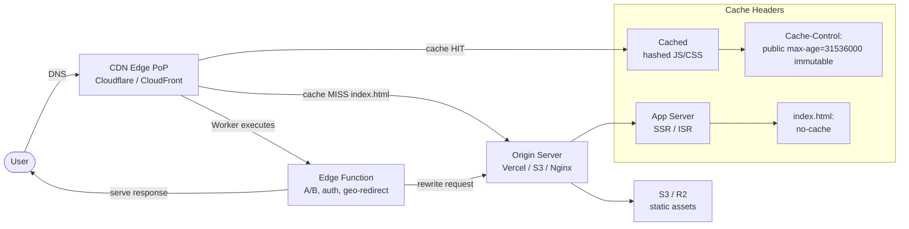

# CDN & Edge Delivery

## Category

Frontend Architecture — Delivery & Caching

## Context

A CDN (Content Delivery Network) distributes static assets — JS bundles, images, fonts — from edge PoPs (Points of Presence) close to users, reducing latency from 100–300 ms to 5–20 ms. Edge Functions extend CDN nodes with compute (request rewriting, A/B testing, auth token introspection) at the same low latency without a round trip to the origin.

### CDN Caching Strategy by Asset Type

| Asset type | Cache-Control | CDN TTL | Invalidation |
|-----------|-------------|---------|-------------|
| **Hashed JS/CSS bundles** | `public, max-age=31536000, immutable` | 1 year | Hash changes on deploy |
| **index.html** | `no-cache` | 0 | Always fetched from origin |
| **Images (hashed)** | `public, max-age=31536000, immutable` | 1 year | Hash |
| **Fonts** | `public, max-age=31536000, immutable` | 1 year | On font change |
| **API responses** | `private, no-store` | 0 | Never cache at CDN |
| **Robots.txt** | `public, max-age=86400` | 1 day | Deploy |

### CDN Provider Comparison

| CDN | Edge compute | TTFB | Global PoPs | Analytics | Best for |
|-----|------------|------|------------|----------|----------|
| **Cloudflare** | Workers (V8 isolates) | ⚡ | 300+ | ✅ | DDoS, edge compute |
| **Vercel Edge** | Edge Functions (V8) | ⚡ | 100+ | ✅ | Next.js apps |
| **AWS CloudFront** | Lambda@Edge / CloudFront Functions | 🟡 | 400+ | ✅ | AWS-native |
| **Fastly** | Compute@Edge (WASM) | ⚡ | 80+ | ✅ | Enterprise |
| **Akamai** | EdgeWorkers (V8) | 🟡 | 4000+ | ✅ | Enterprise |

## Pros

- Hashed assets with `immutable` cache headers are served from edge with zero origin load
- Cloudflare Workers at edge eliminate cold-start latency present in Lambda@Edge
- CDN absorbs DDoS traffic at the edge before it reaches the origin
- Edge-side A/B testing (flag evaluation in Workers) avoids client-side layout shift
- `stale-while-revalidate` at CDN serves stale ISR pages instantly while background revalidates

## Cons

- Cache invalidation complexity: `index.html` must never be cached, or deploys will serve stale JS hashes
- Edge compute (Workers) has restricted Node.js APIs — no filesystem, limited `crypto`, subset of `fetch`
- CDN cost scales with origin request volume before cache warm-up
- Regional cache inconsistency during purge propagation (seconds to minutes)
- Multi-CDN strategies (primary + fallback) require DNS failover and health check orchestration

## Design Diagram



## Code Sample

### TypeScript — Cloudflare Worker for edge A/B testing and geo-redirect

```typescript
// workers/edge.ts — deploy with: wrangler deploy
export interface Env {
  ORIGIN_URL: string;      // bound environment variable in wrangler.toml
}

interface ExperimentConfig {
  variants: Array<{ name: string; weight: number }>;
  cookieName: string;
  headerName: string;
}

// A/B experiment configuration
const PAYMENT_CTA_EXPERIMENT: ExperimentConfig = {
  variants: [
    { name: 'control', weight: 0.5 },
    { name: 'variant-a', weight: 0.5 },
  ],
  cookieName: 'exp_payment_cta',
  headerName: 'X-Experiment-Variant',
};

function selectVariant(config: ExperimentConfig, seed: number): string {
  let cumulative = 0;
  for (const v of config.variants) {
    cumulative += v.weight;
    if (seed < cumulative) return v.name;
  }
  return config.variants[config.variants.length - 1].name;
}

export default {
  async fetch(request: Request, env: Env): Promise<Response> {
    const url = new URL(request.url);

    // ── Geo-redirect ────────────────────────────────────────────────────────
    const country = request.headers.get('CF-IPCountry');
    if (country && ['CN', 'RU', 'KP'].includes(country)) {
      return new Response('Service not available in your region', { status: 451 });
    }

    // ── A/B experiment assignment ───────────────────────────────────────────
    const cookie = request.headers.get('Cookie') ?? '';
    const existing = cookie.match(new RegExp(`${PAYMENT_CTA_EXPERIMENT.cookieName}=([^;]+)`));
    let variant: string;

    if (existing) {
      variant = existing[1];
    } else {
      variant = selectVariant(PAYMENT_CTA_EXPERIMENT, Math.random());
    }

    // ── Proxy to origin with experiment header ──────────────────────────────
    const originRequest = new Request(
      `${env.ORIGIN_URL}${url.pathname}${url.search}`,
      {
        method: request.method,
        headers: new Headers({
          ...Object.fromEntries(request.headers),
          [PAYMENT_CTA_EXPERIMENT.headerName]: variant,
          'X-Forwarded-For': request.headers.get('CF-Connecting-IP') ?? '',
        }),
        body: ['GET', 'HEAD'].includes(request.method) ? undefined : request.body,
      },
    );

    const response = await fetch(originRequest);

    // Attach experiment cookie if newly assigned
    const mutableResponse = new Response(response.body, response);
    if (!existing) {
      mutableResponse.headers.append(
        'Set-Cookie',
        `${PAYMENT_CTA_EXPERIMENT.cookieName}=${variant}; Path=/; SameSite=Lax; Secure; Max-Age=2592000`,
      );
    }
    mutableResponse.headers.set('X-Edge-Worker', 'true');

    return mutableResponse;
  },
};
```

### TypeScript — Next.js Middleware for edge auth token check

```typescript
// middleware.ts — runs at Vercel Edge before the page renders
import { NextResponse, type NextRequest } from 'next/server';
import { jwtVerify, createRemoteJWKSet } from 'jose';

const JWKS_URI = process.env.OIDC_JWKS_URI ?? '';
const AUDIENCE = process.env.OIDC_AUDIENCE ?? '';

const JWKS = JWKS_URI ? createRemoteJWKSet(new URL(JWKS_URI)) : null;

const PROTECTED_PATHS = ['/payments', '/accounts', '/settings'];

export async function middleware(request: NextRequest): Promise<NextResponse> {
  const { pathname } = request.nextUrl;

  // Only protect specific paths
  const isProtected = PROTECTED_PATHS.some((p) => pathname.startsWith(p));
  if (!isProtected) return NextResponse.next();

  const authHeader = request.headers.get('Authorization');
  const token = authHeader?.replace(/^Bearer\s+/, '') ??
    request.cookies.get('access_token')?.value;

  if (!token || !JWKS) {
    const loginUrl = new URL('/login', request.url);
    loginUrl.searchParams.set('returnTo', pathname);
    return NextResponse.redirect(loginUrl);
  }

  try {
    await jwtVerify(token, JWKS, { audience: AUDIENCE });
    return NextResponse.next();
  } catch {
    const loginUrl = new URL('/login', request.url);
    loginUrl.searchParams.set('returnTo', pathname);
    return NextResponse.redirect(loginUrl);
  }
}

export const config = {
  matcher: ['/payments/:path*', '/accounts/:path*', '/settings/:path*'],
};
```

### YAML — CloudFront + S3 cache behaviour configuration (Terraform)

```hcl
# cloudfront.tf — SPA hosting on S3 + CloudFront
resource "aws_cloudfront_distribution" "spa" {
  enabled             = true
  is_ipv6_enabled     = true
  default_root_object = "index.html"
  price_class         = "PriceClass_100" # EU + NA edge PoPs

  origin {
    domain_name            = aws_s3_bucket.spa.bucket_regional_domain_name
    origin_id              = "s3-spa"
    origin_access_control_id = aws_cloudfront_origin_access_control.spa.id
  }

  # Default behaviour — all routes go to index.html (SPA client-side routing)
  default_cache_behavior {
    target_origin_id       = "s3-spa"
    viewer_protocol_policy = "redirect-to-https"
    allowed_methods        = ["GET", "HEAD"]
    cached_methods         = ["GET", "HEAD"]
    compress               = true

    cache_policy_id = aws_cloudfront_cache_policy.no_cache_html.id
    response_headers_policy_id = aws_cloudfront_response_headers_policy.security.id
  }

  # /assets/* — long-lived caching (hashed filenames)
  ordered_cache_behavior {
    path_pattern           = "/assets/*"
    target_origin_id       = "s3-spa"
    viewer_protocol_policy = "redirect-to-https"
    allowed_methods        = ["GET", "HEAD"]
    cached_methods         = ["GET", "HEAD"]
    compress               = true

    cache_policy_id = aws_cloudfront_cache_policy.immutable_assets.id
  }

  # SPA 404 handling — return index.html with 200
  custom_error_response {
    error_code            = 404
    response_code         = 200
    response_page_path    = "/index.html"
    error_caching_min_ttl = 10
  }

  restrictions {
    geo_restriction { restriction_type = "none" }
  }

  viewer_certificate {
    acm_certificate_arn      = var.acm_certificate_arn
    ssl_support_method       = "sni-only"
    minimum_protocol_version = "TLSv1.2_2021"
  }
}
```
