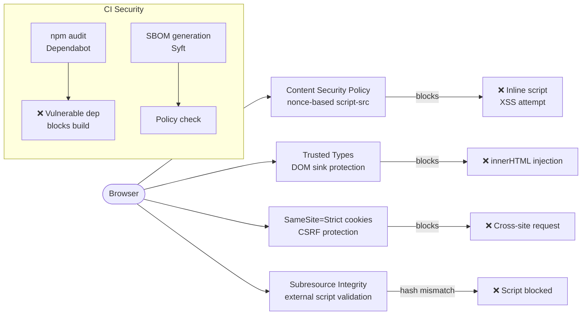

# Frontend Security

## Category

Frontend Architecture — Security

## Context

Frontend security defends the browser-side attack surface: XSS (Cross-Site Scripting), CSRF (Cross-Site Request Forgery), clickjacking, data leakage via third-party scripts, and dependency supply chain attacks. The primary defence layer is a strict Content Security Policy (CSP) combined with `Trusted Types`, `SameSite` cookies, and Subresource Integrity (SRI) for external assets.

### OWASP Frontend Security Threats

| Threat | Defence | Implementation |
|--------|---------|---------------|
| **XSS** | CSP `script-src 'nonce-...'`, Trusted Types | No `innerHTML`, validate URLs |
| **CSRF** | `SameSite=Strict` cookie, CSRF token for state-changing ops | Cookie config, `Origin` header check |
| **Clickjacking** | `X-Frame-Options: DENY` / CSP `frame-ancestors` | Response header |
| **Dependency injection** | Subresource Integrity (SRI) for CDN scripts | `integrity` attribute on `<script>` |
| **Supply chain** | `npm audit`, Dependabot, SBOM | CI gate |
| **Sensitive data in URL** | Never put tokens in query strings | Redirect handler clears `?code=` |
| **Open redirect** | Allowlist redirect URLs | Validate `returnTo` parameter |
| **localStorage token** | Access token in memory only | `sessionStorage` or in-memory Zustand |
| **Third-party script risk** | CSP restrict origins, SRI | Limit external scripts |

### Content Security Policy Directives

| Directive | Recommended value | Purpose |
|-----------|-----------------|---------|
| `default-src` | `'self'` | Base fallback |
| `script-src` | `'nonce-{random}'` | Allow only nonce-tagged scripts |
| `style-src` | `'self' 'nonce-{random}'` | No inline styles without nonce |
| `img-src` | `'self' data: https://cdn.example.com` | Trusted image origins |
| `connect-src` | `'self' https://api.example.com` | XHR/fetch destinations |
| `frame-ancestors` | `'none'` | Prevent clickjacking |
| `object-src` | `'none'` | Disable Flash/plugins |
| `base-uri` | `'self'` | Prevent base tag hijack |
| `require-trusted-types-for` | `'script'` | Enforce Trusted Types |

## Pros

- CSP with nonces eliminates inline XSS in CSP-aware browsers (Chrome, Firefox, Safari)
- `SameSite=Strict` cookies block CSRF without explicit CSRF tokens for same-origin apps
- Trusted Types prevents DOM XSS sinks (`innerHTML`, `eval`) at the platform level
- SRI ensures CDN-delivered scripts are not silently tampered with
- `npm audit` + Dependabot + Snyk catch known vulnerabilities before they reach production

## Cons

- Strict CSP breaks third-party integrations (analytics, chatbots) that use inline scripts
- Nonce-based CSP requires per-request nonce generation — incompatible with static HTML caching
- `require-trusted-types-for 'script'` breaks older React class components using `dangerouslySetInnerHTML`
- SRI hashes must be regenerated each time the CDN library version changes
- `SameSite=Strict` breaks OAuth/OIDC redirect flows — use `SameSite=Lax` for auth cookies

## Design Diagram



## Code Sample

### TypeScript — Next.js CSP nonce middleware

```typescript
// middleware.ts — generate per-request nonce for CSP
import { NextResponse, type NextRequest } from 'next/server';

function generateNonce(): string {
  const array = new Uint8Array(16);
  crypto.getRandomValues(array);
  return Buffer.from(array).toString('base64');
}

function buildCsp(nonce: string): string {
  const directives: Record<string, string> = {
    'default-src': "'self'",
    'script-src': `'self' 'nonce-${nonce}' 'strict-dynamic'`,
    'style-src': `'self' 'nonce-${nonce}'`,
    'img-src': "'self' data: https://cdn.example.com",
    'font-src': "'self' https://fonts.gstatic.com",
    'connect-src': `'self' ${process.env.NEXT_PUBLIC_API_URL ?? ''} https://o123456.ingest.sentry.io`,
    'frame-ancestors': "'none'",
    'base-uri': "'self'",
    'object-src': "'none'",
    'form-action': "'self'",
    'require-trusted-types-for': "'script'",
    'upgrade-insecure-requests': '',
  };

  return Object.entries(directives)
    .map(([directive, value]) => `${directive}${value ? ` ${value}` : ''}`)
    .join('; ');
}

export function middleware(request: NextRequest): NextResponse {
  const nonce = generateNonce();
  const csp = buildCsp(nonce);

  const response = NextResponse.next({
    request: {
      headers: new Headers({
        ...Object.fromEntries(request.headers),
        'x-nonce': nonce,   // available to Next.js layout via headers()
      }),
    },
  });

  // Security headers
  response.headers.set('Content-Security-Policy', csp);
  response.headers.set('X-Frame-Options', 'DENY');
  response.headers.set('X-Content-Type-Options', 'nosniff');
  response.headers.set('Referrer-Policy', 'strict-origin-when-cross-origin');
  response.headers.set('Permissions-Policy', 'camera=(), microphone=(), geolocation=()');
  response.headers.set(
    'Strict-Transport-Security',
    'max-age=31536000; includeSubDomains; preload',
  );

  return response;
}

export const config = { matcher: '/((?!_next/static|_next/image|favicon.ico).*)'  };
```

### TypeScript — Open redirect prevention

```typescript
// src/auth/redirectUtils.ts
const ALLOWED_REDIRECT_ORIGINS = new Set([
  'https://app.example.com',
  'https://admin.example.com',
]);

/**
 * Validates a returnTo URL to prevent open redirect attacks.
 * Only allows same-origin paths or whitelisted origins.
 */
export function sanitiseReturnTo(
  returnTo: string | null | undefined,
  currentOrigin: string,
): string {
  if (!returnTo) return '/';

  try {
    const url = new URL(returnTo, currentOrigin);

    // Allow same-origin relative paths
    if (url.origin === currentOrigin) {
      return url.pathname + url.search;
    }

    // Allow whitelisted cross-origin redirects
    if (ALLOWED_REDIRECT_ORIGINS.has(url.origin)) {
      return url.href;
    }
  } catch {
    // Invalid URL — fall through to default
  }

  console.warn(`[security] Blocked open redirect to: ${returnTo}`);
  return '/';
}
```

### TypeScript — Trusted Types policy for React

```typescript
// src/security/trustedTypes.ts
// Create a Trusted Types policy for controlled use of innerHTML
// (e.g., sanitised rich text from a markdown renderer)

export function createSanitisedHtmlPolicy(): TrustedTypePolicy | null {
  if (!window.trustedTypes) return null;

  return window.trustedTypes.createPolicy('acme-sanitised-html', {
    createHTML: (input: string): string => {
      // Only call this with output from DOMPurify or equivalent
      // Never call this with raw user input
      return input;
    },
  });
}

// Usage with DOMPurify:
// import DOMPurify from 'dompurify';
// const policy = createSanitisedHtmlPolicy();
// const clean = DOMPurify.sanitize(userHtml);
// const trusted = policy?.createHTML(clean) ?? clean;
// element.innerHTML = trusted as unknown as string;
```

### YAML — GitHub Actions security gates

```yaml
# .github/workflows/security.yml
name: Security

on:
  pull_request:
  schedule:
    - cron: '0 2 * * 1'  # weekly Monday 2am

jobs:
  audit:
    runs-on: ubuntu-latest
    steps:
      - uses: actions/checkout@v4
      - uses: actions/setup-node@v4
        with: { node-version: '20', cache: npm }
      - run: npm ci

      - name: npm audit (fail on high/critical)
        run: npm audit --audit-level=high

      - name: SBOM generation
        uses: anchore/sbom-action@v0
        with:
          path: .
          format: spdx-json
          output-file: sbom.spdx.json

      - name: Grype vulnerability scan on SBOM
        uses: anchore/scan-action@v3
        with:
          sbom: sbom.spdx.json
          fail-build: true
          severity-cutoff: high

      - name: Upload SBOM artifact
        uses: actions/upload-artifact@v4
        with:
          name: sbom
          path: sbom.spdx.json
```
