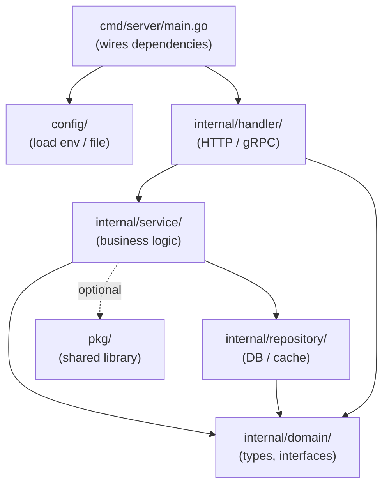

# Project Structure & Modules

## Category
Go, Project Layout, Modules, Build

## Context

Go enforces minimal structure but the community has converged on clear conventions. The **Go module system** (`go mod`) resolves dependencies reproducibly via `go.sum` checksums. A **workspace** (`go work`) allows developing multiple modules together without replace directives.

### Standard project layout

```
myservice/
├── cmd/
│   └── server/
│       └── main.go          # Entry point — thin; only wires up and calls run()
├── internal/                # Private packages — not importable by external modules
│   ├── handler/
│   ├── service/
│   ├── repository/
│   └── domain/
├── pkg/                     # Public library packages (only if you intend external reuse)
├── api/                     # Protobuf / OpenAPI specs
├── config/                  # Config structs loaded at startup
├── migrations/              # SQL migration files
├── scripts/                 # Build / CI helper scripts
├── Makefile
├── Dockerfile
├── go.mod
└── go.sum
```

| Directory | Purpose |
|-----------|---------|
| `cmd/` | One subdirectory per binary; `main.go` only initialises |
| `internal/` | Go enforces this is private to the module — use freely |
| `pkg/` | Only needed for reusable library code shared across repos |
| `api/` | Contract definitions (proto, OpenAPI YAML) |
| `config/` | Typed config structs; loaded once at startup |

### Module naming

```
module github.com/myorg/myservice

go 1.23
```

- Use the full VCS path as the module name — even for private modules.
- Require Go ≥1.21 to use the standard library `log/slog`.

### Build tags (conditional compilation)

```go
//go:build integration

package repository_test
```

Run with: `go test -tags integration ./...`

---

## Pros

- `internal/` enforced at compile time — accidental leakage of implementation details is impossible.
- `go.sum` pins every dependency to a content hash — reproducible builds without a lockfile format separate from the module system.
- A single `go build ./cmd/server` produces a fully static binary — no runtime dependencies.
- `go work` enables multi-module monorepos without publishing intermediate modules to a registry.
- Build tags enable clean separation of unit and integration tests without separate directories.

---

## Cons

- No enforced convention for `pkg/` vs `internal/` — teams must decide upfront and be consistent.
- `go.work` workspace files should not be committed to CI environments that download fresh modules.
- Circular imports between packages are a compile error — plan the package dependency graph early.
- Deep nesting of `internal/` sub-packages increases import path verbosity.
- The `vendor/` directory (for offline builds) duplicates dependencies and must be kept in sync with `go.sum`.

---

## Design Diagram



---

## Code Sample

### Initialise a new module

```bash
mkdir myservice && cd myservice
go mod init github.com/myorg/myservice

# Add a dependency
go get github.com/go-chi/chi/v5@latest

# Tidy — remove unused, add missing
go mod tidy

# Vendor (for air-gapped CI)
go mod vendor
```

### Multi-module workspace (go work)

```bash
# Root of the monorepo
go work init
go work use ./myservice
go work use ./shared-lib

# gowork file is created:
# go 1.23
# use (
#     ./myservice
#     ./shared-lib
# )
```

### cmd/server/main.go — thin entry point

```go
package main

import (
    "context"
    "log/slog"
    "os"
    "os/signal"
    "syscall"

    "github.com/myorg/myservice/config"
    "github.com/myorg/myservice/internal/handler"
    "github.com/myorg/myservice/internal/repository"
    "github.com/myorg/myservice/internal/service"
)

func main() {
    cfg := config.Load()

    logger := slog.New(slog.NewJSONHandler(os.Stdout, &slog.HandlerOptions{
        Level: slog.LevelInfo,
    }))
    slog.SetDefault(logger)

    db := repository.NewDB(cfg.DatabaseURL)
    repo := repository.NewOrderRepo(db)
    svc := service.NewOrderService(repo, logger)
    srv := handler.NewServer(cfg, svc, logger)

    ctx, stop := signal.NotifyContext(context.Background(), syscall.SIGINT, syscall.SIGTERM)
    defer stop()

    if err := srv.Run(ctx); err != nil {
        slog.Error("server exited", "error", err)
        os.Exit(1)
    }
}
```

### Makefile — common targets

```makefile
.PHONY: build test lint tidy docker

BINARY := bin/server
MODULE := github.com/myorg/myservice

build:
	go build -o $(BINARY) ./cmd/server

test:
	go test -race ./...

integration:
	go test -race -tags integration ./...

lint:
	golangci-lint run ./...

tidy:
	go mod tidy

generate:
	go generate ./...

docker:
	docker build -t myservice:local .
```

---

## Related

- [06 — HTTP Services](./06-http-services.md) — `cmd/server` wires the HTTP handler
- [12 — Dependency Injection](./12-dependency-injection.md) — `main.go` is the composition root
- [05 — Testing](./05-testing.md) — build tags separate unit and integration tests
