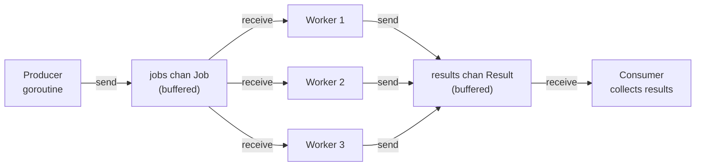

# Concurrency — Goroutines & Channels

## Category
Go, Concurrency, Goroutines, Channels

## Context

Go's concurrency model is built on **goroutines** (lightweight cooperative threads, ~2 KB stack) and **channels** (typed, synchronised message queues). The runtime multiplexes goroutines onto OS threads via M:N scheduling.

**Don't communicate by sharing memory; share memory by communicating.** — Go proverb

| Primitive | Use case |
|-----------|---------|
| `go func()` | Fire a goroutine |
| `chan T` | Communicate between goroutines |
| `sync.Mutex` / `sync.RWMutex` | Protect shared state when channels are awkward |
| `sync.WaitGroup` | Wait for a fixed set of goroutines |
| `sync.Once` | Initialise something exactly once |
| `sync.Map` | Concurrent read-heavy map |
| `errgroup.Group` | Wait for goroutines and collect the first error |
| `context.Context` | Propagate cancellation and deadlines |

### Worker pool pattern

Limit parallelism to avoid overwhelming downstream systems or exhausting file descriptors. A buffered channel acts as the semaphore.

### Pipeline pattern

Each stage reads from an input channel and writes to an output channel. Cancellation flows via `context.Done()`.

---

## Pros

- Goroutines are cheap — 10 000 concurrent goroutines is normal; 1 000 000 is achievable.
- Channels eliminate shared memory races for the common producer-consumer pattern.
- `errgroup` (golang.org/x/sync) provides idiomatic fan-out with error propagation and cancellation.
- The race detector (`go test -race`) catches data races at runtime during testing.
- The goroutine scheduler is pre-emptive since Go 1.14 — no cooperative yield needed.

---

## Cons

- Goroutine leaks (a goroutine blocked on a channel nobody reads) accumulate silently — always provide a cancellation path.
- Channels are FIFO but not LIFO — they are not a priority queue.
- `sync.Map` has worse performance than a `map` + `sync.RWMutex` for write-heavy workloads.
- Shared mutable state protected by a Mutex can still cause deadlocks if locking order is inconsistent.
- `select` with a `default` arm becomes a busy-wait spin loop — avoid unless intentional polling.

---

## Design Diagram



---

## Code Sample

### Worker pool with bounded parallelism

```go
package worker

import (
    "context"
    "fmt"
)

type Job struct {
    ID   int
    Data string
}

type Result struct {
    JobID  int
    Output string
    Err    error
}

// Pool executes process concurrently using workerCount goroutines.
// Returns when all jobs are processed or ctx is cancelled.
func Pool(ctx context.Context, jobs []Job, workerCount int, process func(Job) Result) []Result {
    jobCh := make(chan Job, len(jobs))
    resultCh := make(chan Result, len(jobs))

    // Start workers
    for range workerCount {
        go func() {
            for job := range jobCh {
                select {
                case <-ctx.Done():
                    resultCh <- Result{JobID: job.ID, Err: ctx.Err()}
                default:
                    resultCh <- process(job)
                }
            }
        }()
    }

    // Send all jobs then close to signal workers to exit
    for _, j := range jobs {
        jobCh <- j
    }
    close(jobCh)

    // Collect results
    results := make([]Result, 0, len(jobs))
    for range jobs {
        results = append(results, <-resultCh)
    }
    return results
}
```

### errgroup — fan-out with error propagation

```go
package main

import (
    "context"
    "fmt"
    "net/http"

    "golang.org/x/sync/errgroup"
)

func fetchAll(ctx context.Context, urls []string) ([]string, error) {
    g, ctx := errgroup.WithContext(ctx)
    results := make([]string, len(urls))

    for i, url := range urls {
        i, url := i, url  // capture loop vars (not needed in Go 1.22+)
        g.Go(func() error {
            req, err := http.NewRequestWithContext(ctx, http.MethodGet, url, nil)
            if err != nil {
                return fmt.Errorf("build request %s: %w", url, err)
            }
            resp, err := http.DefaultClient.Do(req)
            if err != nil {
                return fmt.Errorf("fetch %s: %w", url, err)
            }
            defer resp.Body.Close()
            results[i] = resp.Status
            return nil
        })
    }

    if err := g.Wait(); err != nil {
        return nil, err
    }
    return results, nil
}
```

### select — timeout, cancel, and default

```go
func doWithTimeout(ctx context.Context, work func() (string, error)) (string, error) {
    resultCh := make(chan string, 1)
    errCh := make(chan error, 1)

    go func() {
        res, err := work()
        if err != nil {
            errCh <- err
        } else {
            resultCh <- res
        }
    }()

    select {
    case res := <-resultCh:
        return res, nil
    case err := <-errCh:
        return "", err
    case <-ctx.Done():
        return "", fmt.Errorf("work cancelled: %w", ctx.Err())
    }
}
```

### sync primitives — RWMutex cache

```go
type Cache[K comparable, V any] struct {
    mu    sync.RWMutex
    store map[K]V
}

func (c *Cache[K, V]) Get(key K) (V, bool) {
    c.mu.RLock()
    defer c.mu.RUnlock()
    v, ok := c.store[key]
    return v, ok
}

func (c *Cache[K, V]) Set(key K, value V) {
    c.mu.Lock()
    defer c.mu.Unlock()
    c.store[key] = value
}
```

### Goroutine leak prevention — always drain or signal

```go
// BAD: goroutine leaks if nobody reads results after ctx cancelled
go func() {
    results <- doWork()  // blocks forever if caller stopped reading
}()

// GOOD: buffered channel or select with ctx.Done()
go func() {
    res := doWork()
    select {
    case results <- res:
    case <-ctx.Done():
    }
}()
```

---

## Related

- [08 — Context](./08-context.md) — `context.Context` cancels goroutines across call stacks
- [13 — Performance & Profiling](./13-performance-profiling.md) — goroutine count, scheduler traces, race detector
- [06 — HTTP Services](./06-http-services.md) — each incoming HTTP request runs in its own goroutine
