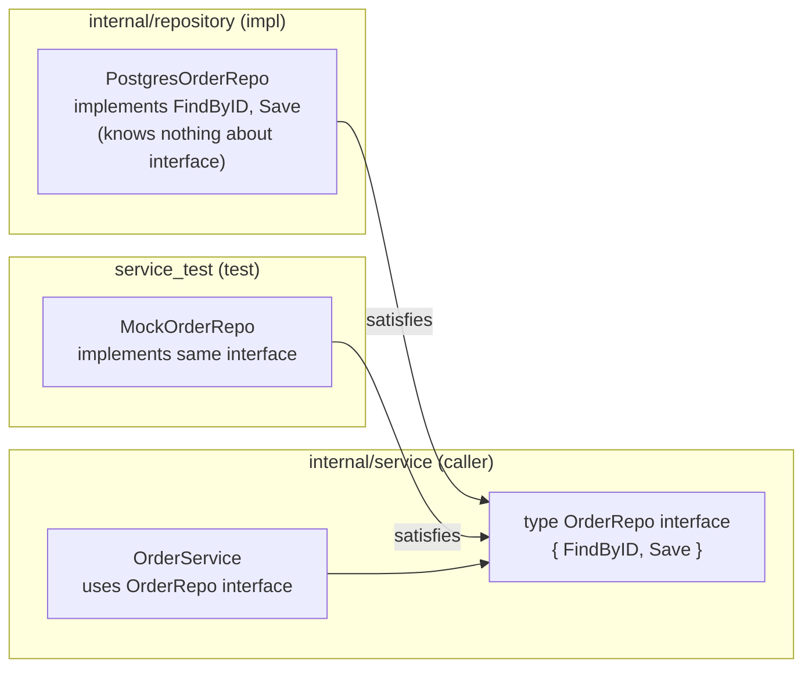

# Interfaces & Composition

## Category
Go, Interfaces, Composition, Design

## Context

Go uses **structural typing** (duck typing): a type satisfies an interface simply by implementing its methods — no `implements` keyword. This makes interfaces lightweight and powerful.

**Design rule**: define interfaces where they are *used*, not where they are *implemented*. A caller package declares the interface it needs; the implementation package knows nothing about it.

| Concept | Description |
|---------|-------------|
| Interface | Set of method signatures; satisfied implicitly |
| Embedding | Compose interfaces or structs — no inheritance |
| Functional options | Extend constructors without breaking callers |
| `io.Reader` / `io.Writer` | The canonical composition example in stdlib |
| Empty interface `any` | Accepts any type — avoid over-use |

### Interface sizing

- **Small interfaces win.** Prefer `io.Reader` (1 method) over a 10-method mega-interface.
- The Go proverb: *"The bigger the interface, the weaker the abstraction."*
- Split large interfaces at call sites: accept `interface{ Read([]byte) (int, error) }` not a 5-method struct.

### Embedding vs inheritance

Go has no inheritance. Embedding promotes fields and methods — and the embedded type can be replaced (e.g., for mocking) if it is an interface type.

---

## Pros

- No explicit `implements` — any package can satisfy any interface without modifying the original type.
- Interfaces are the primary mechanism for testability — inject an interface, mock in tests.
- Struct embedding composes behaviour without deep inheritance trees.
- Functional options (`WithTimeout`, `WithLogger`) allow optional parameters without breaking API on addition.
- Small interfaces (`io.Reader`, `io.Writer`, `fmt.Stringer`) compose across the entire stdlib.

---

## Cons

- Implicit satisfaction makes it harder to discover which types implement an interface (no IDE jump-to-implementors without tooling).
- Interface method sets on pointer vs value receivers are subtly different — `*T` satisfies an interface requiring pointer receivers; `T` does not.
- Embedding a concrete type (not an interface) makes the embedded type impossible to substitute — prefer embedding interfaces.
- Over-interfacing every type creates abstraction soup with no tangible benefit.
- `any` (empty interface) loses type safety — use generics or typed union types instead.

---

## Design Diagram



---

## Code Sample

### Interface defined at the call site

```go
// internal/service/order.go — caller defines what it needs
package service

import (
    "context"
    "fmt"

    "github.com/myorg/myservice/internal/domain"
)

// OrderRepo is declared HERE (in the consumer), not in the repository package.
type OrderRepo interface {
    FindByID(ctx context.Context, id string) (*domain.Order, error)
    Save(ctx context.Context, order *domain.Order) error
}

type OrderService struct {
    repo   OrderRepo
    logger *slog.Logger
}

func NewOrderService(repo OrderRepo, logger *slog.Logger) *OrderService {
    return &OrderService{repo: repo, logger: logger}
}

func (s *OrderService) GetOrder(ctx context.Context, id string) (*domain.Order, error) {
    order, err := s.repo.FindByID(ctx, id)
    if err != nil {
        return nil, fmt.Errorf("get order %s: %w", id, err)
    }
    return order, nil
}
```

### Functional options — extensible constructors

```go
// internal/handler/server.go
package handler

import (
    "net/http"
    "time"
)

type Server struct {
    addr         string
    readTimeout  time.Duration
    writeTimeout time.Duration
    logger       *slog.Logger
}

type Option func(*Server)

func WithReadTimeout(d time.Duration) Option {
    return func(s *Server) { s.readTimeout = d }
}

func WithWriteTimeout(d time.Duration) Option {
    return func(s *Server) { s.writeTimeout = d }
}

func WithLogger(l *slog.Logger) Option {
    return func(s *Server) { s.logger = l }
}

func NewServer(addr string, opts ...Option) *Server {
    s := &Server{
        addr:         addr,
        readTimeout:  5 * time.Second,
        writeTimeout: 10 * time.Second,
        logger:       slog.Default(),
    }
    for _, opt := range opts {
        opt(s)
    }
    return s
}
```

### Interface embedding — compose capabilities

```go
// Compose reader + writer into a single interface
type ReadWriter interface {
    io.Reader
    io.Writer
}

// Embed an interface field for substitutability
type LoggingReader struct {
    r      io.Reader    // interface — can be replaced in tests
    logger *slog.Logger
}

func (lr *LoggingReader) Read(p []byte) (int, error) {
    n, err := lr.r.Read(p)
    lr.logger.Debug("read", "bytes", n, "error", err)
    return n, err
}
```

### Verify interface satisfaction at compile time

```go
// Place in the implementation file — fails to compile if interface not satisfied
var _ service.OrderRepo = (*PostgresOrderRepo)(nil)
```

### Accept interfaces, return structs

```go
// GOOD: accept an interface, so callers can pass any implementation
func ProcessOrders(ctx context.Context, repo OrderRepo) error { ... }

// GOOD: return a concrete type — callers get full access, no artificial restriction
func NewOrderService(repo OrderRepo) *OrderService { ... }
```

---

## Related

- [05 — Testing](./05-testing.md) — interfaces enable mock injection; `mockery` generates mocks from interface definitions
- [12 — Dependency Injection](./12-dependency-injection.md) — DI frameworks rely on interface-based design
- [07 — Generics](./07-generics.md) — interface constraints in generics (type sets)
