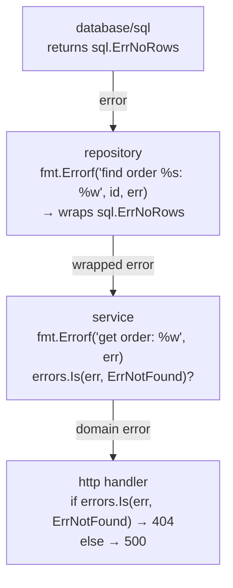

# Error Handling

## Category
Go, Error Handling, Reliability

## Context

Go treats errors as values — `error` is a built-in interface with a single `Error() string` method. Error handling is explicit and imperative: functions return `(value, error)` and callers check immediately.

| Pattern | When to use |
|---------|-------------|
| Sentinel errors | Compare identity — `errors.Is(err, ErrNotFound)` |
| Custom error types | Carry structured context — `errors.As(err, &e)` |
| Wrapping with `%w` | Add context while preserving unwrap chain |
| `errors.Join` | Aggregate multiple errors (Go 1.20+) |
| `panic` / `recover` | Programming errors only — never for flow control |

### Wrapping rules

- Wrap at every layer boundary: `fmt.Errorf("save order %s: %w", id, err)`.
- Do NOT wrap if you are just re-returning a sentinel — wrapping changes identity.
- The error message should read as a colon-separated call chain: `get order: find by id: sql: no rows`.

---

## Pros

- Explicit error handling forces callers to acknowledge failure paths — no hidden exceptions.
- `errors.Is` and `errors.As` work through arbitrary wrap chains — one sentinel type, checked anywhere.
- Wrapping with `%w` preserves the full original error for logging without losing context.
- `errors.Join` allows accumulating validation errors without a third-party library.
- No runtime exception overhead — errors are just values allocated on the heap only when needed.

---

## Cons

- Repetitive `if err != nil` boilerplate — Go 2 proposals aim to address this.
- Forgetting to wrap an error loses the call context (context-free `sql: no rows` bubbles up unhelpfully).
- Mixing sentinel errors and structured types in the same package is inconsistent.
- `panic` used across package boundaries is considered rude — only `recover` it in a top-level handler.
- Error strings that start with capital letters or end with punctuation violate [Go style](https://google.github.io/styleguide/go/decisions#error-strings).

---

## Design Diagram



---

## Code Sample

### Sentinel errors

```go
// internal/domain/errors.go
package domain

import "errors"

// Sentinel errors — use errors.Is() to match these.
// Do NOT wrap these when returning; wrap the sentinel once at the repo layer.
var (
    ErrNotFound   = errors.New("not found")
    ErrConflict   = errors.New("conflict")
    ErrValidation = errors.New("validation failed")
)
```

### Custom error type with structured context

```go
// ValidationError carries the field that failed validation.
type ValidationError struct {
    Field   string
    Message string
}

func (e *ValidationError) Error() string {
    return fmt.Sprintf("validation error: %s — %s", e.Field, e.Message)
}

// Callers use errors.As to extract structured context:
var ve *ValidationError
if errors.As(err, &ve) {
    slog.Warn("validation failed", "field", ve.Field, "message", ve.Message)
}
```

### Wrapping at layer boundaries

```go
// repository layer — wraps DB error and maps to domain sentinel
func (r *OrderRepo) FindByID(ctx context.Context, id string) (*domain.Order, error) {
    var order domain.Order
    err := r.db.QueryRowContext(ctx, `SELECT ... FROM orders WHERE id = $1`, id).
        Scan(&order.ID, &order.Status)
    if errors.Is(err, sql.ErrNoRows) {
        return nil, fmt.Errorf("find order %s: %w", id, domain.ErrNotFound)
    }
    if err != nil {
        return nil, fmt.Errorf("find order %s: %w", id, err)
    }
    return &order, nil
}

// service layer — adds context without changing the sentinel
func (s *OrderService) GetOrder(ctx context.Context, id string) (*domain.Order, error) {
    order, err := s.repo.FindByID(ctx, id)
    if err != nil {
        return nil, fmt.Errorf("get order: %w", err)
    }
    return order, nil
}

// handler layer — maps domain sentinel to HTTP status
func (h *Handler) GetOrder(w http.ResponseWriter, r *http.Request) {
    id := chi.URLParam(r, "id")
    order, err := h.svc.GetOrder(r.Context(), id)
    if err != nil {
        switch {
        case errors.Is(err, domain.ErrNotFound):
            http.Error(w, "order not found", http.StatusNotFound)
        default:
            slog.ErrorContext(r.Context(), "get order", "error", err)
            http.Error(w, "internal error", http.StatusInternalServerError)
        }
        return
    }
    renderJSON(w, order)
}
```

### Accumulating multiple errors (Go 1.20+)

```go
func validateOrder(o *domain.Order) error {
    var errs []error
    if o.ID == "" {
        errs = append(errs, &ValidationError{Field: "id", Message: "required"})
    }
    if o.Amount <= 0 {
        errs = append(errs, &ValidationError{Field: "amount", Message: "must be positive"})
    }
    return errors.Join(errs...)  // nil if errs is empty
}
```

### panic / recover — top-level recovery only

```go
// Middleware: recover from accidental panics in handlers
func recoveryMiddleware(next http.Handler) http.Handler {
    return http.HandlerFunc(func(w http.ResponseWriter, r *http.Request) {
        defer func() {
            if rec := recover(); rec != nil {
                slog.ErrorContext(r.Context(), "panic recovered",
                    "panic", rec,
                    "stack", debug.Stack(),
                )
                http.Error(w, "internal server error", http.StatusInternalServerError)
            }
        }()
        next.ServeHTTP(w, r)
    })
}
```

---

## Related

- [06 — HTTP Services](./06-http-services.md) — error-to-status-code mapping in HTTP handlers
- [11 — gRPC Services](./11-grpc-services.md) — `status.Errorf(codes.NotFound, ...)` for gRPC error codes
- [05 — Testing](./05-testing.md) — test sentinel errors with `errors.Is` asserts
