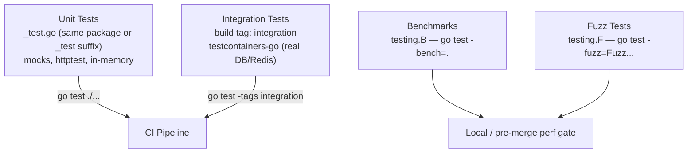

# Testing & Benchmarking

## Category
Go, Testing, Quality, Benchmarking

## Context

Go's `testing` package is part of the standard library. Tests live alongside production code in `_test.go` files. The ecosystem adds `testify` for assertions, `mockery` for generated mocks, `testcontainers-go` for real database tests, and the built-in fuzzer for input validation.

| Tool | Purpose |
|------|---------|
| `testing.T` | Standard test runner |
| `testing.B` | Benchmark runner |
| `testing.F` | Fuzz test runner (Go 1.18+) |
| `testify/assert` | Fluent assertions |
| `testify/require` | Fail-fast assertions (stops test on first failure) |
| `testify/mock` | Hand-rolled or generated mocks |
| `mockery` | Generates mock structs from interface definitions |
| `testcontainers-go` | Spins up real Docker containers for integration tests |
| `httptest` | In-process HTTP server for handler tests |

### Test categories (by build tag convention)

```
go test ./...               # unit tests (no tag)
go test -tags integration ./...   # integration tests (real DB)
```

---

## Pros

- Table-driven tests reduce boilerplate — one test function covers N cases with clear naming.
- `httptest.NewRecorder()` + `httptest.NewServer()` test HTTP handlers without a running server.
- Built-in race detector (`go test -race`) catches data races in concurrent code.
- `testing.Short()` flag lets CI skip slow tests: `if testing.Short() { t.Skip() }`.
- `testcontainers-go` brings real infrastructure (Postgres, Redis, Kafka) to integration tests with automatic cleanup.
- Fuzz testing integrates with the test runner — seed corpus + coverage-guided mutation.

---

## Cons

- `testify` assertions don't halt the test by default — use `require` (not `assert`) when subsequent steps depend on earlier ones.
- Generated mocks (mockery) must be re-generated when interfaces change — easy to forget in code review.
- `httptest.NewServer` starts a real TCP server — do not use inside tight benchmark loops.
- `testcontainers-go` requires Docker — unavailable in some CI environments.
- Table-driven tests can become unmaintainable when test cases have wildly different setups.

---

## Design Diagram



---

## Code Sample

### Table-driven unit test

```go
// internal/service/order_test.go
package service_test

import (
    "context"
    "errors"
    "testing"

    "github.com/stretchr/testify/assert"
    "github.com/stretchr/testify/require"

    "github.com/myorg/myservice/internal/domain"
    "github.com/myorg/myservice/internal/service"
    "github.com/myorg/myservice/internal/service/mocks"
)

func TestGetOrder(t *testing.T) {
    tests := []struct {
        name    string
        id      string
        mockFn  func(*mocks.OrderRepo)
        want    *domain.Order
        wantErr error
    }{
        {
            name: "returns order when found",
            id:   "order-1",
            mockFn: func(m *mocks.OrderRepo) {
                m.On("FindByID", context.Background(), "order-1").
                    Return(&domain.Order{ID: "order-1", Status: "pending"}, nil)
            },
            want: &domain.Order{ID: "order-1", Status: "pending"},
        },
        {
            name: "returns ErrNotFound when missing",
            id:   "order-99",
            mockFn: func(m *mocks.OrderRepo) {
                m.On("FindByID", context.Background(), "order-99").
                    Return(nil, domain.ErrNotFound)
            },
            wantErr: domain.ErrNotFound,
        },
    }

    for _, tc := range tests {
        t.Run(tc.name, func(t *testing.T) {
            repo := mocks.NewOrderRepo(t)
            tc.mockFn(repo)

            svc := service.NewOrderService(repo, slog.Default())
            got, err := svc.GetOrder(context.Background(), tc.id)

            if tc.wantErr != nil {
                require.Error(t, err)
                assert.True(t, errors.Is(err, tc.wantErr))
                return
            }
            require.NoError(t, err)
            assert.Equal(t, tc.want, got)
        })
    }
}
```

### HTTP handler test with httptest

```go
func TestGetOrderHandler(t *testing.T) {
    repo := mocks.NewOrderRepo(t)
    repo.On("FindByID", mock.Anything, "order-1").
        Return(&domain.Order{ID: "order-1", Status: "pending"}, nil)

    svc := service.NewOrderService(repo, slog.Default())
    h := handler.NewServer(":8080", svc)

    req := httptest.NewRequest(http.MethodGet, "/orders/order-1", nil)
    w := httptest.NewRecorder()

    h.ServeHTTP(w, req)

    assert.Equal(t, http.StatusOK, w.Code)
    assert.Contains(t, w.Body.String(), `"order-1"`)
}
```

### mockery — generate mocks from interfaces

```bash
# .mockery.yaml
with-expecter: true
packages:
  github.com/myorg/myservice/internal/service:
    interfaces:
      OrderRepo:
        config:
          dir: "internal/service/mocks"

# Generate:
go run github.com/vektra/mockery/v2@latest
```

### Integration test with testcontainers-go

```go
//go:build integration

package repository_test

import (
    "context"
    "testing"

    "github.com/stretchr/testify/require"
    "github.com/testcontainers/testcontainers-go/modules/postgres"

    "github.com/myorg/myservice/internal/repository"
)

func TestOrderRepo_FindByID_Integration(t *testing.T) {
    ctx := context.Background()

    pgContainer, err := postgres.RunContainer(ctx,
        postgres.WithDatabase("testdb"),
        postgres.WithUsername("user"),
        postgres.WithPassword("password"),
    )
    require.NoError(t, err)
    t.Cleanup(func() { pgContainer.Terminate(ctx) })

    dsn, err := pgContainer.ConnectionString(ctx, "sslmode=disable")
    require.NoError(t, err)

    repo, err := repository.NewOrderRepo(dsn)
    require.NoError(t, err)

    order, err := repo.FindByID(ctx, "non-existent")
    require.ErrorIs(t, err, domain.ErrNotFound)
    require.Nil(t, order)
}
```

### Benchmark

```go
func BenchmarkOrderService_GetOrder(b *testing.B) {
    repo := mocks.NewOrderRepo(b)
    repo.On("FindByID", mock.Anything, "order-1").
        Return(&domain.Order{ID: "order-1"}, nil)
    svc := service.NewOrderService(repo, slog.Default())

    b.ResetTimer()
    for b.Loop() {   // Go 1.24+ preferred over b.N
        svc.GetOrder(context.Background(), "order-1")
    }
}
```

### Fuzz test — input validation

```go
func FuzzParseOrderID(f *testing.F) {
    // Seed corpus
    f.Add("order-123")
    f.Add("")
    f.Add("order-" + strings.Repeat("a", 1000))

    f.Fuzz(func(t *testing.T, input string) {
        // Must not panic regardless of input
        id, err := domain.ParseOrderID(input)
        if err != nil {
            return
        }
        // Round-trip: parsed ID must produce same string
        assert.Equal(t, input, id.String())
    })
}
```

---

## Related

- [03 — Interfaces & Composition](./03-interfaces-composition.md) — interfaces enable mock injection
- [04 — Error Handling](./04-error-handling.md) — test sentinel errors with `errors.Is`
- [09 — Database Patterns](./09-database-patterns.md) — testcontainers-go for real DB integration tests
