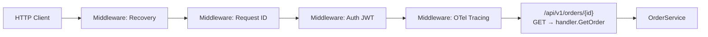

# HTTP Services

## Category
Go, HTTP, REST, Middleware

## Context

Go's `net/http` standard library is production-ready for building HTTP services. Third-party routers (`chi`, `gin`, `echo`) add middleware composition, URL parameter extraction, and request validation while staying close to `net/http` conventions.

| Library | Style | Best for |
|---------|-------|---------|
| `net/http` (stdlib) | Minimal | Simple APIs, no routing complexity |
| `chi` | Lightweight, idiomatic | REST APIs; composes `net/http` middleware |
| `gin` | Full-featured | Teams familiar with Express-style routing |
| `echo` | High-perf | JSON APIs with baked-in validation |
| `fiber` | Express clone | High-throughput; not `net/http`-compatible |

**Middleware** functions wrap `http.Handler` to add cross-cutting concerns (logging, recovery, auth, tracing) without modifying business logic.

**Preferred stack for new services**: `chi` + standard `net/http` for maximum compatibility with the `net/http` ecosystem (middleware, test helpers, OpenTelemetry instrumentation).

---

## Pros

- `net/http` handlers are just functions — testable with `httptest.NewRecorder()` without a running server.
- `chi` middleware composes cleanly with `r.Use()` and subtree routers isolate middleware scope.
- `http.Server` exposes `ReadTimeout`, `WriteTimeout`, `IdleTimeout` — set them; zero values have no timeout.
- Graceful shutdown via `srv.Shutdown(ctx)` drains in-flight requests before exit.
- The `context.Context` embedded in every `*http.Request` propagates cancellation, tracing, and auth tokens automatically.

---

## Cons

- `net/http` has no built-in URL parameter extraction (`{id}` patterns) — a router is needed for real REST APIs.
- Default HTTP client has no timeout — always create a custom `http.Client` with `Timeout` set.
- `chi` does not support request validation out of the box — add `go-playground/validator` separately.
- `gin` and `echo` return concrete types instead of `http.Handler` — middleware from the `net/http` ecosystem is not directly compatible.
- Large request bodies are not limited by default — always wrap with `http.MaxBytesReader`.

---

## Design Diagram



---

## Code Sample

### Server with graceful shutdown

```go
// internal/handler/server.go
package handler

import (
    "context"
    "fmt"
    "net/http"
    "time"

    "github.com/go-chi/chi/v5"
    "github.com/go-chi/chi/v5/middleware"
)

type Server struct {
    srv *http.Server
}

func NewServer(addr string, orderSvc OrderService) *Server {
    r := chi.NewRouter()

    // Global middleware — applied to every request
    r.Use(middleware.RequestID)
    r.Use(middleware.RealIP)
    r.Use(middleware.Recoverer)
    r.Use(middleware.Timeout(30 * time.Second))

    h := &OrderHandler{svc: orderSvc}

    r.Route("/api/v1", func(r chi.Router) {
        r.Route("/orders", func(r chi.Router) {
            r.Get("/{id}", h.GetOrder)
            r.Post("/", h.CreateOrder)
        })
    })

    return &Server{
        srv: &http.Server{
            Addr:         addr,
            Handler:      r,
            ReadTimeout:  5 * time.Second,
            WriteTimeout: 30 * time.Second,
            IdleTimeout:  120 * time.Second,
        },
    }
}

// Run starts the server and blocks until ctx is cancelled, then gracefully shuts down.
func (s *Server) Run(ctx context.Context) error {
    errCh := make(chan error, 1)
    go func() {
        if err := s.srv.ListenAndServe(); err != nil && err != http.ErrServerClosed {
            errCh <- err
        }
    }()

    select {
    case err := <-errCh:
        return fmt.Errorf("server error: %w", err)
    case <-ctx.Done():
        shutdownCtx, cancel := context.WithTimeout(context.Background(), 10*time.Second)
        defer cancel()
        return s.srv.Shutdown(shutdownCtx)
    }
}
```

### Handler — decode, validate, call service, encode

```go
// internal/handler/order.go
package handler

import (
    "encoding/json"
    "errors"
    "log/slog"
    "net/http"

    "github.com/go-chi/chi/v5"
    "github.com/go-playground/validator/v10"

    "github.com/myorg/myservice/internal/domain"
)

var validate = validator.New()

type CreateOrderRequest struct {
    CustomerID string  `json:"customer_id" validate:"required,uuid"`
    Amount     float64 `json:"amount"      validate:"required,gt=0"`
    Currency   string  `json:"currency"    validate:"required,iso4217"`
}

type OrderHandler struct {
    svc OrderService
}

func (h *OrderHandler) GetOrder(w http.ResponseWriter, r *http.Request) {
    id := chi.URLParam(r, "id")
    order, err := h.svc.GetOrder(r.Context(), id)
    if err != nil {
        switch {
        case errors.Is(err, domain.ErrNotFound):
            writeError(w, http.StatusNotFound, "order not found")
        default:
            slog.ErrorContext(r.Context(), "get order", "error", err)
            writeError(w, http.StatusInternalServerError, "internal error")
        }
        return
    }
    writeJSON(w, http.StatusOK, order)
}

func (h *OrderHandler) CreateOrder(w http.ResponseWriter, r *http.Request) {
    r.Body = http.MaxBytesReader(w, r.Body, 1<<20) // 1 MB limit

    var req CreateOrderRequest
    if err := json.NewDecoder(r.Body).Decode(&req); err != nil {
        writeError(w, http.StatusBadRequest, "invalid JSON")
        return
    }
    if err := validate.Struct(req); err != nil {
        writeError(w, http.StatusUnprocessableEntity, err.Error())
        return
    }

    order, err := h.svc.CreateOrder(r.Context(), req.CustomerID, req.Amount, req.Currency)
    if err != nil {
        slog.ErrorContext(r.Context(), "create order", "error", err)
        writeError(w, http.StatusInternalServerError, "internal error")
        return
    }
    writeJSON(w, http.StatusCreated, order)
}

func writeJSON(w http.ResponseWriter, status int, v any) {
    w.Header().Set("Content-Type", "application/json")
    w.WriteHeader(status)
    json.NewEncoder(w).Encode(v)
}

func writeError(w http.ResponseWriter, status int, msg string) {
    writeJSON(w, status, map[string]string{"error": msg})
}
```

### Custom middleware — structured request logging

```go
func RequestLogger(logger *slog.Logger) func(http.Handler) http.Handler {
    return func(next http.Handler) http.Handler {
        return http.HandlerFunc(func(w http.ResponseWriter, r *http.Request) {
            ww := middleware.NewWrapResponseWriter(w, r.ProtoMajor)
            start := time.Now()
            next.ServeHTTP(ww, r)
            logger.InfoContext(r.Context(), "request",
                "method", r.Method,
                "path", r.URL.Path,
                "status", ww.Status(),
                "bytes", ww.BytesWritten(),
                "duration_ms", time.Since(start).Milliseconds(),
                "request_id", middleware.GetReqID(r.Context()),
            )
        })
    }
}
```

### Outbound HTTP client — always set timeout

```go
var httpClient = &http.Client{
    Timeout: 10 * time.Second,
    Transport: &http.Transport{
        MaxIdleConns:        100,
        MaxIdleConnsPerHost: 10,
        IdleConnTimeout:     90 * time.Second,
    },
}

func callDownstream(ctx context.Context, url string) error {
    req, err := http.NewRequestWithContext(ctx, http.MethodGet, url, nil)
    if err != nil {
        return fmt.Errorf("build request: %w", err)
    }
    resp, err := httpClient.Do(req)
    if err != nil {
        return fmt.Errorf("call downstream: %w", err)
    }
    defer resp.Body.Close()
    // Read and discard body to allow connection reuse
    io.Copy(io.Discard, resp.Body)
    return nil
}
```

---

## Related

- [08 — Context](./08-context.md) — every `*http.Request` carries a `context.Context`
- [04 — Error Handling](./04-error-handling.md) — error-to-status mapping in handlers
- [10 — Observability](./10-observability.md) — OpenTelemetry HTTP middleware instruments every request
- [15 — Security Patterns](./15-security-patterns.md) — JWT auth middleware, rate limiting, TLS config
