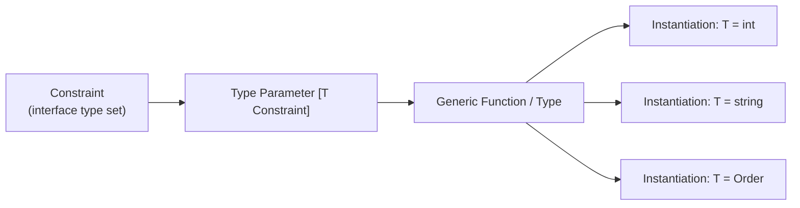

# Generics

## Category
Go, Generics, Type Parameters, Go 1.18+

## Context

Go 1.18 introduced **generics** via type parameters. They eliminate boilerplate for data structures and algorithms that operate on multiple types while keeping compile-time type safety.

**Key concepts**:

| Concept | Description |
|---------|-------------|
| Type parameter | `[T any]` or `[T Ordered]` — declares the generic slot |
| Constraint | Interface that defines the allowed type set; `any` = all types |
| Type set | The set of types a constraint permits |
| `comparable` | Built-in constraint for types usable as map keys (`==`, `!=`) |
| `~T` | Approximation element — includes types with underlying type `T` |
| `golang.org/x/exp/slices` | Generic slice utilities (sorted into stdlib in Go 1.21) |
| `golang.org/x/exp/maps` | Generic map utilities |

### When to use generics

- **Use**: reusable data structures (set, stack, queue, cache), generic algorithms (Map, Filter, Reduce), typed result wrappers (`Result[T]`, `Option[T]`).
- **Avoid**: when an interface solves the problem equally well, or when the function body would be the same for all types anyway (just accept `any`).

---

## Pros

- Compile-time type safety — no `interface{}` casts at runtime.
- Eliminates copy-paste implementations of the same data structure for `[]int`, `[]string`, etc.
- Type inference means callers often do not need to write the type parameter explicitly.
- `slices` and `maps` packages (Go 1.21) provide generic sort, search, and map operations in the standard library.
- Constraints open new vocabulary: `Ordered`, `Number`, `Integer` — expressible via interface type sets.

---

## Cons

- Generics add compile time and binary size — do not over-apply to simple cases.
- Cannot use type parameters on methods (only on functions and types) — receiver type parameters only.
- `comparable` constraint allows types whose `==` may panic at runtime for interface values containing non-comparable underlying types.
- Readability decreases when type constraints are complex multi-line interfaces.
- Before Go 1.21, `slices`/`maps` were in `golang.org/x/exp` — inconsistent across codebases targeting older Go.

---

## Design Diagram



---

## Code Sample

### Type constraints

```go
// Ordered covers all integer, float, and string types
type Ordered interface {
    ~int | ~int8 | ~int16 | ~int32 | ~int64 |
        ~uint | ~uint8 | ~uint16 | ~uint32 | ~uint64 | ~uintptr |
        ~float32 | ~float64 |
        ~string
}

// Number limits to numeric types
type Number interface {
    ~int | ~int64 | ~float64
}
```

### Generic Min / Max / Map / Filter (stdlib patterns)

```go
// Min returns the smaller of two ordered values.
func Min[T Ordered](a, b T) T {
    if a < b {
        return a
    }
    return b
}

// Map transforms a slice of type S into a slice of type T.
func Map[S, T any](s []S, f func(S) T) []T {
    result := make([]T, len(s))
    for i, v := range s {
        result[i] = f(v)
    }
    return result
}

// Filter returns elements where predicate returns true.
func Filter[T any](s []T, pred func(T) bool) []T {
    var result []T
    for _, v := range s {
        if pred(v) {
            result = append(result, v)
        }
    }
    return result
}

// Reduce folds a slice into a single value.
func Reduce[T, Acc any](s []T, initial Acc, f func(Acc, T) Acc) Acc {
    acc := initial
    for _, v := range s {
        acc = f(acc, v)
    }
    return acc
}
```

### Generic Set

```go
type Set[T comparable] struct {
    m map[T]struct{}
}

func NewSet[T comparable](values ...T) *Set[T] {
    s := &Set[T]{m: make(map[T]struct{}, len(values))}
    for _, v := range values {
        s.Add(v)
    }
    return s
}

func (s *Set[T]) Add(v T)            { s.m[v] = struct{}{} }
func (s *Set[T]) Remove(v T)         { delete(s.m, v) }
func (s *Set[T]) Contains(v T) bool  { _, ok := s.m[v]; return ok }
func (s *Set[T]) Len() int           { return len(s.m) }

func (s *Set[T]) Intersection(other *Set[T]) *Set[T] {
    result := NewSet[T]()
    for v := range s.m {
        if other.Contains(v) {
            result.Add(v)
        }
    }
    return result
}
```

### Generic Result type (avoid two-value returns in complex pipelines)

```go
type Result[T any] struct {
    value T
    err   error
}

func OK[T any](v T) Result[T]    { return Result[T]{value: v} }
func Err[T any](e error) Result[T] { return Result[T]{err: e} }

func (r Result[T]) Unwrap() (T, error) { return r.value, r.err }
func (r Result[T]) IsOK() bool         { return r.err == nil }

func (r Result[T]) Map(f func(T) T) Result[T] {
    if r.err != nil {
        return r
    }
    return OK(f(r.value))
}
```

### stdlib slices package (Go 1.21+)

```go
import "slices"

nums := []int{3, 1, 4, 1, 5, 9, 2, 6}

slices.Sort(nums)                                // in-place sort
idx, found := slices.BinarySearch(nums, 5)      // binary search on sorted slice
nums = slices.Compact(nums)                      // remove consecutive duplicates
slices.Reverse(nums)                             // reverse in-place
max := slices.Max(nums)                          // generic max
```

---

## Related

- [03 — Interfaces & Composition](./03-interfaces-composition.md) — constraints are interfaces; generics and interfaces complement each other
- [02 — Concurrency](./02-concurrency.md) — generic `Cache[K, V]` with `sync.RWMutex`
- [05 — Testing](./05-testing.md) — generic test helpers reduce table-driven test boilerplate
