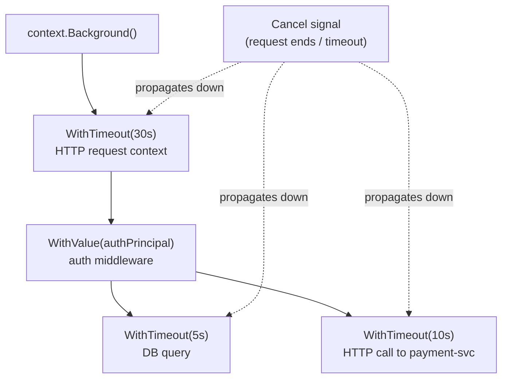

# Context — Propagation, Cancellation & Deadlines

## Category
Go, Context, Cancellation, Deadlines

## Context

`context.Context` is the mechanism for propagating cancellation signals, deadlines, and request-scoped values across API boundaries and goroutines. It is the first argument to every function that does I/O or calls downstream services.

| Function | Creates |
|----------|---------|
| `context.Background()` | Root context — use in `main`, top-level tests |
| `context.TODO()` | Placeholder — replace once you know the right context |
| `context.WithCancel(parent)` | Returns cancel function; calling it cancels descendants |
| `context.WithTimeout(parent, d)` | Auto-cancels after duration `d` |
| `context.WithDeadline(parent, t)` | Auto-cancels at absolute time `t` |
| `context.WithValue(parent, key, val)` | Thread request-scoped values; avoid for optional data |

### Context propagation rules

1. **Pass via argument, never store in a struct.** A context stored in a struct cannot be garbage-collected when the request ends.
2. **First parameter, named `ctx`.** Convention observed by the entire stdlib and ecosystem.
3. **Values are for request-scoped data** (request ID, auth principal) — not for optional parameters.
4. **Check `ctx.Err()` before expensive operations** in loops; check `<-ctx.Done()` in select.

---

## Pros

- Automatic propagation of cancellation across goroutine boundaries — a cancelled HTTP request automatically cancels DB queries and downstream calls.
- `WithTimeout` wraps any call with a hard deadline; the caller does not need to implement its own timer.
- Request IDs and auth tokens stored in context flow through the call stack without thread-local variables.
- Contextual deadlines compose: a 30 s request with a 5 s DB call — the tighter deadline wins.
- `http.Request.Context()` already carries the server deadline — propagate it to every downstream call.

---

## Cons

- Context values are untyped (`any`) — use unexported key types to avoid collisions across packages.
- Overly aggressive cancellation (e.g., cancelling on the first downstream error) may abort parallel requests that would have succeeded.
- `WithTimeout` must have its cancel function deferred — forgetting causes a goroutine leak (`go vet` catches this for `WithCancel` but not always `WithTimeout`).
- Storing mutable state in a context value is a race condition — values must be immutable.
- Deep call stacks with `WithValue` make debugging harder; prefer explicit parameters for domain data.

---

## Design Diagram



---

## Code Sample

### Context key pattern — avoid collisions

```go
// internal/ctxkey/keys.go
package ctxkey

// Use unexported concrete type as key — prevents collision with other packages.
type contextKey string

const (
    RequestID     contextKey = "request_id"
    AuthPrincipal contextKey = "auth_principal"
)

func WithRequestID(ctx context.Context, id string) context.Context {
    return context.WithValue(ctx, RequestID, id)
}

func GetRequestID(ctx context.Context) string {
    id, _ := ctx.Value(RequestID).(string)
    return id
}
```

### Request ID middleware (inject into context)

```go
func RequestIDMiddleware(next http.Handler) http.Handler {
    return http.HandlerFunc(func(w http.ResponseWriter, r *http.Request) {
        id := r.Header.Get("X-Request-ID")
        if id == "" {
            id = uuid.NewString()
        }
        ctx := ctxkey.WithRequestID(r.Context(), id)
        w.Header().Set("X-Request-ID", id)
        next.ServeHTTP(w, r.WithContext(ctx))
    })
}
```

### Timeout propagation — DB and downstream calls

```go
func (s *OrderService) CreateOrder(ctx context.Context, req CreateOrderRequest) (*domain.Order, error) {
    // Use the incoming ctx — carries the HTTP request deadline
    order, err := s.repo.Save(ctx, domainOrder)
    if err != nil {
        return nil, fmt.Errorf("save order: %w", err)
    }

    // Add a tighter sub-deadline for the downstream call
    payCtx, cancel := context.WithTimeout(ctx, 5*time.Second)
    defer cancel()  // Always defer cancel — prevents goroutine leak

    if err := s.paymentSvc.Charge(payCtx, order.ID, req.Amount); err != nil {
        return nil, fmt.Errorf("charge payment: %w", err)
    }
    return order, nil
}
```

### Check cancellation in a processing loop

```go
func processItems(ctx context.Context, items []Item) error {
    for _, item := range items {
        // Check before each expensive operation
        if err := ctx.Err(); err != nil {
            return fmt.Errorf("processing cancelled after %d items: %w", i, err)
        }
        if err := process(ctx, item); err != nil {
            return fmt.Errorf("process item %s: %w", item.ID, err)
        }
    }
    return nil
}
```

### select on ctx.Done() in a goroutine

```go
func (w *Worker) Run(ctx context.Context) error {
    ticker := time.NewTicker(10 * time.Second)
    defer ticker.Stop()

    for {
        select {
        case <-ctx.Done():
            return ctx.Err()   // Graceful exit
        case <-ticker.C:
            if err := w.doWork(ctx); err != nil {
                slog.ErrorContext(ctx, "work failed", "error", err)
                // Continue rather than exit — let ctx cancellation stop the loop
            }
        }
    }
}
```

---

## Related

- [02 — Concurrency](./02-concurrency.md) — goroutines use `ctx.Done()` as their cancellation signal
- [06 — HTTP Services](./06-http-services.md) — `r.Context()` carries the per-request deadline into the service layer
- [09 — Database Patterns](./09-database-patterns.md) — `QueryContext`, `ExecContext` propagate cancellation to Postgres
