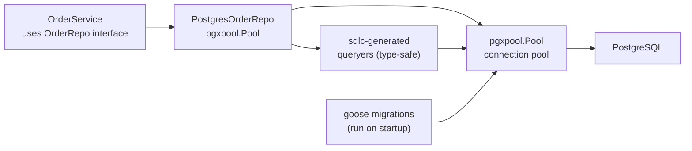

# Database Patterns

## Category
Go, Database, PostgreSQL, Repository Pattern

## Context

Go's standard `database/sql` package provides a connection-pool abstraction. For PostgreSQL, `pgx` offers a native driver with better performance and typed scanning. `sqlc` generates type-safe Go code from SQL queries. For schema migrations, `goose` or `golang-migrate` are the standard choices.

| Tool | Purpose |
|------|---------|
| `database/sql` | Standard DB interface; driver-agnostic |
| `jackc/pgx/v5` | High-performance native Postgres driver; also implements `database/sql` interface |
| `jmoiern/sqlx` | Thin extension to `database/sql`; struct scanning |
| `sqlc` | Generates Go code from SQL — write SQL, get Go functions |
| `GORM` | ORM — avoid for complex queries; fine for CRUD-heavy services |
| `goose` | Migration tool; up/down SQL files |
| `golang-migrate` | Alternative migration tool with embedded support |

### Repository pattern

Define an interface in the service layer; implement it in the repository layer. The interface is what the service knows — the concrete type is what the repository provides.

```
internal/
├── service/
│   └── order.go       ← defines OrderRepo interface
└── repository/
    ├── order.go        ← PostgresOrderRepo implements it
    └── order_test.go   ← integration tests (testcontainers)
```

---

## Pros

- `sqlc` eliminates runtime SQL errors — queries are validated against the schema at code-generation time.
- `pgx` connection pooling (`pgxpool`) is highly tunable and supports `LISTEN/NOTIFY`.
- Repository interfaces make service logic testable with mocks — no real DB needed for unit tests.
- `goose` embedded migrations run on startup — zero-downtime schema evolution as part of the service lifecycle.
- `database/sql` `QueryContext` / `ExecContext` propagate `context.Context` cancellation to in-flight queries.

---

## Cons

- `sqlc` requires regenerating code when SQL changes — easy to forget; add to CI `make generate` step.
- `pgx` v5 is not fully compatible with `database/sql` scanning (`pgx.Rows` vs `sql.Rows`) — choose one scanning API.
- GORM generates suboptimal queries for complex joins — prefer raw SQL via `sqlc` for read-heavy services.
- Connection pool exhaustion under load causes request queuing — tune `SetMaxOpenConns` and set `SetConnMaxLifetime`.
- Long-running transactions block autovacuum and lock rows — always use short transactions; never hold them across HTTP boundaries.

---

## Design Diagram



---

## Code Sample

### pgxpool — connection pool setup

```go
// internal/repository/db.go
package repository

import (
    "context"
    "fmt"

    "github.com/jackc/pgx/v5/pgxpool"
)

func NewPool(ctx context.Context, dsn string) (*pgxpool.Pool, error) {
    cfg, err := pgxpool.ParseConfig(dsn)
    if err != nil {
        return nil, fmt.Errorf("parse db config: %w", err)
    }

    cfg.MaxConns = 25
    cfg.MinConns = 5
    cfg.MaxConnLifetime = 30 * time.Minute
    cfg.MaxConnIdleTime = 5 * time.Minute
    cfg.HealthCheckPeriod = 1 * time.Minute

    pool, err := pgxpool.NewWithConfig(ctx, cfg)
    if err != nil {
        return nil, fmt.Errorf("create pool: %w", err)
    }
    if err := pool.Ping(ctx); err != nil {
        return nil, fmt.Errorf("ping db: %w", err)
    }
    return pool, nil
}
```

### sqlc — define queries, generate Go code

```sql
-- db/queries/orders.sql
-- name: FindOrderByID :one
SELECT id, customer_id, amount, currency, status, created_at
FROM orders
WHERE id = $1;

-- name: CreateOrder :one
INSERT INTO orders (id, customer_id, amount, currency, status)
VALUES ($1, $2, $3, $4, $5)
RETURNING *;

-- name: ListOrdersByCustomer :many
SELECT id, customer_id, amount, currency, status, created_at
FROM orders
WHERE customer_id = $1
ORDER BY created_at DESC
LIMIT $2;
```

```yaml
# sqlc.yaml
version: "2"
sql:
  - engine: postgresql
    queries: db/queries/
    schema: db/migrations/
    gen:
      go:
        package: dbgen
        out: internal/repository/dbgen
        emit_json_tags: true
        emit_pointers_for_null_types: true
```

```bash
go run github.com/sqlc-dev/sqlc/cmd/sqlc@latest generate
```

### Repository implementation

```go
// internal/repository/order.go
package repository

import (
    "context"
    "errors"
    "fmt"

    "github.com/jackc/pgx/v5"
    "github.com/jackc/pgx/v5/pgxpool"

    "github.com/myorg/myservice/internal/domain"
    "github.com/myorg/myservice/internal/repository/dbgen"
)

type OrderRepo struct {
    pool    *pgxpool.Pool
    queries *dbgen.Queries
}

func NewOrderRepo(pool *pgxpool.Pool) *OrderRepo {
    return &OrderRepo{pool: pool, queries: dbgen.New(pool)}
}

func (r *OrderRepo) FindByID(ctx context.Context, id string) (*domain.Order, error) {
    row, err := r.queries.FindOrderByID(ctx, id)
    if errors.Is(err, pgx.ErrNoRows) {
        return nil, fmt.Errorf("find order %s: %w", id, domain.ErrNotFound)
    }
    if err != nil {
        return nil, fmt.Errorf("find order %s: %w", id, err)
    }
    return mapRowToOrder(row), nil
}

func (r *OrderRepo) Save(ctx context.Context, order *domain.Order) error {
    _, err := r.queries.CreateOrder(ctx, dbgen.CreateOrderParams{
        ID:         order.ID,
        CustomerID: order.CustomerID,
        Amount:     order.Amount,
        Currency:   order.Currency,
        Status:     order.Status,
    })
    if err != nil {
        return fmt.Errorf("save order: %w", err)
    }
    return nil
}
```

### goose — embedded migrations

```go
// internal/repository/migrate.go
package repository

import (
    "context"
    "embed"

    "github.com/pressly/goose/v3"
    "github.com/jackc/pgx/v5/stdlib"
    "github.com/jackc/pgx/v5/pgxpool"
)

//go:embed migrations/*.sql
var migrationsFS embed.FS

func Migrate(ctx context.Context, pool *pgxpool.Pool) error {
    db := stdlib.OpenDBFromPool(pool)
    defer db.Close()

    goose.SetBaseFS(migrationsFS)
    if err := goose.SetDialect("postgres"); err != nil {
        return fmt.Errorf("set goose dialect: %w", err)
    }
    if err := goose.Up(db, "migrations"); err != nil {
        return fmt.Errorf("run migrations: %w", err)
    }
    return nil
}
```

```sql
-- db/migrations/001_create_orders.sql
-- +goose Up
CREATE TABLE orders (
    id          TEXT PRIMARY KEY,
    customer_id TEXT NOT NULL,
    amount      NUMERIC(12, 2) NOT NULL,
    currency    CHAR(3) NOT NULL,
    status      TEXT NOT NULL DEFAULT 'pending',
    created_at  TIMESTAMPTZ NOT NULL DEFAULT now()
);
CREATE INDEX idx_orders_customer ON orders(customer_id);

-- +goose Down
DROP TABLE orders;
```

---

## Related

- [03 — Interfaces & Composition](./03-interfaces-composition.md) — repository interface defined in the service package
- [08 — Context](./08-context.md) — all DB calls use `ctx` for cancellation and tracing
- [05 — Testing](./05-testing.md) — testcontainers-go for real-DB integration tests
