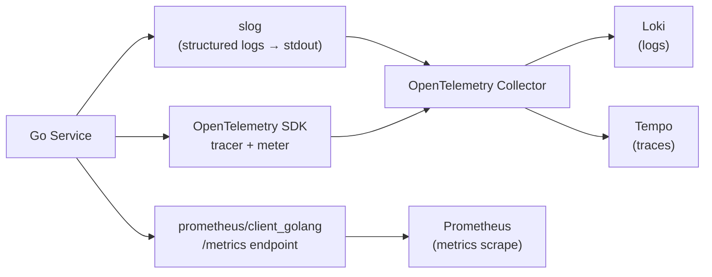

# Observability — Logging, Metrics & Tracing

## Category
Go, Observability, OpenTelemetry, Prometheus, Structured Logging

## Context

Go observability follows the three-pillar model: **structured logging** (`log/slog` or `zerolog`), **metrics** (Prometheus client or OTLP), and **distributed tracing** (OpenTelemetry Go SDK). The OTLP SDK unifies metrics, traces, and logs under one API with vendor-neutral exporters.

| Pillar | Standard library | Ecosystem |
|--------|-----------------|-----------|
| Logging | `log/slog` (Go 1.21) | `zerolog`, `zap` |
| Metrics | — | `prometheus/client_golang`, OTLP metric SDK |
| Tracing | — | `go.opentelemetry.io/otel` |
| All-in-one | — | OpenTelemetry SDK + Collector |

### log/slog vs zerolog

| Concern | slog | zerolog |
|---------|------|---------|
| Standard library | ✅ Go 1.21 | ✗ |
| Zero-alloc hot path | ✗ (some allocs) | ✅ |
| JSON output | ✅ `JSONHandler` | ✅ |
| Context-aware | ✅ `slog.InfoContext` | ✅ `log.Ctx(ctx)` |
| Recommendation | Default for most services | Use when profiling shows logging overhead |

---

## Pros

- `slog.InfoContext(ctx, ...)` automatically carries trace/span IDs when an OTLP trace context handler is installed.
- OpenTelemetry auto-instrumentation libraries for `net/http`, `database/sql`, `grpc` add spans with zero business logic changes.
- Prometheus `promauto` registers metrics at package init — no global mutex required in application code.
- Structured JSON logs (key=value pairs) are directly queryable in Loki without regex parsing.
- OTLP SDK exports to any collector (Datadog, Honeycomb, Grafana Tempo) by swapping the exporter config — no code changes.

---

## Cons

- OpenTelemetry Go SDK has many packages — importing the right combination is confusing initially.
- `slog` attributes are not zero-alloc — use `slog.With` for high-frequency logging paths or switch to `zerolog`.
- Prometheus histograms have fixed buckets defined at init time — wrong bucket boundaries require a restart.
- Trace context propagation must be explicit across goroutine boundaries (use `otel.GetTextMapPropagator()` or pass the span context in `ctx`).
- Over-instrumenting with many metrics or spans adds latency; use sampling for high-volume traces.

---

## Design Diagram



---

## Code Sample

### slog — structured logging setup

```go
// cmd/server/main.go
package main

import (
    "log/slog"
    "os"
)

func initLogger(env string) {
    level := slog.LevelInfo
    if env == "development" {
        level = slog.LevelDebug
    }

    handler := slog.NewJSONHandler(os.Stdout, &slog.HandlerOptions{
        Level:     level,
        AddSource: env == "development",
    })
    slog.SetDefault(slog.New(handler))
}

// Usage throughout the app — always pass ctx to carry trace IDs
slog.InfoContext(ctx, "order created",
    slog.String("order_id", order.ID),
    slog.String("customer_id", order.CustomerID),
    slog.Float64("amount", order.Amount),
)

slog.ErrorContext(ctx, "save order failed",
    slog.String("order_id", order.ID),
    slog.Any("error", err),
)
```

### OpenTelemetry — SDK setup (OTLP exporter)

```go
// internal/telemetry/otel.go
package telemetry

import (
    "context"
    "fmt"

    "go.opentelemetry.io/otel"
    "go.opentelemetry.io/otel/exporters/otlp/otlptrace/otlptracegrpc"
    "go.opentelemetry.io/otel/propagation"
    "go.opentelemetry.io/otel/sdk/resource"
    "go.opentelemetry.io/otel/sdk/trace"
    semconv "go.opentelemetry.io/otel/semconv/v1.26.0"
)

func InitTracer(ctx context.Context, serviceName, serviceVersion, collectorAddr string) (func(context.Context) error, error) {
    exp, err := otlptracegrpc.New(ctx,
        otlptracegrpc.WithEndpoint(collectorAddr),
        otlptracegrpc.WithInsecure(),
    )
    if err != nil {
        return nil, fmt.Errorf("create OTLP exporter: %w", err)
    }

    res := resource.NewWithAttributes(
        semconv.SchemaURL,
        semconv.ServiceName(serviceName),
        semconv.ServiceVersion(serviceVersion),
    )

    tp := trace.NewTracerProvider(
        trace.WithBatcher(exp),
        trace.WithResource(res),
        trace.WithSampler(trace.ParentBased(trace.TraceIDRatioBased(0.1))), // 10% sampling
    )
    otel.SetTracerProvider(tp)
    otel.SetTextMapPropagator(propagation.NewCompositeTextMapPropagator(
        propagation.TraceContext{},
        propagation.Baggage{},
    ))
    return tp.Shutdown, nil
}
```

### Manual span creation in service code

```go
import "go.opentelemetry.io/otel"

var tracer = otel.Tracer("github.com/myorg/myservice/internal/service")

func (s *OrderService) CreateOrder(ctx context.Context, req CreateOrderRequest) (*domain.Order, error) {
    ctx, span := tracer.Start(ctx, "OrderService.CreateOrder")
    defer span.End()

    span.SetAttributes(
        attribute.String("order.customer_id", req.CustomerID),
        attribute.Float64("order.amount", req.Amount),
    )

    order, err := s.repo.Save(ctx, domainOrder)
    if err != nil {
        span.RecordError(err)
        span.SetStatus(codes.Error, err.Error())
        return nil, fmt.Errorf("save order: %w", err)
    }
    return order, nil
}
```

### Prometheus metrics

```go
// internal/metrics/metrics.go
package metrics

import (
    "github.com/prometheus/client_golang/prometheus"
    "github.com/prometheus/client_golang/prometheus/promauto"
)

var (
    OrdersCreated = promauto.NewCounterVec(
        prometheus.CounterOpts{
            Name: "orders_created_total",
            Help: "Total number of orders created",
        },
        []string{"currency", "status"},
    )

    OrderProcessingDuration = promauto.NewHistogramVec(
        prometheus.HistogramOpts{
            Name:    "order_processing_duration_seconds",
            Help:    "Duration of order processing",
            Buckets: []float64{0.001, 0.005, 0.01, 0.05, 0.1, 0.5, 1, 5},
        },
        []string{"outcome"},
    )
)

// Usage in service:
// start := time.Now()
// ... process ...
// metrics.OrderProcessingDuration.
//     WithLabelValues("success").
//     Observe(time.Since(start).Seconds())
```

```go
// Mount the /metrics endpoint
import "github.com/prometheus/client_golang/prometheus/promhttp"

r.Handle("/metrics", promhttp.Handler())
```

### OpenTelemetry HTTP middleware (auto-instrument)

```go
import (
    "go.opentelemetry.io/contrib/instrumentation/net/http/otelhttp"
)

// Wrap the router — all requests get a trace span automatically
handler := otelhttp.NewHandler(r, "order-service",
    otelhttp.WithMessageEvents(otelhttp.ReadEvents, otelhttp.WriteEvents),
)
```

---

## Related

- [06 — HTTP Services](./06-http-services.md) — mount `/metrics` and OTLP middleware on the chi router
- [08 — Context](./08-context.md) — trace context propagates through `ctx` across goroutine boundaries
- [11 — gRPC Services](./11-grpc-services.md) — `otelgrpc` interceptor instruments gRPC calls automatically
