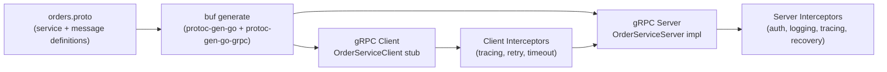

# gRPC Services

## Category
Go, gRPC, Protobuf, Streaming, RPC

## Context

`grpc-go` is the official Go implementation of gRPC. Services are defined in `.proto` files; `protoc` with `protoc-gen-go` and `protoc-gen-go-grpc` generates typed client and server stubs. Interceptors are the gRPC equivalent of HTTP middleware.

| Concept | Description |
|---------|-------------|
| Unary RPC | Single request → single response (most common) |
| Server streaming | Single request → stream of responses |
| Client streaming | Stream of requests → single response |
| Bidirectional streaming | Stream of requests → stream of responses |
| Interceptor | Middleware for unary or streaming calls |
| Reflection | Allows gRPC tools (grpcurl, Postman) to discover services at runtime |
| Metadata | Key-value pairs on calls — equivalent of HTTP headers |

### Buf CLI

`buf` replaces `protoc` for linting, formatting, breaking-change detection, and code generation. Standard in modern Go gRPC projects.

---

## Pros

- Strongly typed contracts — proto schema is the API contract; any mismatch is a compile error.
- Efficient binary serialisation (protobuf) — typically 5–10× smaller payloads than JSON.
- Built-in streaming — bidirectional streaming is first-class, unlike WebSocket bolt-ons.
- Code generation handles client + server stubs, eliminating hand-written HTTP client boilerplate.
- Interceptors compose cleanly — OpenTelemetry, auth, logging, recovery all as separate interceptors.

---

## Cons

- Not human-readable on the wire — requires `grpcurl`, Postman, or Evans CLI for manual testing.
- Browser support requires gRPC-Web or gRPC-Gateway (REST ↔ gRPC transcoding).
- Proto schema evolution requires careful attention — removing fields is a breaking change (even though protobuf is backward-compatible by field number).
- gRPC requires HTTP/2 — some load balancers and proxies need explicit configuration.
- Streaming connections are long-lived — connection pool sizing and keepalive configuration differ from REST.

---

## Design Diagram



---

## Code Sample

### Proto definition

```protobuf
// api/proto/orders/v1/orders.proto
syntax = "proto3";

package orders.v1;

option go_package = "github.com/myorg/myservice/api/gen/orders/v1;ordersv1";

import "google/protobuf/timestamp.proto";

service OrderService {
  rpc GetOrder(GetOrderRequest) returns (GetOrderResponse);
  rpc CreateOrder(CreateOrderRequest) returns (CreateOrderResponse);
  rpc ListOrders(ListOrdersRequest) returns (stream Order);  // server streaming
}

message Order {
  string id          = 1;
  string customer_id = 2;
  double amount      = 3;
  string currency    = 4;
  string status      = 5;
  google.protobuf.Timestamp created_at = 6;
}

message GetOrderRequest  { string id = 1; }
message GetOrderResponse { Order order = 1; }

message CreateOrderRequest {
  string customer_id = 1;
  double amount      = 2;
  string currency    = 3;
}
message CreateOrderResponse { Order order = 1; }

message ListOrdersRequest { string customer_id = 1; }
```

### buf.yaml + buf.gen.yaml

```yaml
# buf.yaml
version: v2
lint:
  use: [DEFAULT]
breaking:
  use: [FILE]
```

```yaml
# buf.gen.yaml
version: v2
plugins:
  - remote: buf.build/protocolbuffers/go
    out: api/gen
    opt: paths=source_relative
  - remote: buf.build/grpc/go
    out: api/gen
    opt: paths=source_relative
```

```bash
buf generate
```

### Server implementation

```go
// internal/grpchandler/order.go
package grpchandler

import (
    "context"

    "google.golang.org/grpc/codes"
    "google.golang.org/grpc/status"

    ordersv1 "github.com/myorg/myservice/api/gen/orders/v1"
    "github.com/myorg/myservice/internal/domain"
    "github.com/myorg/myservice/internal/service"
)

type OrderGRPCHandler struct {
    ordersv1.UnimplementedOrderServiceServer // forward compatibility
    svc *service.OrderService
}

func (h *OrderGRPCHandler) GetOrder(ctx context.Context, req *ordersv1.GetOrderRequest) (*ordersv1.GetOrderResponse, error) {
    order, err := h.svc.GetOrder(ctx, req.GetId())
    if err != nil {
        switch {
        case errors.Is(err, domain.ErrNotFound):
            return nil, status.Errorf(codes.NotFound, "order %s not found", req.GetId())
        default:
            return nil, status.Errorf(codes.Internal, "get order: %v", err)
        }
    }
    return &ordersv1.GetOrderResponse{Order: mapOrderToProto(order)}, nil
}

func (h *OrderGRPCHandler) ListOrders(req *ordersv1.ListOrdersRequest, stream ordersv1.OrderService_ListOrdersServer) error {
    orders, err := h.svc.ListByCustomer(stream.Context(), req.GetCustomerId())
    if err != nil {
        return status.Errorf(codes.Internal, "list orders: %v", err)
    }
    for _, order := range orders {
        if err := stream.Send(mapOrderToProto(order)); err != nil {
            return err  // Client disconnected
        }
    }
    return nil
}
```

### Server startup with interceptors

```go
// cmd/server/main.go
import (
    "google.golang.org/grpc"
    "google.golang.org/grpc/reflection"
    "go.opentelemetry.io/contrib/instrumentation/google.golang.org/grpc/otelgrpc"
)

func runGRPC(ctx context.Context, handler *grpchandler.OrderGRPCHandler) error {
    srv := grpc.NewServer(
        grpc.ChainUnaryInterceptor(
            otelgrpc.UnaryServerInterceptor(),  // Tracing
            recoveryInterceptor(),              // Panic recovery
            authInterceptor(),                  // JWT validation
            loggingInterceptor(),               // Structured request logging
        ),
        grpc.ChainStreamInterceptor(
            otelgrpc.StreamServerInterceptor(),
        ),
    )

    ordersv1.RegisterOrderServiceServer(srv, handler)
    reflection.Register(srv)  // Enable grpcurl introspection

    lis, err := net.Listen("tcp", ":9090")
    if err != nil {
        return fmt.Errorf("listen: %w", err)
    }

    go func() {
        <-ctx.Done()
        srv.GracefulStop()
    }()
    return srv.Serve(lis)
}
```

### Client with interceptors

```go
func NewOrderClient(addr string) (ordersv1.OrderServiceClient, error) {
    conn, err := grpc.NewClient(addr,
        grpc.WithTransportCredentials(insecure.NewCredentials()), // use TLS in prod
        grpc.WithChainUnaryInterceptor(
            otelgrpc.UnaryClientInterceptor(),
            grpc_retry.UnaryClientInterceptor(
                grpc_retry.WithMax(3),
                grpc_retry.WithCodes(codes.Unavailable, codes.DeadlineExceeded),
            ),
        ),
    )
    if err != nil {
        return nil, fmt.Errorf("dial %s: %w", addr, err)
    }
    return ordersv1.NewOrderServiceClient(conn), nil
}
```

---

## Related

- [04 — Error Handling](./04-error-handling.md) — map domain sentinel errors to `codes.NotFound` etc.
- [08 — Context](./08-context.md) — gRPC metadata + context deadline propagation
- [10 — Observability](./10-observability.md) — `otelgrpc` interceptor instruments every call automatically
