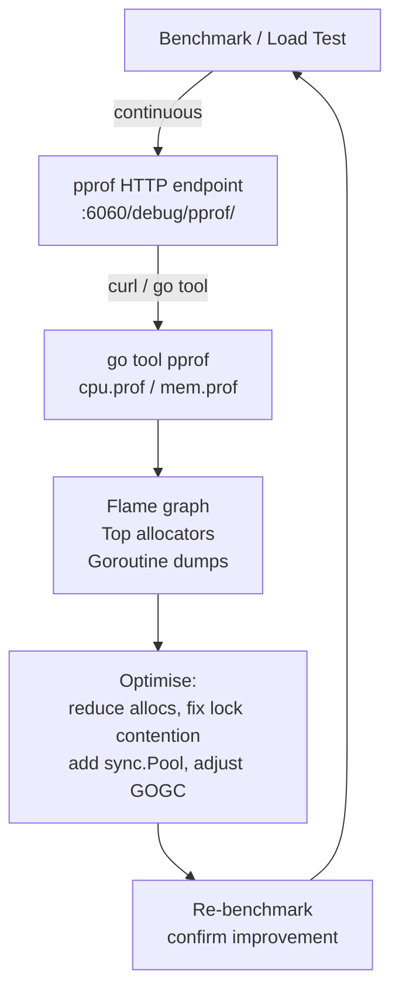

# Performance & Profiling

## Category
Go, Performance, pprof, Profiling, Memory

## Context

Go's runtime provides built-in profiling via `pprof`. The garbage collector, escape analysis, and scheduler are the main levers for performance tuning. Most services do not need micro-optimisation — profile first, optimise second.

| Profile type | What it measures |
|-------------|-----------------|
| CPU | Where the CPU spends time |
| Heap | Current live allocations |
| Allocs | All allocations since start (includes collected) |
| Goroutine | Stack traces of all goroutines |
| Block | Where goroutines block on sync primitives |
| Mutex | Where goroutines wait for mutexes |
| Trace | Full runtime event trace (scheduler, GC, goroutines) |

### Escape analysis

A value **escapes to the heap** when the compiler cannot prove it has a shorter lifetime than the stack frame — typically when its address is taken and stored, or passed to an interface. Heap allocations pressure the GC.

```bash
go build -gcflags='-m' ./...   # prints escape decisions
```

---

## Pros

- `net/http/pprof` adds a zero-config profiling endpoint — mount it on an internal port for always-on profiling.
- `go test -bench=. -benchmem` shows allocation count per operation alongside ns/op.
- `go tool trace` renders the runtime scheduler trace in a browser — shows GC pauses, goroutine scheduling, and network events.
- The race detector (`go test -race`) is cheap (~2–20× slowdown) and catches data races that pprof cannot.
- `sync.Pool` dramatically reduces GC pressure for frequently allocated short-lived objects (byte buffers, request structs).

---

## Cons

- pprof is sampling-based — low-frequency hot paths may not appear in CPU profiles; use `-count=N` to run benchmarks longer.
- Enabling `block` and `mutex` profiling (`runtime.SetBlockProfileRate`, `SetMutexProfileFraction`) has non-zero overhead — enable only when debugging.
- `sync.Pool` objects are cleared on GC — do not rely on them for correctness, only performance.
- Reducing allocations often makes code less idiomatic — only optimise after profiling confirms the allocation is a bottleneck.
- The GC target (`GOGC`, `GOMEMLIMIT`) is a trade-off: lower GOGC = more GC work, less memory; higher = less GC work, more memory.

---

## Design Diagram



---

## Code Sample

### Mount pprof endpoint (internal port)

```go
// cmd/server/main.go — run on a separate internal port, never expose to public
import _ "net/http/pprof"

go func() {
    // Only reachable internally — never expose this to the public internet
    if err := http.ListenAndServe("localhost:6060", nil); err != nil {
        slog.Error("pprof server", "error", err)
    }
}()
```

```bash
# Capture a 30s CPU profile
go tool pprof http://localhost:6060/debug/pprof/profile?seconds=30

# Capture a heap profile
go tool pprof http://localhost:6060/debug/pprof/heap

# Interactive flame graph in browser
go tool pprof -http=:8080 cpu.prof
```

### Benchmark with memory stats

```go
func BenchmarkProcessOrders(b *testing.B) {
    orders := makeTestOrders(1000)
    svc := newTestService()

    b.ReportAllocs()
    b.ResetTimer()

    for b.Loop() {  // Go 1.24+ — preferred over range b.N
        _ = svc.ProcessBatch(context.Background(), orders)
    }
}
```

```bash
go test -bench=BenchmarkProcessOrders -benchmem -count=5 ./internal/service/
# BenchmarkProcessOrders-8   10000   112340 ns/op   24576 B/op   128 allocs/op
```

### sync.Pool — reuse byte buffers

```go
var bufPool = sync.Pool{
    New: func() any {
        return bytes.NewBuffer(make([]byte, 0, 4096))
    },
}

func encodeToJSON(v any) ([]byte, error) {
    buf := bufPool.Get().(*bytes.Buffer)
    buf.Reset()
    defer bufPool.Put(buf)   // Return to pool after use

    if err := json.NewEncoder(buf).Encode(v); err != nil {
        return nil, err
    }
    // Copy out — buf goes back to pool; caller owns the returned slice
    result := make([]byte, buf.Len())
    copy(result, buf.Bytes())
    return result, nil
}
```

### GC tuning — GOGC and GOMEMLIMIT

```bash
# Default GOGC=100 means GC triggers when heap doubles since last collection.
# Reduce to run GC more often (lower memory, more CPU):
GOGC=50 ./myservice

# GOMEMLIMIT (Go 1.19+): hard limit — GC runs more aggressively before this is hit.
# Matches your container memory limit (leave 10% headroom):
GOMEMLIMIT=900MiB ./myservice
```

```go
import "runtime/debug"

func init() {
    // Set in code when env var not convenient
    debug.SetMemoryLimit(900 * 1024 * 1024) // 900 MiB
    debug.SetGCPercent(100)                 // default
}
```

### Escape analysis — avoid unnecessary heap allocations

```go
// BAD: addr escapes to heap because it's returned from the function
func newPoint(x, y int) *Point {
    return &Point{x, y}   // escapes
}

// GOOD: return value type — caller allocates on stack if it doesn't escape further
func newPoint(x, y int) Point {
    return Point{x, y}
}

// Use -gcflags='-m' to confirm:
// go build -gcflags='-m' ./...
// → internal/service/order.go:42:12: &Point literal escapes to heap
```

---

## Related

- [02 — Concurrency](./02-concurrency.md) — goroutine leaks show up in the goroutine pprof profile
- [09 — Database Patterns](./09-database-patterns.md) — connection pool exhaustion manifests as block profile contention
- [10 — Observability](./10-observability.md) — expose `GOMEMLIMIT` and GC pause stats as Prometheus metrics
