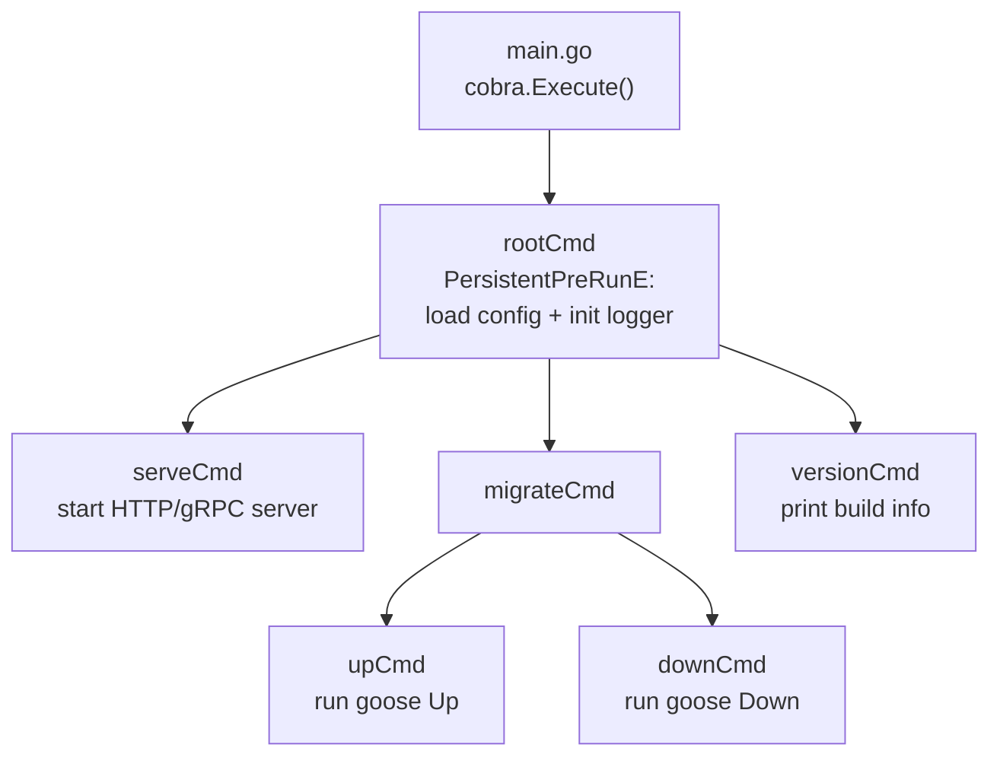

# CLI Tooling

## Category
Go, CLI, Cobra, Viper, Configuration

## Context

Go is an excellent language for CLI tools — static binaries, fast startup, cross-compilation. **Cobra** is the standard library for command trees (used by `kubectl`, `helm`, `gh`). **Viper** handles configuration from flags, environment variables, config files, and remote sources — and integrates directly with Cobra.

| Library | Purpose |
|---------|---------|
| `spf13/cobra` | Command tree, flag parsing, help generation |
| `spf13/viper` | Configuration from flags + env + file + remote |
| `spf13/pflag` | POSIX-compatible flags (used by cobra internally) |
| `charmbracelet/bubbletea` | TUI (terminal UI) with Elm-style model |
| `charmbracelet/lipgloss` | Terminal styling |
| `urfave/cli` | Alternative to cobra — simpler API |

### Cobra command anatomy

```
mycli
├── root        (global flags, PersistentPreRun)
├── serve       (start the server)
│   └── --port, --host
├── migrate     (run DB migrations)
│   ├── up
│   └── down
└── version     (print version info)
```

---

## Pros

- Cobra generates `--help` and shell completions (bash, zsh, fish, PowerShell) automatically.
- Viper's precedence order (flag > env > config file > default) matches 12-Factor App principles.
- `cobra.Command.PersistentPreRunE` is ideal for initialising shared state (config, logger) before any subcommand runs.
- Cross-compilation: `GOOS=linux GOARCH=amd64 go build` — no container needed to build Linux binaries on macOS.
- Go's fast startup means CLIs feel snappy — unlike Python or JVM tools.

---

## Cons

- Cobra's global state (viper's `GetString`) is hard to test — prefer passing a config struct to subcommands.
- Viper env var binding is case-insensitive globally — `MYAPP_DB_HOST` binds to `db.host` in config files, which can be surprising.
- Shell completion requires sourcing a script — document this prominently for users.
- Cobra's `Run` vs `RunE` distinction: always use `RunE` so errors propagate properly (non-zero exit code).
- Large CLIs with many subcommands benefit from lazy loading — not built into Cobra.

---

## Design Diagram



---

## Code Sample

### Project layout for a CLI

```
mycli/
├── cmd/
│   └── mycli/
│       └── main.go
├── internal/
│   ├── cli/
│   │   ├── root.go
│   │   ├── serve.go
│   │   ├── migrate.go
│   │   └── version.go
│   └── config/
│       └── config.go
├── go.mod
└── Makefile
```

### root command with Viper config binding

```go
// internal/cli/root.go
package cli

import (
    "fmt"
    "log/slog"
    "os"

    "github.com/spf13/cobra"
    "github.com/spf13/viper"
)

var cfgFile string

func NewRootCmd(version string) *cobra.Command {
    cmd := &cobra.Command{
        Use:   "mycli",
        Short: "My production service CLI",
        PersistentPreRunE: func(cmd *cobra.Command, args []string) error {
            return initConfig(cmd)
        },
    }

    cmd.PersistentFlags().StringVar(&cfgFile, "config", "", "config file (default: ./config.yaml)")
    cmd.PersistentFlags().String("log-level", "info", "log level (debug|info|warn|error)")
    viper.BindPFlag("log_level", cmd.PersistentFlags().Lookup("log-level"))

    cmd.AddCommand(newServeCmd())
    cmd.AddCommand(newMigrateCmd())
    cmd.AddCommand(newVersionCmd(version))

    return cmd
}

func initConfig(cmd *cobra.Command) error {
    if cfgFile != "" {
        viper.SetConfigFile(cfgFile)
    } else {
        viper.SetConfigName("config")
        viper.SetConfigType("yaml")
        viper.AddConfigPath(".")
        viper.AddConfigPath("$HOME/.mycli")
    }

    viper.SetEnvPrefix("MYCLI")      // MYCLI_DB_URL → db.url
    viper.AutomaticEnv()             // Read all matching env vars

    if err := viper.ReadInConfig(); err != nil {
        if _, ok := err.(viper.ConfigFileNotFoundError); !ok {
            return fmt.Errorf("read config: %w", err)
        }
    }

    level, _ := slog.ParseLogLevel(viper.GetString("log_level"))
    slog.SetDefault(slog.New(slog.NewJSONHandler(os.Stderr, &slog.HandlerOptions{Level: level})))
    return nil
}
```

### serve subcommand

```go
// internal/cli/serve.go
package cli

import (
    "github.com/spf13/cobra"
    "github.com/spf13/viper"

    "github.com/myorg/mycli/internal/config"
    "github.com/myorg/mycli/internal/handler"
    "github.com/myorg/mycli/internal/repository"
    "github.com/myorg/mycli/internal/service"
)

func newServeCmd() *cobra.Command {
    cmd := &cobra.Command{
        Use:   "serve",
        Short: "Start the HTTP server",
        RunE: func(cmd *cobra.Command, args []string) error {
            cfg := config.Config{
                Addr:        viper.GetString("server.addr"),
                DatabaseURL: viper.GetString("db.url"),
            }
            return runServer(cmd.Context(), cfg)
        },
    }

    cmd.Flags().String("addr", ":8080", "HTTP listen address")
    viper.BindPFlag("server.addr", cmd.Flags().Lookup("addr"))

    return cmd
}

func runServer(ctx context.Context, cfg config.Config) error {
    pool, err := repository.NewPool(ctx, cfg.DatabaseURL)
    if err != nil {
        return err
    }
    defer pool.Close()

    repo := repository.NewOrderRepo(pool)
    svc  := service.NewOrderService(repo, slog.Default())
    srv  := handler.NewServer(cfg.Addr, svc)
    return srv.Run(ctx)
}
```

### version command with build info

```go
// internal/cli/version.go
package cli

import (
    "fmt"
    "runtime/debug"

    "github.com/spf13/cobra"
)

func newVersionCmd(version string) *cobra.Command {
    return &cobra.Command{
        Use:   "version",
        Short: "Print version information",
        Run: func(cmd *cobra.Command, args []string) {
            info, _ := debug.ReadBuildInfo()
            fmt.Printf("version: %s<br/>", version)
            fmt.Printf("go:      %s<br/>", info.GoVersion)
            for _, s := range info.Settings {
                if s.Key == "vcs.revision" {
                    fmt.Printf("commit:  %s<br/>", s.Value)
                }
            }
        },
    }
}
```

### main.go — entry point

```go
// cmd/mycli/main.go
package main

import (
    "context"
    "os"
    "os/signal"
    "syscall"

    "github.com/myorg/mycli/internal/cli"
)

var version = "dev" // overridden at build time: -ldflags "-X main.version=1.2.3"

func main() {
    ctx, stop := signal.NotifyContext(context.Background(), syscall.SIGINT, syscall.SIGTERM)
    defer stop()

    if err := cli.NewRootCmd(version).ExecuteContext(ctx); err != nil {
        os.Exit(1)
    }
}
```

```bash
# Build with version injected
go build -ldflags "-X main.version=$(git describe --tags)" -o bin/mycli ./cmd/mycli

# Generate shell completions
./bin/mycli completion zsh > ~/.zsh/completions/_mycli
```

---

## Related

- [01 — Project Structure](./01-project-structure.md) — CLI binary lives under `cmd/mycli/`
- [04 — Error Handling](./04-error-handling.md) — use `RunE` so errors produce non-zero exit codes
- [08 — Context](./08-context.md) — `cmd.Context()` carries SIGINT cancellation to subcommand logic
