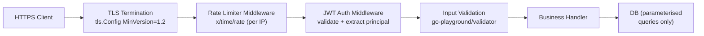

# Security Patterns

## Category
Go, Security, TLS, JWT, Input Validation, Rate Limiting

## Context

Secure Go services follow standard OWASP principles applied to the Go HTTP and crypto stack. The major concerns are: TLS configuration, JWT authentication middleware, input validation, rate limiting, and secure secret handling.

| Concern | Go approach |
|---------|------------|
| TLS | `crypto/tls` with modern `MinVersion: tls.VersionTLS12` |
| Auth tokens | `golang-jwt/jwt/v5` (verify) or `go-jose` (JOSE full stack) |
| Input validation | `go-playground/validator/v10` |
| Rate limiting | `golang.org/x/time/rate` (token bucket) |
| Secrets | Environment variables or Vault SDK — never hardcoded |
| Password hashing | `golang.org/x/crypto/bcrypt` or `argon2id` |
| HTML output | `html/template` (auto-escaping) — never `text/template` for HTML |
| SQL injection | Parameterised queries — never `fmt.Sprintf` in SQL |
| CORS | `rs/cors` middleware |

---

## Pros

- Go's `crypto/tls` defaults are conservative and safe; `tls.Config` allows fine-grained cipher control.
- Parameterised queries via `database/sql` / `pgx` make SQL injection impossible by construction.
- `html/template` auto-escapes all dynamic content — XSS-safe by default.
- `context.WithTimeout` prevents slow-read attacks on incoming request bodies.
- `http.MaxBytesReader` caps request body size — mitigates resource exhaustion.

---

## Cons

- JWT verification requires checking `alg` header explicitly — `golang-jwt` does this, but hand-rolled parsers often miss it.
- `bcrypt` default cost (10) may be too low for modern hardware; use cost ≥ 12 and benchmark.
- `golang.org/x/time/rate` is per-instance — distributed rate limiting requires Redis (e.g., `go-redis/redis_rate`).
- `tls.VersionTLS12` minimum still allows weak cipher suites — explicitly set `CipherSuites` for PCI-DSS compliance.
- Secrets injected via environment variables are readable by other processes on the same host — use a secrets manager for sensitive production workloads.

---

## Design Diagram



---

## Code Sample

### TLS server configuration

```go
// Only call this for services that terminate TLS directly (not behind a load balancer)
func newTLSConfig() *tls.Config {
    return &tls.Config{
        MinVersion: tls.VersionTLS12,
        // Prefer TLS 1.3 — cipher suites are fixed and secure
        CurvePreferences: []tls.CurveID{tls.X25519, tls.CurveP256},
        CipherSuites: []uint16{
            tls.TLS_ECDHE_ECDSA_WITH_AES_256_GCM_SHA384,
            tls.TLS_ECDHE_RSA_WITH_AES_256_GCM_SHA384,
            tls.TLS_ECDHE_ECDSA_WITH_CHACHA20_POLY1305_SHA256,
            tls.TLS_ECDHE_RSA_WITH_CHACHA20_POLY1305_SHA256,
        },
        // Rotate certificates without restart using GetCertificate
        GetCertificate: certManager.GetCertificate,
    }
}
```

### JWT authentication middleware

```go
// internal/middleware/auth.go
package middleware

import (
    "context"
    "net/http"
    "strings"

    "github.com/golang-jwt/jwt/v5"
)

type Claims struct {
    jwt.RegisteredClaims
    UserID string   `json:"sub"`
    Roles  []string `json:"roles"`
}

func JWTAuth(secret []byte) func(http.Handler) http.Handler {
    parser := jwt.NewParser(
        jwt.WithValidMethods([]string{"HS256", "RS256"}),  // Never allow "none"
        jwt.WithExpirationRequired(),
        jwt.WithIssuedAt(),
    )

    return func(next http.Handler) http.Handler {
        return http.HandlerFunc(func(w http.ResponseWriter, r *http.Request) {
            authHeader := r.Header.Get("Authorization")
            if !strings.HasPrefix(authHeader, "Bearer ") {
                http.Error(w, "missing token", http.StatusUnauthorized)
                return
            }
            tokenStr := strings.TrimPrefix(authHeader, "Bearer ")

            var claims Claims
            _, err := parser.ParseWithClaims(tokenStr, &claims, func(t *jwt.Token) (any, error) {
                return secret, nil
            })
            if err != nil {
                http.Error(w, "invalid token", http.StatusUnauthorized)
                return
            }

            ctx := ctxkey.WithAuthPrincipal(r.Context(), &claims)
            next.ServeHTTP(w, r.WithContext(ctx))
        })
    }
}
```

### Rate limiting middleware (per IP, token bucket)

```go
// internal/middleware/ratelimit.go
package middleware

import (
    "net/http"
    "sync"
    "time"

    "golang.org/x/time/rate"
)

type ipLimiter struct {
    mu       sync.Mutex
    limiters map[string]*rate.Limiter
    r        rate.Limit
    b        int
}

func newIPLimiter(r rate.Limit, b int) *ipLimiter {
    return &ipLimiter{limiters: make(map[string]*rate.Limiter), r: r, b: b}
}

func (il *ipLimiter) get(ip string) *rate.Limiter {
    il.mu.Lock()
    defer il.mu.Unlock()
    if l, ok := il.limiters[ip]; ok {
        return l
    }
    l := rate.NewLimiter(il.r, il.b)
    il.limiters[ip] = l
    return l
}

// RateLimit allows r requests/second with burst b per IP.
// For distributed rate limiting, swap il.get with a Redis-backed limiter.
func RateLimit(r rate.Limit, b int) func(http.Handler) http.Handler {
    il := newIPLimiter(r, b)
    return func(next http.Handler) http.Handler {
        return http.HandlerFunc(func(w http.ResponseWriter, r *http.Request) {
            ip := r.RemoteAddr  // Use X-Forwarded-For after trusted proxy validation
            if !il.get(ip).Allow() {
                w.Header().Set("Retry-After", "1")
                http.Error(w, "rate limit exceeded", http.StatusTooManyRequests)
                return
            }
            next.ServeHTTP(w, r)
        })
    }
}
```

### Password hashing with bcrypt

```go
import "golang.org/x/crypto/bcrypt"

const bcryptCost = 12  // Benchmark on target hardware; >= 12 recommended

func HashPassword(password string) (string, error) {
    hash, err := bcrypt.GenerateFromPassword([]byte(password), bcryptCost)
    if err != nil {
        return "", fmt.Errorf("hash password: %w", err)
    }
    return string(hash), nil
}

func CheckPassword(hash, password string) bool {
    return bcrypt.CompareHashAndPassword([]byte(hash), []byte(password)) == nil
}
```

### Secrets from environment — never hardcode

```go
// config/config.go
package config

import (
    "fmt"
    "os"
)

type Config struct {
    DatabaseURL string
    JWTSecret   []byte
}

func Load() (*Config, error) {
    dbURL := os.Getenv("DATABASE_URL")
    if dbURL == "" {
        return nil, fmt.Errorf("DATABASE_URL is required")
    }

    jwtSecret := os.Getenv("JWT_SECRET")
    if len(jwtSecret) < 32 {
        return nil, fmt.Errorf("JWT_SECRET must be at least 32 characters")
    }

    return &Config{
        DatabaseURL: dbURL,
        JWTSecret:   []byte(jwtSecret),
    }, nil
}
```

### Security checklist (bind to CI)

```bash
# Static analysis — OWASP-aligned rules
go run github.com/securego/gosec/v2/cmd/gosec@latest ./...

# Dependency vulnerability scan
go run golang.org/x/vuln/cmd/govulncheck@latest ./...

# Detect hardcoded secrets
go run github.com/gitleaks/gitleaks@latest detect --source . --no-git
```

---

## Related

- [06 — HTTP Services](./06-http-services.md) — mount auth and rate-limit middleware on the chi router
- [04 — Error Handling](./04-error-handling.md) — never leak internal error details in HTTP responses
- [10 — Observability](./10-observability.md) — log auth failures with request ID for incident investigation
