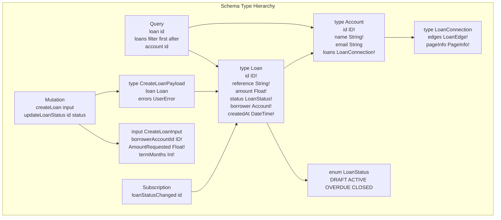

# Schema Design Fundamentals

## Category

GraphQL — Schema & Types

## Context

The GraphQL schema is the **contract** between server and client. Every type, field, argument, and directive is visible to clients via introspection. A schema is written in the **Schema Definition Language (SDL)** and maps directly to resolver functions on the server. Good schema design prioritises expressiveness, evolvability, and client ergonomics — not database fidelity.

### Type System Overview

| Kind | SDL Keyword | Purpose |
|------|------------|---------|
| **Object** | `type` | Named set of fields — the core building block |
| **Interface** | `interface` | Shared shape contract across multiple types |
| **Union** | `union` | One of a set of object types — no shared fields |
| **Enum** | `enum` | Closed set of string values |
| **Scalar** | `scalar` | Primitive leaf values: `String`, `Int`, `Float`, `Boolean`, `ID` + custom |
| **Input** | `input` | Argument type for mutations and queries — cannot be an Object type |

### Nullability Rules

| Rule | Rationale |
|------|----------|
| Make fields nullable by **default** | Partial failure: failed sub-resolver returns `null` rather than erroring the whole query |
| Use `!` (non-null) only when the field is **always populated** | E.g. `id: ID!`, `createdAt: DateTime!` |
| Never make entire query roots non-null | `loan(id: ID!): Loan` not `Loan!` — allows null on not-found |
| Mutation results non-null at the top level | `createLoan(input: CreateLoanInput!): CreateLoanPayload!` — response always present |

### Directive Reference

| Directive | Location | Purpose |
|-----------|---------- |---------|
| `@deprecated(reason)` | Field / Enum value | Mark for removal — shows in introspection tooling |
| `@skip(if: Boolean!)` | Field / Fragment | Client-side conditional inclusion |
| `@include(if: Boolean!)` | Field / Fragment | Client-side conditional inclusion |
| `@specifiedBy(url)` | Custom Scalar | Link to scalar specification |
| Custom `@auth`, `@rateLimit` | Field / Object | Server-defined execution directives (schema directives) |

### SDL Design Anti-patterns

| Anti-pattern | Problem | Fix |
|-------------|---------|-----|
| Returning object type from mutation input | Mutation payload tightly coupled to query type | Use dedicated `Input` and `Payload` types |
| Generic `JSON` scalar for everything | No type safety, breaks code generation | Model the data as proper types |
| Returning array at query root directly | No room to add pagination or metadata | Wrap in a `Connection` type from the start |
| Deeply nested mutations | `updateOrder.items.addProduct` — hard to authorise | Flat mutations with IDs as input |
| Over-using non-null | Single field failure bubbles up entire object tree | Use nullable with partial success pattern |

## Pros

- SDL is readable by non-engineers — schema doubles as living documentation
- Interface and Union types make polymorphic APIs explicit and type-safe
- Custom scalars (`DateTime`, `URL`, `EmailAddress`) enforce domain constraints at the schema boundary
- Directives allow cross-cutting concerns (auth, rate-limiting, deprecation) to be expressed in-schema without logic in every resolver

## Cons

- SDL requires discipline on naming conventions — GraphQL has no built-in namespace, so `LoanStatus` and `OrderStatus` must be globally unique
- Deeply nested types are powerful but can encourage overly complex client queries that are expensive server-side
- Nullability decisions are hard to change after API consumers are in production
- Union types cannot share fields — force clients to use inline fragments for every type

## Design Diagram



## Code Sample

### GraphQL SDL — Loan domain schema

```graphql
# Custom scalars
scalar DateTime
scalar PositiveFloat
scalar EmailAddress

# Shareable interface for audit fields
interface Auditable {
  createdAt: DateTime!
  updatedAt: DateTime!
  createdBy: String!
}

# Loan status as a closed enum — not a String
enum LoanStatus {
  DRAFT
  PENDING_APPROVAL
  ACTIVE
  OVERDUE
  CLOSED
  WRITTEN_OFF
}

enum LoanType {
  PERSONAL
  MORTGAGE
  AUTO
  BUSINESS_TERM
  REVOLVING
}

# Core domain object
type Loan implements Auditable {
  id: ID!
  reference: String!
  amount: PositiveFloat!
  currency: String!
  interestRate: Float!
  termMonths: Int!
  status: LoanStatus!
  type: LoanType!
  borrower: Account!
  repayments: RepaymentConnection!
  # Nullable — only present when overdue
  daysOverdue: Int
  createdAt: DateTime!
  updatedAt: DateTime!
  createdBy: String!
}

type Account implements Auditable {
  id: ID!
  name: String!
  email: EmailAddress
  loans(first: Int, after: String, status: LoanStatus): LoanConnection!
  createdAt: DateTime!
  updatedAt: DateTime!
  createdBy: String!
}

# Relay-compliant Connection
type LoanConnection {
  edges: [LoanEdge!]!
  pageInfo: PageInfo!
  totalCount: Int!
}

type LoanEdge {
  node: Loan!
  cursor: String!
}

type PageInfo {
  hasNextPage: Boolean!
  hasPreviousPage: Boolean!
  startCursor: String
  endCursor: String
}

# Input types are separate from object types
input CreateLoanInput {
  borrowerAccountId: ID!
  amount: PositiveFloat!
  currency: String!
  interestRate: Float!
  termMonths: Int!
  type: LoanType!
}

input LoanFilterInput {
  status: LoanStatus
  type: LoanType
  amountMin: Float
  amountMax: Float
  createdAfter: DateTime
}

# Mutation payloads — union-style error handling
type CreateLoanPayload {
  loan: Loan
  errors: [UserError!]!
}

type UserError {
  message: String!
  field: [String!]
  code: String!
}

# Root operation types
type Query {
  loan(id: ID!): Loan
  loans(filter: LoanFilterInput, first: Int, after: String): LoanConnection!
  account(id: ID!): Account
}

type Mutation {
  createLoan(input: CreateLoanInput!): CreateLoanPayload!
  updateLoanStatus(id: ID!, status: LoanStatus!): CreateLoanPayload!
}

type Subscription {
  loanStatusChanged(loanId: ID!): Loan!
}
```

### TypeScript — Custom scalar definition (server-side, GraphQL Yoga / Apollo)

```typescript
import { GraphQLScalarType, Kind } from 'graphql';

export const DateTimeScalar = new GraphQLScalarType({
  name: 'DateTime',
  description: 'ISO 8601 date-time string',
  serialize(value: unknown): string {
    if (value instanceof Date) return value.toISOString();
    if (typeof value === 'string') return new Date(value).toISOString();
    throw new TypeError(`DateTime cannot serialize value: ${String(value)}`);
  },
  parseValue(value: unknown): Date {
    if (typeof value !== 'string') throw new TypeError('DateTime expects a string');
    const d = new Date(value);
    if (isNaN(d.getTime())) throw new TypeError(`Invalid DateTime: ${value}`);
    return d;
  },
  parseLiteral(ast): Date {
    if (ast.kind !== Kind.STRING) throw new TypeError('DateTime literal must be a string');
    return new Date(ast.value);
  },
});

export const PositiveFloatScalar = new GraphQLScalarType({
  name: 'PositiveFloat',
  description: 'A float > 0',
  serialize: (v) => Number(v),
  parseValue(value: unknown): number {
    const n = Number(value);
    if (!isFinite(n) || n <= 0) throw new TypeError('PositiveFloat must be > 0');
    return n;
  },
  parseLiteral(ast) {
    if (ast.kind !== Kind.FLOAT && ast.kind !== Kind.INT)
      throw new TypeError('PositiveFloat must be a number');
    const n = parseFloat(ast.value);
    if (n <= 0) throw new TypeError('PositiveFloat must be > 0');
    return n;
  },
});
```

## References

- [GraphQL Specification](https://spec.graphql.org/)
- [GraphQL Learn — Schemas and Types](https://graphql.org/learn/schema/)
- [Principled GraphQL](https://principledgraphql.com/)
- [graphql-scalars library](https://the-guild.dev/graphql/scalars)
- [Shopify GraphQL Design Tutorial](https://github.com/Shopify/graphql-design-tutorial)
