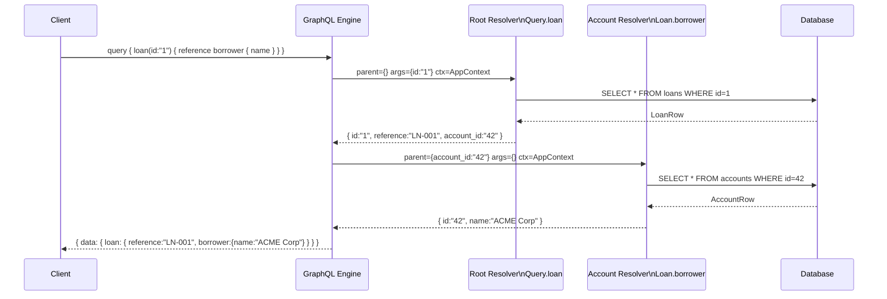

# Resolvers & Data Fetching

## Category

GraphQL — Data Fetching

## Context

A **resolver** is the function that populates data for each field in a GraphQL schema. Execution of a GraphQL query is a tree traversal — starting from root resolvers (`Query`, `Mutation`, `Subscription`) and recursively calling field resolvers for each type. Understanding how the resolver chain works, how context flows, and how the default resolver behaves is foundational to correct and efficient GraphQL server implementation.

### Resolver Signature

Every resolver receives four arguments:

| Argument | Type | Description |
|---------|------|-------------|
| `parent` | `unknown` | Resolved value of the parent field (root resolvers receive `rootValue` or `{}`) |
| `args` | `Record<string, unknown>` | Arguments passed to the field in the query |
| `context` | `AppContext` | Shared per-request object — DB connections, auth user, DataLoaders |
| `info` | `GraphQLResolveInfo` | AST of the current query — field name, path, schema, selected fields |

### Resolution Flow

| Phase | What happens |
|-------|-------------|
| **1. Parse** | Query string → AST |
| **2. Validate** | AST is validated against the schema |
| **3. Execute** | Root resolver called; results passed down as `parent` to child resolvers |
| **4. Coerce** | Scalar serialisers convert raw values to wire format |
| **5. Respond** | `{ data, errors }` JSON response assembled |

### Default Resolver Behaviour

If no resolver is defined for a field, GraphQL uses the **default resolver**: `(parent) => parent[fieldName]`. This means if a root resolver returns a plain JS object, all matching fields resolve automatically — object shape drives automatic resolution.

### Context Object Pattern

| What belongs in context | What does not |
|------------------------|--------------|
| Auth user / JWT claims | Request-local mutation state |
| DB connection / ORM instance | Business logic |
| DataLoader instances (per request) | Shared mutable singletons |
| Logger (per request, with trace ID) | Cached responses (use field-level caching instead) |

## Pros

- Field-level resolution means clients can request exactly what they need — unused fields are never resolved (lazy execution)
- Context injection decouples resolver logic from infrastructure — easy to swap DB or mock in tests
- `info.fieldNodes` allows inspection of the query's selected fields — enables query-driven SQL `SELECT` optimisation
- Parent/child resolver chain allows composable, reusable type resolvers across different root queries

## Cons

- Naive implementation of list field resolvers causes the N+1 query problem (see DataLoader pattern)
- Deep resolver chains can make tracing data flow difficult — observability tooling is essential
- `info.fieldNodes` based SQL projection is complex to implement correctly for aliased fields and fragments
- Async resolver errors at leaf fields result in partial data — callers must handle `data + errors` co-presence

## Design Diagram



## Code Sample

### TypeScript — Resolver map with typed context (GraphQL Yoga / Apollo)

```typescript
import { GraphQLResolveInfo, GraphQLError } from 'graphql';
import type { AppContext } from './context';
import type { Loan, Account, LoanConnection, QueryLoanArgs, QueryLoansArgs } from './generated/types';

export const resolvers = {
  Query: {
    loan: async (
      _parent: unknown,
      args: QueryLoanArgs,
      ctx: AppContext,
      _info: GraphQLResolveInfo
    ): Promise<Loan | null> => {
      const loan = await ctx.db.loan.findUnique({ where: { id: args.id } });
      return loan ?? null;
    },

    loans: async (
      _parent: unknown,
      args: QueryLoansArgs,
      ctx: AppContext
    ): Promise<LoanConnection> => {
      const { first = 20, after, filter } = args;
      return ctx.loaders.loanConnection.load({ first, after, filter });
    },
  },

  Mutation: {
    createLoan: async (_parent: unknown, { input }: { input: CreateLoanInput }, ctx: AppContext) => {
      // Authorisation check before any data access
      if (!ctx.user) throw new GraphQLError('Unauthenticated', { extensions: { code: 'UNAUTHENTICATED' } });

      const errors = validateCreateLoan(input);
      if (errors.length > 0) return { loan: null, errors };

      const loan = await ctx.db.loan.create({ data: mapInputToEntity(input, ctx.user.id) });
      return { loan, errors: [] };
    },
  },

  // Type resolver — Loan.borrower
  Loan: {
    borrower: (parent: Loan, _args: unknown, ctx: AppContext): Promise<Account> => {
      // Uses DataLoader to batch — see 03-dataloader-batching.md
      return ctx.loaders.accountById.load(parent.borrowerAccountId);
    },

    // Compute derived field — not stored in DB
    daysOverdue: (parent: Loan): number | null => {
      if (parent.status !== 'OVERDUE' || !parent.dueDateOverride) return null;
      const diff = Date.now() - new Date(parent.dueDateOverride).getTime();
      return Math.floor(diff / 86_400_000);
    },
  },

  // Abstract type resolver — needed for Interface or Union
  SearchResult: {
    __resolveType(obj: { __typename?: string; loanId?: string; accountId?: string }) {
      if (obj.__typename) return obj.__typename;
      if ('loanId' in obj) return 'Loan';
      if ('accountId' in obj) return 'Account';
      return null;
    },
  },
};
```

### TypeScript — Context factory (per-request context creation)

```typescript
import { PrismaClient } from '@prisma/client';
import { createAccountLoader, createLoanConnectionLoader } from './loaders';
import { verifyJwt } from './auth';
import type { Request } from 'express';

const prisma = new PrismaClient();

export interface AppContext {
  db: PrismaClient;
  user: { id: string; roles: string[] } | null;
  loaders: {
    accountById: ReturnType<typeof createAccountLoader>;
    loanConnection: ReturnType<typeof createLoanConnectionLoader>;
  };
  requestId: string;
}

export async function buildContext(req: Request): Promise<AppContext> {
  const token = req.headers.authorization?.replace('Bearer ', '') ?? null;
  const user = token ? await verifyJwt(token) : null;

  return {
    db:          prisma,
    user,
    // DataLoader instances are created fresh per request to avoid cross-request cache contamination
    loaders: {
      accountById:      createAccountLoader(prisma),
      loanConnection:   createLoanConnectionLoader(prisma),
    },
    requestId: req.headers['x-request-id'] as string ?? crypto.randomUUID(),
  };
}
```

### TypeScript — Info-based query projection (select only requested SQL columns)

```typescript
import { GraphQLResolveInfo } from 'graphql';
import { parseResolveInfo, ResolveTree } from 'graphql-parse-resolve-info';

function getSelectedFields(info: GraphQLResolveInfo): string[] {
  const parsed = parseResolveInfo(info) as ResolveTree;
  const fields = Object.keys(parsed.fieldsByTypeName['Loan'] ?? {});
  // Always include id for DataLoader caching
  return Array.from(new Set(['id', ...fields]));
}

// In the root resolver:
const loan = async (_parent: unknown, args: { id: string }, ctx: AppContext, info: GraphQLResolveInfo) => {
  const select = getSelectedFields(info).reduce(
    (acc, f) => ({ ...acc, [f]: true }), {} as Record<string, boolean>
  );
  return ctx.db.loan.findUnique({ where: { id: args.id }, select });
};
```

## References

- [GraphQL Execution](https://graphql.org/learn/execution/)
- [GraphQL Yoga — Resolvers](https://the-guild.dev/graphql/yoga-server/docs/features/resolvers)
- [Apollo Server — Resolvers](https://www.apollographql.com/docs/apollo-server/data/resolvers/)
- [graphql-parse-resolve-info](https://github.com/graphile/graphile-engine/tree/main/packages/graphql-parse-resolve-info)
