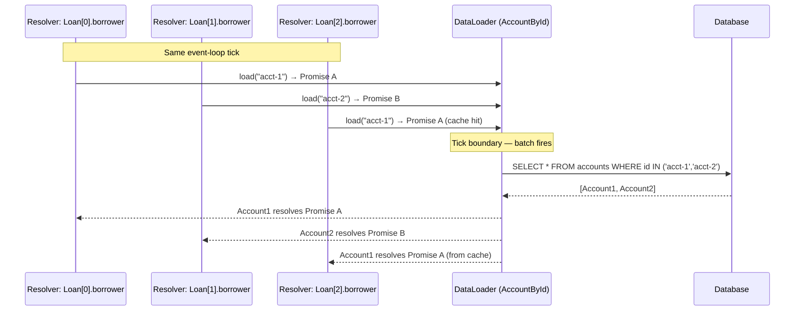

# DataLoader & Batching

## Category

GraphQL — Data Fetching

## Context

The **N+1 problem** is the most common performance issue in GraphQL servers. When a query fetches a list of N objects and each object has a field that requires its own database lookup, the server makes 1 + N database queries instead of 2 (one for the list, one batched fetch for related records). **DataLoader** solves this by coalescing multiple load calls within a single event-loop tick into a single batch request.

### N+1 Anatomy

```
Query: { loans { borrower { name } } }

Without DataLoader:
  SELECT * FROM loans                          -- 1 query
  SELECT * FROM accounts WHERE id = 'acct-1'  -- 1 per loan (N queries)
  SELECT * FROM accounts WHERE id = 'acct-2'
  SELECT * FROM accounts WHERE id = 'acct-3'
  ...                                          -- total: 1 + N

With DataLoader:
  SELECT * FROM loans                          -- 1 query
  SELECT * FROM accounts WHERE id IN (         -- 1 batch query
    'acct-1', 'acct-2', 'acct-3', ...
  )                                            -- total: 2
```

### DataLoader Mechanics

| Step | Event | Action |
|------|-------|--------|
| **Queue** | Resolver calls `loader.load(key)` | Key added to the batch queue; Promise returned |
| **Tick end** | Node.js event loop tick completes | DataLoader fires the batch function with all queued keys |
| **Batch fn** | Executes once per tick | DB query with all keys; returns values in same key order |
| **Fulfil** | Results mapped back to individual promises | Each resolver's `load()` promise resolves |

### DataLoader Caching

| Behaviour | Description |
|----------|-------------|
| **Per-request cache** | Each DataLoader instance has an internal `Map<key, Promise>` — same key in the same request returns the cached promise |
| **Request isolation** | DataLoaders must be created **per request** inside the context factory — never share a single loader across requests |
| **Cache invalidation** | Call `loader.clear(key)` or `loader.clearAll()` after mutations that change the cached entity |
| **Cache priming** | Call `loader.prime(key, value)` to pre-populate the cache from data you already fetched |

## Pros

- Eliminates N+1 with no changes to resolver logic — resolvers still call `loader.load(id)` individually
- In-request caching prevents duplicate fetches even when the same entity is referenced from multiple paths in the same query
- Cache priming allows root resolvers to hydrate loaders ahead of time when all data is already available
- Works with any async data source — DB, REST API, gRPC — as long as the batch function is implemented

## Cons

- DataLoader batching is per event-loop tick — deeply nested queries may generate multiple smaller batches if the tick boundary falls between resolution levels
- The batch function must return results in the **exact same order** as the input keys — easy to get wrong silently; missing keys must be represented as `null` (not omitted)
- Per-request instance creation has a small allocation cost — negligible in practice
- Does not prevent unbounded list loads; still need to cap page sizes to limit maximum batch sizes

## Design Diagram



## Code Sample

### TypeScript — DataLoader for accounts by ID (Prisma)

```typescript
import DataLoader from 'dataloader';
import type { PrismaClient, Account } from '@prisma/client';

export function createAccountLoader(db: PrismaClient) {
  return new DataLoader<string, Account | null>(
    async (ids: readonly string[]) => {
      const accounts = await db.account.findMany({
        where: { id: { in: ids as string[] } },
      });

      // Build a map for O(1) lookup
      const accountMap = new Map<string, Account>(
        accounts.map(a => [a.id, a])
      );

      // CRITICAL: return values in the same order as input keys
      // DataLoader requires index alignment — missing values must be null, not omitted
      return ids.map(id => accountMap.get(id) ?? null);
    },
    {
      // Disable caching if mutation invalidation is not implemented
      // cache: false,
      maxBatchSize: 1000,
    }
  );
}
```

### TypeScript — DataLoader for a one-to-many relationship (Loan[] by accountId)

```typescript
import DataLoader from 'dataloader';
import type { PrismaClient, Loan } from '@prisma/client';

export function createLoansByAccountLoader(db: PrismaClient) {
  return new DataLoader<string, Loan[]>(
    async (accountIds: readonly string[]) => {
      const loans = await db.loan.findMany({
        where: { borrowerAccountId: { in: accountIds as string[] } },
        orderBy: { createdAt: 'desc' },
      });

      // Group loans by accountId
      const loansByAccount = new Map<string, Loan[]>();
      for (const loan of loans) {
        const bucket = loansByAccount.get(loan.borrowerAccountId) ?? [];
        bucket.push(loan);
        loansByAccount.set(loan.borrowerAccountId, bucket);
      }

      // Return in key order — missing account IDs get empty array, not null
      return accountIds.map(id => loansByAccount.get(id) ?? []);
    }
  );
}
```

### TypeScript — Cache invalidation and priming after mutation

```typescript
import type { AppContext } from './context';

// After updating an account — clear its loader cache entry
export async function updateAccountName(
  id: string,
  name: string,
  ctx: AppContext
): Promise<Account> {
  const updated = await ctx.db.account.update({
    where: { id },
    data: { name },
  });

  // Invalidate the now-stale cache entry
  ctx.loaders.accountById.clear(id);

  // Prime with the fresh value to avoid an immediate re-fetch
  ctx.loaders.accountById.prime(id, updated);

  return updated;
}
```

### TypeScript — Context factory wiring DataLoaders per request

```typescript
import { createAccountLoader } from './loaders/account-loader';
import { createLoansByAccountLoader } from './loaders/loans-by-account-loader';

export async function buildContext(req: Request): Promise<AppContext> {
  const user = await resolveUser(req);
  const db = getPrismaClient();

  return {
    db,
    user,
    loaders: {
      // Each loader instantiated fresh — no cross-request cache contamination
      accountById:        createAccountLoader(db),
      loansByAccount:     createLoansByAccountLoader(db),
    },
    requestId: req.headers['x-request-id'] ?? crypto.randomUUID(),
  };
}
```

## References

- [DataLoader — GitHub](https://github.com/graphql/dataloader)
- [DataLoader Caching Docs](https://github.com/graphql/dataloader#caching)
- [The N+1 Problem in GraphQL](https://shopify.engineering/solving-the-n-1-problem-for-graphql-through-batching)
- [graphql-dataloader-factory](https://the-guild.dev/graphql/tools)
