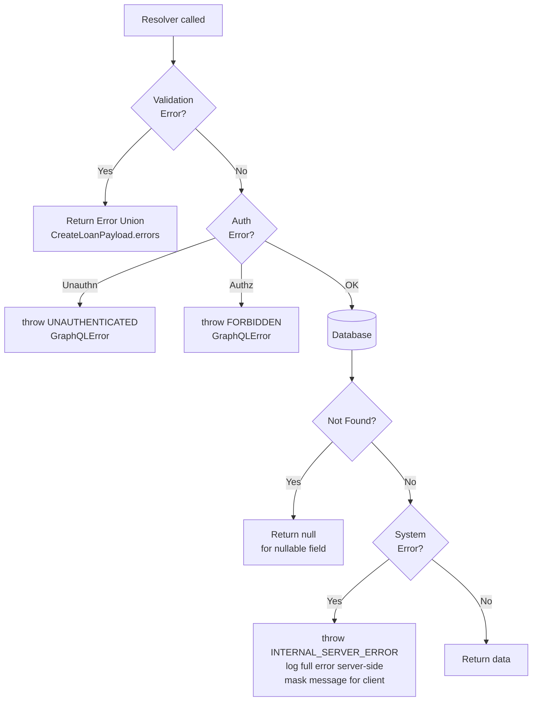

# Error Handling

## Category

GraphQL — Error & Edge Cases

## Context

GraphQL has a unique error model: a response can simultaneously contain **partial data and errors** (`{ data: {...}, errors: [...] }`). This is intentional — nullable fields allow child resolvers to fail without invalidating the entire response. Understanding when to throw, when to return `null`, and when to use **error union types** determines how predictable and useful your API errors are for clients.

### Error Response Anatomy

```json
{
  "data": {
    "loan": {
      "id": "123",
      "borrower": null
    }
  },
  "errors": [
    {
      "message": "Account not found",
      "locations": [{ "line": 3, "column": 5 }],
      "path": ["loan", "borrower"],
      "extensions": {
        "code": "NOT_FOUND",
        "entityType": "Account",
        "entityId": "acct-999"
      }
    }
  ]
}
```

### Error Strategy Comparison

| Strategy | Errors Appear In | Client Handling | When to Use |
|---------|-----------------|----------------|------------|
| **Throw `GraphQLError`** | `errors[]` array | Must check `errors` presence | Unexpected/system errors, auth failures |
| **Return `null`** | `errors[]` (if resolver throws internally) or silent | Check for null | Not-found on nullable field |
| **Error Union (`Result` type)** | `data` field | Type discriminator on `__typename` | Mutation business rule failures |
| **`extensions.code`** | `errors[].extensions` | Switch on `code` string | Structured machine-readable error codes |

### Standard Error Extension Codes

| Code | Meaning | HTTP analogue |
|------|---------|--------------|
| `UNAUTHENTICATED` | No valid credentials | 401 |
| `FORBIDDEN` | Valid credentials, insufficient permission | 403 |
| `NOT_FOUND` | Requested entity does not exist | 404 |
| `BAD_USER_INPUT` | Validation failure on input arguments | 400 |
| `CONFLICT` | Duplicate entity, state machine violation | 409 |
| `INTERNAL_SERVER_ERROR` | Unexpected server error (never expose internals) | 500 |

## Pros

- Error unions in `data` are strongly typed — code-generated clients know all possible error shapes at compile time
- `extensions.code` is machine-readable — clients can switch on error codes without parsing `message` strings
- Partial data + errors allows a page to render with most data even when a secondary widget fails
- `GraphQLError` wraps underlying errors — inner exception can be logged server-side without leaking to the client

## Cons

- Partial success (`data != null AND errors != null`) is surprising for engineers used to HTTP status codes — client SDK must always check `errors`
- Error unions increase schema verbosity — every mutation needs a dedicated `Payload` type
- `throw` errors from resolvers abort the field and all its children — a system error in a deeply nested field can null out a large portion of the response
- Stack traces must never appear in `extensions` in production — requires explicit stripping in error formatting

## Design Diagram



## Code Sample

### GraphQL SDL — Error union mutation pattern

```graphql
type Mutation {
  createLoan(input: CreateLoanInput!): CreateLoanPayload!
  updateLoanStatus(id: ID!, status: LoanStatus!): UpdateLoanStatusPayload!
}

# Each mutation has its own result payload
type CreateLoanPayload {
  loan: Loan                # null when errors present
  errors: [UserError!]!    # empty array on success
}

type UpdateLoanStatusPayload {
  loan: Loan
  errors: [UserError!]!
}

# Structured user-facing error
type UserError {
  message: String!
  field: [String!]         # dotted path: ["input", "amount"]
  code: String!            # BAD_USER_INPUT, CONFLICT, etc.
}
```

### TypeScript — Error formatting + code injection (Apollo Server / Yoga)

```typescript
import { GraphQLError, GraphQLFormattedError } from 'graphql';

// Custom error classes for structured throwing
export class NotFoundError extends GraphQLError {
  constructor(entityType: string, id: string) {
    super(`${entityType} with id ${id} not found`, {
      extensions: { code: 'NOT_FOUND', entityType, entityId: id },
    });
  }
}

export class ConflictError extends GraphQLError {
  constructor(message: string) {
    super(message, {
      extensions: { code: 'CONFLICT' },
    });
  }
}

// Error formatter — strips stack traces in production, sanitises messages
export function formatError(
  formattedError: GraphQLFormattedError,
  error: unknown
): GraphQLFormattedError {
  const originalError = formattedError.extensions?.originalError as Error | undefined;

  // Never expose internal error details to clients
  if (
    !formattedError.extensions?.code ||
    formattedError.extensions.code === 'INTERNAL_SERVER_ERROR'
  ) {
    console.error('[GraphQL Error]', { formattedError, originalError });
    return {
      message: 'An unexpected error occurred. Please try again.',
      extensions: { code: 'INTERNAL_SERVER_ERROR' },
    };
  }

  // Remove stack trace in all environments
  const { stacktrace: _, ...safeExtensions } = formattedError.extensions as Record<string, unknown>;

  return { ...formattedError, extensions: safeExtensions };
}
```

### TypeScript — Mutation resolver using error union

```typescript
const resolvers = {
  Mutation: {
    createLoan: async (_: unknown, { input }: { input: CreateLoanInput }, ctx: AppContext) => {
      // 1. Auth gate — not a user error, a system error
      if (!ctx.user) throw new GraphQLError('Unauthenticated', {
        extensions: { code: 'UNAUTHENTICATED' }
      });

      // 2. Validation — returned as user errors, not thrown
      const errors = validateCreateLoanInput(input);
      if (errors.length > 0) return { loan: null, errors };

      // 3. Business rule check — also a user error
      const existing = await ctx.db.loan.findFirst({
        where: { reference: input.reference }
      });
      if (existing) {
        return {
          loan: null,
          errors: [{ message: 'A loan with this reference already exists', code: 'CONFLICT', field: ['input', 'reference'] }]
        };
      }

      // 4. DB — genuine system errors propagate as thrown errors
      const loan = await ctx.db.loan.create({ data: mapInput(input) });
      return { loan, errors: [] };
    },
  },
};

// Validation helper — returns UserError[]
function validateCreateLoanInput(input: CreateLoanInput): UserError[] {
  const errors: UserError[] = [];
  if (input.amount <= 0) {
    errors.push({ message: 'Amount must be positive', code: 'BAD_USER_INPUT', field: ['input', 'amount'] });
  }
  if (input.termMonths < 1 || input.termMonths > 360) {
    errors.push({ message: 'Term must be between 1 and 360 months', code: 'BAD_USER_INPUT', field: ['input', 'termMonths'] });
  }
  return errors;
}
```

### TypeScript — Client-side error handling (Apollo Client)

```typescript
import { useMutation } from '@apollo/client';
import { CREATE_LOAN } from './mutations';

function LoanForm() {
  const [createLoan] = useMutation(CREATE_LOAN, {
    onError(networkError) {
      // Network-level or UNAUTHENTICATED/FORBIDDEN errors land here
      console.error('Network/auth error:', networkError.graphQLErrors);
    },
  });

  async function submit(input: CreateLoanInput) {
    const { data } = await createLoan({ variables: { input } });
    const result = data?.createLoan;

    if (!result) return;

    // Business rule errors land in data.createLoan.errors — not in onError
    if (result.errors.length > 0) {
      result.errors.forEach(e => {
        const field = e.field?.join('.') ?? 'general';
        setFieldError(field, e.message);
      });
      return;
    }

    // Success
    navigate(`/loans/${result.loan.id}`);
  }
}
```

## References

- [GraphQL Errors Spec](https://spec.graphql.org/draft/#sec-Errors)
- [GraphQL Error Handling Best Practices — The Guild](https://the-guild.dev/blog/graphql-error-handling-with-fp)
- [Apollo Server Error Handling](https://www.apollographql.com/docs/apollo-server/data/errors/)
- [Production-Ready Error Formatting](https://www.apollographql.com/docs/apollo-server/performance/cache-hints/)
