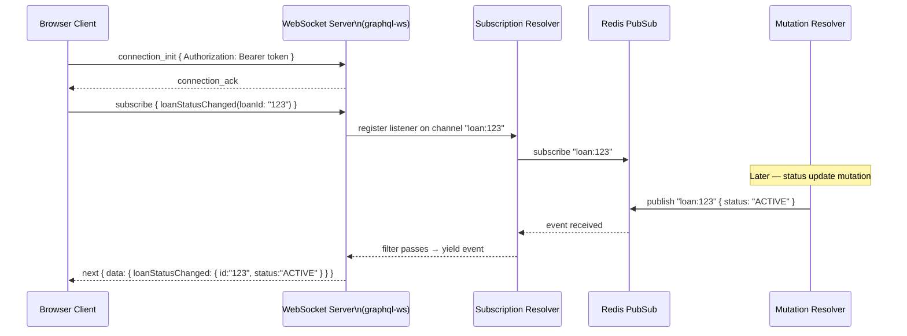

# Subscriptions & Real-time

## Category

GraphQL — Real-time

## Context

GraphQL **subscriptions** are long-lived operations that push server-side events to connected clients. They share the same type system and SDL as queries and mutations but use a persistent transport — typically **WebSocket** (via the `graphql-ws` protocol) or **Server-Sent Events (SSE)**. Subscriptions are fired by resolvers that return an async iterable or observable.

### Transport Comparison

| Protocol | Library | Direction | Reconnect | Auth | When to Use |
|---------|---------|----------|----------|------|------------|
| **WebSocket** (`graphql-ws`) | `graphql-ws` | Bidirectional | Client must handle | Via `connectionParams` | Low-latency push, multi-subscription per connection |
| **SSE** (`graphql-sse`) | `graphql-sse` | Server → Client only | Browser auto-reconnects | HTTP headers | Simple browser push, firewall-friendly |
| **Long polling** | Polling query with `pollInterval` | Request/response loop | N/A | Standard HTTP | Legacy env without WebSocket support |

### Subscription Lifecycle

| Phase | Description |
|-------|-------------|
| **Subscribe** | Client sends `subscribe` message with the operation; server registers a listener |
| **Event received** | Server emits an event on a PubSub channel; subscription resolver filters/maps it |
| **Next** | Server sends `next` message with data payload to all matching subscribers |
| **Complete** | Client or server sends `complete`; connection closed for that subscription |
| **Error** | Server sends `error`; subscription terminates |

### PubSub Options

| PubSub Implementation | Scalable? | When to Use |
|----------------------|----------|------------|
| `graphql-subscriptions` (in-process) | ❌ single process | Development, single-instance deployments |
| Redis Pub/Sub | ✅ | Multi-instance production — all servers connect to Redis |
| Kafka | ✅ | High-throughput event-driven architectures |
| Database LISTEN/NOTIFY (PostgreSQL) | ✅ limited | Low-volume, Postgres-native without extra infra |

## Pros

- Real-time push reduces client polling and its associated server load
- Subscriptions reuse the same schema type system — no separate WebSocket protocol to define
- SSE is HTTP-based — passes through most corporate firewalls without special configuration
- Subscription resolvers can filter events per-subscriber — only relevant events are pushed

## Cons

- WebSocket connections are stateful — horizontal scaling requires all instances to share a PubSub bus (Redis)
- Unbounded subscriptions are a DoS vector — must limit concurrent subscriptions per connection and enforce auth
- GraphQL Yoga / Apollo Server handle subscriptions differently — library choice matters early
- SSE does not support bidirectional messaging — clients cannot send messages after subscribing

## Design Diagram



## Code Sample

### GraphQL SDL — Subscription operation

```graphql
type Subscription {
  # Subscribe to status changes for a specific loan
  loanStatusChanged(loanId: ID!): LoanStatusEvent!

  # Subscribe to all new loans for a manager view (auth: MANAGER required)
  newLoanCreated: Loan! @auth(requires: MANAGER)
}

type LoanStatusEvent {
  loanId:    ID!
  oldStatus: LoanStatus!
  newStatus: LoanStatus!
  changedAt: DateTime!
  changedBy: String!
}
```

### TypeScript — Subscription resolver with Redis PubSub filtering

```typescript
import { createClient } from 'redis';
import { RedisPubSub } from 'graphql-redis-subscriptions';

const redis = createClient({ url: process.env.REDIS_URL });
const pubsub = new RedisPubSub({
  publisher:  createClient({ url: process.env.REDIS_URL }),
  subscriber: createClient({ url: process.env.REDIS_URL }),
});

const LOAN_STATUS_CHANGED = 'LOAN_STATUS_CHANGED';

export const subscriptionResolvers = {
  Subscription: {
    loanStatusChanged: {
      // subscribe must return an AsyncIterable
      subscribe: async function* (
        _parent: unknown,
        args: { loanId: string },
        ctx: AppContext
      ) {
        // Auth check at subscribe time
        if (!ctx.user) throw new GraphQLError('Unauthenticated', {
          extensions: { code: 'UNAUTHENTICATED' }
        });

        const iterator = pubsub.asyncIterator<LoanStatusEvent>(LOAN_STATUS_CHANGED);

        // Wrap iterator with per-subscriber filter
        for await (const event of iterator) {
          if (event.loanId === args.loanId) {
            yield event;
          }
        }
      },
      // resolve is applied after subscribe yields an event
      resolve: (payload: LoanStatusEvent) => payload,
    },
  },
};

// Publisher — called from the mutation resolver after a status change
export async function publishLoanStatusChange(event: LoanStatusEvent): Promise<void> {
  await pubsub.publish(LOAN_STATUS_CHANGED, event);
}
```

### TypeScript — Mutation resolver publishes to PubSub

```typescript
import { publishLoanStatusChange } from './subscriptions';

const resolvers = {
  Mutation: {
    updateLoanStatus: async (_: unknown, { id, status }: UpdateLoanStatusArgs, ctx: AppContext) => {
      if (!ctx.user) throw new GraphQLError('Unauthenticated', { extensions: { code: 'UNAUTHENTICATED' } });

      const existing = await ctx.db.loan.findUnique({ where: { id } });
      if (!existing) return { loan: null, errors: [{ message: 'Loan not found', code: 'NOT_FOUND', field: ['id'] }] };

      const updated = await ctx.db.loan.update({
        where: { id },
        data: { status, updatedAt: new Date(), updatedBy: ctx.user.id },
      });

      // Fire-and-forget publish — do not await to keep mutation response fast
      publishLoanStatusChange({
        loanId:    id,
        oldStatus: existing.status,
        newStatus: status,
        changedAt: new Date().toISOString(),
        changedBy: ctx.user.id,
      }).catch(err => console.error('PubSub publish failed', err));

      return { loan: updated, errors: [] };
    },
  },
};
```

### TypeScript — Client-side subscription (Apollo Client)

```typescript
import { useSubscription, gql } from '@apollo/client';

const LOAN_STATUS_CHANGED = gql`
  subscription LoanStatusChanged($loanId: ID!) {
    loanStatusChanged(loanId: $loanId) {
      loanId
      oldStatus
      newStatus
      changedAt
    }
  }
`;

function LoanStatusBadge({ loanId }: { loanId: string }) {
  const { data, error } = useSubscription(LOAN_STATUS_CHANGED, {
    variables: { loanId },
  });

  if (error) return <span>Disconnected</span>;
  const status = data?.loanStatusChanged?.newStatus ?? 'Loading...';
  return <span className={`badge badge-${status.toLowerCase()}`}>{status}</span>;
}
```

## References

- [graphql-ws Protocol](https://github.com/enisdenjo/graphql-ws)
- [graphql-sse](https://github.com/enisdenjo/graphql-sse)
- [graphql-redis-subscriptions](https://github.com/davidyaha/graphql-redis-subscriptions)
- [GraphQL Subscriptions Spec](https://spec.graphql.org/draft/#sec-Subscription)
- [Apollo Client Subscriptions](https://www.apollographql.com/docs/react/data/subscriptions/)
