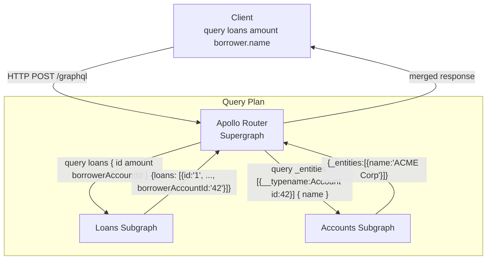

# Federation & Supergraph

## Category

GraphQL — Architecture

## Context

**Apollo Federation v2** is the dominant architecture for composing multiple team-owned GraphQL services (subgraphs) into a single unified API (supergraph). Clients query one endpoint — the **Apollo Router** — which plans and routes sub-queries to the appropriate subgraphs using **query planning**. Each subgraph owns a slice of the schema and can reference types defined in other subgraphs using `@key` and `@external`.

### Federation Core Directives

| Directive | Usage | Description |
|-----------|-------|-------------|
| `@key(fields)` | On type definition | Marks the type as an **entity** — resolvable by its primary key across subgraphs |
| `@external` | On field | Marks a field as defined in another subgraph (used for query planning) |
| `@requires(fields)` | On field | Field needs `@external` fields from the owning subgraph to resolve |
| `@provides(fields)` | On field | Hints that this resolver can return a sibling's fields inline, avoiding a fetch |
| `@override(from)` | On field | Migrates a field from one subgraph to another — for incremental migration |
| `@shareable` | On type or field | Marks a value type as safe to be defined in multiple subgraphs |
| `@inaccessible` | On type or field | Hides the type or field from the client-facing composed schema |

### Entity Resolution Flow

When the Router needs to resolve `Loan.borrower` (owned by the `accounts` subgraph):
1. `loans` subgraph returns `{ __typename: "Account", id: "acct-42" }` — a **representation**
2. Router sends an `_entities` query to the `accounts` subgraph with the representation
3. `accounts` subgraph resolves `Account` by its `@key` field (`id`) and returns the full object

### Subgraph Responsibilities

| Subgraph | Owns | References |
|----------|------|-----------|
| `loans` | `Loan`, `Repayment` | `Account` (by `@key`) |
| `accounts` | `Account` | — |
| `notifications` | `Notification` | `Loan`, `Account` (by `@key`) |

## Pros

- Subgraphs are independently deployable — a change to the `accounts` schema does not require redeploying `loans`
- Rover CLI schema checks catch breaking changes before deployment — prevents runtime failures
- `@override` enables safe field ownership migration without a big-bang cut-over
- The Router's query plan is deterministic and precomputed — no runtime overhead for planning simple queries
- Each subgraph can use a different runtime, database, and programming language

## Cons

- Federation adds operational complexity — Rover CLI, Router configuration, schema registry must be managed
- Entity resolution adds a network round-trip per entity type — misuse of nested entities can be slower than a monolith
- `@requires` creates a dependency on `@external` fields — if the owning subgraph changes the field, the depending subgraph breaks
- Local development with multiple subgraphs requires composition tooling (`rover dev`) — harder than a single server

## Design Diagram



## Code Sample

### GraphQL SDL — Loans subgraph (defines `Loan`, references `Account`)

```graphql
# loans subgraph schema
extend schema @link(url: "https://specs.apollo.dev/federation/v2.3", import: ["@key", "@external"])

type Loan @key(fields: "id") {
  id:               ID!
  reference:        String!
  amount:           Float!
  status:           LoanStatus!
  borrowerAccountId: ID!
  # Field that references Account — @external marks it as owned by accounts subgraph
  borrower: Account!
}

# Stub for Account — owned by accounts subgraph
type Account @key(fields: "id") {
  id: ID! @external
}

type Query {
  loan(id: ID!): Loan
  loans(first: Int, after: String): LoanConnection!
}
```

### GraphQL SDL — Accounts subgraph (defines `Account`, resolves entity requests)

```graphql
# accounts subgraph schema
extend schema @link(url: "https://specs.apollo.dev/federation/v2.3", import: ["@key", "@shareable"])

type Account @key(fields: "id") {
  id:    ID!
  name:  String!
  email: String
  # Account points back to loans — @shareable because both subgraphs can return this
  tier:  AccountTier! @shareable
}

enum AccountTier {
  STANDARD
  PREMIUM
  CORPORATE
}

type Query {
  account(id: ID!): Account
  me: Account
}
```

### TypeScript — Reference resolver in Accounts subgraph (entity resolution)

```typescript
import { buildSubgraphSchema } from '@apollo/subgraph';

const resolvers = {
  Account: {
    // __resolveReference is called by the Router for entity resolution
    __resolveReference: async (
      reference: { __typename: 'Account'; id: string },
      ctx: AppContext
    ) => {
      return ctx.loaders.accountById.load(reference.id);
    },
  },
  Query: {
    account: (_: unknown, { id }: { id: string }, ctx: AppContext) =>
      ctx.db.account.findUnique({ where: { id } }),
    me: (_: unknown, __: unknown, ctx: AppContext) => {
      if (!ctx.user) throw new GraphQLError('Unauthenticated', { extensions: { code: 'UNAUTHENTICATED' } });
      return ctx.db.account.findUnique({ where: { id: ctx.user.id } });
    },
  },
};

export const schema = buildSubgraphSchema({ typeDefs, resolvers });
```

### YAML — Apollo Router configuration

```yaml
# router.yaml
supergraph:
  listen: 0.0.0.0:4000

# Subgraph service URLs
override_subgraph_url:
  loans:    http://loans-service:4001/graphql
  accounts: http://accounts-service:4002/graphql

# Header propagation — forward auth to all subgraphs
headers:
  all:
    request:
      - propagate:
          named: authorization
      - propagate:
          named: x-request-id

# Query depth and complexity limits
limits:
  max_depth: 10
  max_height: 200
  max_aliases: 30
  max_root_fields: 20

# Trusted documents (persisted queries)
persisted_queries:
  enabled: true
  safelist:
    enabled: true
    require_id: true

telemetry:
  exporters:
    tracing:
      otlp:
        endpoint: http://otel-collector:4317
```

### Shell — Rover CLI subgraph publish + composition check

```shell
# Publish loans subgraph schema to Apollo GraphOS
rover subgraph publish my-graph@production \
  --schema ./loans/schema.graphql \
  --name loans \
  --routing-url https://loans.internal/graphql

# Check for breaking changes before deploy
rover subgraph check my-graph@production \
  --schema ./loans/schema.graphql \
  --name loans

# Compose locally for development
rover supergraph compose --config ./supergraph.yaml > supergraph.graphql

# Start local dev Router with all subgraphs
rover dev \
  --supergraph-config ./supergraph.yaml \
  --router-config ./router.yaml
```

## References

- [Apollo Federation v2 Docs](https://www.apollographql.com/docs/federation/)
- [Rover CLI](https://www.apollographql.com/docs/rover/)
- [Apollo Router](https://www.apollographql.com/docs/router/)
- [Federation Directives Reference](https://www.apollographql.com/docs/federation/federated-types/federated-directives/)
- [Federation Design Principles](https://principledgraphql.com/integrity)
