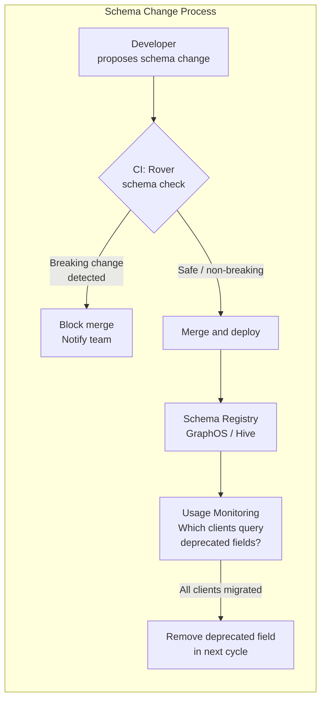

# Schema Evolution & Versioning

## Category

GraphQL — Schema & Types

## Context

GraphQL is explicitly designed for **versionless APIs** — the schema evolves additively and clients always request exactly the fields they need. The GraphQL specification defines a concept of **deprecation** for retiring fields gracefully. Tooling like **Rover CLI**, **GraphQL Inspector**, and **Hive** automates breaking change detection in CI pipelines.

### Change Classification

| Change Type | Breaking? | Example |
|-------------|----------|---------|
| Add new field to type | ✅ Safe | `Loan.interestRateActual: Float` |
| Add new type | ✅ Safe | `type Collateral { ... }` |
| Add nullable argument | ✅ Safe | `loans(currency: String)` |
| Add value to enum | ⚠️ Dangerous | Clients doing exhaustive switch may break |
| Deprecate field | ✅ Safe | `@deprecated(reason: "Use interestRate")` |
| Remove non-deprecated field | ❌ Breaking | Clients querying that field receive null + error |
| Change field type | ❌ Breaking | `amount: Int` → `amount: Float` |
| Make nullable field non-null | ❌ Breaking | `name: String` → `name: String!` |
| Rename field | ❌ Breaking | Always add new name, deprecate old, remove later |
| Remove required argument | ⚠️ Dangerous | Clients passing the arg may behave unexpectedly |
| Add required (non-null) input field | ❌ Breaking | Existing client mutations omitting the field fail |

### Field Deprecation Lifecycle

```
Phase 1: Add new field (safe)
  loanReference: String!        # new, preferred name
  reference: String! @deprecated(reason: "Use loanReference instead")

Phase 2: Observe usage (weeks/months)
  Monitor: does any client still query `reference`?

Phase 3: Remove deprecated field (breaking — coordinate with all clients)
```

### Schema Change Detection Tools

| Tool | Integration | What it detects |
|------|------------|----------------|
| **Rover CLI** (`rover subgraph check`) | CI/CD | Breaking changes vs published schema in GraphOS |
| **GraphQL Inspector** | GitHub Action | Breaking, dangerous, non-breaking diffs |
| **Hive** | Schema registry | History, usage analytics, breaking change gate |
| **graphql-schema-diff** | CLI / CI | Local diff of two schema files |

## Pros

- Additive-only changes are always safe — a well-disciplined team can evolve the schema continuously without versioning
- `@deprecated` is visible in client tooling (GraphiQL, Apollo Studio) — consumers are automatically notified
- Usage analytics from Apollo Studio / Hive show which deprecated fields are still actively queried — removes guesswork from removal timing
- `@override` in Federation migrates fields between subgraphs incrementally without a client-breaking cut-over

## Cons

- Enum value additions are silently dangerous — TypeScript discriminated unions and exhaustive switches on the client will not catch unknown values at compile time
- Field renaming requires a deprecation period — cannot be done in a single deploy like a DB column rename
- Schema drift across federation subgraphs requires active governance — teams add similar types with different names
- Without a schema registry, there is no automated way to know if a deprecated field is still in use

## Design Diagram



## Code Sample

### GraphQL SDL — Deprecation in practice

```graphql
type Loan {
  id: ID!

  # Original field — deprecated in favour of structured type
  interestRatePercent: Float @deprecated(reason: "Use interestDetails.ratePercent instead (added v2.1)")

  # Replacement — richer structure
  interestDetails: InterestDetails!

  # Renamed field — old name kept for backward compatibility
  reference: String! @deprecated(reason: "Use loanReference. Will be removed 2025-Q1.")
  loanReference: String!
}

type InterestDetails {
  ratePercent:  Float!
  rateType:     InterestRateType!
  effectiveDate: DateTime!
}

enum InterestRateType {
  FIXED
  VARIABLE
  # New value — clients must handle unknown enum values gracefully
  TRACKER @deprecated(reason: "Use VARIABLE — TRACKER unified into VARIABLE as of 2025-Q2")
}
```

### Shell — GraphQL Inspector in CI (GitHub Actions)

```yaml
# .github/workflows/schema-check.yml
name: GraphQL Schema Check

on:
  pull_request:
    paths:
      - 'src/schema/**'
      - '**/*.graphql'

jobs:
  schema-check:
    runs-on: ubuntu-latest
    steps:
      - uses: actions/checkout@v4
        with:
          fetch-depth: 0  # needed to get base branch schema

      - uses: actions/setup-node@v4
        with:
          node-version: 20

      - run: npm ci

      # Compare current branch schema against main
      - name: Check for breaking changes
        run: |
          npx graphql-inspector diff \
            'git:origin/main:./src/schema/schema.graphql' \
            './src/schema/schema.graphql'
```

### Shell — Rover CLI schema check against GraphOS registry

```shell
# Check for breaking changes before deploying a subgraph
rover subgraph check my-graph@production \
  --schema ./schema.graphql \
  --name loans

# Publish schema after successful check and deploy
rover subgraph publish my-graph@production \
  --schema ./schema.graphql \
  --name loans \
  --routing-url https://loans.internal/graphql

# Introspect current production schema to compare locally
rover graph introspect https://api.example.com/graphql \
  --header "Authorization: Bearer $TOKEN" \
  > current-production.graphql
```

### TypeScript — Client-side handling of unknown enum values

```typescript
// Generated enum from GraphQL Code Generator
export type InterestRateType = 'FIXED' | 'VARIABLE' | 'TRACKER';

// Safe handling — unknown values fall through to default
function formatRateType(rateType: InterestRateType | string): string {
  switch (rateType) {
    case 'FIXED':    return 'Fixed Rate';
    case 'VARIABLE': return 'Variable Rate';
    case 'TRACKER':  return 'Tracker Rate';
    default:         return rateType; // gracefully handle new enum values from schema
  }
}
```

## References

- [GraphQL Spec — Deprecation](https://spec.graphql.org/draft/#sec--deprecated)
- [GraphQL Inspector](https://the-guild.dev/graphql/inspector)
- [Apollo GraphOS Schema Checks](https://www.apollographql.com/docs/graphos/delivery/schema-checks/)
- [Rover CLI](https://www.apollographql.com/docs/rover/)
- [Hive — Open Schema Registry](https://the-guild.dev/graphql/hive)
