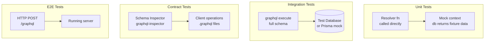

# Testing Strategies

## Category

GraphQL — Operations

## Context

Testing a GraphQL API involves three distinct layers: **unit-testing resolvers** in isolation (business logic + error paths), **integration-testing the full schema** (parse + validate + execute against a real database or in-memory fixture), and **contract testing** the schema shape against client expectations. Each layer has different tooling and serves a different purpose.

### Test Pyramid for GraphQL

| Level | Scope | Speed | What it catches |
|-------|-------|-------|----------------|
| **Unit** | Single resolver function | Fast | Logic errors, error handling, edge cases |
| **Integration** | Full schema execution against real DB / test container | Medium | Resolver wiring, auth directives, DataLoader batching |
| **Contract** | Schema SDL vs client-expected operations | Fast | Breaking changes, missing fields |
| **End-to-end** | HTTP client → server → DB | Slow | Transport-level bugs, auth middleware |

### Resolver Unit Testing Pattern

Unit-test the resolver function directly by:
1. Injecting a mock context (`ctx`) with a mock DB client
2. Calling the resolver with constructed `parent`, `args`, `ctx`
3. Asserting the returned value or thrown error

This does not require a GraphQL server — it is just a function call.

## Pros

- Resolver unit tests run in milliseconds — no DB, no server, no network
- Integration tests using `graphql()` execute function catch schema wiring errors without HTTP overhead
- GraphQL Inspector schema diffing in CI catches breaking changes before any client is affected
- Snapshot testing of query results detects unintended changes to resolver output shape

## Cons

- Mock contexts must be kept in sync with the real context type — stale mocks are a source of false-positive tests
- DataLoader batching behaviour is hard to test in pure unit tests — integration tests are needed to verify batching
- Schema contract tests cannot catch dynamic runtime data issues — integration tests are required
- End-to-end tests are the only way to test HTTP auth middleware, APQ, and persisted query behaviour

## Design Diagram



## Code Sample

### TypeScript — Unit test for a resolver (Vitest)

```typescript
import { describe, it, expect, vi, beforeEach } from 'vitest';
import { resolvers } from '../resolvers';
import type { AppContext } from '../context';

const mockLoan = {
  id:                '1',
  reference:         'LN-001',
  amount:            100_000,
  status:            'ACTIVE',
  borrowerAccountId: 'acct-42',
  createdAt:         new Date('2024-01-01'),
  updatedAt:         new Date('2024-01-01'),
  createdBy:         'user-1',
};

function buildMockContext(overrides: Partial<AppContext> = {}): AppContext {
  return {
    user:      { id: 'user-1', email: 'test@example.com', roles: ['MANAGER'] },
    requestId: 'req-test',
    db: {
      loan: {
        findUnique: vi.fn().mockResolvedValue(mockLoan),
        create:     vi.fn().mockResolvedValue(mockLoan),
      },
    } as any,
    loaders: {
      accountById:    { load: vi.fn().mockResolvedValue({ id: 'acct-42', name: 'ACME Corp' }) } as any,
      loanConnection: { load: vi.fn() } as any,
    },
    ...overrides,
  };
}

describe('Query.loan', () => {
  it('returns null when loan is not found', async () => {
    const ctx = buildMockContext();
    (ctx.db.loan.findUnique as ReturnType<typeof vi.fn>).mockResolvedValue(null);

    const result = await resolvers.Query.loan(undefined, { id: 'missing' }, ctx, {} as any);

    expect(result).toBeNull();
    expect(ctx.db.loan.findUnique).toHaveBeenCalledWith({ where: { id: 'missing' } });
  });

  it('returns the loan when found', async () => {
    const ctx = buildMockContext();

    const result = await resolvers.Query.loan(undefined, { id: '1' }, ctx, {} as any);

    expect(result).toMatchObject({ id: '1', reference: 'LN-001' });
  });
});

describe('Mutation.createLoan', () => {
  it('returns validation errors for negative amount', async () => {
    const ctx = buildMockContext();
    const input = { borrowerAccountId: 'acct-42', amount: -100, currency: 'GBP', interestRate: 5, termMonths: 12, type: 'PERSONAL' };

    const result = await resolvers.Mutation.createLoan(undefined, { input }, ctx, {} as any);

    expect(result.loan).toBeNull();
    expect(result.errors).toContainEqual(
      expect.objectContaining({ code: 'BAD_USER_INPUT', field: expect.arrayContaining(['input', 'amount']) })
    );
  });

  it('throws UNAUTHENTICATED for unauthenticated user', async () => {
    const ctx = buildMockContext({ user: null });

    await expect(
      resolvers.Mutation.createLoan(undefined, { input: {} as any }, ctx, {} as any)
    ).rejects.toMatchObject({ extensions: { code: 'UNAUTHENTICATED' } });
  });
});
```

### TypeScript — Integration test using `graphql` execute (no HTTP server)

```typescript
import { graphql } from 'graphql';
import { schema } from '../schema';
import { buildContext } from '../context';

const GET_LOAN = `
  query GetLoan($id: ID!) {
    loan(id: $id) {
      id
      reference
      amount
      borrower { name }
    }
  }
`;

describe('loan query — integration', () => {
  it('returns loan with borrower', async () => {
    // Use real context with test database
    const ctx = await buildContext({ headers: testAuthHeaders } as any);

    const result = await graphql({
      schema,
      source: GET_LOAN,
      variableValues: { id: TEST_LOAN_ID },
      contextValue: ctx,
    });

    expect(result.errors).toBeUndefined();
    expect(result.data?.loan).toMatchObject({
      reference: expect.stringMatching(/^LN-/),
      borrower:  { name: expect.any(String) },
    });
  });

  it('returns null for non-existent loan', async () => {
    const ctx = await buildContext({ headers: testAuthHeaders } as any);

    const result = await graphql({
      schema,
      source: GET_LOAN,
      variableValues: { id: 'non-existent-id' },
      contextValue: ctx,
    });

    expect(result.errors).toBeUndefined();
    expect(result.data?.loan).toBeNull();
  });
});
```

### YAML — GraphQL Inspector contract check in CI

```yaml
# .github/workflows/graphql-contract.yml
name: GraphQL Contract Tests

on: [push, pull_request]

jobs:
  validate-operations:
    runs-on: ubuntu-latest
    steps:
      - uses: actions/checkout@v4
      - uses: actions/setup-node@v4
        with: { node-version: 20 }
      - run: npm ci

      # Validate all .graphql client operation files against the schema
      - name: Validate client operations
        run: |
          npx graphql-inspector validate \
            './src/**/*.graphql' \
            './schema.graphql'

      # Ensure no deprecated fields are used in new client operations
      - name: Check deprecated field usage
        run: |
          npx graphql-inspector audit \
            './src/**/*.graphql' \
            './schema.graphql'
```

## References

- [Testing GraphQL Resolvers — The Guild](https://the-guild.dev/graphql/yoga-server/docs/testing)
- [graphql-inspector validate](https://the-guild.dev/graphql/inspector/docs/essentials/validate)
- [Apollo Server Testing](https://www.apollographql.com/docs/apollo-server/testing/testing/)
- [Vitest](https://vitest.dev/)
- [graphql — execute function](https://graphql.org/graphql-js/graphql/#graphql)
