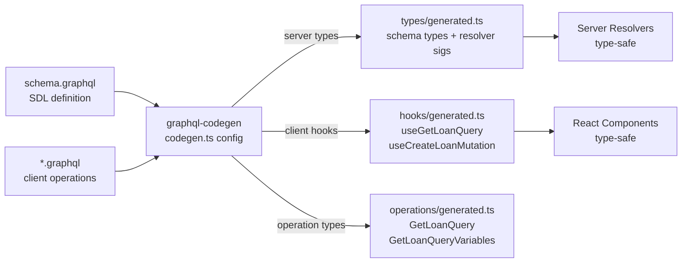

# Code Generation

## Category

GraphQL — Schema & Types

## Context

**GraphQL Code Generator** (codegen) automatically generates TypeScript types, resolver signatures, and typed operation hooks from GraphQL schema SDL and client operation documents (`.graphql` files). This eliminates an entire class of type mismatch bugs — the schema and code share a single source of truth.

### What Can Be Generated

| Output | Plugin | Use |
|--------|--------|-----|
| TypeScript schema types | `typescript` | `Loan`, `LoanStatus`, `CreateLoanInput` — match schema exactly |
| Resolver type signatures | `typescript-resolvers` | `QueryResolvers`, `LoanResolvers` — ensure resolvers return correct types |
| Typed Apollo Client hooks | `typescript-react-apollo` | `useGetLoanQuery`, `useCreateLoanMutation` — typed auto-generated hooks |
| Typed Urql operations | `typescript-urql` | Same for Urql |
| Typed generic operations | `typescript-operations` | `GetLoanQuery`, `GetLoanQueryVariables` |
| MSW mock handlers | `typescript-msw` | Automatic MSW handler stubs for every operation |
| Typed Zod validators | `typescript-zod` | Zod schemas matching GraphQL input types |

### Codegen Configuration

The `codegen.ts` file defines which schemas and documents are processed, which plugins run, and where outputs are written. A **near-operation** output strategy co-locates generated files next to the `.graphql` operation files they belong to.

## Pros

- Resolver type signatures are enforced at compile time — a missing field, wrong return type, or wrong argument is a build error
- Client hooks are generated per operation — no hand-written query strings, no manual type assertions
- Schema changes automatically produce TypeScript errors in resolvers and clients — refactoring with full type safety
- Generated types are always in sync with the schema — no git conflicts between hand-written types and SDL

## Cons

- Codegen must be run after every schema change — if skipped, generated types drift from the schema
- Generated files are verbose — should be committed to git (for CI visibility) or gitignored (for cleanliness) — team must align
- Near-operation co-location produces many small generated files — some linting tools need to be configured to ignore them
- `typescript-resolvers` can be over-restrictive — complex resolver signatures with contextual return types require `mappers` configuration

## Design Diagram



## Code Sample

### TypeScript — `codegen.ts` configuration

```typescript
import type { CodegenConfig } from '@graphql-codegen/cli';

const config: CodegenConfig = {
  schema: './src/schema/**/*.graphql',
  documents: ['./src/**/*.graphql', '!src/schema/**'],
  generates: {
    // 1. Server-side: schema types + typed resolver interfaces
    './src/server/generated/types.ts': {
      plugins: ['typescript', 'typescript-resolvers'],
      config: {
        contextType:    '../context#AppContext',
        // Map DB model to schema type (avoids friction between ORM and GQL types)
        mappers: {
          Loan:    '@prisma/client#Loan as LoanModel',
          Account: '@prisma/client#Account as AccountModel',
        },
        useIndexSignature: true,
        enumsAsTypes: true,
      },
    },

    // 2. Client-side: typed Apollo hooks per operation
    './src/client/generated/': {
      preset:   'near-operation-file',
      presetConfig: { baseTypesPath: '~@/server/generated/types' },
      plugins: ['typescript-operations', 'typescript-react-apollo'],
      config: {
        withHooks: true,
        withComponent: false,
        withResultType: true,
      },
    },

    // 3. Schema introspection JSON (for tooling)
    './src/schema.json': {
      plugins: ['introspection'],
    },
  },
  hooks: {
    afterAllFileWrite: ['prettier --write'],
  },
};

export default config;
```

### TypeScript — Using generated resolver types on the server

```typescript
// BEFORE codegen — no type safety:
const resolvers = {
  Query: {
    loan: async (_, args, ctx) => {  // all `any`
      return ctx.db.loan.findUnique({ where: { id: args.it } }); // typo compiles!
    }
  }
};

// AFTER codegen — fully typed:
import type { QueryResolvers, LoanResolvers } from './generated/types';

const queryResolvers: QueryResolvers = {
  loan: async (_parent, args, ctx) => {
    // args.id is inferred as `string` — args.it would be a compile error
    return ctx.db.loan.findUnique({ where: { id: args.id } });
  },
};

const loanResolvers: LoanResolvers = {
  // Mapper: resolver receives LoanModel (Prisma), must return Loan (schema)
  borrower: (parent, _args, ctx) => {
    // parent is typed as LoanModel — .borrowerAccountId is available
    return ctx.loaders.accountById.load(parent.borrowerAccountId);
  },
};
```

### TypeScript — Using generated Apollo hooks on the client

```typescript
// operations/GetLoan.graphql → generates GetLoanQuery, GetLoanQueryVariables, useGetLoanQuery
import { useGetLoanQuery } from './generated/GetLoan.generated';

function LoanDetail({ id }: { id: string }) {
  const { data, loading, error } = useGetLoanQuery({
    variables: { id },   // typed — id must be string
  });

  if (loading) return <Skeleton />;
  if (error)   return <ErrorBanner message={error.message} />;

  // data.loan is typed — all fields inferred from the operation document
  const loan = data?.loan;

  return (
    <div>
      <h1>{loan?.reference}</h1>
      <p>Amount: {loan?.amount}</p>
      <p>Borrower: {loan?.borrower.name}</p>
    </div>
  );
}
```

### Shell — Codegen in watch mode during development

```shell
# Install
npm install -D @graphql-codegen/cli \
  @graphql-codegen/typescript \
  @graphql-codegen/typescript-resolvers \
  @graphql-codegen/typescript-operations \
  @graphql-codegen/typescript-react-apollo \
  @graphql-codegen/near-operation-file-preset

# Run once
npx graphql-codegen

# Watch mode — re-runs whenever .graphql files change
npx graphql-codegen --watch

# CI — generate and fail if output differs from committed files
npx graphql-codegen
git diff --exit-code src/generated/
```

## References

- [GraphQL Code Generator](https://the-guild.dev/graphql/codegen)
- [typescript-resolvers plugin](https://the-guild.dev/graphql/codegen/plugins/typescript/typescript-resolvers)
- [near-operation-file preset](https://the-guild.dev/graphql/codegen/docs/presets/near-operation-file)
- [typescript-react-apollo plugin](https://the-guild.dev/graphql/codegen/plugins/typescript/typescript-react-apollo)
